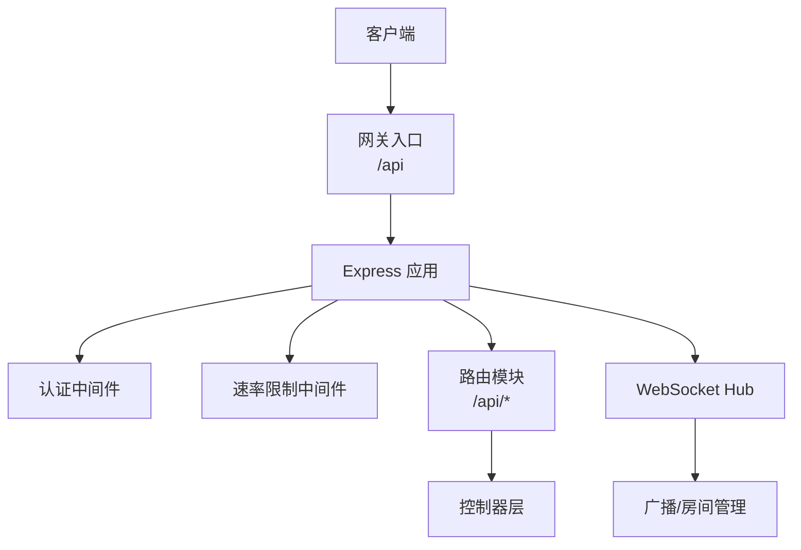
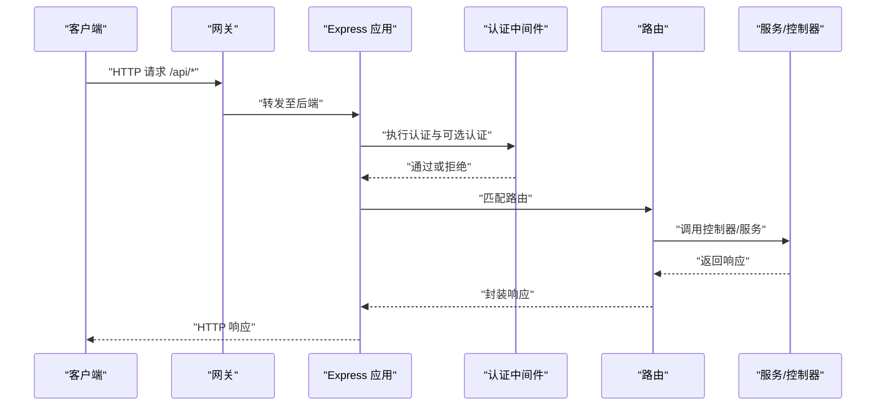
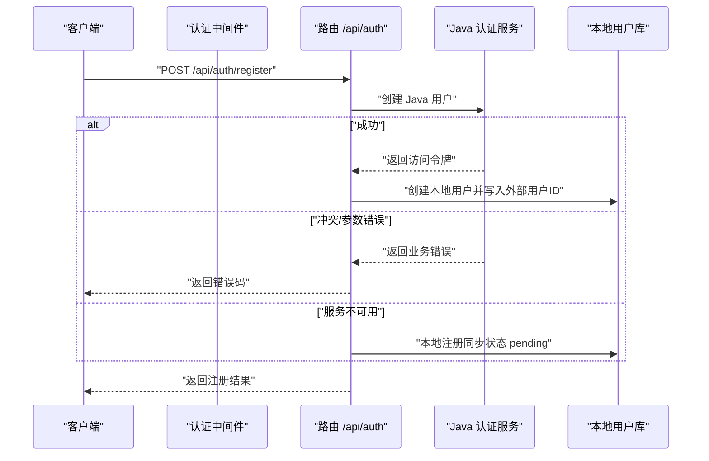
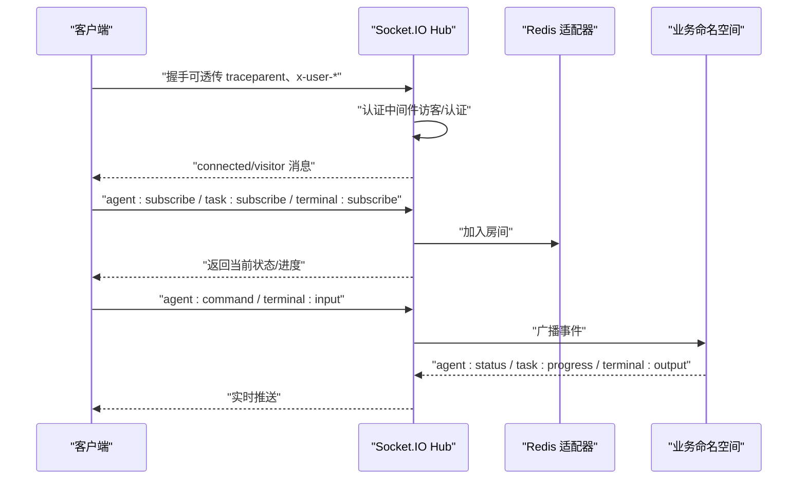
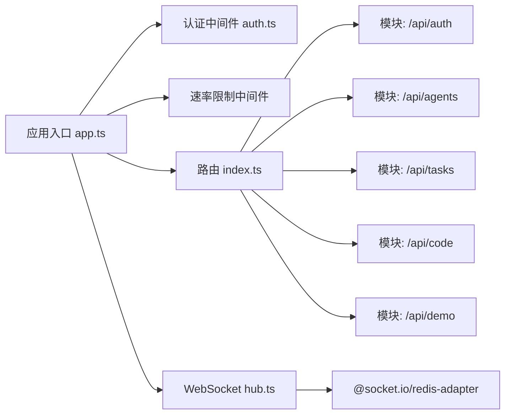

# API 参考文档

<cite>
**本文引用的文件**
- [apps/api/docs/API_REFERENCE.md](file://apps/api/docs/API_REFERENCE.md)
- [apps/api/src/app.ts](file://apps/api/src/app.ts)
- [apps/api/src/index.ts](file://apps/api/src/index.ts)
- [apps/api/src/route/index.ts](file://apps/api/src/routes/index.ts)
- [apps/api/src/middleware/auth.ts](file://apps/api/src/middleware/auth.ts)
- [apps/api/src/websocket/hub.ts](file://apps/api/src/websocket/hub.ts)
- [apps/api/src/routes/auth.ts](file://apps/api/src/routes/auth.ts)
- [apps/api/src/routes/agents.ts](file://apps/api/src/routes/agents.ts)
</cite>

## 目录
1. [简介](#简介)
2. [项目结构](#项目结构)
3. [核心组件](#核心组件)
4. [架构总览](#架构总览)
5. [详细组件分析](#详细组件分析)
6. [依赖关系分析](#依赖关系分析)
7. [性能考量](#性能考量)
8. [故障排除指南](#故障排除指南)
9. [结论](#结论)
10. [附录](#附录)

## 简介
本文件为 AgentHive Cloud 后端 API 的完整参考文档，覆盖 RESTful 接口、认证授权机制、WebSocket 实时通信、请求/响应格式、错误码与状态码、版本管理与兼容策略、以及客户端集成与最佳实践。API 基于 Node.js + Express 构建，统一通过网关入口提供服务。

## 项目结构
- 应用入口与中间件装配位于应用层，负责 CORS、JSON 解析、认证中间件、速率限制、路由挂载与全局错误处理。
- 路由层按模块划分（认证、Agent、任务、代码、演示、项目、聊天、积分等），统一挂载在 /api 前缀下。
- WebSocket Hub 基于 Socket.IO，支持 Redis 适配器进行跨 Pod 广播，提供访客与认证用户的差异化房间与事件处理。
- 健康检查接口聚合数据库、缓存与 LLM 服务状态，便于网关与监控系统观测。

图表来源
- [apps/api/src/app.ts:13-58](file://apps/api/src/app.ts#L13-L58)
- [apps/api/src/routes/index.ts:85-96](file://apps/api/src/routes/index.ts#L85-L96)
- [apps/api/src/websocket/hub.ts:27-109](file://apps/api/src/websocket/hub.ts#L27-L109)

章节来源
- [apps/api/src/app.ts:13-58](file://apps/api/src/app.ts#L13-L58)
- [apps/api/src/routes/index.ts:85-96](file://apps/api/src/routes/index.ts#L85-L96)

## 核心组件
- 应用与中间件
  - CORS、Cookie 解析、结构化请求日志、认证中间件、速率限制、/h/:projectId 公共站点托管与流量追踪、/api 路由挂载、404/500 统一错误处理。
- 路由与模块
  - /api/health 健康检查；/api/auth 认证模块；/api/agents Agent 模块；/api/tasks 任务模块；/api/code 代码模块；/api/demo 演示模块；/api/projects 项目模块；/api/chat 聊天控制器；/api/credits 积分模块。
- WebSocket Hub
  - Socket.IO + Redis 适配器；支持访客与认证用户房间；Agent 状态、任务进度、终端输出等事件；广播与统计接口。
- 认证中间件
  - 白名单放行、测试环境透传、开发环境模拟用户注入、生产环境强制网关透传 X-User-* 头；可选认证中间件用于非阻断场景。

章节来源
- [apps/api/src/app.ts:13-58](file://apps/api/src/app.ts#L13-L58)
- [apps/api/src/routes/index.ts:52-83](file://apps/api/src/routes/index.ts#L52-L83)
- [apps/api/src/websocket/hub.ts:27-109](file://apps/api/src/websocket/hub.ts#L27-L109)
- [apps/api/src/middleware/auth.ts:95-124](file://apps/api/src/middleware/auth.ts#L95-L124)

## 架构总览
下图展示从客户端到后端各层的交互路径与职责边界：

图表来源
- [apps/api/src/app.ts:13-58](file://apps/api/src/app.ts#L13-L58)
- [apps/api/src/middleware/auth.ts:95-124](file://apps/api/src/middleware/auth.ts#L95-L124)
- [apps/api/src/routes/index.ts:85-96](file://apps/api/src/routes/index.ts#L85-L96)

## 详细组件分析

### 认证模块（/api/auth）
- 接口概览
  - 发送短信验证码：POST /api/auth/sms/send
  - 验证短信验证码：POST /api/auth/sms/verify
  - 短信验证码登录：POST /api/auth/login/sms
  - 用户名密码登录：POST /api/auth/login
  - 用户注册：POST /api/auth/register
  - 用户登出：POST /api/auth/logout
  - 刷新 Token：POST /api/auth/refresh
  - 获取当前用户：GET /api/auth/me
- 认证方式
  - 除白名单接口外，其余接口需携带 Authorization: Bearer <token>。
  - 白名单路径包括健康检查、演示、短信登录/验证、刷新等。
- 注册流程（含降级策略）
  - 先调用 Java 认证服务注册，解析返回的访问令牌以获取外部用户 ID。
  - 若 Java 服务不可用，采用本地注册降级，标记同步状态为 pending。
  - 参数校验基于 Zod，密码强度与邮箱/手机号至少一项必填。
- 响应格式
  - 统一包装结构：success、data、error、message；HTTP 状态码与 code 字段解耦，便于前端一致处理。

图表来源
- [apps/api/src/routes/auth.ts:45-129](file://apps/api/src/routes/auth.ts#L45-L129)
- [apps/api/src/middleware/auth.ts:95-124](file://apps/api/src/middleware/auth.ts#L95-L124)

章节来源
- [apps/api/docs/API_REFERENCE.md:105-355](file://apps/api/docs/API_REFERENCE.md#L105-L355)
- [apps/api/src/routes/auth.ts:45-129](file://apps/api/src/routes/auth.ts#L45-L129)
- [apps/api/src/middleware/auth.ts:6-14](file://apps/api/src/middleware/auth.ts#L6-L14)

### Agent 模块（/api/agents）
- 接口概览
  - 列表：GET /api/agents
  - 详情：GET /api/agents/:id
  - 创建：POST /api/agents
  - 更新：PATCH /api/agents/:id
  - 删除：DELETE /api/agents/:id
  - 状态控制：POST /api/agents/:id/start|stop|pause|resume
  - 状态与任务：GET /api/agents/:id/status, POST /api/agents/:id/tasks
  - 命令：POST /api/agents/:id/command
  - 日志：GET /api/agents/:id/logs
- 当前状态
  - Agent 运行时集成处于待完善阶段，部分接口为占位或 Mock 行为。
- 请求/响应
  - 统一 JSON 请求体；响应遵循统一包装结构；部分接口返回 Mock 数据结构。

章节来源
- [apps/api/docs/API_REFERENCE.md:357-591](file://apps/api/docs/API_REFERENCE.md#L357-L591)
- [apps/api/src/routes/agents.ts:57-126](file://apps/api/src/routes/agents.ts#L57-L126)

### 任务模块（/api/tasks）
- 接口概览
  - 列表：GET /api/tasks
  - 详情：GET /api/tasks/:id
  - 创建：POST /api/tasks
  - 更新：PATCH /api/tasks/:id
  - 删除：DELETE /api/tasks/:id
  - 取消：POST /api/tasks/:id/cancel
  - 子任务：GET /api/tasks/:id/subtasks
- 当前状态
  - 任务执行引擎正在开发中，已集成 LLM 流式执行能力（`taskExecution.ts`），支持 Agent Runtime 的任务调度
  - 接口同时兼容 Mock 数据和真实执行模式，通过配置切换
- 执行流程
  - 任务创建 → Agent Runtime 分配 Worker → QueryLoop 执行 → 流式返回结果 → WebSocket 实时推送进度

### 聊天模块（/api/chat）
- 接口概览
  - 发送消息（流式）：POST /api/chat/message
  - 获取会话列表：GET /api/chat/sessions
  - 获取消息历史：GET /api/chat/sessions/:id/messages
  - 创建新会话：POST /api/chat/sessions
- 集成能力
  - 与 Agent Runtime 深度集成，支持通过聊天界面触发 Agent 任务
  - 流式 SSE 响应，实时推送 Agent 思考过程（ThinkBlock）和执行结果
  - 消息类型支持：message、think、task、system_event、recommend
- 数据流
  - 用户输入 → Intent Classification → Agent Orchestrator → Workers 并行执行 → 结果返回

章节来源
- [apps/api/docs/API_REFERENCE.md:593-703](file://apps/api/docs/API_REFERENCE.md#L593-L703)

### 代码模块（/api/code）
- 接口概览
  - 文件列表：GET /api/code/files
  - 文件内容：GET /api/code/files/*（支持通配符）
  - 更新/创建：PUT /api/code/files/*
  - 删除：DELETE /api/code/files/*
  - 搜索：GET /api/code/search
- 存储
  - 当前使用本地文件系统存储；对象存储支持处于待实现阶段。
- 请求/响应
  - 文件内容包含路径、语言、最后修改时间等元信息；更新时根据扩展名识别语言。

章节来源
- [apps/api/docs/API_REFERENCE.md:705-800](file://apps/api/docs/API_REFERENCE.md#L705-L800)

### 演示模块（/api/demo）
- 用途
  - 提供演示数据与交互体验，路径前缀为 /api/demo/*。
- 适用场景
  - 前端联调、无真实数据时的占位接口。

章节来源
- [apps/api/docs/API_REFERENCE.md:16-20](file://apps/api/docs/API_REFERENCE.md#L16-L20)
- [apps/api/src/middleware/auth.ts:6-14](file://apps/api/src/middleware/auth.ts#L6-L14)

### 健康检查（/api/health）
- 接口
  - GET /api/health
- 功能
  - 并行检查数据库、Redis、LLM 服务可用性，返回综合健康状态与时间戳。
- 响应
  - 200 表示全部健康；503 表示部分服务不可用。

章节来源
- [apps/api/src/routes/index.ts:52-83](file://apps/api/src/routes/index.ts#L52-L83)

### WebSocket API（实时通信）
- 连接与鉴权
  - 通过 Socket.IO 连接，支持从握手头透传 traceparent；生产环境要求网关透传 x-user-id 等用户信息；开发环境可注入模拟用户；未认证为访客模式。
- 房间与权限
  - 认证用户加入 user:{userId} 与 authenticated 房间；访客加入 visitors 与 demo-broadcast 房间；访客仅能接收演示数据，无法发送命令。
- 事件类型
  - Agent：订阅/取消订阅、心跳广播、命令下发。
  - 任务：订阅/取消订阅、进度更新、日志广播。
  - 终端：订阅、输入下发、输出广播。
  - 通用：连接确认、错误、Ping/Pong。
- 广播与统计
  - 提供广播函数用于向认证用户、访客或全体广播；支持获取在线统计。

图表来源
- [apps/api/src/websocket/hub.ts:44-109](file://apps/api/src/websocket/hub.ts#L44-L109)
- [apps/api/src/websocket/hub.ts:164-306](file://apps/api/src/websocket/hub.ts#L164-L306)

章节来源
- [apps/api/src/websocket/hub.ts:27-109](file://apps/api/src/websocket/hub.ts#L27-L109)
- [apps/api/src/websocket/hub.ts:111-162](file://apps/api/src/websocket/hub.ts#L111-L162)
- [apps/api/src/websocket/hub.ts:164-306](file://apps/api/src/websocket/hub.ts#L164-L306)
- [apps/api/src/websocket/hub.ts:330-391](file://apps/api/src/websocket/hub.ts#L330-L391)

## 依赖关系分析
- 应用层对中间件与路由的依赖清晰：认证中间件在速率限制之前执行，确保安全与合规。
- 路由层对控制器/服务的依赖：各模块路由仅负责参数与响应封装，具体业务逻辑在控制器与服务层。
- WebSocket Hub 对 Redis 适配器与可观测性工具的依赖：保证跨 Pod 广播与链路追踪。
- 启动流程对数据库迁移、Redis、LLM、任务队列、计费重试等组件的初始化依赖。

图表来源
- [apps/api/src/app.ts:13-58](file://apps/api/src/app.ts#L13-L58)
- [apps/api/src/routes/index.ts:85-96](file://apps/api/src/routes/index.ts#L85-L96)
- [apps/api/src/websocket/hub.ts:3-41](file://apps/api/src/websocket/hub.ts#L3-L41)

章节来源
- [apps/api/src/app.ts:13-58](file://apps/api/src/app.ts#L13-L58)
- [apps/api/src/index.ts:54-152](file://apps/api/src/index.ts#L54-L152)

## 性能考量
- 速率限制
  - 在认证中间件之后、路由之前应用，避免未认证请求滥用。
- 异步并行健康检查
  - 数据库、Redis、LLM 检查并行执行，缩短健康检查耗时。
- WebSocket 广播
  - 使用 Redis 适配器实现跨 Pod 广播，降低单点压力。
- 启动阶段资源初始化
  - 数据库迁移、Redis 连通性、LLM 初始化、任务队列与计费重试等在启动时完成，减少运行时抖动。

章节来源
- [apps/api/src/app.ts:26-27](file://apps/api/src/app.ts#L26-L27)
- [apps/api/src/routes/index.ts:54-62](file://apps/api/src/routes/index.ts#L54-L62)
- [apps/api/src/websocket/hub.ts:38-41](file://apps/api/src/websocket/hub.ts#L38-L41)
- [apps/api/src/index.ts:87-116](file://apps/api/src/index.ts#L87-L116)

## 故障排除指南
- 401 未认证
  - 生产环境必须由网关透传 x-user-id 等头部；开发环境可通过环境变量注入模拟用户；测试环境自动通过。
- 500 服务器内部错误
  - 未捕获异常统一返回 500；检查日志与堆栈；确认数据库/Redis 连接状态。
- 404 未找到
  - 路由不存在或路径错误；确认基础路径与模块前缀。
- 健康检查 503
  - 数据库、Redis 或 LLM 不可用；检查对应服务状态与网络连通性。
- WebSocket 连接失败
  - 检查 Redis 连通性与 CORS 配置；确认握手头是否正确透传。

章节来源
- [apps/api/src/middleware/auth.ts:95-124](file://apps/api/src/middleware/auth.ts#L95-L124)
- [apps/api/src/app.ts:39-55](file://apps/api/src/app.ts#L39-L55)
- [apps/api/src/routes/index.ts:52-83](file://apps/api/src/routes/index.ts#L52-L83)
- [apps/api/src/websocket/hub.ts:27-41](file://apps/api/src/websocket/hub.ts#L27-L41)

## 结论
本 API 参考文档系统性地梳理了 RESTful 接口、认证授权、WebSocket 实时通信与错误处理机制。尽管部分模块（Agent 运行时、任务执行引擎、对象存储）尚在完善中，但整体架构清晰、中间件与路由职责明确，具备良好的扩展性与可观测性。建议在客户端集成时严格遵循统一响应格式与错误码约定，并结合速率限制与健康检查策略保障稳定性。

## 附录

### 请求/响应格式与错误码
- 请求
  - 统一 JSON；Content-Type: application/json。
- 响应
  - 统一包装：success、data、error、message；HTTP 状态码与 code 字段解耦。
- 错误码
  - 400 参数校验失败；401 未认证；404 未找到；409 冲突；500 服务器内部错误；503 服务不可用。

章节来源
- [apps/api/docs/API_REFERENCE.md:72-103](file://apps/api/docs/API_REFERENCE.md#L72-L103)
- [apps/api/src/routes/auth.ts:47-54](file://apps/api/src/routes/auth.ts#L47-L54)
- [apps/api/src/app.ts:39-55](file://apps/api/src/app.ts#L39-L55)

### 认证授权流程（JWT 与刷新）
- 获取与刷新
  - 短信登录/用户名密码登录返回 token；刷新接口用于续期。
- 登出
  - 客户端删除本地 token 即可；服务端不维护黑名单。
- 权限验证
  - 除白名单外，均需携带 Bearer token；生产环境强制网关透传用户信息。

章节来源
- [apps/api/docs/API_REFERENCE.md:197-331](file://apps/api/docs/API_REFERENCE.md#L197-L331)
- [apps/api/src/middleware/auth.ts:6-14](file://apps/api/src/middleware/auth.ts#L6-L14)

### WebSocket 连接与消息格式
- 连接
  - 支持 traceparent 透传；生产环境透传 x-user-id 等；访客模式仅读。
- 事件
  - agent:subscribe/unsubscribe、agent:heartbeat、agent:command、task:*、terminal:*、通用事件。
- 广播
  - 提供 broadcast.toAll、toVisitors、toAllUsers 等广播方法。

章节来源
- [apps/api/src/websocket/hub.ts:44-109](file://apps/api/src/websocket/hub.ts#L44-L109)
- [apps/api/src/websocket/hub.ts:164-306](file://apps/api/src/websocket/hub.ts#L164-L306)
- [apps/api/src/websocket/hub.ts:330-376](file://apps/api/src/websocket/hub.ts#L330-L376)

### API 版本管理、向后兼容与弃用策略
- 版本管理
  - 当前文档版本：1.1.0；基础地址：http://localhost:8080/api（网关统一入口）。
- 向后兼容
  - 新增字段采用可选策略；变更字段保留兼容读取；严格遵守统一响应格式。
- 弃用策略
  - 通过文档标注“待实现/占位/Mock”提示；逐步替换为真实实现；提供迁移指引。

章节来源
- [apps/api/docs/API_REFERENCE.md:1-7](file://apps/api/docs/API_REFERENCE.md#L1-L7)
- [apps/api/docs/API_REFERENCE.md:357-359](file://apps/api/docs/API_REFERENCE.md#L357-L359)
- [apps/api/docs/API_REFERENCE.md:595-596](file://apps/api/docs/API_REFERENCE.md#L595-L596)
- [apps/api/docs/API_REFERENCE.md:707](file://apps/api/docs/API_REFERENCE.md#L707)

### 客户端集成指南与最佳实践
- 集成步骤
  - 健康检查：GET /api/health 观察服务状态。
  - 认证：使用 /api/auth/login 或短信登录获取 token。
  - 请求：在 Authorization 头中携带 Bearer <token>。
  - 速率限制：遵循中间件策略，避免短时间高频请求。
- 最佳实践
  - 统一响应格式处理；对 401 做自动重定向登录；对 503 做退避重试。
  - WebSocket 使用前先进行健康检查；订阅事件时处理离线重连。
  - 本地 Mock 数据仅用于联调，生产务必切换为真实实现。

章节来源
- [apps/api/src/routes/index.ts:52-83](file://apps/api/src/routes/index.ts#L52-L83)
- [apps/api/src/middleware/auth.ts:95-124](file://apps/api/src/middleware/auth.ts#L95-L124)
- [apps/api/src/app.ts:26-27](file://apps/api/src/app.ts#L26-L27)
- [apps/api/src/websocket/hub.ts:44-109](file://apps/api/src/websocket/hub.ts#L44-L109)