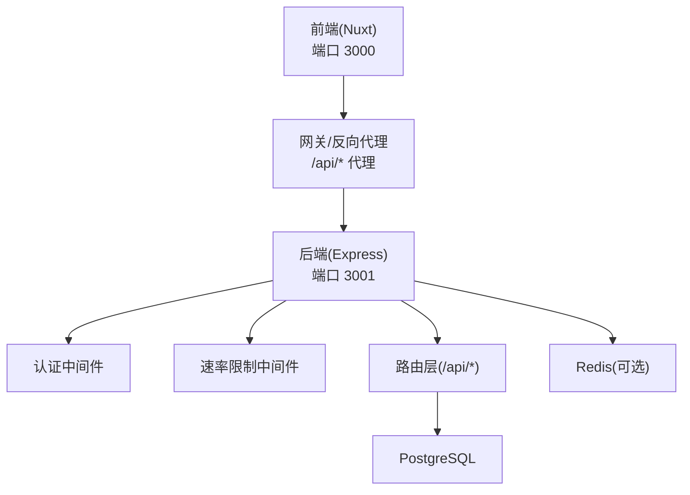
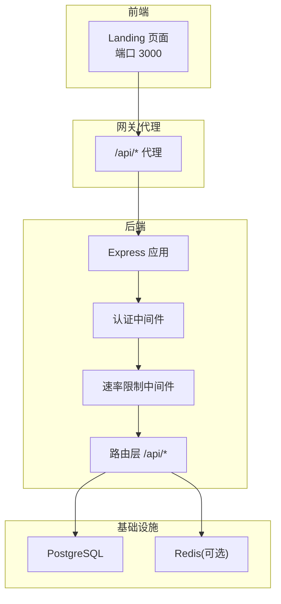
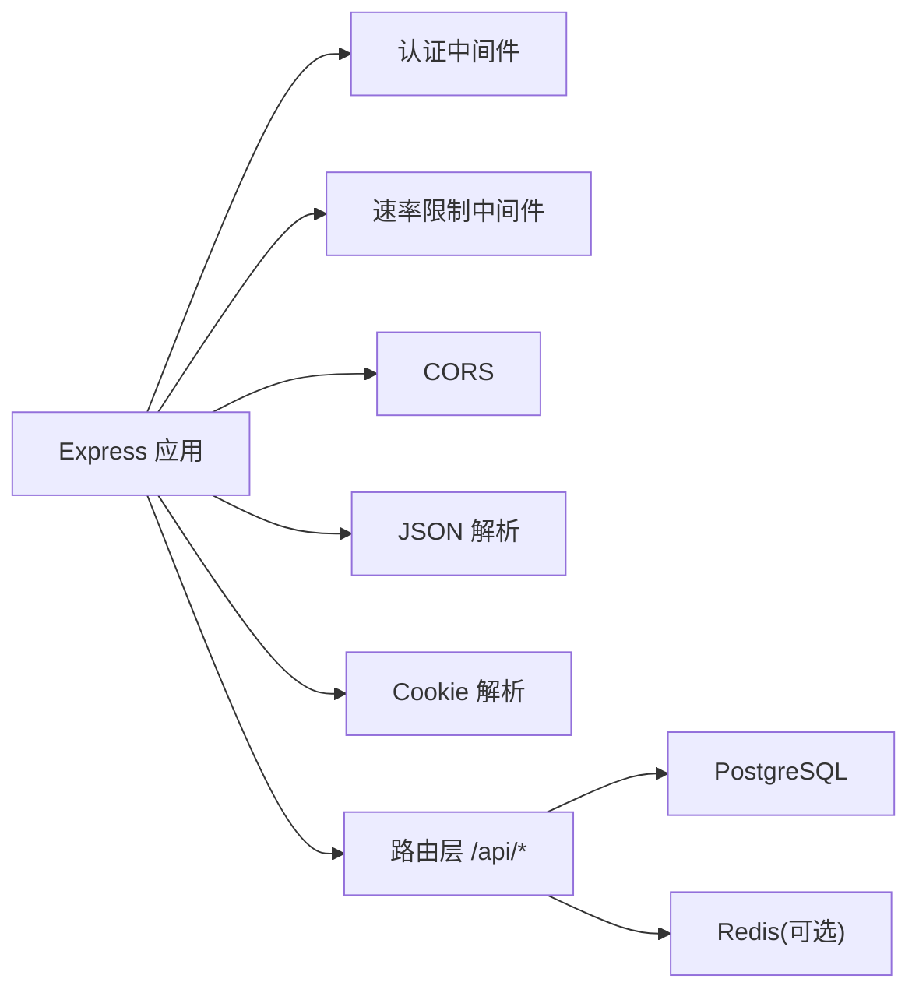

# REST API 端点

<cite>
**本文引用的文件**
- [API 参考文档](file://apps/api/docs/API_REFERENCE.md)
- [应用入口](file://apps/api/src/app.ts)
- [包配置](file://apps/api/package.json)
</cite>

## 目录
1. [简介](#简介)
2. [项目结构](#项目结构)
3. [核心组件](#核心组件)
4. [架构总览](#架构总览)
5. [详细端点说明](#详细端点说明)
6. [依赖关系分析](#依赖关系分析)
7. [性能考量](#性能考量)
8. [故障排查指南](#故障排查指南)
9. [结论](#结论)
10. [附录](#附录)

## 简介
本文件为 AgentHive Cloud 的 REST API 端点权威参考，覆盖认证、Agent 管理、任务管理、代码文件操作、演示数据以及健康检查等模块。文档提供每个端点的 HTTP 方法、URL 模式、请求参数、响应格式、认证要求、权限级别、使用限制、常见场景与调用示例，并对参数验证规则与业务约束进行说明。

## 项目结构
后端采用 Express 应用，统一挂载在 /api 前缀下，配合 CORS、JSON 解析、认证中间件、速率限制、请求日志、404/500 错误处理等基础能力。前端通过 Nginx 或网关将 /api/* 代理至后端服务。

图表来源
- [应用入口:13-58](file://apps/api/src/app.ts#L13-L58)

章节来源
- [应用入口:13-58](file://apps/api/src/app.ts#L13-L58)
- [包配置:1-61](file://apps/api/package.json#L1-L61)

## 核心组件
- 应用入口与中间件栈
  - CORS、JSON 解析、Cookie 解析、请求日志、认证中间件、速率限制、路由挂载、404/500 错误处理
- 路由组织
  - 所有 API 路由以 /api 前缀统一暴露，具体模块在路由层内按模块划分
- 错误响应规范
  - 统一返回包含 code、message、data 的结构；404 与 500 分别由中间件捕获并返回

章节来源
- [应用入口:13-58](file://apps/api/src/app.ts#L13-L58)

## 架构总览
后端服务通过 Express 提供 REST API，认证中间件确保除公开端点外均需携带有效 JWT；速率限制中间件保护系统免受滥用；路由层承载各模块端点；数据持久化依赖 PostgreSQL，实时通信依赖 Redis（可选）。

图表来源
- [应用入口:13-58](file://apps/api/src/app.ts#L13-L58)
- [API 参考文档:1156-1178](file://apps/api/docs/API_REFERENCE.md#L1156-L1178)

## 详细端点说明

### 通用说明
- 请求格式
  - 统一 JSON；Content-Type: application/json
- 响应格式
  - 成功：success=true，data 包含业务数据
  - 失败：success=false，message 包含错误信息，部分端点可能包含 error 字段
- 认证要求
  - 除明确标注外，其余端点均需 Authorization: Bearer <token>
  - 公开端点包括：短信验证码发送、短信验证码校验、短信登录、账号密码登录、注册、健康检查、演示模块

章节来源
- [API 参考文档:72-103](file://apps/api/docs/API_REFERENCE.md#L72-L103)

### 认证模块 (/api/auth)
- 发送短信验证码
  - 方法与路径：POST /api/auth/sms/send
  - 认证：无需
  - 请求体字段
    - phone: string，必填，手机号格式校验
    - type: string，可选，业务类型(login/register/reset)
    - templateType: string，可选，模板类型枚举，与 type 二选一
    - signName: string，可选，签名名称
  - 响应
    - 成功：data.expiresIn 数值表示过期秒数
    - 失败：message 错误信息
  - 限制与说明
    - 同一手机号 60 秒间隔限制、验证码 5 分钟有效、每日单手机号上限 10 条
    - 支持签名与模板类型
- 验证短信验证码
  - 方法与路径：POST /api/auth/sms/verify
  - 认证：无需
  - 请求体字段
    - phone: string，必填
    - code: string，必填，6 位数字
    - templateType: string，可选，默认模板类型
  - 响应
    - 成功：success=true
    - 失败：message 错误信息
- 短信验证码登录
  - 方法与路径：POST /api/auth/login/sms
  - 认证：无需
  - 请求体字段
    - phone: string，必填
    - code: string，必填，6 位数字
  - 响应
    - 成功：data.token 与 data.user
    - 说明：新用户将自动注册；继承登录限流；Token 有效期 24 小时
- 账号密码登录
  - 方法与路径：POST /api/auth/login
  - 认证：无需
  - 请求体字段
    - username: string，必填
    - password: string，必填
  - 响应
    - 成功：同短信登录
  - 说明：当前为 Mock 实现，任何凭据均可登录；不存在用户将自动创建
- 用户注册
  - 方法与路径：POST /api/auth/register
  - 认证：无需
  - 请求体字段
    - username: string，必填
    - email: string，可选
    - password: string，必填
    - phone: string，可选
    - code: string，可选，6 位数字
  - 响应
    - 成功：同登录
  - 说明：若提供 phone 与 code，需先完成短信验证码校验
- 用户登出
  - 方法与路径：POST /api/auth/logout
  - 认证：需要
  - 响应
    - 成功：message 表示登出成功
  - 说明：客户端需自行清理本地 Token
- 刷新 Token
  - 方法与路径：POST /api/auth/refresh
  - 认证：需要
  - 响应
    - 成功：data.token 与 data.user
- 获取当前用户
  - 方法与路径：GET /api/auth/me
  - 认证：需要
  - 响应
    - 成功：data.user

章节来源
- [API 参考文档:105-355](file://apps/api/docs/API_REFERENCE.md#L105-L355)

### Agent 模块 (/api/agents)
- 获取 Agent 列表（Mock）
  - 方法与路径：GET /api/agents?teamId=xxx
  - 认证：需要
  - 查询参数
    - teamId: string，可选，团队过滤
  - 响应
    - 成功：data.agents 数组与 data.total
- 获取 Agent 详情
  - 方法与路径：GET /api/agents/:id
  - 认证：需要
  - 响应
    - 成功：data.agent、data.tasks、data.stats
- 创建 Agent
  - 方法与路径：POST /api/agents
  - 认证：需要
  - 请求体字段
    - name: string，必填
    - role: string，必填
    - description: string，可选
    - config: object，可选，包含 avatar、skills 等
  - 响应
    - 成功：data.agent
- 更新 Agent
  - 方法与路径：PATCH /api/agents/:id
  - 认证：需要
  - 请求体字段
    - name/description/config: 可选字段
- 删除 Agent
  - 方法与路径：DELETE /api/agents/:id
  - 认证：需要
  - 响应
    - 成功：message
- 控制 Agent 状态
  - 启动：POST /api/agents/:id/start
  - 停止：POST /api/agents/:id/stop
  - 暂停：POST /api/agents/:id/pause
  - 恢复：POST /api/agents/:id/resume
  - 认证：需要
  - 响应
    - 成功：data.id 与 data.status
- 发送命令
  - 方法与路径：POST /api/agents/:id/command
  - 认证：需要
  - 请求体字段
    - type: string，必填，如 terminal
    - payload: object，必填，如 { command: "..." }
  - 响应
    - 成功：message 与 data.commandId、type、status
- 获取 Agent 日志
  - 方法与路径：GET /api/agents/:id/logs?lines=100
  - 认证：需要
  - 查询参数
    - lines: number，默认 100
  - 响应
    - 成功：data.logs 数组与 data.total

章节来源
- [API 参考文档:357-591](file://apps/api/docs/API_REFERENCE.md#L357-L591)

### 任务模块 (/api/tasks)
- 获取任务列表（Mock）
  - 方法与路径：GET /api/tasks?status=running&assignedTo=agent-1&page=1&pageSize=10
  - 认证：需要
  - 查询参数
    - status: string，可选，状态筛选
    - assignedTo: string，可选，分配给指定 Agent
    - page: number，默认 1
    - pageSize: number，默认 10
  - 响应
    - 成功：data.tasks、data.total、data.page、data.pageSize
- 获取任务详情
  - 方法与路径：GET /api/tasks/:id
  - 认证：需要
- 创建任务
  - 方法与路径：POST /api/tasks
  - 认证：需要
  - 请求体字段
    - title: string，必填
    - description: string，可选
    - type: string，必填
    - priority: string，必填
    - assignedTo: string，可选
    - input: object，必填
- 更新任务
  - 方法与路径：PATCH /api/tasks/:id
  - 认证：需要
  - 请求体字段
    - title/description/status/progress/assignedTo: 可选字段
- 删除任务
  - 方法与路径：DELETE /api/tasks/:id
  - 认证：需要
- 取消任务
  - 方法与路径：POST /api/tasks/:id/cancel
  - 认证：需要
- 获取子任务
  - 方法与路径：GET /api/tasks/:id/subtasks
  - 认证：需要

章节来源
- [API 参考文档:593-704](file://apps/api/docs/API_REFERENCE.md#L593-L704)

### 代码模块 (/api/code)
- 获取文件列表
  - 方法与路径：GET /api/code/files?path=/
  - 认证：需要
  - 查询参数
    - path: string，默认根路径
  - 响应
    - 成功：data.files 数组、data.total、data.path
- 获取文件内容
  - 方法与路径：GET /api/code/files/*（支持多级路径）
  - 认证：需要
  - 响应
    - 成功：data.path、data.content、data.language、data.lastModified
- 更新/创建文件
  - 方法与路径：PUT /api/code/files/*
  - 认证：需要
  - 请求体字段
    - content: string，必填
  - 说明：文件不存在时自动创建；根据扩展名识别语言
- 删除文件
  - 方法与路径：DELETE /api/code/files/*
  - 认证：需要
- 搜索文件
  - 方法与路径：GET /api/code/search?query=main
  - 认证：需要
  - 查询参数
    - query: string，必填
  - 响应
    - 成功：data.files 数组、data.total、data.query
- 获取最近文件
  - 方法与路径：GET /api/code/recent?limit=10
  - 认证：需要
  - 查询参数
    - limit: number，默认 10
  - 响应
    - 成功：data.files 数组

章节来源
- [API 参考文档:705-822](file://apps/api/docs/API_REFERENCE.md#L705-L822)

### 演示模块 (/api/demo)
- 获取示例计划
  - 方法与路径：GET /api/demo/plan
  - 认证：无需
  - 响应
    - 成功：data.id、data.name、data.summary、data.tickets
- 获取示例 Agents
  - 方法与路径：GET /api/demo/agents
  - 认证：无需
- 获取示例任务
  - 方法与路径：GET /api/demo/tasks
  - 认证：无需
- 访客状态
  - 方法与路径：GET /api/demo/visitor-status
  - 认证：无需
  - 响应
    - 成功：data.visitorId、data.mode、data.expiresAt

章节来源
- [API 参考文档:823-885](file://apps/api/docs/API_REFERENCE.md#L823-L885)

### 健康检查
- 健康检查
  - 方法与路径：GET /api/health
  - 认证：无需
  - 响应
    - 成功：data.ok=true、data.timestamp

章节来源
- [API 参考文档:940-956](file://apps/api/docs/API_REFERENCE.md#L940-L956)

### WebSocket 实时通信
- 连接地址
  - ws://localhost:3001
- 事件
  - 订阅 Agent 状态：agent:subscribe
  - 取消订阅：agent:unsubscribe
  - 发送命令给 Agent：agent:command
  - 订阅任务进度：task:subscribe
  - 终端输入：terminal:input
- 服务器推送事件
  - agent:status、agent:log、task:progress、task:log、terminal:output

章节来源
- [API 参考文档:888-937](file://apps/api/docs/API_REFERENCE.md#L888-L937)

## 依赖关系分析
- 中间件依赖
  - 认证中间件：确保除公开端点外均需 JWT
  - 速率限制中间件：保护系统免受高频请求冲击
  - CORS：允许前端域名访问
  - JSON/cookie 解析：统一请求解析
- 路由依赖
  - /api 前缀统一挂载路由层
- 外部依赖
  - PostgreSQL：数据持久化
  - Redis（可选）：WebSocket 与缓存/消息队列

图表来源
- [应用入口:13-58](file://apps/api/src/app.ts#L13-L58)

章节来源
- [应用入口:13-58](file://apps/api/src/app.ts#L13-L58)

## 性能考量
- 速率限制
  - 在认证中间件之后、路由之前应用，避免未认证请求滥用
- 缓存与异步
  - Redis 可用于任务进度与日志推送，减少轮询压力
- 数据库连接
  - 使用连接池与迁移工具，保证数据库一致性与可用性
- 前后端分离
  - 前端通过代理访问后端，降低跨域与网络延迟影响

## 故障排查指南
- 401 未认证
  - 检查 Authorization 头是否携带有效 Bearer Token
- 404 不存在
  - 确认端点路径拼写与模块前缀 /api
- 500 服务器内部错误
  - 查看后端日志，确认数据库初始化与连接状态
- 数据库未初始化
  - 执行数据库初始化脚本后再进行相关端点调用
- Redis 不可用
  - WebSocket 与实时事件可能受限，属预期行为

章节来源
- [应用入口:38-55](file://apps/api/src/app.ts#L38-L55)
- [API 参考文档:1052-1064](file://apps/api/docs/API_REFERENCE.md#L1052-L1064)

## 结论
本文档提供了 AgentHive Cloud 后端 REST API 的完整端点清单与使用说明。建议在开发与集成过程中严格遵循认证要求、参数校验与响应格式规范，并结合速率限制与数据库初始化策略保障系统稳定运行。

## 附录

### 错误码说明
- 200 OK：请求成功
- 201 Created：创建成功
- 400 Bad Request：请求参数错误
- 401 Unauthorized：未认证或 Token 无效
- 404 Not Found：资源不存在
- 409 Conflict：资源冲突（如用户名已存在）
- 429 Too Many Requests：请求过于频繁
- 500 Internal Server Error：服务器内部错误

章节来源
- [API 参考文档:1052-1064](file://apps/api/docs/API_REFERENCE.md#L1052-L1064)

### 开发环境配置
- 启动服务
  - 进入 apps/api，安装依赖并启动开发服务器
- 环境变量
  - PORT、JWT_SECRET、CORS_ORIGIN、DATABASE_URL、PG*、REDIS_URL、WORKSPACE_BASE、OLLAMA_HOST、DEFAULT_LLM_PROVIDER
- 数据库初始化
  - 首次启动执行数据库初始化脚本
- 测试数据
  - 初始化后自动创建默认 Agent 与 Task 示例

章节来源
- [API 参考文档:1067-1131](file://apps/api/docs/API_REFERENCE.md#L1067-L1131)
- [包配置:6-25](file://apps/api/package.json#L6-L25)