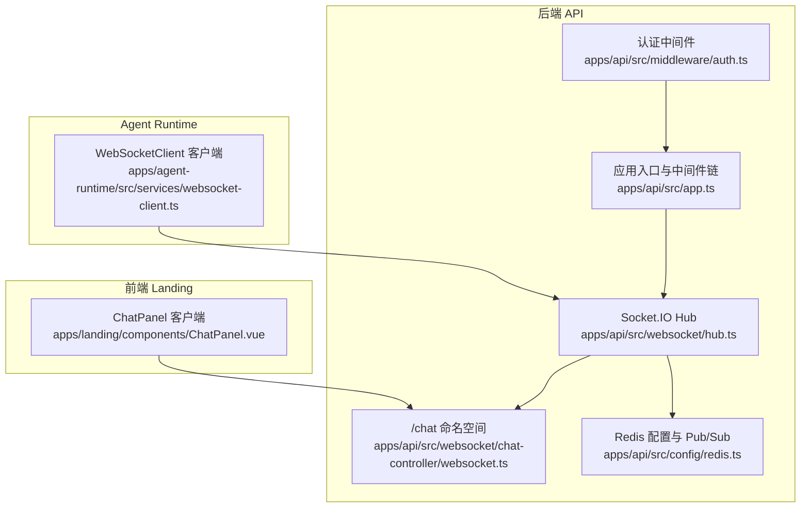
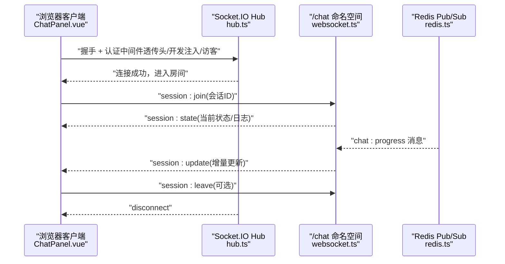
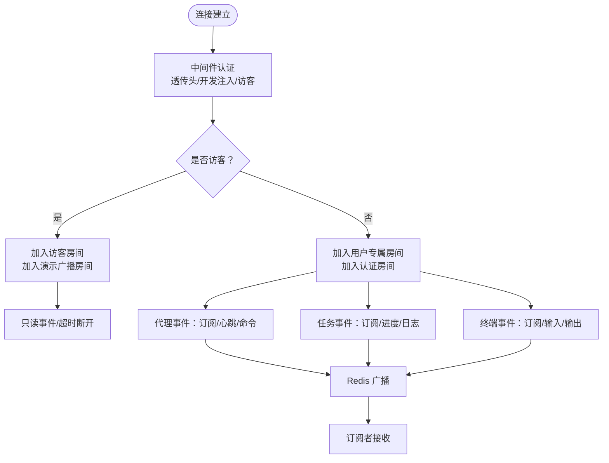
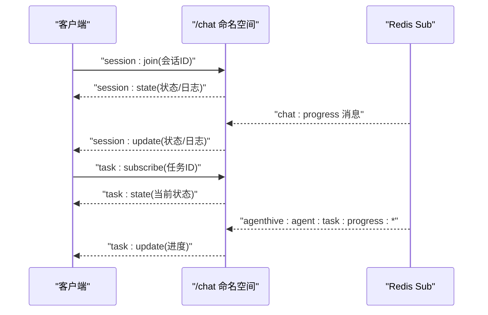
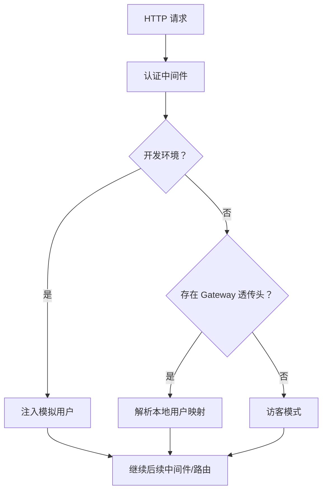
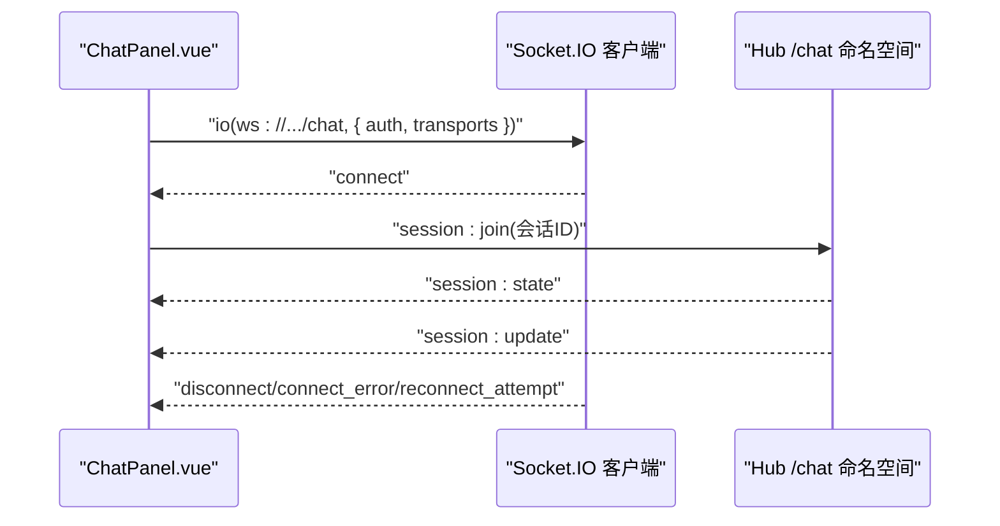
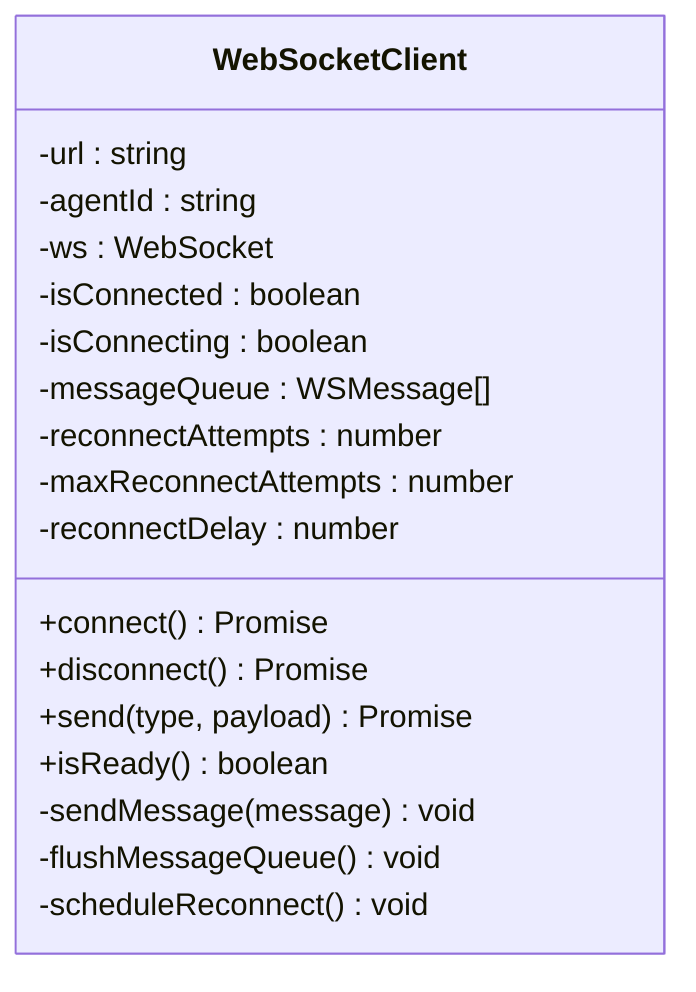
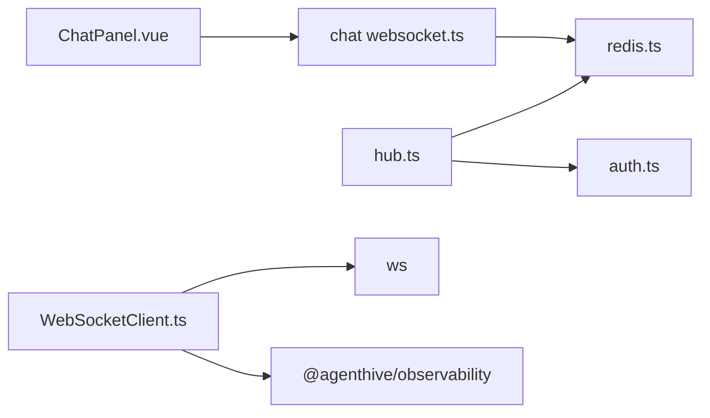

# WebSocket API

<cite>
**本文引用的文件**
- [apps/api/src/websocket/hub.ts](file://apps/api/src/websocket/hub.ts)
- [apps/api/src/websocket/ws-telemetry.ts](file://apps/api/src/websocket/ws-telemetry.ts)
- [apps/api/src/websocket/chat-controller/websocket.ts](file://apps/api/src/websocket/chat-controller/websocket.ts)
- [apps/api/src/config/redis.ts](file://apps/api/src/config/redis.ts)
- [apps/api/src/middleware/auth.ts](file://apps/api/src/middleware/auth.ts)
- [apps/api/src/app.ts](file://apps/api/src/app.ts)
- [apps/agent-runtime/src/services/websocket-client.ts](file://apps/agent-runtime/src/services/websocket-client.ts)
- [apps/landing/components/ChatPanel.vue](file://apps/landing/components/ChatPanel.vue)
- [apps/api/tests/unit/websocket.hub.test.ts](file://apps/api/tests/unit/websocket.hub.test.ts)
- [apps/api/tests/utils/test-websocket.ts](file://apps/api/tests/utils/test-websocket.ts)
</cite>

## 目录
1. [简介](#简介)
2. [项目结构](#项目结构)
3. [核心组件](#核心组件)
4. [架构总览](#架构总览)
5. [详细组件分析](#详细组件分析)
6. [依赖关系分析](#依赖关系分析)
7. [性能考量](#性能考量)
8. [故障排查指南](#故障排查指南)
9. [结论](#结论)
10. [附录](#附录)

## 简介
本文件系统化梳理平台的 WebSocket 实时通信能力，覆盖连接建立、认证与授权、命名空间与房间模型、事件类型与消息格式、客户端接入示例、错误处理与重连策略、以及跨实例广播与可观测性集成。重点包括：
- Socket.IO 主 Hub 与 /chat 命名空间的协作
- 认证中间件对握手阶段的透传支持
- Redis Pub/Sub 实现跨进程/跨 Pod 广播
- 客户端侧（浏览器）与 Agent Runtime 侧（Supervisor）的连接与消息处理
- 事件类型：会话状态、任务进度、终端输入输出、代理心跳与命令等

## 项目结构
WebSocket 相关代码主要分布在后端 API 与前端 Landing 两个入口：
- 后端 API
  - WebSocket Hub：Socket.IO 服务器、中间件、房间与广播
  - /chat 命名空间：会话级实时事件
  - Redis 配置与 Pub/Sub：跨实例广播
  - 认证中间件：Gateway 透传头解析
- 前端 Landing
  - ChatPanel：基于 Socket.IO 客户端接入 /chat 命名空间
- Agent Runtime
  - WebSocketClient：与 Supervisor 的 WebSocket 客户端封装

图表来源
- [apps/api/src/websocket/hub.ts:1-109](file://apps/api/src/websocket/hub.ts#L1-L109)
- [apps/api/src/websocket/chat-controller/websocket.ts:15-111](file://apps/api/src/websocket/chat-controller/websocket.ts#L15-L111)
- [apps/api/src/config/redis.ts:32-71](file://apps/api/src/config/redis.ts#L32-L71)
- [apps/api/src/middleware/auth.ts:95-124](file://apps/api/src/middleware/auth.ts#L95-L124)
- [apps/api/src/app.ts:13-58](file://apps/api/src/app.ts#L13-L58)
- [apps/landing/components/ChatPanel.vue:378-424](file://apps/landing/components/ChatPanel.vue#L378-L424)
- [apps/agent-runtime/src/services/websocket-client.ts:12-186](file://apps/agent-runtime/src/services/websocket-client.ts#L12-L186)

章节来源
- [apps/api/src/websocket/hub.ts:1-109](file://apps/api/src/websocket/hub.ts#L1-L109)
- [apps/api/src/websocket/chat-controller/websocket.ts:15-111](file://apps/api/src/websocket/chat-controller/websocket.ts#L15-L111)
- [apps/api/src/config/redis.ts:32-71](file://apps/api/src/config/redis.ts#L32-L71)
- [apps/api/src/middleware/auth.ts:95-124](file://apps/api/src/middleware/auth.ts#L95-L124)
- [apps/api/src/app.ts:13-58](file://apps/api/src/app.ts#L13-L58)
- [apps/landing/components/ChatPanel.vue:378-424](file://apps/landing/components/ChatPanel.vue#L378-L424)
- [apps/agent-runtime/src/services/websocket-client.ts:12-186](file://apps/agent-runtime/src/services/websocket-client.ts#L12-L186)

## 核心组件
- Socket.IO Hub
  - 初始化 Socket.IO 服务器，启用 Redis 适配器实现多实例广播
  - 握手阶段中间件：从 Gateway 透传头解析用户身份；开发环境注入模拟用户；访客模式降级
  - 房间模型：用户专属房间、认证用户房间、访客房间、演示广播房间
  - 事件处理：代理心跳与命令、任务进度与日志、终端输入输出、通用 ping/pong
  - 广播接口：按主题向订阅者推送状态/进度/日志
- /chat 命名空间
  - 会话房间：每个聊天会话一个房间，支持加入/离开、拉取当前状态与日志
  - Redis Pub/Sub：跨实例广播会话进度与任务进度更新
- Redis 配置
  - 单实例/URL 形式配置、重试策略、发布/订阅分离连接、键前缀
- 认证中间件
  - 白名单路径放行
  - 开发环境注入模拟用户
  - 生产环境强制 Gateway 透传头校验
- 前端 ChatPanel 客户端
  - 基于 Socket.IO 客户端，接入 /chat 命名空间
  - 认证：携带令牌；传输：websocket/polling；重连：指数退避
  - 事件：connect/connect_error/disconnect/reconnect_attempt；业务事件：session:state/session:update 等
- Agent Runtime WebSocketClient
  - 与 Supervisor 建立 WebSocket 连接，消息格式包含类型、负载与时间戳
  - 连接管理：连接/断开、消息队列、指数退避重连、最大重连次数
  - 跨传输追踪：将 trace 上下文注入消息负载

章节来源
- [apps/api/src/websocket/hub.ts:27-109](file://apps/api/src/websocket/hub.ts#L27-L109)
- [apps/api/src/websocket/hub.ts:112-328](file://apps/api/src/websocket/hub.ts#L112-L328)
- [apps/api/src/websocket/chat-controller/websocket.ts:15-111](file://apps/api/src/websocket/chat-controller/websocket.ts#L15-L111)
- [apps/api/src/config/redis.ts:5-71](file://apps/api/src/config/redis.ts#L5-L71)
- [apps/api/src/middleware/auth.ts:95-124](file://apps/api/src/middleware/auth.ts#L95-L124)
- [apps/landing/components/ChatPanel.vue:378-424](file://apps/landing/components/ChatPanel.vue#L378-L424)
- [apps/agent-runtime/src/services/websocket-client.ts:12-186](file://apps/agent-runtime/src/services/websocket-client.ts#L12-L186)

## 架构总览
WebSocket 采用“主 Hub + 命名空间”的分层设计：
- 主 Hub 负责全局连接生命周期、认证与房间管理
- /chat 命名空间负责会话级事件与跨实例广播
- Redis Pub/Sub 作为跨实例通信通道
- 前端与 Agent Runtime 通过各自客户端接入

图表来源
- [apps/api/src/websocket/hub.ts:44-102](file://apps/api/src/websocket/hub.ts#L44-L102)
- [apps/api/src/websocket/chat-controller/websocket.ts:31-84](file://apps/api/src/websocket/chat-controller/websocket.ts#L31-L84)
- [apps/api/src/websocket/chat-controller/websocket.ts:86-111](file://apps/api/src/websocket/chat-controller/websocket.ts#L86-L111)
- [apps/api/src/config/redis.ts:35-43](file://apps/api/src/config/redis.ts#L35-L43)

## 详细组件分析

### Socket.IO Hub（主服务器）
- 初始化与跨实例广播
  - 创建 Socket.IO 服务器，启用 Redis 适配器，实现多实例广播
  - 配置 ping 超时与间隔，保障长连接稳定性
- 中间件与认证
  - 优先从 Gateway 透传头解析用户身份；开发环境注入模拟用户；否则为访客
  - 认证失败抛出错误，阻止连接
- 房间与事件
  - 访客房间：加入演示广播，只读，超时断开
  - 认证用户房间：加入专属房间与“已认证”房间，订阅代理/任务/终端事件
  - 通用事件：disconnect、error、ping/pong
- 广播接口
  - 按主题广播代理状态、任务进度、日志
  - 广播至认证用户、访客或全体用户

图表来源
- [apps/api/src/websocket/hub.ts:44-102](file://apps/api/src/websocket/hub.ts#L44-L102)
- [apps/api/src/websocket/hub.ts:112-328](file://apps/api/src/websocket/hub.ts#L112-L328)

章节来源
- [apps/api/src/websocket/hub.ts:27-109](file://apps/api/src/websocket/hub.ts#L27-L109)
- [apps/api/src/websocket/hub.ts:112-328](file://apps/api/src/websocket/hub.ts#L112-L328)

### /chat 命名空间（会话级实时）
- 认证
  - 在命名空间内再次确认 socket.data.userId 存在，确保主 Hub 已完成认证
- 会话房间
  - session:join：加入房间并立即回推当前状态与最近日志
  - session:leave：离开房间并清理上下文
  - session:logs：请求最新日志
- 任务订阅
  - task:subscribe：订阅任务进度频道，回推当前状态
- Redis 广播
  - 订阅 chat:progress 与任务进度频道，将增量更新推送给会话房间

图表来源
- [apps/api/src/websocket/chat-controller/websocket.ts:31-84](file://apps/api/src/websocket/chat-controller/websocket.ts#L31-L84)
- [apps/api/src/websocket/chat-controller/websocket.ts:86-111](file://apps/api/src/websocket/chat-controller/websocket.ts#L86-L111)

章节来源
- [apps/api/src/websocket/chat-controller/websocket.ts:15-111](file://apps/api/src/websocket/chat-controller/websocket.ts#L15-L111)

### 认证与授权（Gateway 透传）
- 认证中间件
  - 白名单放行公共路径
  - 开发环境注入模拟用户，避免外键约束失败
  - 生产环境强制要求 Gateway 透传 x-user-id/x-user-name/x-user-role
- 握手阶段
  - Hub 中间件从握手头提取 traceparent，注入 socket.data
  - 将外部用户映射为本地用户，填充 socket.data

图表来源
- [apps/api/src/middleware/auth.ts:95-124](file://apps/api/src/middleware/auth.ts#L95-L124)
- [apps/api/src/websocket/hub.ts:44-85](file://apps/api/src/websocket/hub.ts#L44-L85)

章节来源
- [apps/api/src/middleware/auth.ts:95-124](file://apps/api/src/middleware/auth.ts#L95-L124)
- [apps/api/src/websocket/hub.ts:44-85](file://apps/api/src/websocket/hub.ts#L44-L85)

### 前端接入示例（ChatPanel）
- 连接建立
  - 将 http 替换为 ws，接入 /chat 命名空间
  - 通过 auth 传递令牌；transports 指定 websocket/polling
  - reconnectionAttempts/reconnectionDelay 控制重连策略
- 事件处理
  - connect：连接成功后发送 session:join
  - session:state：初始化状态与日志
  - session:update：接收增量更新
  - disconnect/connect_error/error/reconnect_attempt：状态与错误处理

图表来源
- [apps/landing/components/ChatPanel.vue:378-424](file://apps/landing/components/ChatPanel.vue#L378-L424)
- [apps/api/src/websocket/chat-controller/websocket.ts:31-84](file://apps/api/src/websocket/chat-controller/websocket.ts#L31-L84)

章节来源
- [apps/landing/components/ChatPanel.vue:378-424](file://apps/landing/components/ChatPanel.vue#L378-L424)

### Agent Runtime WebSocketClient
- 消息格式
  - 类型 type、负载 payload、时间戳 timestamp
- 连接与消息
  - connect：建立连接，连接成功后清空消息队列
  - send：离线时入队，连接恢复后出队发送
  - disconnect：关闭连接并清理重连定时器
- 重连策略
  - 指数退避，最大重连次数与最大等待时间限制
- 追踪传播
  - 将 trace 上下文注入 payload，实现跨传输追踪

图表来源
- [apps/agent-runtime/src/services/websocket-client.ts:12-186](file://apps/agent-runtime/src/services/websocket-client.ts#L12-L186)

章节来源
- [apps/agent-runtime/src/services/websocket-client.ts:12-186](file://apps/agent-runtime/src/services/websocket-client.ts#L12-L186)

### 事件类型与消息格式
- 会话事件（/chat）
  - 客户端 -> 服务端：session:join、session:leave、session:logs、task:subscribe
  - 服务端 -> 客户端：session:state、session:update、session:logs、task:state、task:update
- 代理事件（主 Hub）
  - 客户端 -> 服务端：agent:subscribe、agent:unsubscribe、agent:command
  - 服务端 -> 客户端：agent:status、agent:error、agent:log
  - 服务端接收：agent:heartbeat（由代理服务发送）
- 任务事件（主 Hub）
  - 客户端 -> 服务端：task:subscribe、task:unsubscribe
  - 服务端 -> 客户端：task:progress、task:log
  - 服务端接收：task:progress、task:log（由代理服务发送）
- 终端事件（主 Hub）
  - 客户端 -> 服务端：terminal:subscribe、terminal:input
  - 服务端 -> 客户端：terminal:output
  - 服务端接收：terminal:output（由代理服务发送）
- 通用事件
  - 客户端 -> 服务端：ping
  - 服务端 -> 客户端：pong

章节来源
- [apps/api/src/websocket/chat-controller/websocket.ts:31-111](file://apps/api/src/websocket/chat-controller/websocket.ts#L31-L111)
- [apps/api/src/websocket/hub.ts:165-306](file://apps/api/src/websocket/hub.ts#L165-L306)

## 依赖关系分析
- Hub 依赖
  - Redis 适配器：实现跨实例广播
  - 认证中间件：确保握手阶段用户身份
  - Redis Pub/Sub：会话与任务进度广播
- 前端依赖
  - Socket.IO 客户端：命名空间接入、重连与事件处理
- Agent Runtime 依赖
  - ws：原生 WebSocket 客户端
  - @agenthive/observability：追踪上下文注入

图表来源
- [apps/api/src/websocket/hub.ts:3,4,7,8,10:3-11](file://apps/api/src/websocket/hub.ts#L3-L11)
- [apps/api/src/config/redis.ts:2,33-37](file://apps/api/src/config/redis.ts#L2,L33-L37)
- [apps/api/src/middleware/auth.ts:1-5](file://apps/api/src/middleware/auth.ts#L1-L5)
- [apps/api/src/websocket/chat-controller/websocket.ts:8,9,10:8-10](file://apps/api/src/websocket/chat-controller/websocket.ts#L8-L10)
- [apps/agent-runtime/src/services/websocket-client.ts:2,4:2-5](file://apps/agent-runtime/src/services/websocket-client.ts#L2-L5)

章节来源
- [apps/api/src/websocket/hub.ts:3,4,7,8,10:3-11](file://apps/api/src/websocket/hub.ts#L3-L11)
- [apps/api/src/config/redis.ts:2,33-37](file://apps/api/src/config/redis.ts#L2,L33-L37)
- [apps/api/src/middleware/auth.ts:1-5](file://apps/api/src/middleware/auth.ts#L1-L5)
- [apps/api/src/websocket/chat-controller/websocket.ts:8,9,10:8-10](file://apps/api/src/websocket/chat-controller/websocket.ts#L8-L10)
- [apps/agent-runtime/src/services/websocket-client.ts:2,4:2-5](file://apps/agent-runtime/src/services/websocket-client.ts#L2-L5)

## 性能考量
- 连接与房间
  - 使用 Redis 适配器进行跨实例广播，避免单点瓶颈
  - 房间粒度控制订阅范围，减少无关广播
- Redis
  - 发布/订阅分离连接，降低阻塞风险
  - 重试策略与最大重试次数限制，提升稳定性
- 心跳与保活
  - Hub 配置 pingTimeout/pingInterval，结合客户端 ping/pong 保持连接健康
- 前端重连
  - 指数退避与最大等待时间限制，避免雪崩效应
- 日志与广播
  - 会话日志采用列表结构，限制返回条数，避免消息过大

章节来源
- [apps/api/src/websocket/hub.ts:27-36](file://apps/api/src/websocket/hub.ts#L27-L36)
- [apps/api/src/config/redis.ts:23-30](file://apps/api/src/config/redis.ts#L23-L30)
- [apps/landing/components/ChatPanel.vue:387-390](file://apps/landing/components/ChatPanel.vue#L387-L390)
- [apps/agent-runtime/src/services/websocket-client.ts:163-184](file://apps/agent-runtime/src/services/websocket-client.ts#L163-L184)

## 故障排查指南
- 连接失败
  - 检查认证中间件是否正确透传 Gateway 头或开发注入
  - 查看 Hub 中间件日志与错误事件
- 无法接收会话更新
  - 确认客户端已发送 session:join 并加入对应房间
  - 检查 Redis 订阅是否正常，消息是否被正确序列化
- 代理/任务/终端事件未生效
  - 确认客户端已订阅相应主题（agent:subscribe/task:subscribe/terminal:subscribe）
  - 检查代理服务是否正确广播 agent:heartbeat/task:progress/terminal:output
- 重连异常
  - 前端：检查 reconnectionAttempts/reconnectionDelay 设置
  - Agent Runtime：查看指数退避与最大重连次数是否触发
- 观测性
  - Hub 中间件已移除 OpenTelemetry SDK，改由 Beyla 无侵入采集

章节来源
- [apps/api/src/middleware/auth.ts:95-124](file://apps/api/src/middleware/auth.ts#L95-L124)
- [apps/api/src/websocket/hub.ts:44-85](file://apps/api/src/websocket/hub.ts#L44-L85)
- [apps/api/src/websocket/chat-controller/websocket.ts:31-111](file://apps/api/src/websocket/chat-controller/websocket.ts#L31-L111)
- [apps/landing/components/ChatPanel.vue:387-412](file://apps/landing/components/ChatPanel.vue#L387-L412)
- [apps/agent-runtime/src/services/websocket-client.ts:163-184](file://apps/agent-runtime/src/services/websocket-client.ts#L163-L184)
- [apps/api/src/websocket/ws-telemetry.ts:1-46](file://apps/api/src/websocket/ws-telemetry.ts#L1-L46)

## 结论
该 WebSocket 方案通过 Hub + 命名空间 + Redis Pub/Sub 的组合，实现了高可用、可扩展的实时通信能力。认证中间件确保生产环境的安全性，房间与广播机制满足多场景需求。前端与 Agent Runtime 的客户端均具备完善的连接管理与重连策略，配合可观测性改造，整体具备良好的工程实践价值。

## 附录
- 测试工具
  - 提供 Mock Socket 与 Mock Socket.IO Server，便于单元测试与集成测试
- 示例参考
  - 前端 ChatPanel 的连接与事件处理示例
  - Agent Runtime WebSocketClient 的消息格式与重连策略示例

章节来源
- [apps/api/tests/utils/test-websocket.ts:1-185](file://apps/api/tests/utils/test-websocket.ts#L1-L185)
- [apps/api/tests/unit/websocket.hub.test.ts:1-25](file://apps/api/tests/unit/websocket.hub.test.ts#L1-L25)
- [apps/landing/components/ChatPanel.vue:378-424](file://apps/landing/components/ChatPanel.vue#L378-L424)
- [apps/agent-runtime/src/services/websocket-client.ts:12-186](file://apps/agent-runtime/src/services/websocket-client.ts#L12-L186)