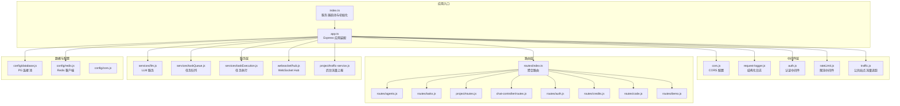
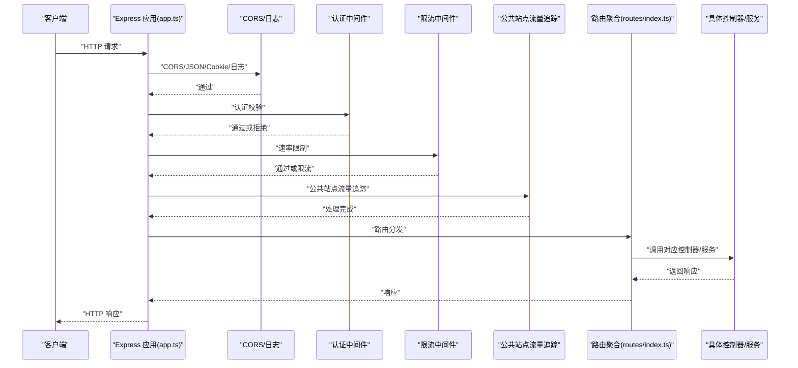
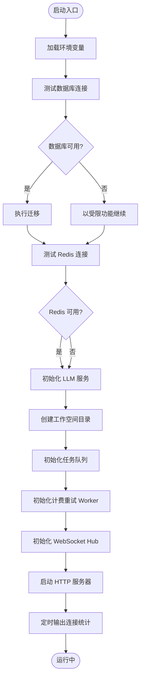
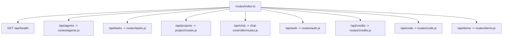
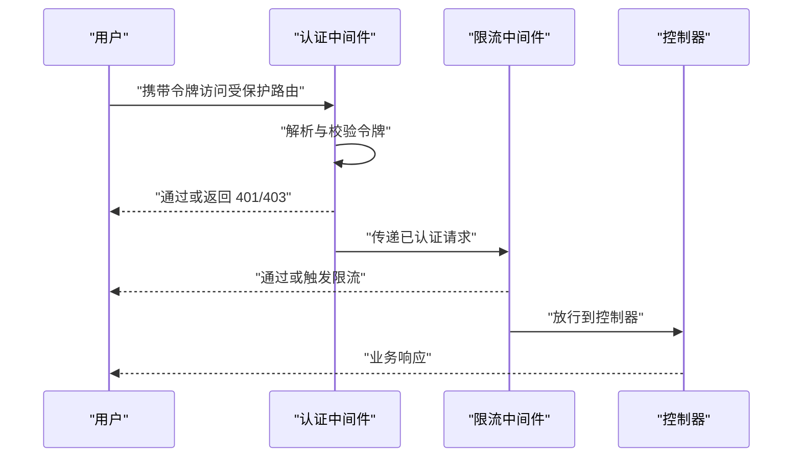
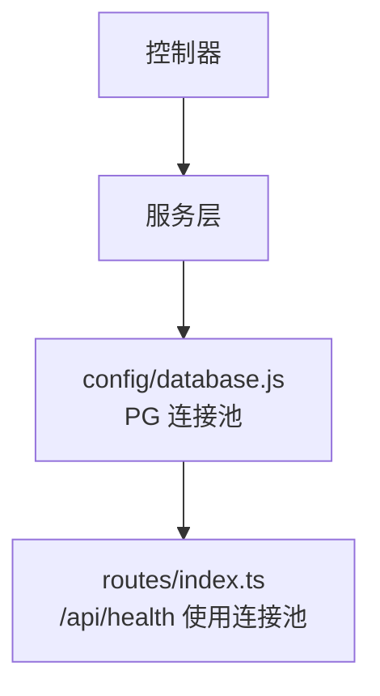
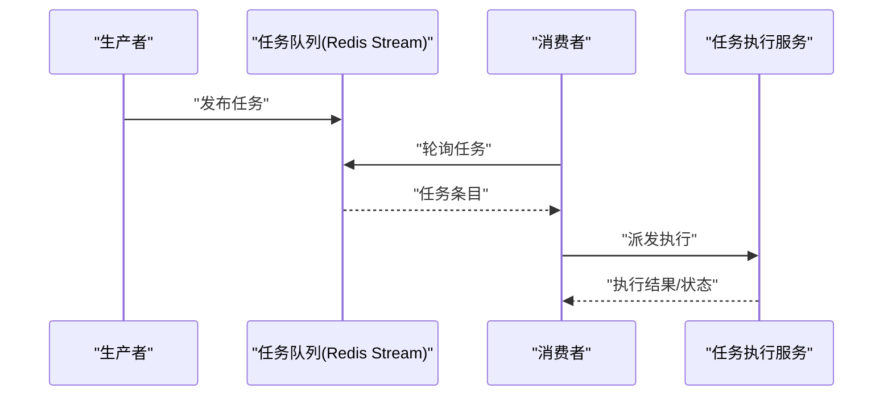
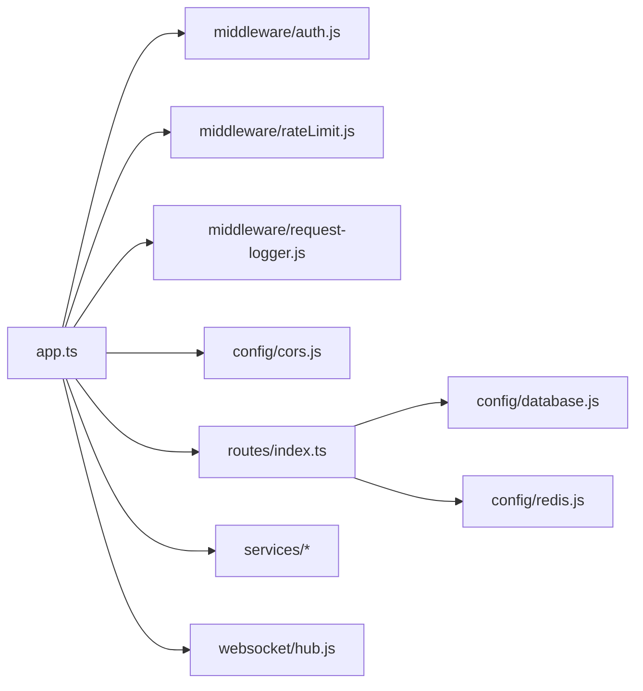

# API 服务架构

<cite>
**本文引用的文件**
- [apps/api/src/app.ts](file://apps/api/src/app.ts)
- [apps/api/src/index.ts](file://apps/api/src/index.ts)
- [apps/api/src/package.json](file://apps/api/src/package.json)
- [apps/api/src/routes/index.ts](file://apps/api/src/routes/index.ts)
- [apps/api/src/config/cors.js](file://apps/api/src/config/cors.js)
- [apps/api/src/middleware/auth.js](file://apps/api/src/middleware/auth.js)
- [apps/api/src/middleware/rateLimit.js](file://apps/api/src/middleware/rateLimit.js)
- [apps/api/src/middleware/request-logger.js](file://apps/api/src/middleware/request-logger.js)
- [apps/api/src/middleware/traffic.js](file://apps/api/src/middleware/traffic.js)
- [apps/api/src/websocket/hub.js](file://apps/api/src/websocket/hub.js)
- [apps/api/src/services/llm.js](file://apps/api/src/services/llm.js)
- [apps/api/src/services/taskExecution.js](file://apps/api/src/services/taskExecution.js)
- [apps/api/src/services/taskQueue.js](file://apps/api/src/services/taskQueue.js)
- [apps/api/src/project/traffic-service.js](file://apps/api/src/project/traffic-service.js)
- [apps/api/src/utils/logger.js](file://apps/api/src/utils/logger.js)
- [apps/api/src/config/database.js](file://apps/api/src/config/database.js)
- [apps/api/src/config/redis.js](file://apps/api/src/config/redis.js)
- [apps/api/src/chat-controller/routes.js](file://apps/api/src/chat-controller/routes.js)
- [apps/api/src/project/routes.js](file://apps/api/src/project/routes.js)
- [apps/api/src/routes/agents.js](file://apps/api/src/routes/agents.js)
- [apps/api/src/routes/tasks.js](file://apps/api/src/routes/tasks.js)
- [apps/api/src/routes/code.js](file://apps/api/src/routes/code.js)
- [apps/api/src/routes/demo.js](file://apps/api/src/routes/demo.js)
- [apps/api/src/routes/credits.js](file://apps/api/src/routes/credits.js)
- [apps/api/src/routes/auth.js](file://apps/api/src/routes/auth.js)
</cite>

## 目录
1. [引言](#引言)
2. [项目结构](#项目结构)
3. [核心组件](#核心组件)
4. [架构总览](#架构总览)
5. [详细组件分析](#详细组件分析)
6. [依赖关系分析](#依赖关系分析)
7. [性能考虑](#性能考虑)
8. [故障排除指南](#故障排除指南)
9. [结论](#结论)
10. [附录](#附录)

## 引言
本文件面向 API 服务架构的技术文档，围绕基于 Express.js 的后端进行系统化梳理，涵盖应用初始化流程、中间件配置、路由组织、核心控制器职责、认证授权与权限控制、数据库与缓存连接、数据访问层与事务管理、API 接口规范、错误处理标准、安全最佳实践、性能优化与监控指标等主题。文档以仓库中实际代码为依据，提供可追溯的章节来源与图示。

## 项目结构
API 服务位于 apps/api 目录，采用模块化分层组织：
- 应用入口与初始化：index.ts 负责环境准备、数据库迁移、外部服务初始化与 HTTP 服务器启动
- 应用装配：app.ts 组织中间件、路由与全局错误处理
- 路由层：routes/index.ts 聚合各业务模块路由（agents、tasks、projects、chat、auth 等）
- 中间件层：统一处理 CORS、日志、认证、限流、流量追踪等
- 服务层：LLM、任务队列、任务执行、WebSocket、计费重试等
- 数据访问层：PostgreSQL 连接池与 Redis 客户端封装
- 工具与配置：日志、CORS、数据库、Redis、工作空间路径等

**图表来源**
- [apps/api/src/index.ts:1-158](file://apps/api/src/index.ts#L1-L158)
- [apps/api/src/app.ts:1-58](file://apps/api/src/app.ts#L1-L58)
- [apps/api/src/routes/index.ts:1-96](file://apps/api/src/routes/index.ts#L1-L96)

**章节来源**
- [apps/api/src/index.ts:1-158](file://apps/api/src/index.ts#L1-L158)
- [apps/api/src/app.ts:1-58](file://apps/api/src/app.ts#L1-L58)
- [apps/api/src/routes/index.ts:1-96](file://apps/api/src/routes/index.ts#L1-L96)

## 核心组件
- 应用装配与中间件链
  - CORS、JSON 解析、Cookie 解析、结构化请求日志、认证、限流、公共站点流量追踪、API 路由挂载、404 与 500 错误处理
- 路由聚合
  - /api/health 健康检查；/api/agents、/api/tasks、/api/projects、/api/chat、/api/auth、/api/credits、/api/code、/api/demo 等模块路由
- 初始化流程
  - 数据库连接测试与迁移、Redis 连接测试、LLM 服务初始化、工作空间目录创建、任务队列初始化、计费重试 Worker、WebSocket Hub、HTTP 服务器监听

**章节来源**
- [apps/api/src/app.ts:1-58](file://apps/api/src/app.ts#L1-L58)
- [apps/api/src/routes/index.ts:1-96](file://apps/api/src/routes/index.ts#L1-L96)
- [apps/api/src/index.ts:54-152](file://apps/api/src/index.ts#L54-L152)

## 架构总览
下图展示从客户端到服务端的典型调用链路，包括中间件处理顺序与路由分发：

**图表来源**
- [apps/api/src/app.ts:15-36](file://apps/api/src/app.ts#L15-L36)
- [apps/api/src/routes/index.ts:85-93](file://apps/api/src/routes/index.ts#L85-L93)

## 详细组件分析

### 应用初始化与启动流程
- 环境变量加载、HTTP 服务器创建、端口监听
- 数据库连接测试与迁移（支持 Helm Hook 兼容的迁移策略）
- Redis 连接测试
- LLM 服务初始化（失败降级）
- 工作空间目录创建
- 任务队列初始化（Redis Stream）
- 计费重试 Worker 初始化
- WebSocket Hub 初始化（依赖 Redis）
- 定时输出 WebSocket 连接统计

**图表来源**
- [apps/api/src/index.ts:54-152](file://apps/api/src/index.ts#L54-L152)

**章节来源**
- [apps/api/src/index.ts:54-152](file://apps/api/src/index.ts#L54-L152)

### 中间件配置与处理顺序
- CORS：使用独立配置模块
- 结构化日志：携带 trace_id 的请求日志中间件
- 认证中间件：在限流前执行，确保受保护路由的鉴权
- 速率限制：基于请求路径与用户上下文的限流策略
- 公共站点流量追踪：对 /h/:projectId 路径进行流量统计与模拟处理
- 404 与 500 错误处理：统一响应格式

**图表来源**
- [apps/api/src/app.ts:15-55](file://apps/api/src/app.ts#L15-L55)

**章节来源**
- [apps/api/src/app.ts:15-55](file://apps/api/src/app.ts#L15-L55)
- [apps/api/src/config/cors.js](file://apps/api/src/config/cors.js)
- [apps/api/src/middleware/request-logger.js](file://apps/api/src/middleware/request-logger.js)
- [apps/api/src/middleware/auth.js](file://apps/api/src/middleware/auth.js)
- [apps/api/src/middleware/rateLimit.js](file://apps/api/src/middleware/rateLimit.js)
- [apps/api/src/middleware/traffic.js](file://apps/api/src/middleware/traffic.js)

### 路由组织与健康检查
- 路由聚合：统一在 routes/index.ts 中注册各模块路由
- /api/health：并发检查数据库、Redis、LLM 服务健康状态，返回标准化 JSON
- 模块路由：agents、tasks、projects、chat、auth、credits、code、demo

**图表来源**
- [apps/api/src/routes/index.ts:85-93](file://apps/api/src/routes/index.ts#L85-L93)

**章节来源**
- [apps/api/src/routes/index.ts:18-83](file://apps/api/src/routes/index.ts#L18-L83)
- [apps/api/src/routes/index.ts:85-93](file://apps/api/src/routes/index.ts#L85-L93)

### 核心控制器与服务职责
- Agent 控制器：负责代理相关资源的增删改查与生命周期管理
- 任务控制器：任务创建、调度、执行与状态跟踪
- 项目控制器：项目维度的数据与权限边界控制
- 聊天控制器：聊天会话与消息处理
- 认证控制器：登录、登出、令牌刷新与权限校验
- 信用点/积分控制器：消费与充值记录
- 代码工具控制器：代码片段与脚本管理
- Demo 控制器：演示与样例接口

上述控制器由对应路由模块导出并在路由聚合中注册，具体实现文件位于相应目录中。

**章节来源**
- [apps/api/src/routes/agents.js](file://apps/api/src/routes/agents.js)
- [apps/api/src/routes/tasks.js](file://apps/api/src/routes/tasks.js)
- [apps/api/src/project/routes.js](file://apps/api/src/project/routes.js)
- [apps/api/src/chat-controller/routes.js](file://apps/api/src/chat-controller/routes.js)
- [apps/api/src/routes/auth.js](file://apps/api/src/routes/auth.js)
- [apps/api/src/routes/credits.js](file://apps/api/src/routes/credits.js)
- [apps/api/src/routes/code.js](file://apps/api/src/routes/code.js)
- [apps/api/src/routes/demo.js](file://apps/api/src/routes/demo.js)

### 认证授权机制与权限控制
- 认证中间件：在 app.ts 中于限流前加载，确保所有受保护路由均经过身份验证
- 权限控制：结合用户角色与资源边界，在控制器层进行细粒度权限判断
- JWT 令牌处理：通过认证中间件解析与校验令牌，注入用户上下文供后续中间件与控制器使用
- 速率限制：在认证中间件之后，按用户/IP 等维度实施限流策略

**图表来源**
- [apps/api/src/app.ts:23-27](file://apps/api/src/app.ts#L23-L27)
- [apps/api/src/middleware/auth.js](file://apps/api/src/middleware/auth.js)
- [apps/api/src/middleware/rateLimit.js](file://apps/api/src/middleware/rateLimit.js)

**章节来源**
- [apps/api/src/app.ts:23-27](file://apps/api/src/app.ts#L23-L27)
- [apps/api/src/middleware/auth.js](file://apps/api/src/middleware/auth.js)
- [apps/api/src/middleware/rateLimit.js](file://apps/api/src/middleware/rateLimit.js)

### 数据库连接配置与数据访问层
- PostgreSQL 连接池：通过 config/database.js 提供连接池实例，路由中用于 /api/health 健康检查
- 数据访问层：控制器/服务通过连接池执行查询，避免直接在路由层操作数据库
- 事务管理：在需要一致性的场景中，使用连接池事务封装；具体事务边界在服务层定义

**图表来源**
- [apps/api/src/config/database.js](file://apps/api/src/config/database.js)
- [apps/api/src/routes/index.ts:54-58](file://apps/api/src/routes/index.ts#L54-L58)

**章节来源**
- [apps/api/src/config/database.js](file://apps/api/src/config/database.js)
- [apps/api/src/routes/index.ts:54-58](file://apps/api/src/routes/index.ts#L54-L58)

### 缓存与会话存储（Redis）
- Redis 客户端：通过 config/redis.js 提供客户端实例
- 用途：会话存储、任务队列（Stream）、分布式锁、缓存与限流状态
- 健康检查：/api/health 并发检查 Redis Ping

**章节来源**
- [apps/api/src/config/redis.js](file://apps/api/src/config/redis.js)
- [apps/api/src/routes/index.ts:64-66](file://apps/api/src/routes/index.ts#L64-L66)

### 任务队列与任务执行
- 任务队列：基于 Redis Stream 的任务队列，初始化在 index.ts 中完成
- 任务执行：服务层负责任务拉取、并发控制、超时与重试策略
- 计费重试：计费异常时的重试 Worker，保障账单一致性

**图表来源**
- [apps/api/src/index.ts:87-93](file://apps/api/src/index.ts#L87-L93)
- [apps/api/src/services/taskQueue.js](file://apps/api/src/services/taskQueue.js)
- [apps/api/src/services/taskExecution.js](file://apps/api/src/services/taskExecution.js)

**章节来源**
- [apps/api/src/index.ts:87-116](file://apps/api/src/index.ts#L87-L116)
- [apps/api/src/services/taskQueue.js](file://apps/api/src/services/taskQueue.js)
- [apps/api/src/services/taskExecution.js](file://apps/api/src/services/taskExecution.js)

### WebSocket 与实时通信
- WebSocket Hub：基于 Socket.IO 与 Redis Adapter 实现跨节点通信
- 连接统计：定时输出连接总数、已认证与访客数量
- 依赖：需 Redis 可用才启用

**章节来源**
- [apps/api/src/websocket/hub.js](file://apps/api/src/websocket/hub.js)
- [apps/api/src/index.ts:121-130](file://apps/api/src/index.ts#L121-L130)

### LLM 服务集成
- 初始化：启动时尝试初始化 LLM 服务，失败则降级
- 健康检查：/api/health 并发检查 LLM 可用性与提供商信息

**章节来源**
- [apps/api/src/index.ts:71-77](file://apps/api/src/index.ts#L71-L77)
- [apps/api/src/services/llm.js](file://apps/api/src/services/llm.js)
- [apps/api/src/routes/index.ts:67-68](file://apps/api/src/routes/index.ts#L67-L68)

### 公共站点流量追踪
- 路径：/h/:projectId
- 功能：在认证前进行流量统计与模拟处理，便于公开站点的访问统计

**章节来源**
- [apps/api/src/app.ts:29-30](file://apps/api/src/app.ts#L29-L30)
- [apps/api/src/middleware/traffic.js](file://apps/api/src/middleware/traffic.js)

## 依赖关系分析
- Express 应用依赖中间件、路由与配置模块
- 路由依赖数据库与 Redis 客户端进行健康检查
- 服务层依赖数据库与 Redis 客户端
- 初始化流程串行依赖数据库与 Redis 的可用性

**图表来源**
- [apps/api/src/app.ts:1-11](file://apps/api/src/app.ts#L1-L11)
- [apps/api/src/routes/index.ts:11-13](file://apps/api/src/routes/index.ts#L11-L13)

**章节来源**
- [apps/api/src/app.ts:1-11](file://apps/api/src/app.ts#L1-L11)
- [apps/api/src/routes/index.ts:11-13](file://apps/api/src/routes/index.ts#L11-L13)

## 性能考虑
- 中间件顺序优化：认证与限流置于日志之后，减少无效日志开销
- 并发与超时：任务执行设置最大并发与超时时间，避免资源耗尽
- 连接池与缓存：合理配置数据库连接池大小与 Redis 连接数
- 健康检查并发：/api/health 使用 Promise.allSettled 并发检查多依赖，降低延迟
- WebSocket：按需启用，避免不必要的广播与连接

[本节为通用指导，无需特定文件来源]

## 故障排除指南
- 服务器启动失败：检查数据库与 Redis 连接日志，确认迁移是否成功
- 认证失败：确认令牌有效性与中间件加载顺序
- 限流触发：检查用户标识与限流规则
- WebSocket 不可用：确认 Redis 可用性与 Hub 初始化日志
- 健康检查 503：定位数据库、Redis 或 LLM 服务异常

**章节来源**
- [apps/api/src/index.ts:54-152](file://apps/api/src/index.ts#L54-L152)
- [apps/api/src/app.ts:47-55](file://apps/api/src/app.ts#L47-L55)
- [apps/api/src/utils/logger.js](file://apps/api/src/utils/logger.js)

## 结论
该 API 服务采用清晰的分层架构与模块化路由，结合认证、限流、日志与健康检查等中间件，形成稳定的服务入口。初始化流程覆盖数据库迁移、外部服务连接与基础设施准备，具备良好的可维护性与可扩展性。建议在生产环境中强化密钥管理、网络隔离与监控告警，并持续优化任务执行与缓存策略以提升吞吐与稳定性。

[本节为总结性内容，无需特定文件来源]

## 附录

### API 接口规范与错误处理
- 统一响应结构
  - 成功：code=200，message="success"，data 为业务数据
  - 失败：code 为错误码，message 为错误描述，data=null
- 错误处理
  - 404：未匹配到路由
  - 500：未捕获的服务器内部错误
  - 401/403：认证或权限不足（由认证中间件与控制器返回）

**章节来源**
- [apps/api/src/app.ts:38-55](file://apps/api/src/app.ts#L38-L55)

### 安全最佳实践
- 令牌管理：使用短期有效令牌与安全存储，定期轮换密钥
- CORS 与 HTTPS：严格配置允许源与安全头
- 输入校验：结合 Zod 等工具在路由层进行参数校验
- 日志脱敏：避免在日志中输出敏感信息
- 最小权限：控制器内按资源边界进行权限校验

**章节来源**
- [apps/api/src/package.json:26-42](file://apps/api/src/package.json#L26-L42)
- [apps/api/src/middleware/auth.js](file://apps/api/src/middleware/auth.js)

### 监控指标与可观测性
- 健康检查：/api/health 返回数据库、Redis、LLM 状态
- 连接统计：WebSocket Hub 定时输出连接数
- 结构化日志：携带 trace_id，便于链路追踪
- OpenTelemetry：依赖 @opentelemetry/api，建议在服务层埋点

**章节来源**
- [apps/api/src/routes/index.ts:52-83](file://apps/api/src/routes/index.ts#L52-L83)
- [apps/api/src/websocket/hub.js](file://apps/api/src/websocket/hub.js)
- [apps/api/src/middleware/request-logger.js](file://apps/api/src/middleware/request-logger.js)
- [apps/api/src/package.json:29](file://apps/api/src/package.json#L29)