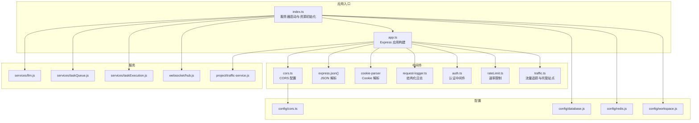
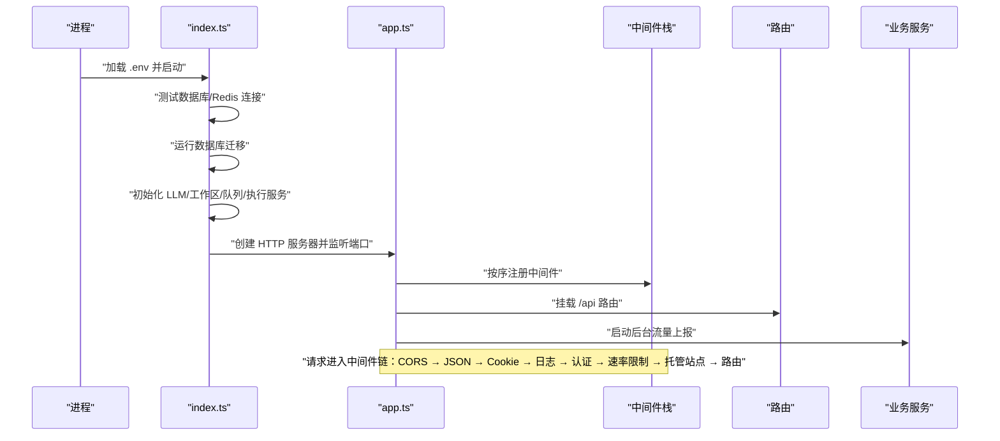
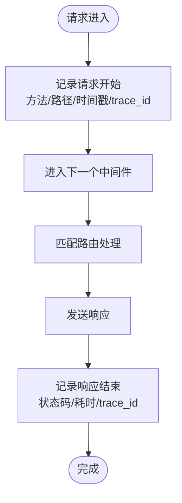
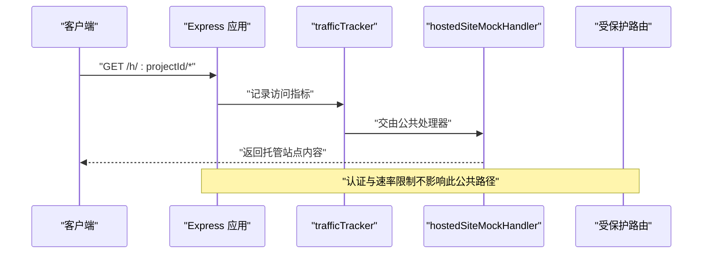
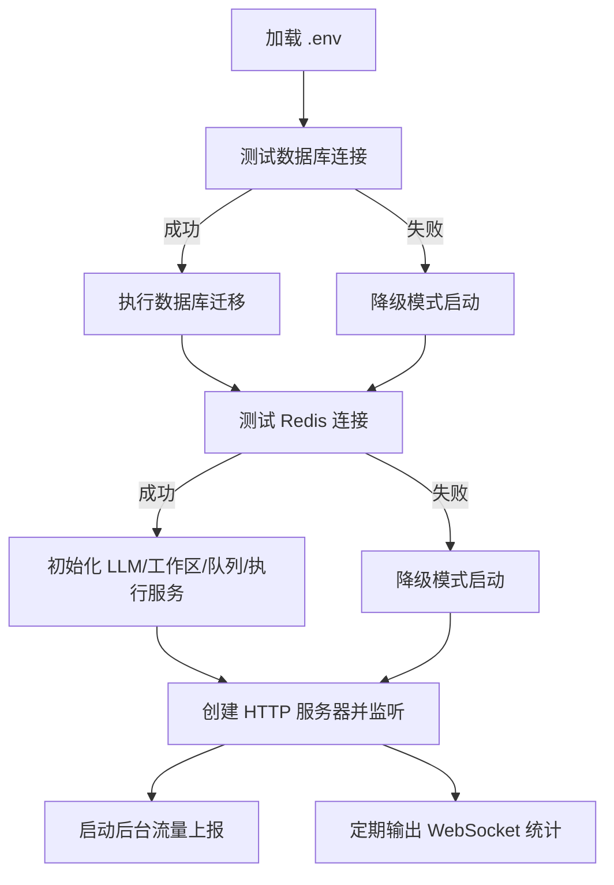
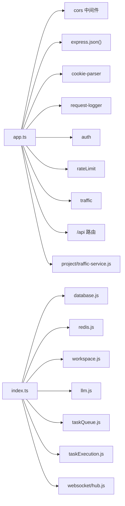

# 应用结构与初始化

<cite>
**本文引用的文件**
- [apps/api/src/app.ts](file://apps/api/src/app.ts)
- [apps/api/src/index.ts](file://apps/api/src/index.ts)
- [apps/api/src/middleware/request-logger.ts](file://apps/api/src/middleware/request-logger.ts)
- [apps/api/src/middleware/auth.ts](file://apps/api/src/middleware/auth.ts)
- [apps/api/src/middleware/rateLimit.ts](file://apps/api/src/middleware/rateLimit.ts)
- [apps/api/src/middleware/traffic.ts](file://apps/api/src/middleware/traffic.ts)
- [apps/api/src/config/cors.ts](file://apps/api/src/config/cors.ts)
- [apps/api/src/config/database.js](file://apps/api/src/config/database.js)
- [apps/api/src/config/redis.js](file://apps/api/src/config/redis.js)
- [apps/api/src/config/workspace.js](file://apps/api/src/config/workspace.js)
- [apps/api/src/websocket/hub.js](file://apps/api/src/websocket/hub.js)
- [apps/api/src/services/llm.js](file://apps/api/src/services/llm.js)
- [apps/api/src/services/taskExecution.js](file://apps/api/src/services/taskExecution.js)
- [apps/api/src/services/taskQueue.js](file://apps/api/src/services/taskQueue.js)
- [apps/api/src/project/traffic-service.js](file://apps/api/src/project/traffic-service.js)
- [apps/api/src/utils/logger.js](file://apps/api/src/utils/logger.js)
</cite>

## 目录
1. [引言](#引言)
2. [项目结构](#项目结构)
3. [核心组件](#核心组件)
4. [架构总览](#架构总览)
5. [详细组件分析](#详细组件分析)
6. [依赖关系分析](#依赖关系分析)
7. [性能考量](#性能考量)
8. [故障排查指南](#故障排查指南)
9. [结论](#结论)
10. [附录](#附录)

## 引言
本文件聚焦于 AgentHive Cloud 项目中 API 应用的结构与初始化流程，系统梳理 Express 应用的启动序列、中间件配置顺序与职责边界，以及与认证、速率限制、日志、流量追踪、工作区管理等关键模块的集成方式。文档旨在帮助开发者快速理解应用初始化的全貌与最佳实践。

## 项目结构
API 应用位于 apps/api/src 目录，采用按功能域分层的组织方式：
- 入口与应用实例：index.ts 负责环境加载、资源初始化与服务器启动；app.ts 构建 Express 实例并挂载中间件与路由。
- 中间件：集中于 middleware 目录，包含 CORS、请求日志、认证、速率限制、流量追踪等。
- 配置：config 目录提供 CORS、数据库、Redis、工作区等配置。
- 服务：services 目录封装 LLM、任务队列、任务执行、计费重试等业务能力。
- WebSocket：websocket 目录提供连接 Hub 的初始化与统计。
- 工具：utils 提供统一日志工具。

图表来源
- [apps/api/src/index.ts:1-158](file://apps/api/src/index.ts#L1-L158)
- [apps/api/src/app.ts:1-58](file://apps/api/src/app.ts#L1-L58)

章节来源
- [apps/api/src/index.ts:1-158](file://apps/api/src/index.ts#L1-L158)
- [apps/api/src/app.ts:1-58](file://apps/api/src/app.ts#L1-L58)

## 核心组件
- Express 应用实例：在 app.ts 中创建并配置中间件与路由。
- 中间件栈：CORS、JSON 解析、Cookie 解析、请求日志、认证、速率限制、托管站点流量追踪。
- 服务器启动：在 index.ts 中完成数据库/Redis 连通性测试、迁移、LLM 初始化、工作区准备、任务队列与执行服务初始化、WebSocket 初始化，最后启动 HTTP 服务器。
- 日志与错误处理：统一使用结构化日志，错误处理中间件返回标准化错误响应。

章节来源
- [apps/api/src/app.ts:13-58](file://apps/api/src/app.ts#L13-L58)
- [apps/api/src/index.ts:54-152](file://apps/api/src/index.ts#L54-L152)

## 架构总览
下图展示从进程启动到请求处理的关键交互：

图表来源
- [apps/api/src/index.ts:54-152](file://apps/api/src/index.ts#L54-L152)
- [apps/api/src/app.ts:15-36](file://apps/api/src/app.ts#L15-L36)

## 详细组件分析

### Express 应用初始化与中间件顺序
- 初始化步骤
  - 创建 Express 实例。
  - 注册基础中间件：CORS、JSON 解析、Cookie 解析。
  - 结构化请求日志中间件。
  - 认证中间件。
  - 速率限制中间件。
  - 托管站点公共访问处理（在认证之前）。
  - API 路由挂载。
  - 404 与错误处理中间件。
- 关键点
  - CORS 在最前，确保跨域预检与后续中间件一致生效。
  - JSON 与 Cookie 解析为后续中间件与路由提供数据基础。
  - 结构化日志在认证前，便于捕获未认证请求的完整上下文。
  - 认证与速率限制在路由前，保证对所有受保护路由生效。
  - 托管站点公共路径在认证前，允许公开访问并进行流量追踪。

章节来源
- [apps/api/src/app.ts:15-36](file://apps/api/src/app.ts#L15-L36)

### CORS 配置
- 配置来源：通过 config/cors.ts 导出的 corsConfig 传入 cors 中间件。
- 作用：统一处理跨域请求，避免浏览器同源策略导致的请求失败。
- 建议：生产环境应明确白名单域名，最小暴露策略。

章节来源
- [apps/api/src/app.ts:16](file://apps/api/src/app.ts#L16)
- [apps/api/src/config/cors.ts](file://apps/api/src/config/cors.ts)

### JSON 解析与 Cookie 解析
- JSON 解析：express.json() 将请求体解析为 JSON 对象，供后续中间件与路由使用。
- Cookie 解析：cookie-parser 将 Cookie 字段解析为对象，便于读取会话信息。
- 位置：紧随 CORS 之后，确保后续中间件可直接访问 req.body 与 req.cookies。

章节来源
- [apps/api/src/app.ts:17-18](file://apps/api/src/app.ts#L17-L18)

### 请求日志中间件（结构化日志）
- 实现位置：middleware/request-logger.ts。
- 功能：在请求进入时记录请求元数据，在响应发送后记录状态码、耗时与 trace_id，形成结构化日志。
- 与认证的关系：在认证中间件之前，可记录未认证请求的访问轨迹，便于审计与问题定位。

图表来源
- [apps/api/src/app.ts:20-21](file://apps/api/src/app.ts#L20-L21)
- [apps/api/src/middleware/request-logger.ts](file://apps/api/src/middleware/request-logger.ts)

章节来源
- [apps/api/src/app.ts:20-21](file://apps/api/src/app.ts#L20-L21)

### 认证中间件（执行时机与安全考虑）
- 执行时机：在请求日志之后、速率限制之前，确保已记录 trace_id 且在受保护路由上生效。
- 安全考虑：结合 JWT 或会话机制校验身份，失败时返回 401/403；对敏感操作建议二次校验。
- 与托管站点：托管站点公共访问在认证之前，避免泄露公开内容。

章节来源
- [apps/api/src/app.ts:23-27](file://apps/api/src/app.ts#L23-L27)
- [apps/api/src/middleware/auth.ts](file://apps/api/src/middleware/auth.ts)

### 速率限制中间件
- 执行时机：在认证之后、路由之前，基于用户身份或 IP 进行限流。
- 作用：防止滥用与 DDoS 攻击，保护下游服务稳定。

章节来源
- [apps/api/src/app.ts:26-27](file://apps/api/src/app.ts#L26-L27)
- [apps/api/src/middleware/rateLimit.ts](file://apps/api/src/middleware/rateLimit.ts)

### 托管站点流量追踪与公共访问
- 路由前缀：/h/:projectId。
- 机制：先执行 trafficTracker 中间件记录访问指标，再由 hostedSiteMockHandler 处理公共访问。
- 价值：无需登录即可收集访问数据，便于分析与优化。

图表来源
- [apps/api/src/app.ts:29-30](file://apps/api/src/app.ts#L29-L30)
- [apps/api/src/middleware/traffic.ts](file://apps/api/src/middleware/traffic.ts)

章节来源
- [apps/api/src/app.ts:29-30](file://apps/api/src/app.ts#L29-L30)

### API 路由与 404/错误处理
- 路由挂载：/api 前缀下挂载全部业务路由。
- 404 处理：未匹配到路由时返回标准化 404 响应。
- 错误处理：捕获未处理异常，记录错误日志并返回 500。

章节来源
- [apps/api/src/app.ts:32-45](file://apps/api/src/app.ts#L32-L45)

### 应用启动流程与环境变量配置
- 环境变量加载：通过 dotenv 加载 .env 文件。
- 数据库与 Redis：启动前进行连通性测试，失败时以降级模式运行。
- 数据库迁移：开发环境启动时自动执行 pending migration，生产环境建议在 CI/CD 中显式执行。
- LLM 初始化：尝试初始化 LLM 服务，失败则记录日志并继续启动。
- 工作区管理：创建工作区根目录，确保任务执行与文件存储可用。
- 任务队列与执行：初始化 Redis Stream 任务队列与任务执行服务。
- WebSocket：在 Redis 可用时初始化 Hub 并定期输出连接统计。
- 服务器监听：创建 HTTP 服务器并监听端口，输出健康检查地址。

图表来源
- [apps/api/src/index.ts:34-51](file://apps/api/src/index.ts#L34-L51)
- [apps/api/src/index.ts:54-152](file://apps/api/src/index.ts#L54-L152)

章节来源
- [apps/api/src/index.ts:3-27](file://apps/api/src/index.ts#L3-L27)
- [apps/api/src/index.ts:54-152](file://apps/api/src/index.ts#L54-L152)

### 工作区管理与最佳实践
- 工作区根目录：通过 config/workspace.js 提供 WORKSPACE_BASE，启动时自动创建。
- 最佳实践：
  - 确保容器/主机对该目录有读写权限。
  - 定期清理过期任务产物，避免磁盘占用。
  - 对外部挂载场景，建议使用只读绑定 + 写入缓存策略。

章节来源
- [apps/api/src/index.ts:18](file://apps/api/src/index.ts#L18)
- [apps/api/src/config/workspace.js](file://apps/api/src/config/workspace.js)

### 背景服务与流量上报
- 后台流量上报：在 app.ts 中调用 startBatchReporter() 启动批量上报任务。
- 用途：将采集到的访问指标批量写入后端存储，降低实时上报开销。

章节来源
- [apps/api/src/app.ts:35](file://apps/api/src/app.ts#L35)
- [apps/api/src/project/traffic-service.js](file://apps/api/src/project/traffic-service.js)

## 依赖关系分析
- 模块耦合
  - app.ts 作为装配中心，依赖各中间件与配置模块。
  - index.ts 作为启动器，负责外部依赖（数据库、Redis、WS、LLM、队列、执行服务）的初始化。
- 关键依赖链
  - CORS 配置 → cors 中间件 → 全局跨域策略。
  - request-logger → 认证/速率限制 → 路由处理。
  - traffic.ts → 托管站点公共访问。
  - database.js/redis.js → 启动阶段的连通性测试。
  - workspace.js → 工作区目录准备。
  - websocket/hub.js → WebSocket 初始化。
  - project/traffic-service.js → 后台流量上报。

图表来源
- [apps/api/src/app.ts:1-58](file://apps/api/src/app.ts#L1-L58)
- [apps/api/src/index.ts:1-158](file://apps/api/src/index.ts#L1-L158)

章节来源
- [apps/api/src/app.ts:1-58](file://apps/api/src/app.ts#L1-L58)
- [apps/api/src/index.ts:1-158](file://apps/api/src/index.ts#L1-L158)

## 性能考量
- 中间件顺序优化：将轻量中间件（CORS、JSON、Cookie、日志）置于前部，减少后续中间件的无效计算。
- 速率限制粒度：区分公开与受保护路由，避免对托管站点路径施加严格限制。
- WebSocket 连接统计：定期输出连接数，便于容量规划与异常监控。
- 后台任务：批量上报与定时统计在独立线程执行，避免阻塞主请求链路。

## 故障排查指南
- 启动失败
  - 数据库/Redis 连接失败：检查连接字符串与网络策略；生产环境迁移失败将终止启动。
  - LLM 初始化失败：确认模型服务可用性与鉴权配置。
  - 工作区创建失败：检查磁盘空间与权限。
- 请求无日志
  - 确认 request-logger 是否正确注册且未被覆盖。
- 认证绕过
  - 检查托管站点公共路径是否误放至认证中间件之后。
- 404 与 500
  - 404：确认路由前缀与路径拼写；检查 404 中间件是否在路由之后注册。
  - 500：查看错误处理中间件日志，定位具体异常。

章节来源
- [apps/api/src/index.ts:54-152](file://apps/api/src/index.ts#L54-L152)
- [apps/api/src/app.ts:38-55](file://apps/api/src/app.ts#L38-L55)

## 结论
该应用通过清晰的中间件顺序与模块化装配，实现了从启动到请求处理的稳健流程。CORS、JSON、Cookie、日志、认证、速率限制与托管站点公共访问的组合，既满足了安全需求，又兼顾了可观测性与可扩展性。配合结构化日志与后台流量上报，能够有效支撑线上问题定位与容量规划。

## 附录
- 环境变量建议
  - NODE_ENV：development/production/staging
  - PORT：监听端口
  - API_ROOT：API 根目录
  - MIGRATIONS_DIR：数据库迁移目录
  - DATABASE_URL/REDIS_URL：连接字符串
  - WORKSPACE_BASE：工作区根目录
- 健康检查
  - 启动完成后可通过健康端点进行探测，详见启动日志输出的健康地址。