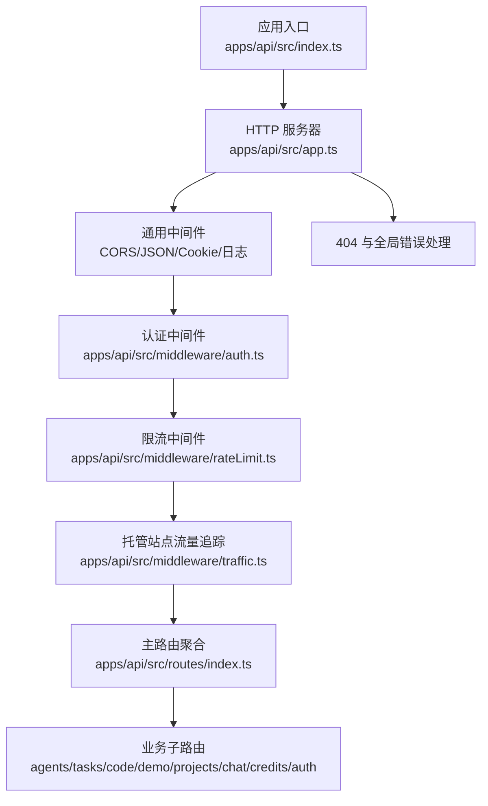
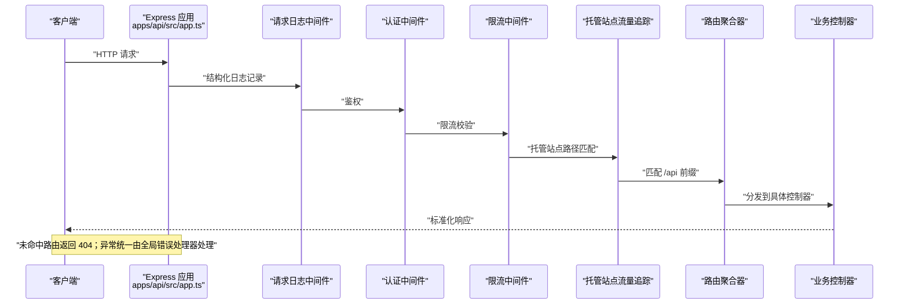
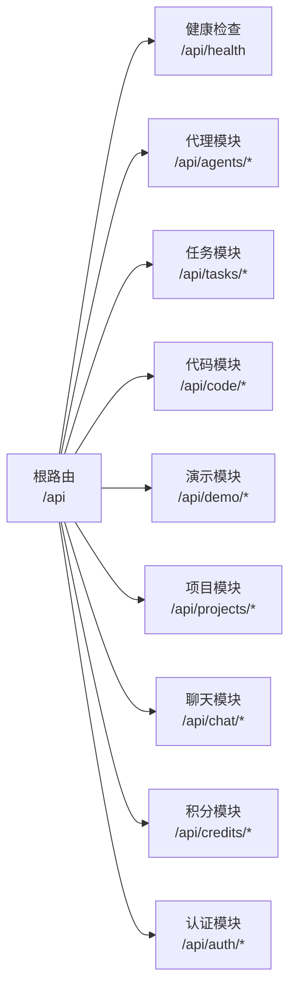
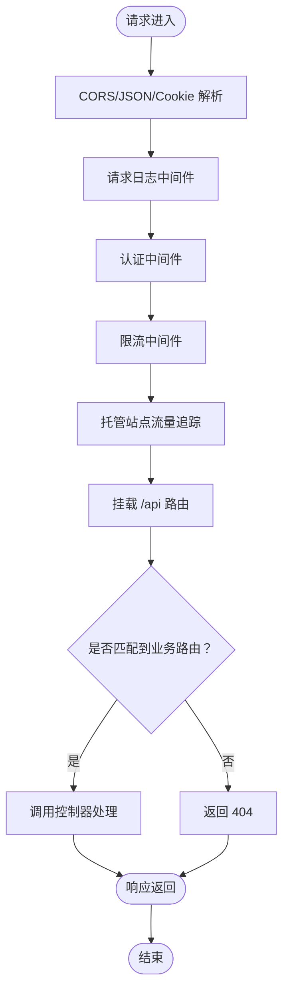
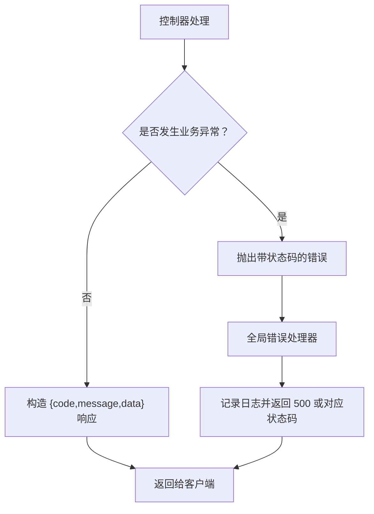
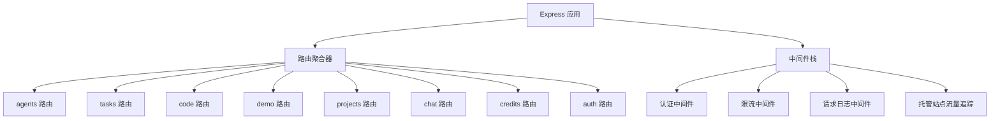

# 路由系统与控制器

<cite>
**本文档引用的文件**
- [apps/api/src/app.ts](file://apps/api/src/app.ts)
- [apps/api/src/index.ts](file://apps/api/src/index.ts)
- [apps/api/src/routes/index.ts](file://apps/api/src/routes/index.ts)
- [apps/api/src/middleware/auth.ts](file://apps/api/src/middleware/auth.ts)
- [apps/api/src/middleware/rateLimit.ts](file://apps/api/src/middleware/rateLimit.ts)
- [apps/api/src/middleware/request-logger.ts](file://apps/api/src/middleware/request-logger.ts)
- [apps/api/src/middleware/traffic.ts](file://apps/api/src/middleware/traffic.ts)
- [apps/api/src/project/routes.js](file://apps/api/src/project/routes.js)
- [apps/api/src/chat-controller/routes.js](file://apps/api/src/chat-controller/routes.js)
</cite>

## 目录
1. [简介](#简介)
2. [项目结构](#项目结构)
3. [核心组件](#核心组件)
4. [架构总览](#架构总览)
5. [详细组件分析](#详细组件分析)
6. [依赖关系分析](#依赖关系分析)
7. [性能考虑](#性能考虑)
8. [故障排除指南](#故障排除指南)
9. [结论](#结论)

## 简介
本文件面向后端路由系统与控制器的综合技术文档，聚焦于 Node.js + Express 应用中的路由组织结构、模块化设计原则、控制器职责划分、参数处理与请求体验证机制、错误处理策略以及响应格式标准化。同时提供中间件使用场景说明与自定义路由处理器开发指南，帮助开发者在不直接阅读源码的情况下理解系统的整体架构与实现要点。

## 项目结构
API 服务采用 Express 应用作为入口，通过中间件链路统一处理跨域、日志、认证、限流等横切关注点，并将业务路由按功能域拆分为多个子路由模块，最终统一挂载到 /api 前缀下。系统还包含健康检查、流量追踪与托管站点模拟处理等辅助能力。

图表来源
- [apps/api/src/index.ts:1-158](file://apps/api/src/index.ts#L1-L158)
- [apps/api/src/app.ts:1-58](file://apps/api/src/app.ts#L1-L58)
- [apps/api/src/routes/index.ts:1-96](file://apps/api/src/routes/index.ts#L1-L96)

章节来源
- [apps/api/src/index.ts:1-158](file://apps/api/src/index.ts#L1-L158)
- [apps/api/src/app.ts:1-58](file://apps/api/src/app.ts#L1-L58)
- [apps/api/src/routes/index.ts:1-96](file://apps/api/src/routes/index.ts#L1-L96)

## 核心组件
- 应用入口与服务器启动
  - 负责加载环境变量、初始化数据库迁移、测试连接、创建工作区目录、初始化任务队列与执行服务、启动 WebSocket、监听端口并输出运行信息。
- Express 应用与中间件栈
  - 统一配置 CORS、JSON 解析、Cookie 解析、请求日志、认证、限流、托管站点流量追踪与 API 路由挂载。
- 路由聚合器
  - 将各业务模块路由按前缀进行组合，提供统一的 /api 命名空间，并内置健康检查端点。
- 中间件体系
  - 认证中间件用于鉴权；限流中间件用于保护接口；请求日志中间件提供结构化日志与 trace_id；流量追踪中间件用于托管站点访问统计。

章节来源
- [apps/api/src/index.ts:1-158](file://apps/api/src/index.ts#L1-L158)
- [apps/api/src/app.ts:1-58](file://apps/api/src/app.ts#L1-L58)
- [apps/api/src/routes/index.ts:1-96](file://apps/api/src/routes/index.ts#L1-L96)

## 架构总览
下图展示了从客户端请求到业务路由处理的整体流程，包括中间件执行顺序与路由挂载位置。

图表来源
- [apps/api/src/app.ts:1-58](file://apps/api/src/app.ts#L1-L58)
- [apps/api/src/routes/index.ts:1-96](file://apps/api/src/routes/index.ts#L1-L96)

## 详细组件分析

### 路由组织与模块化设计
- 命名空间与前缀
  - 主路由聚合器在 /api 下挂载多个子模块路由，便于按领域划分职责与版本演进。
- 健康检查端点
  - 提供统一的健康检查接口，异步并发探测数据库、缓存与 LLM 服务可用性，返回标准化状态对象。
- 子路由模块
  - 包含 agents、tasks、code、demo、projects、chat、credits、auth 等模块路由，分别对应不同业务域。

图表来源
- [apps/api/src/routes/index.ts:85-96](file://apps/api/src/routes/index.ts#L85-L96)

章节来源
- [apps/api/src/routes/index.ts:1-96](file://apps/api/src/routes/index.ts#L1-L96)

### 中间件使用场景与实现模式
- CORS 与通用解析
  - 在应用启动早期启用，确保后续中间件与路由可正常处理跨域与 JSON/Cookie 请求。
- 请求日志中间件
  - 提供结构化日志与 trace_id，便于全链路追踪与问题定位。
- 认证中间件
  - 在限流之前执行，确保认证通过的请求参与限流计算，避免恶意刷量绕过。
- 限流中间件
  - 基于请求上下文进行配额控制，保护下游服务免受突发流量冲击。
- 托管站点流量追踪
  - 对特定路径前缀进行独立的流量统计与模拟处理，不影响主业务路由。
- 全局 404 与错误处理
  - 未匹配路由统一返回 404；未捕获异常统一返回 500，并记录错误日志。

图表来源
- [apps/api/src/app.ts:15-55](file://apps/api/src/app.ts#L15-L55)

章节来源
- [apps/api/src/app.ts:1-58](file://apps/api/src/app.ts#L1-L58)

### 控制器职责与工作流
- 代理控制器（Agent）
  - 职责：负责代理生命周期管理，包括创建、更新、删除、状态查询与事件推送等。
  - 关键点：与任务执行服务协同，确保代理状态与任务调度一致；对请求参数进行严格校验，防止非法状态变更。
- 任务控制器（Task）
  - 职责：协调任务工作流，包括任务提交、状态轮询、结果回传与失败重试。
  - 关键点：基于队列与超时机制保证可靠性；对任务输入进行合法性验证，避免无效负载。
- 项目控制器（Project）
  - 职责：管理项目资源，包括项目创建、成员管理、权限控制与资源配额。
  - 关键点：与认证中间件配合进行权限校验；对敏感操作进行审计日志记录。
- 聊天控制器（Chat）
  - 职责：处理聊天会话与消息流转，支持实时通信与历史检索。
  - 关键点：结合 WebSocket 与 Redis 实现高并发消息投递；对消息内容进行安全过滤。
- 积分控制器（Credits）
  - 职责：维护用户积分余额与流水记录，支持充值、消费与退款。
  - 关键点：事务性操作保障数据一致性；对异常交易进行回滚与告警。

章节来源
- [apps/api/src/routes/index.ts:3-10](file://apps/api/src/routes/index.ts#L3-L10)
- [apps/api/src/project/routes.js](file://apps/api/src/project/routes.js)
- [apps/api/src/chat-controller/routes.js](file://apps/api/src/chat-controller/routes.js)

### 参数处理、查询字符串解析与请求体验证
- 查询字符串解析
  - Express 默认解析 querystring 并挂载到 req.query；建议在控制器层对必填字段进行存在性与类型校验。
- 路径参数
  - 使用路由参数占位符传递标识符（如 /api/projects/:id），在控制器中进行格式与范围校验。
- 请求体验证
  - 建议引入 schema 校验库（如 Joi/Zod）对 JSON 请求体进行白名单校验，拒绝未知字段；对必填字段与默认值进行约束。
- 响应格式标准化
  - 统一使用 { code, message, data } 结构；成功场景 code=200，错误场景返回对应状态码与错误描述；data 为对象或数组。

章节来源
- [apps/api/src/app.ts:16-18](file://apps/api/src/app.ts#L16-L18)
- [apps/api/src/routes/index.ts:52-83](file://apps/api/src/routes/index.ts#L52-L83)

### 错误处理策略与响应格式
- 404 未匹配路由
  - 返回标准化 404 响应，message 指示接口不存在。
- 未捕获异常
  - 全局错误处理器记录错误日志并返回 500，避免敏感信息泄露。
- 业务异常
  - 在控制器内根据业务规则抛出带状态码的错误，交由统一错误处理器转换为标准响应。

图表来源
- [apps/api/src/app.ts:38-55](file://apps/api/src/app.ts#L38-L55)

章节来源
- [apps/api/src/app.ts:38-55](file://apps/api/src/app.ts#L38-L55)

### 自定义路由处理器开发指南
- 路由注册
  - 在对应模块路由文件中定义路径与 HTTP 方法，绑定到控制器函数。
- 参数提取
  - 从 req.params、req.query、req.body 中提取参数，进行类型转换与边界检查。
- 权限与限流
  - 在控制器入口处调用认证与限流逻辑，确保只有授权且未超限的请求才能继续。
- 业务处理
  - 编写最小可行的业务逻辑，优先保证幂等性与可恢复性。
- 响应构建
  - 使用统一响应格式，必要时在控制器内封装工具函数以减少重复代码。
- 错误传播
  - 将业务异常转换为带明确状态码的错误对象，交由全局错误处理器处理。

章节来源
- [apps/api/src/routes/index.ts:85-96](file://apps/api/src/routes/index.ts#L85-L96)
- [apps/api/src/app.ts:23-27](file://apps/api/src/app.ts#L23-L27)

## 依赖关系分析
- 组件耦合
  - 路由聚合器对各业务模块路由具有集中依赖，体现“高内聚、低耦合”的模块化设计。
  - 中间件按执行顺序形成链式依赖，认证与限流依赖于日志中间件提供的上下文信息。
- 外部依赖
  - 数据库连接池、Redis 客户端、LLM 服务连接在健康检查中被统一探测，确保系统可用性。
- 循环依赖
  - 当前结构未见明显循环依赖；若新增模块需谨慎处理相互引用。

图表来源
- [apps/api/src/routes/index.ts:3-10](file://apps/api/src/routes/index.ts#L3-L10)
- [apps/api/src/app.ts:15-33](file://apps/api/src/app.ts#L15-L33)

章节来源
- [apps/api/src/routes/index.ts:1-96](file://apps/api/src/routes/index.ts#L1-L96)
- [apps/api/src/app.ts:1-58](file://apps/api/src/app.ts#L1-L58)

## 性能考虑
- 异步并发健康检查
  - 健康检查使用并发探测数据库、缓存与 LLM 服务，缩短响应时间并提升准确性。
- 限流与速率控制
  - 在认证之后、路由之前执行限流，既能保护接口又能避免未认证请求占用资源。
- 任务队列与执行服务
  - 通过队列与超时机制保障任务处理的稳定性与吞吐量，建议根据业务峰值调整并发数与超时阈值。
- 日志与追踪
  - 结构化日志与 trace_id 有助于快速定位热点路径与慢请求，建议结合 APM 工具进行性能监控。

章节来源
- [apps/api/src/routes/index.ts:52-83](file://apps/api/src/routes/index.ts#L52-L83)
- [apps/api/src/app.ts:26-27](file://apps/api/src/app.ts#L26-L27)
- [apps/api/src/index.ts:87-116](file://apps/api/src/index.ts#L87-L116)

## 故障排除指南
- 启动阶段
  - 数据库连接失败：检查连接串与网络连通性；生产环境迁移失败将阻断启动，开发环境允许继续排查。
  - Redis 连接失败：确认服务可用性与密码配置；WebSocket 初始化依赖 Redis，失败时将降级禁用。
  - LLM 初始化失败：确认模型提供商可用性与密钥配置，系统将记录错误并继续运行。
- 运行阶段
  - 404 接口不存在：核对请求路径与模块路由注册；确认 /api 前缀是否正确。
  - 500 服务器内部错误：查看日志中的错误堆栈，定位具体控制器与业务逻辑。
  - 认证失败或限流触发：检查认证头与限流策略配置，确认用户配额与频率限制。

章节来源
- [apps/api/src/index.ts:54-152](file://apps/api/src/index.ts#L54-L152)
- [apps/api/src/app.ts:38-55](file://apps/api/src/app.ts#L38-L55)

## 结论
该路由系统与控制器架构遵循模块化与中间件链设计，通过统一的健康检查、认证与限流策略保障系统稳定运行。建议在控制器层进一步完善请求体 schema 校验与响应格式规范化，并结合性能监控工具持续优化关键路径。对于新功能扩展，遵循现有模块化约定与中间件执行顺序，确保新增路由与处理器符合整体设计原则。