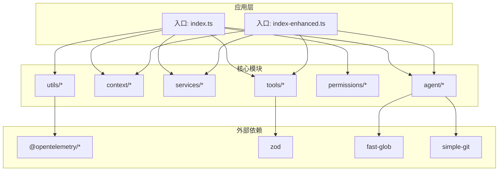
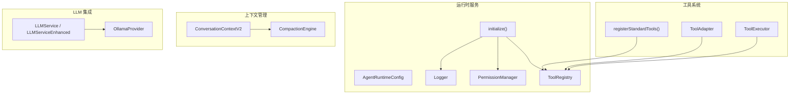
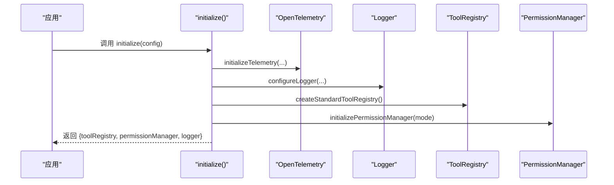
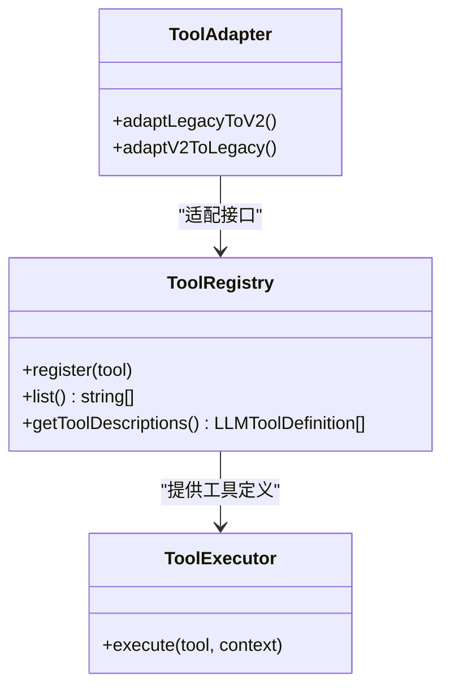
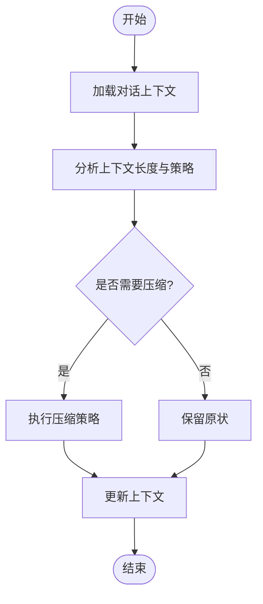
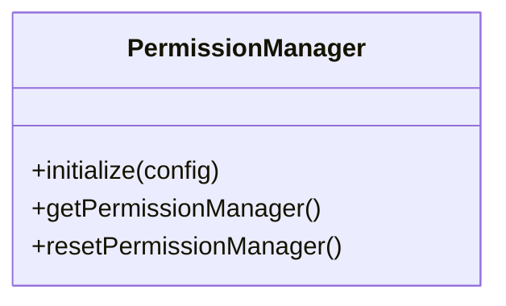
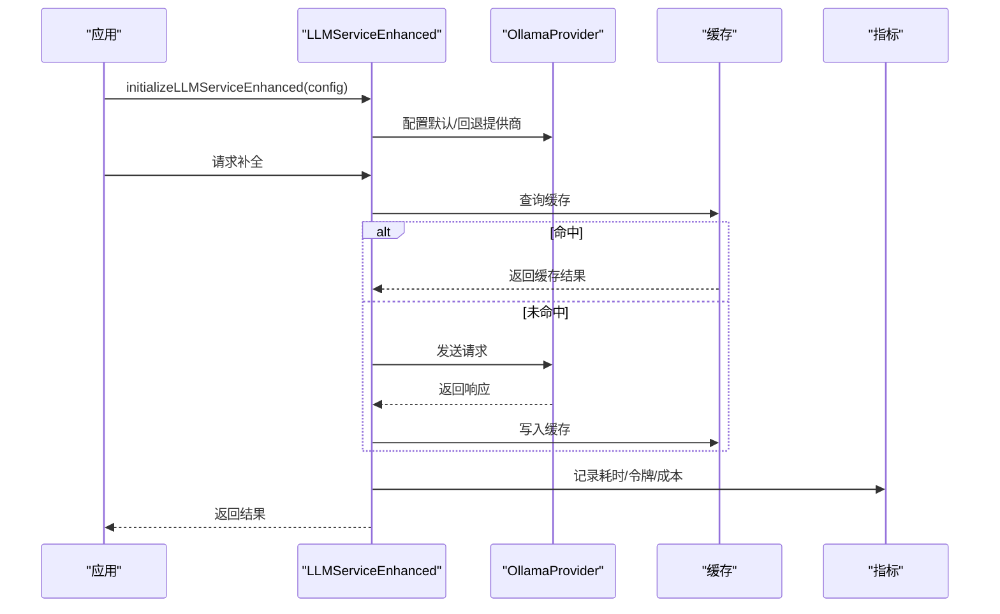
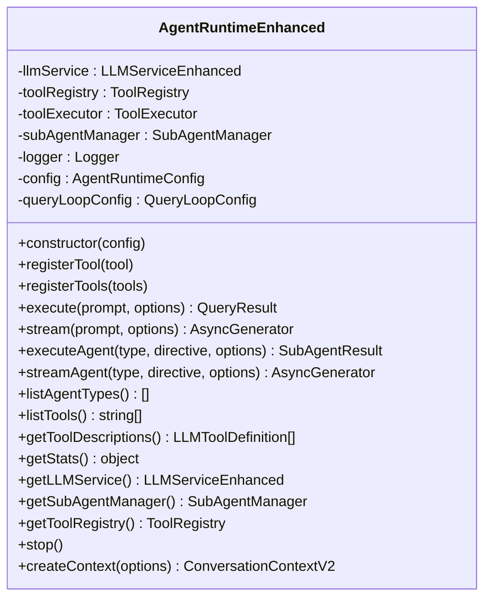
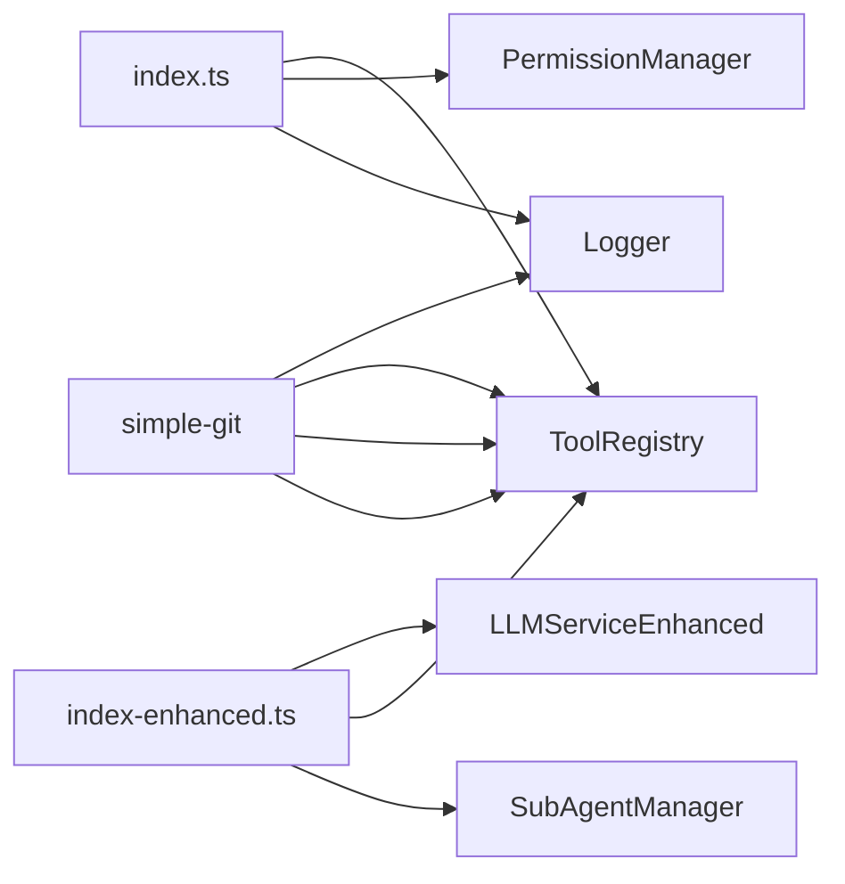

# Agent Runtime 服务

<cite>
**本文引用的文件**
- [apps/agent-runtime/src/index.ts](file://apps/agent-runtime/src/index.ts)
- [apps/agent-runtime/src/index-enhanced.ts](file://apps/agent-runtime/src/index-enhanced.ts)
- [apps/agent-runtime/README.md](file://apps/agent-runtime/README.md)
- [apps/agent-runtime/package.json](file://apps/agent-runtime/package.json)
- [apps/agent-runtime/dist/index.d.ts](file://apps/agent-runtime/dist/index.d.ts)
</cite>

## 目录
1. [简介](#简介)
2. [项目结构](#项目结构)
3. [核心组件](#核心组件)
4. [架构总览](#架构总览)
5. [详细组件分析](#详细组件分析)
6. [依赖关系分析](#依赖关系分析)
7. [性能考虑](#性能考虑)
8. [故障排除指南](#故障排除指南)
9. [结论](#结论)
10. [附录](#附录)

## 简介
本文件为 Agent Runtime 服务的详细技术文档，聚焦于运行时服务的架构设计与核心能力，包括：
- 任务执行环境：Agent 系统、隔离模式、子代理与查询循环
- 状态管理与资源调度：对话上下文、压缩引擎、权限管理
- 工具系统：工具注册表、工具适配器、工具执行机制
- 上下文管理：对话上下文、工作区管理、状态持久化
- LLM 集成：多提供商适配器、成本控制与指标
- 运行时配置、性能调优与监控指标
- 使用示例与故障排除

Agent Runtime 服务提供统一的运行时入口与增强版能力，支持标准工具注册、LLM 服务初始化、上下文压缩与权限控制，并通过可观测性组件集成 OpenTelemetry。

## 项目结构
Agent Runtime 服务位于 apps/agent-runtime 目录，采用模块化组织方式：
- 入口文件：src/index.ts 与 src/index-enhanced.ts
- 服务与组件：agent、context、services、tools、permissions、utils
- 文档与示例：docs、examples
- 部署与测试：deploy、tests、Dockerfile、vitest.config.ts

图表来源
- [apps/agent-runtime/src/index.ts:1-351](file://apps/agent-runtime/src/index.ts#L1-L351)
- [apps/agent-runtime/src/index-enhanced.ts:1-333](file://apps/agent-runtime/src/index-enhanced.ts#L1-L333)
- [apps/agent-runtime/package.json:24-51](file://apps/agent-runtime/package.json#L24-L51)

章节来源
- [apps/agent-runtime/src/index.ts:1-351](file://apps/agent-runtime/src/index.ts#L1-L351)
- [apps/agent-runtime/src/index-enhanced.ts:1-333](file://apps/agent-runtime/src/index-enhanced.ts#L1-L333)
- [apps/agent-runtime/package.json:1-52](file://apps/agent-runtime/package.json#L1-L52)

## 核心组件
- 运行时入口与初始化
  - 标准入口：统一导出运行时服务、工具类型、上下文、LLM 服务、工具注册表等；提供 initialize 方法完成可观测性初始化、日志配置、工具注册与权限管理初始化。
  - 增强入口：提供 AgentRuntimeEnhanced 类，封装 LLM 服务、工具注册表、工具执行器、子代理管理器与查询循环配置，支持流式执行与统计查询。
- 工具系统
  - 工具注册表：支持注册标准工具（文件读写、搜索、Shell、Git、Web 操作等），并提供批量注册与描述生成。
  - 工具适配器：提供从旧接口到新接口的双向适配方法。
- 上下文管理
  - 对话上下文：支持对话历史管理与压缩策略。
  - 压缩引擎：提供上下文压缩策略与结果类型定义。
- 权限管理
  - 权限管理器：支持多种权限模式（ask/allow/deny/auto），并提供初始化与重置能力。
- LLM 集成
  - LLM 服务：提供初始化与获取实例的方法，支持多提供商适配（如 Ollama）。
  - 成本控制与指标：增强版 LLM 服务支持成本跟踪与指标采集。
- 日志与可观测性
  - 增强日志器：提供全局日志器与子日志器，支持级别与分类。
  - OpenTelemetry：自动初始化 SDK，支持链路追踪与指标导出。

章节来源
- [apps/agent-runtime/src/index.ts:12-351](file://apps/agent-runtime/src/index.ts#L12-L351)
- [apps/agent-runtime/src/index-enhanced.ts:53-333](file://apps/agent-runtime/src/index-enhanced.ts#L53-L333)
- [apps/agent-runtime/dist/index.d.ts:1-64](file://apps/agent-runtime/dist/index.d.ts#L1-L64)

## 架构总览
Agent Runtime 的架构围绕“运行时服务 + 工具系统 + 上下文管理 + LLM 集成”展开，采用分层设计与模块化组织，确保可扩展与可维护性。

图表来源
- [apps/agent-runtime/src/index.ts:305-345](file://apps/agent-runtime/src/index.ts#L305-L345)
- [apps/agent-runtime/src/index-enhanced.ts:89-141](file://apps/agent-runtime/src/index-enhanced.ts#L89-L141)

## 详细组件分析

### 运行时初始化与配置
- initialize(config)
  - 功能：初始化 OpenTelemetry、配置日志器、注册标准工具、初始化权限管理器并返回工具注册表、权限管理器与日志器。
  - 关键点：支持日志级别、权限模式与工作区路径；自动初始化开关可通过环境变量启用。
- AgentRuntimeConfig
  - 字段：logLevel、permissionMode、workspacePath。
- 自动初始化
  - 当环境变量满足条件时，模块被导入即触发初始化。

图表来源
- [apps/agent-runtime/src/index.ts:314-345](file://apps/agent-runtime/src/index.ts#L314-L345)

章节来源
- [apps/agent-runtime/src/index.ts:305-345](file://apps/agent-runtime/src/index.ts#L305-L345)

### 工具系统：注册表、适配器与执行
- 工具注册表
  - registerStandardTools：注册文件操作、搜索、Shell、Git、Web 相关工具。
  - createStandardToolRegistry：快速创建已注册的标准工具集合。
- 工具适配器
  - adaptLegacyToV2 / adaptV2ToLegacy：在旧接口与新接口之间进行转换。
- 工具执行
  - 增强版入口中提供 ToolRegistry、ToolExecutor 与 buildTool，支持工具构建与执行。

图表来源
- [apps/agent-runtime/src/index.ts:260-289](file://apps/agent-runtime/src/index.ts#L260-L289)
- [apps/agent-runtime/src/index-enhanced.ts:46-51](file://apps/agent-runtime/src/index-enhanced.ts#L46-L51)

章节来源
- [apps/agent-runtime/src/index.ts:245-289](file://apps/agent-runtime/src/index.ts#L245-L289)
- [apps/agent-runtime/src/index-enhanced.ts:46-51](file://apps/agent-runtime/src/index-enhanced.ts#L46-L51)

### 上下文管理：对话上下文与压缩引擎
- ConversationContextV2
  - 作用：承载对话历史、消息序列与上下文状态，支持最大令牌数限制。
- CompactionEngine
  - 作用：对上下文进行压缩，减少令牌消耗，提升 LLM 输入效率。
  - 类型：提供压缩策略与结果类型定义。

图表来源
- [apps/agent-runtime/src/index.ts:99-103](file://apps/agent-runtime/src/index.ts#L99-L103)

章节来源
- [apps/agent-runtime/src/index.ts:87-103](file://apps/agent-runtime/src/index.ts#L87-L103)

### 权限管理
- PermissionManager
  - 支持权限模式：ask（询问）、allow（允许）、deny（拒绝）、auto（自动）。
  - 提供初始化、获取与重置能力，便于在运行时调整权限策略。

图表来源
- [apps/agent-runtime/src/index.ts:190-194](file://apps/agent-runtime/src/index.ts#L190-L194)

章节来源
- [apps/agent-runtime/src/index.ts:171-194](file://apps/agent-runtime/src/index.ts#L171-L194)

### LLM 集成：服务、提供商与成本控制
- LLMService / LLMServiceEnhanced
  - 提供初始化与获取实例方法；增强版支持缓存、重试、成本跟踪与指标采集。
- OllamaProvider
  - 示例提供商适配器，展示如何接入本地或自托管 LLM。
- 成本控制与指标
  - 增强版 LLM 服务可开启成本跟踪与指标上报，便于运营与计费。

图表来源
- [apps/agent-runtime/src/index.ts:109-124](file://apps/agent-runtime/src/index.ts#L109-L124)
- [apps/agent-runtime/src/index-enhanced.ts:89-141](file://apps/agent-runtime/src/index-enhanced.ts#L89-L141)

章节来源
- [apps/agent-runtime/src/index.ts:109-124](file://apps/agent-runtime/src/index.ts#L109-L124)
- [apps/agent-runtime/src/index-enhanced.ts:89-141](file://apps/agent-runtime/src/index-enhanced.ts#L89-L141)

### 增强版运行时：AgentRuntimeEnhanced
- 能力概览
  - LLM 服务初始化与配置（默认/回退提供商、缓存、重试、成本跟踪、指标）。
  - 工具注册表与执行器，支持注册自定义工具。
  - 子代理管理器与查询循环配置，支持流式执行与统计查询。
  - 提供便捷工厂函数与默认导出。
- 关键方法
  - registerTool/registerTools：注册单个或多个工具。
  - execute/stream：执行查询与流式输出。
  - executeAgent/streamAgent：执行子代理与流式输出。
  - getStats/getToolDescriptions：获取运行时统计与工具描述。
  - stop/createContext：停止活动与创建上下文。

图表来源
- [apps/agent-runtime/src/index-enhanced.ts:89-324](file://apps/agent-runtime/src/index-enhanced.ts#L89-L324)

章节来源
- [apps/agent-runtime/src/index-enhanced.ts:89-324](file://apps/agent-runtime/src/index-enhanced.ts#L89-L324)

## 依赖关系分析
- 内部模块耦合
  - 运行时入口依赖工具注册表、权限管理器与日志器；增强版运行时进一步整合 LLM 服务、工具执行器与子代理管理器。
- 外部依赖
  - OpenTelemetry 生态：链路追踪与指标导出。
  - 数据校验：Zod。
  - 文件与 Git 操作：fast-glob、simple-git。
- 版本与脚本
  - 包版本与 Node 引擎要求；构建、测试与部署脚本。

图表来源
- [apps/agent-runtime/src/index.ts:12-351](file://apps/agent-runtime/src/index.ts#L12-L351)
- [apps/agent-runtime/src/index-enhanced.ts:1-12](file://apps/agent-runtime/src/index-enhanced.ts#L1-L12)
- [apps/agent-runtime/package.json:24-51](file://apps/agent-runtime/package.json#L24-L51)

章节来源
- [apps/agent-runtime/package.json:24-51](file://apps/agent-runtime/package.json#L24-L51)

## 性能考虑
- 缓存与重试
  - LLM 服务支持缓存与指数退避重试，降低网络抖动影响并提升吞吐。
- 上下文压缩
  - 使用压缩引擎减少上下文长度，避免超出模型上下文窗口。
- 工具执行
  - 批量注册工具与延迟加载，减少启动开销。
- 观测性
  - 启用指标与链路追踪，定位性能瓶颈与异常路径。
- 资源限制
  - 在容器环境中合理设置内存与 CPU 请求/限制，避免资源争用。

## 故障排除指南
- 初始化失败
  - 检查环境变量与日志级别配置；确认 OpenTelemetry 初始化是否成功。
- 工具注册问题
  - 确认工具名称唯一且输入模式符合 LLM 要求；使用 getToolDescriptions 校验导出。
- LLM 请求异常
  - 查看重试与缓存配置；核对提供商凭据与网络连通性。
- 上下文过长
  - 启用压缩引擎并调整压缩策略；限制最大令牌数。
- 权限相关错误
  - 根据权限模式调整策略；必要时切换为 auto 或 allow 进行验证。

## 结论
Agent Runtime 服务通过清晰的模块划分与增强的运行时能力，提供了稳定、可观测且可扩展的智能体执行环境。其工具系统、上下文管理与 LLM 集成方案能够满足多样化任务场景，配合成本控制与指标体系，有助于在生产环境中实现高效与可控的运行。

## 附录
- 快速开始
  - 安装依赖后，调用 initialize 并传入配置；或使用增强版 AgentRuntimeEnhanced 创建运行时实例。
- 部署参考
  - 服务端部署与健康检查可参考服务说明文档与部署脚本。

章节来源
- [apps/agent-runtime/README.md:1-118](file://apps/agent-runtime/README.md#L1-L118)