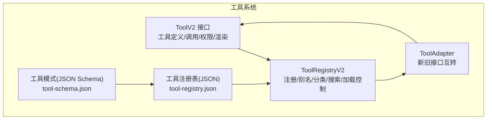
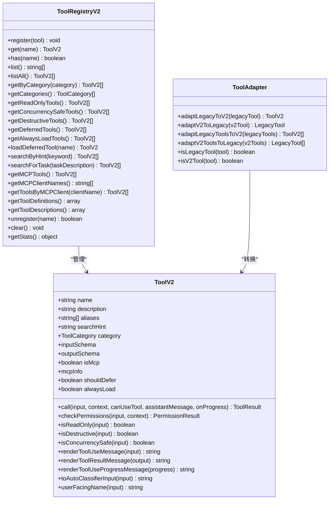
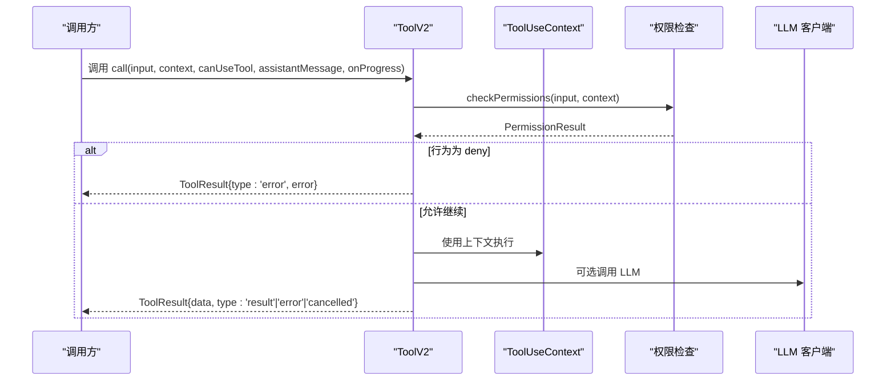
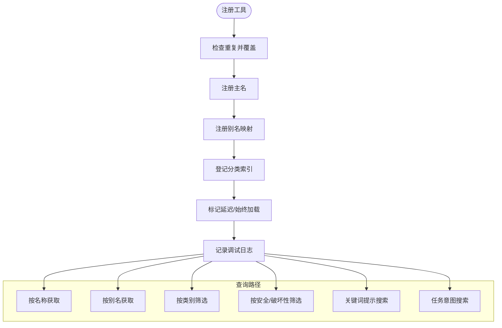
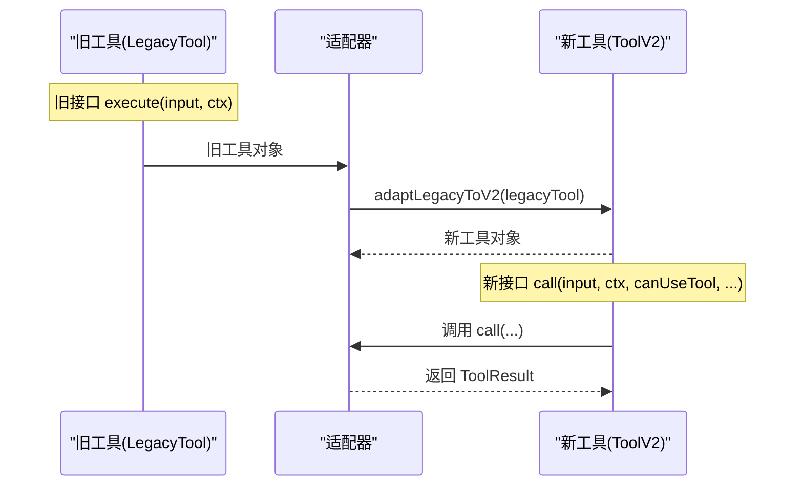
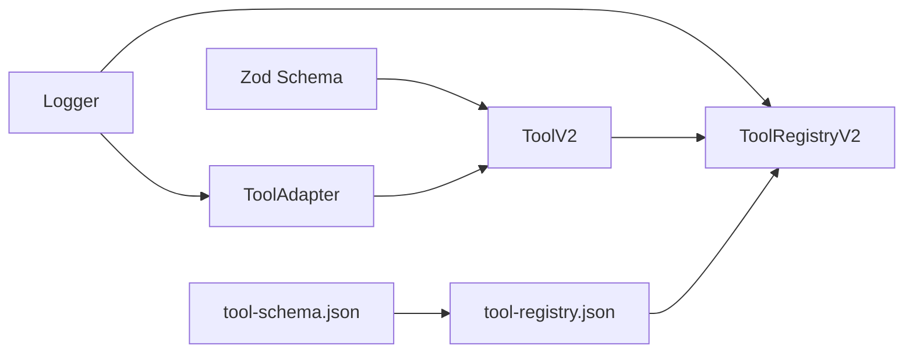

# 工具系统

<cite>
**本文引用的文件**
- [apps/agent-runtime/src/tools/ToolV2.ts](file://apps/agent-runtime/src/tools/ToolV2.ts)
- [apps/agent-runtime/src/tools/registry/ToolRegistryV2.ts](file://apps/agent-runtime/src/tools/registry/ToolRegistryV2.ts)
- [apps/agent-runtime/src/tools/adapters/ToolAdapter.ts](file://apps/agent-runtime/src/tools/adapters/ToolAdapter.ts)
- [apps/agent-runtime/src/tools/adapters/index.ts](file://apps/agent-runtime/src/tools/adapters/index.ts)
- [AGENTS/tools/tool-registry.json](file://AGENTS/tools/tool-registry.json)
- [AGENTS/tools/tool-schema.json](file://AGENTS/tools/tool-schema.json)
- [apps/agent-runtime/tests/unit/ToolV2.test.ts](file://apps/agent-runtime/tests/unit/ToolV2.test.ts)
- [apps/agent-runtime/tests/unit/ToolRegistryV2.test.ts](file://apps/agent-runtime/tests/unit/ToolRegistryV2.test.ts)
</cite>

## 目录
1. [简介](#简介)
2. [项目结构](#项目结构)
3. [核心组件](#核心组件)
4. [架构总览](#架构总览)
5. [详细组件分析](#详细组件分析)
6. [依赖关系分析](#依赖关系分析)
7. [性能考量](#性能考量)
8. [故障排查指南](#故障排查指南)
9. [结论](#结论)
10. [附录](#附录)

## 简介
本文件面向工具系统的使用者与维护者，系统化阐述 ToolV2 新接口的设计理念与实现细节，涵盖工具定义、执行上下文与结果处理；文档化工具注册表系统 ToolRegistryV2 的注册机制、全局工具管理与工具发现功能；阐明工具适配器的作用与双向转换机制；提供工具开发指南（自定义工具的创建、注册与测试）、工具分类体系、权限管理策略与性能优化建议。

## 项目结构
工具系统位于 agent-runtime 应用内，采用“按功能域分层”的组织方式：
- 工具核心接口与工厂：apps/agent-runtime/src/tools/ToolV2.ts
- 工具注册表：apps/agent-runtime/src/tools/registry/ToolRegistryV2.ts
- 工具适配器（新旧接口互转）：apps/agent-runtime/src/tools/adapters/ToolAdapter.ts
- 适配器聚合导出：apps/agent-runtime/src/tools/adapters/index.ts
- 工具注册表与模式：AGENTS/tools/tool-registry.json、AGENTS/tools/tool-schema.json
- 单元测试：apps/agent-runtime/tests/unit/ToolV2.test.ts、apps/agent-runtime/tests/unit/ToolRegistryV2.test.ts

图表来源
- [apps/agent-runtime/src/tools/ToolV2.ts:1-479](file://apps/agent-runtime/src/tools/ToolV2.ts#L1-L479)
- [apps/agent-runtime/src/tools/registry/ToolRegistryV2.ts:1-466](file://apps/agent-runtime/src/tools/registry/ToolRegistryV2.ts#L1-L466)
- [apps/agent-runtime/src/tools/adapters/ToolAdapter.ts:1-358](file://apps/agent-runtime/src/tools/adapters/ToolAdapter.ts#L1-L358)
- [AGENTS/tools/tool-registry.json:1-471](file://AGENTS/tools/tool-registry.json#L1-L471)
- [AGENTS/tools/tool-schema.json:1-62](file://AGENTS/tools/tool-schema.json#L1-L62)

章节来源
- [apps/agent-runtime/src/tools/ToolV2.ts:1-479](file://apps/agent-runtime/src/tools/ToolV2.ts#L1-L479)
- [apps/agent-runtime/src/tools/registry/ToolRegistryV2.ts:1-466](file://apps/agent-runtime/src/tools/registry/ToolRegistryV2.ts#L1-L466)
- [apps/agent-runtime/src/tools/adapters/ToolAdapter.ts:1-358](file://apps/agent-runtime/src/tools/adapters/ToolAdapter.ts#L1-L358)
- [AGENTS/tools/tool-registry.json:1-471](file://AGENTS/tools/tool-registry.json#L1-L471)
- [AGENTS/tools/tool-schema.json:1-62](file://AGENTS/tools/tool-schema.json#L1-L62)

## 核心组件
- ToolV2 接口：定义工具的名称、描述、别名、类别、输入/输出 Schema、MCP 支持、权限检查、并发安全、渲染方法、自动分类器输入与用户友好名称等，并提供 call() 执行入口与工厂函数 buildToolV2。
- ToolRegistryV2：集中管理工具注册、别名映射、分类索引、延迟加载/始终加载、搜索（关键词提示、任务意图）、MCP 客户端分组、工具定义导出（用于 LLM 函数调用）、统计信息与生命周期管理。
- ToolAdapter：提供 Legacy Tool 与 ToolV2 的双向适配，保证向后兼容；同时负责上下文、权限结果与输出格式的转换。
- 工具注册表与模式：以 JSON/JSON Schema 描述工具清单、分类、权限约束、中断行为、默认限制等，作为外部配置与校验依据。

章节来源
- [apps/agent-runtime/src/tools/ToolV2.ts:235-424](file://apps/agent-runtime/src/tools/ToolV2.ts#L235-L424)
- [apps/agent-runtime/src/tools/registry/ToolRegistryV2.ts:22-393](file://apps/agent-runtime/src/tools/registry/ToolRegistryV2.ts#L22-L393)
- [apps/agent-runtime/src/tools/adapters/ToolAdapter.ts:27-244](file://apps/agent-runtime/src/tools/adapters/ToolAdapter.ts#L27-L244)
- [AGENTS/tools/tool-registry.json:1-471](file://AGENTS/tools/tool-registry.json#L1-L471)
- [AGENTS/tools/tool-schema.json:1-62](file://AGENTS/tools/tool-schema.json#L1-L62)

## 架构总览
ToolV2 将工具抽象为统一的 call() 接口，结合 ToolUseContext 提供统一的执行环境；ToolRegistryV2 负责工具的注册、检索与分类；ToolAdapter 保障与 Legacy Tool 的兼容；工具注册表与模式为系统提供外部可配置能力。

图表来源
- [apps/agent-runtime/src/tools/ToolV2.ts:235-424](file://apps/agent-runtime/src/tools/ToolV2.ts#L235-L424)
- [apps/agent-runtime/src/tools/registry/ToolRegistryV2.ts:22-393](file://apps/agent-runtime/src/tools/registry/ToolRegistryV2.ts#L22-L393)
- [apps/agent-runtime/src/tools/adapters/ToolAdapter.ts:27-244](file://apps/agent-runtime/src/tools/adapters/ToolAdapter.ts#L27-L244)

## 详细组件分析

### ToolV2 接口与执行上下文
- 设计理念
  - 统一 call() 接口：将工具执行抽象为异步调用，便于统一调度、权限检查与进度上报。
  - 类型安全：基于 Zod Schema 的输入/输出校验，支持延迟 Schema（lazySchema）以优化初始化成本。
  - MCP 集成：内置 isMcp 与 mcpInfo 字段，便于对接 MCP 服务器。
  - 渲染与分类：提供渲染方法与自动分类器输入，便于用户感知与自动化识别。
- 关键类型
  - ToolUseContext：统一的执行上下文，包含 agentId、workspacePath、日志发送、中止控制、应用状态、消息历史、查询链追踪、内容替换预算、MCP 客户端、父上下文、权限检查函数、LLM 客户端等。
  - ToolResult：封装 data、error、type（result/error/cancelled）、resultForAssistant、contextModifier、MCP 元数据等。
  - PermissionResult：权限检查结果，支持行为（allow/deny/ask/defer/passthrough）与异步分类器结果。
- 工具工厂
  - buildToolV2：合并默认值与自定义实现，确保最小实现即可运行。
  - 结果辅助：createToolResult/createToolError/createToolCancelled 提供标准化结果构造。
- 类型守卫：isToolV2/isToolResultError/isToolResultCancelled 便于运行时类型判断。

图表来源
- [apps/agent-runtime/src/tools/ToolV2.ts:275-281](file://apps/agent-runtime/src/tools/ToolV2.ts#L275-L281)
- [apps/agent-runtime/src/tools/ToolV2.ts:157-195](file://apps/agent-runtime/src/tools/ToolV2.ts#L157-L195)

章节来源
- [apps/agent-runtime/src/tools/ToolV2.ts:18-479](file://apps/agent-runtime/src/tools/ToolV2.ts#L18-L479)
- [apps/agent-runtime/tests/unit/ToolV2.test.ts:1-287](file://apps/agent-runtime/tests/unit/ToolV2.test.ts#L1-L287)

### ToolRegistryV2 注册表系统
- 注册机制
  - register：去重警告、建立主名/别名映射、分类索引、延迟加载/始终加载标记。
  - get/has：支持按主名与别名检索。
- 分类与筛选
  - getByCategory/getCategories：按类别获取工具集合。
  - getReadOnlyTools/getConcurrencySafeTools/getDestructiveTools：基于工具方法动态筛选。
- 加载控制
  - getDeferredTools/getAlwaysLoadTools/loadDeferredTool：延迟加载与强制加载策略。
- 搜索与发现
  - searchByHint：基于 hint、名称、别名、类别、描述的关键词匹配。
  - searchForTask：基于关键词映射到类别集合，进行任务意图发现。
- MCP 支持
  - getMCPTools/getMCPClientNames/getToolsByMCPClient：MCP 工具与客户端分组。
- 工具定义导出
  - getToolDefinitions/getToolDescriptions：将工具定义转换为 LLM 函数调用格式（JSON Schema）。
- 生命周期与统计
  - unregister/clear：注销与清空；getStats：统计总数、分类分布、别名数、延迟/始终加载数、MCP 工具数。

图表来源
- [apps/agent-runtime/src/tools/registry/ToolRegistryV2.ts:34-78](file://apps/agent-runtime/src/tools/registry/ToolRegistryV2.ts#L34-L78)
- [apps/agent-runtime/src/tools/registry/ToolRegistryV2.ts:84-100](file://apps/agent-runtime/src/tools/registry/ToolRegistryV2.ts#L84-L100)
- [apps/agent-runtime/src/tools/registry/ToolRegistryV2.ts:118-163](file://apps/agent-runtime/src/tools/registry/ToolRegistryV2.ts#L118-L163)
- [apps/agent-runtime/src/tools/registry/ToolRegistryV2.ts:169-188](file://apps/agent-runtime/src/tools/registry/ToolRegistryV2.ts#L169-L188)
- [apps/agent-runtime/src/tools/registry/ToolRegistryV2.ts:194-259](file://apps/agent-runtime/src/tools/registry/ToolRegistryV2.ts#L194-L259)
- [apps/agent-runtime/src/tools/registry/ToolRegistryV2.ts:265-283](file://apps/agent-runtime/src/tools/registry/ToolRegistryV2.ts#L265-L283)
- [apps/agent-runtime/src/tools/registry/ToolRegistryV2.ts:289-325](file://apps/agent-runtime/src/tools/registry/ToolRegistryV2.ts#L289-L325)

章节来源
- [apps/agent-runtime/src/tools/registry/ToolRegistryV2.ts:1-466](file://apps/agent-runtime/src/tools/registry/ToolRegistryV2.ts#L1-L466)
- [apps/agent-runtime/tests/unit/ToolRegistryV2.test.ts:1-395](file://apps/agent-runtime/tests/unit/ToolRegistryV2.test.ts#L1-L395)

### 工具适配器（新旧接口互转）
- 旧 Tool → 新 ToolV2
  - 适配基础属性、Schema、MCP 标记、延迟加载标记。
  - call() 适配：执行权限检查、上下文转换、调用旧版 execute()、包装结果。
  - 权限/只读/破坏性/并发安全/渲染/分类器/用户友好名称等方法适配。
- 新 ToolV2 → 旧 Tool
  - execute() 适配：创建 AbortController、上下文转换、调用 call()、结果处理。
  - 权限/只读/破坏性/并发安全/渲染/分类器/用户友好名称等方法适配。
- 上下文与权限结果转换：确保字段对齐与行为兼容。
- 类型检测：isLegacyTool/isV2Tool 便于运行时判断。

图表来源
- [apps/agent-runtime/src/tools/adapters/ToolAdapter.ts:27-143](file://apps/agent-runtime/src/tools/adapters/ToolAdapter.ts#L27-L143)
- [apps/agent-runtime/src/tools/adapters/ToolAdapter.ts:149-244](file://apps/agent-runtime/src/tools/adapters/ToolAdapter.ts#L149-L244)

章节来源
- [apps/agent-runtime/src/tools/adapters/ToolAdapter.ts:1-358](file://apps/agent-runtime/src/tools/adapters/ToolAdapter.ts#L1-L358)
- [apps/agent-runtime/src/tools/adapters/index.ts:1-17](file://apps/agent-runtime/src/tools/adapters/index.ts#L1-L17)

### 工具分类体系与权限管理
- 工具分类
  - ToolV2.category：read/write/edit/search/execute/agent/mcp/destructive 等。
  - ToolRegistryV2.getByCategory/getCategories：按类别检索与枚举。
- 权限模型
  - ToolV2.checkPermissions：工具级权限检查，返回 PermissionResult。
  - ToolUseContext.checkPermission：统一的权限检查函数注入。
  - 旧接口兼容：LegacyTool.checkPermissions 通过适配器转换。
- 安全属性
  - isReadOnly/isDestructive/isConcurrencySafe：用于安全筛选与策略控制。
- 中断行为
  - 工具注册表中的 interruptBehavior（cancel/block）影响执行中断策略。
- 敏感命令与红线检查
  - 工具注册表支持 sensitiveCommands 与 redLineChecks，用于 Git 等高危命令的安全约束。

章节来源
- [apps/agent-runtime/src/tools/ToolV2.ts:290-308](file://apps/agent-runtime/src/tools/ToolV2.ts#L290-L308)
- [apps/agent-runtime/src/tools/registry/ToolRegistryV2.ts:135-163](file://apps/agent-runtime/src/tools/registry/ToolRegistryV2.ts#L135-L163)
- [AGENTS/tools/tool-registry.json:182-287](file://AGENTS/tools/tool-registry.json#L182-L287)

### 工具开发指南
- 自定义工具创建
  - 使用 buildToolV2 定义 name/description/inputSchema/outputSchema 等。
  - 实现 call() 并在其中调用 canUseTool 进行权限检查。
  - 可选：实现渲染方法、自动分类器输入、用户友好名称。
- 注册与发布
  - 通过 ToolRegistryV2.register 注册；必要时设置 aliases/category/shouldDefer/alwaysLoad。
  - 对于 MCP 工具，设置 isMcp 与 mcpInfo。
- 测试方法
  - 使用 Vitest 编写单元测试，覆盖 call()、权限拒绝、懒加载 Schema、结果构造与类型守卫。
  - 使用 createMockContext 构造 ToolUseContext。
- 外部配置
  - 在 tool-registry.json 中声明工具清单、分类、权限、中断行为与默认限制。
  - 使用 tool-schema.json 校验注册表结构与字段。

章节来源
- [apps/agent-runtime/src/tools/ToolV2.ts:408-424](file://apps/agent-runtime/src/tools/ToolV2.ts#L408-L424)
- [apps/agent-runtime/tests/unit/ToolV2.test.ts:21-131](file://apps/agent-runtime/tests/unit/ToolV2.test.ts#L21-L131)
- [apps/agent-runtime/tests/unit/ToolV2.test.ts:133-169](file://apps/agent-runtime/tests/unit/ToolV2.test.ts#L133-L169)
- [apps/agent-runtime/tests/unit/ToolV2.test.ts:171-198](file://apps/agent-runtime/tests/unit/ToolV2.test.ts#L171-L198)
- [apps/agent-runtime/tests/unit/ToolV2.test.ts:200-227](file://apps/agent-runtime/tests/unit/ToolV2.test.ts#L200-L227)
- [apps/agent-runtime/tests/unit/ToolV2.test.ts:229-249](file://apps/agent-runtime/tests/unit/ToolV2.test.ts#L229-L249)
- [apps/agent-runtime/tests/unit/ToolV2.test.ts:251-267](file://apps/agent-runtime/tests/unit/ToolV2.test.ts#L251-L267)
- [AGENTS/tools/tool-registry.json:1-471](file://AGENTS/tools/tool-registry.json#L1-L471)
- [AGENTS/tools/tool-schema.json:1-62](file://AGENTS/tools/tool-schema.json#L1-L62)

## 依赖关系分析
- 组件耦合
  - ToolV2 与 ToolUseContext 强耦合，但通过接口隔离了具体实现。
  - ToolRegistryV2 仅依赖 ToolV2 接口，保持低耦合与高内聚。
  - ToolAdapter 作为桥接层，依赖新旧两种接口，承担兼容职责。
- 外部依赖
  - Zod 用于 Schema 校验与 JSON Schema 导出。
  - Logger 用于调试日志记录。
- 可能的循环依赖
  - 当前设计避免了循环依赖：ToolV2 不依赖注册表，注册表不依赖具体工具实现。

图表来源
- [apps/agent-runtime/src/tools/ToolV2.ts:11](file://apps/agent-runtime/src/tools/ToolV2.ts#L11)
- [apps/agent-runtime/src/tools/registry/ToolRegistryV2.ts:12-20](file://apps/agent-runtime/src/tools/registry/ToolRegistryV2.ts#L12-L20)
- [apps/agent-runtime/src/tools/adapters/ToolAdapter.ts:19](file://apps/agent-runtime/src/tools/adapters/ToolAdapter.ts#L19)
- [AGENTS/tools/tool-registry.json:1-471](file://AGENTS/tools/tool-registry.json#L1-L471)
- [AGENTS/tools/tool-schema.json:1-62](file://AGENTS/tools/tool-schema.json#L1-L62)

章节来源
- [apps/agent-runtime/src/tools/ToolV2.ts:11-12](file://apps/agent-runtime/src/tools/ToolV2.ts#L11-L12)
- [apps/agent-runtime/src/tools/registry/ToolRegistryV2.ts:12-20](file://apps/agent-runtime/src/tools/registry/ToolRegistryV2.ts#L12-L20)
- [apps/agent-runtime/src/tools/adapters/ToolAdapter.ts:19](file://apps/agent-runtime/src/tools/adapters/ToolAdapter.ts#L19)

## 性能考量
- 懒加载 Schema：使用 lazySchema 延迟创建复杂 Schema，降低初始化成本。
- 延迟加载工具：shouldDefer 与 alwaysLoad 策略配合，减少启动时资源占用。
- 并发安全：isConcurrencySafe 用于并发执行策略与队列控制。
- 结果大小限制：工具注册表提供 maxToolResultSize 等默认限制，避免大结果污染。
- JSON Schema 导出：getToolDefinitions 使用 zodToJsonSchema 将 Zod Schema 转换为 LLM 可消费的 JSON Schema，减少重复定义与不一致风险。

章节来源
- [apps/agent-runtime/src/tools/ToolV2.ts:201-229](file://apps/agent-runtime/src/tools/ToolV2.ts#L201-L229)
- [apps/agent-runtime/src/tools/registry/ToolRegistryV2.ts:169-188](file://apps/agent-runtime/src/tools/registry/ToolRegistryV2.ts#L169-L188)
- [apps/agent-runtime/src/tools/registry/ToolRegistryV2.ts:289-325](file://apps/agent-runtime/src/tools/registry/ToolRegistryV2.ts#L289-L325)
- [AGENTS/tools/tool-registry.json:465-470](file://AGENTS/tools/tool-registry.json#L465-L470)

## 故障排查指南
- 权限相关
  - 现象：工具返回 error 或被拒绝。
  - 排查：检查 ToolV2.checkPermissions 与 ToolUseContext.checkPermission 的实现与返回值；确认 PermissionResult 的 behavior 与 message。
- 中断与取消
  - 现象：执行被中断或返回 cancelled。
  - 排查：检查 ToolUseContext.abortController 的使用；核对工具注册表 interruptBehavior 设置。
- Schema 校验失败
  - 现象：输入/输出校验报错。
  - 排查：使用 resolveSchema 确认 Schema 正确解析；核对 tool-registry.json 中的 inputSchema。
- MCP 工具异常
  - 现象：MCP 工具无法调用或连接失败。
  - 排查：检查 isMcp 与 mcpInfo；确认 ToolRegistryV2.getMCPTools/getToolsByMCPClient 的分组结果。
- 适配器问题
  - 现象：新旧工具互转后行为异常。
  - 排查：核对 ToolAdapter 的上下文转换、权限结果适配与输出格式；使用 isLegacyTool/isV2Tool 进行类型判断。

章节来源
- [apps/agent-runtime/src/tools/ToolV2.ts:445-458](file://apps/agent-runtime/src/tools/ToolV2.ts#L445-L458)
- [apps/agent-runtime/src/tools/registry/ToolRegistryV2.ts:265-283](file://apps/agent-runtime/src/tools/registry/ToolRegistryV2.ts#L265-L283)
- [apps/agent-runtime/src/tools/adapters/ToolAdapter.ts:251-283](file://apps/agent-runtime/src/tools/adapters/ToolAdapter.ts#L251-L283)

## 结论
ToolV2 新接口以统一的 call() 与 ToolUseContext 为核心，结合 ToolRegistryV2 的注册、分类、搜索与加载控制，以及 ToolAdapter 的双向适配，构建了高扩展、强安全与易维护的工具系统。配合工具注册表与 JSON Schema，系统实现了从配置到执行的全链路治理。建议在新增工具时遵循统一接口、完善权限与渲染方法，并利用测试用例保障质量。

## 附录
- 工具注册表字段参考
  - name/description/category/inputSchema/allowedAgents/deniedAgents/interruptBehavior/sensitiveCommands/redLineChecks 等。
- 工具分类参考
  - read/write/edit/search/execute/agent/mcp/destructive 等。
- 默认限制参考
  - maxFileReadLines/maxSearchResults/maxCommandTimeout/maxToolResultSize 等。

章节来源
- [AGENTS/tools/tool-registry.json:1-471](file://AGENTS/tools/tool-registry.json#L1-L471)
- [AGENTS/tools/tool-schema.json:18-54](file://AGENTS/tools/tool-schema.json#L18-L54)