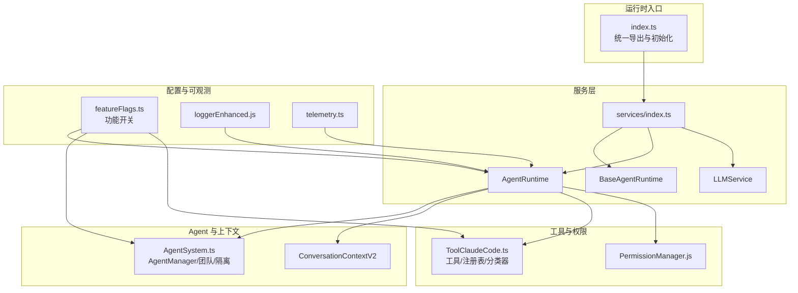
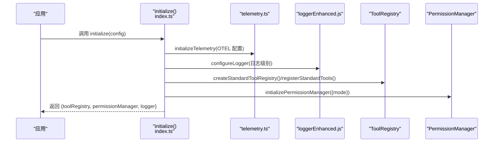
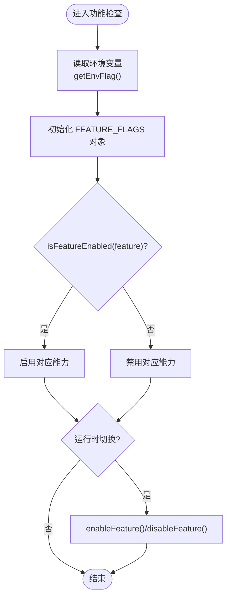
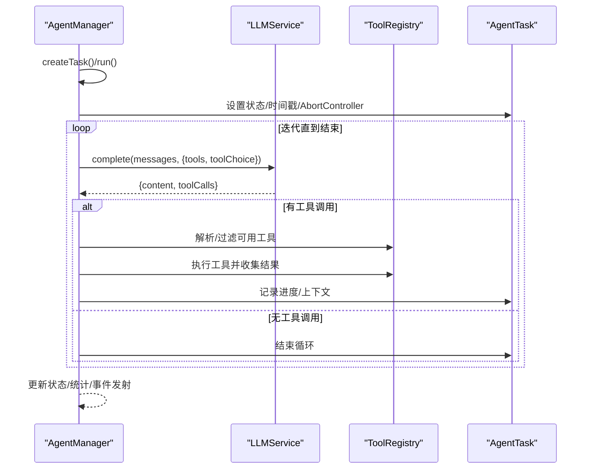
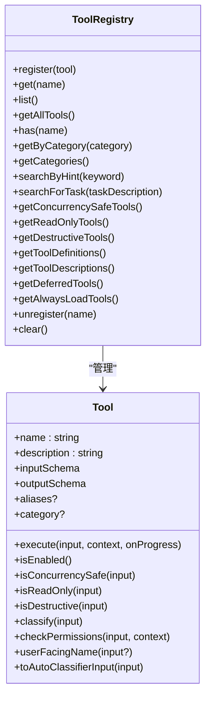
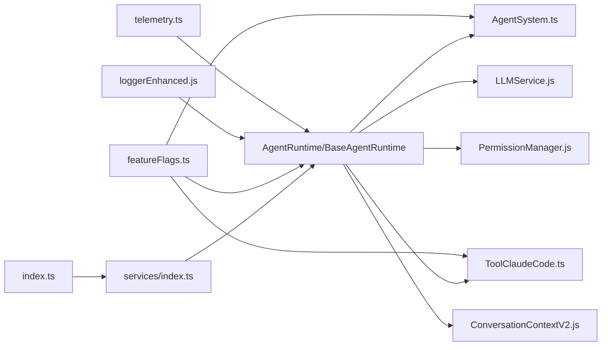

# 运行时核心架构

<cite>
**本文档引用的文件**
- [apps/agent-runtime/src/index.ts](file://apps/agent-runtime/src/index.ts)
- [apps/agent-runtime/src/services/index.ts](file://apps/agent-runtime/src/services/index.ts)
- [apps/agent-runtime/src/config/featureFlags.ts](file://apps/agent-runtime/src/config/featureFlags.ts)
- [apps/agent-runtime/src/agent/AgentSystem.ts](file://apps/agent-runtime/src/agent/AgentSystem.ts)
- [apps/agent-runtime/src/tools/ToolClaudeCode.ts](file://apps/agent-runtime/src/tools/ToolClaudeCode.ts)
- [apps/agent-runtime/src/context/ConversationContextV2.js](file://apps/agent-runtime/src/context/ConversationContextV2.js)
- [apps/agent-runtime/src/services/llm/LLMService.js](file://apps/agent-runtime/src/services/llm/LLMService.js)
- [apps/agent-runtime/src/permissions/PermissionManager.js](file://apps/agent-runtime/src/permissions/PermissionManager.js)
- [apps/agent-runtime/src/utils/loggerEnhanced.js](file://apps/agent-runtime/src/utils/loggerEnhanced.js)
- [apps/agent-runtime/src/telemetry.ts](file://apps/agent-runtime/src/telemetry.ts)
</cite>

## 目录
1. [简介](#简介)
2. [项目结构](#项目结构)
3. [核心组件](#核心组件)
4. [架构总览](#架构总览)
5. [详细组件分析](#详细组件分析)
6. [依赖关系分析](#依赖关系分析)
7. [性能考量](#性能考量)
8. [故障排除指南](#故障排除指南)
9. [结论](#结论)
10. [附录](#附录)

## 简介
本文件面向 Agent Runtime 核心架构，聚焦以下主题：
- 运行时服务基础架构设计：BaseAgentRuntime 与 AgentRuntime 的职责边界、版本演进与配置管理
- 功能开关系统（Feature Flags）：动态启用/禁用能力、权限控制与性能优化
- 初始化流程、服务生命周期管理与错误处理机制
- 配置项详解、性能调优建议与监控指标说明
- 实际配置示例与故障排除指南

## 项目结构
Agent Runtime 位于 apps/agent-runtime，采用按功能域分层的组织方式：
- services：运行时核心服务（包含 BaseAgentRuntime、AgentRuntime 以及 LLMService 等）
- agent：Agent 系统与团队协作、任务生命周期
- tools：工具体系（ToolV2、ToolClaudeCode、注册表等）
- config：运行时配置与功能开关
- context：对话上下文（V2）
- permissions：权限管理
- utils：日志、工具与增强能力
- telemetry：遥测与链路追踪

图表来源
- [apps/agent-runtime/src/index.ts:1-351](file://apps/agent-runtime/src/index.ts#L1-L351)
- [apps/agent-runtime/src/services/index.ts:1-10](file://apps/agent-runtime/src/services/index.ts#L1-L10)
- [apps/agent-runtime/src/config/featureFlags.ts:1-120](file://apps/agent-runtime/src/config/featureFlags.ts#L1-L120)
- [apps/agent-runtime/src/agent/AgentSystem.ts:1-1121](file://apps/agent-runtime/src/agent/AgentSystem.ts#L1-L1121)
- [apps/agent-runtime/src/tools/ToolClaudeCode.ts:1-656](file://apps/agent-runtime/src/tools/ToolClaudeCode.ts#L1-L656)
- [apps/agent-runtime/src/context/ConversationContextV2.js](file://apps/agent-runtime/src/context/ConversationContextV2.js)
- [apps/agent-runtime/src/services/llm/LLMService.js](file://apps/agent-runtime/src/services/llm/LLMService.js)
- [apps/agent-runtime/src/permissions/PermissionManager.js](file://apps/agent-runtime/src/permissions/PermissionManager.js)
- [apps/agent-runtime/src/utils/loggerEnhanced.js](file://apps/agent-runtime/src/utils/loggerEnhanced.js)
- [apps/agent-runtime/src/telemetry.ts](file://apps/agent-runtime/src/telemetry.ts)

章节来源
- [apps/agent-runtime/src/index.ts:1-351](file://apps/agent-runtime/src/index.ts#L1-L351)
- [apps/agent-runtime/src/services/index.ts:1-10](file://apps/agent-runtime/src/services/index.ts#L1-L10)

## 核心组件
- 运行时入口与初始化
  - 统一导出：BaseAgentRuntime、AgentRuntime、工具与类型、功能开关、LLM 服务、日志与工具注册等
  - 初始化函数负责 OpenTelemetry 遥测、日志配置、标准工具注册与权限管理器初始化，并返回工具注册表、权限管理器与日志器
  - 支持通过环境变量自动初始化

- 功能开关（Feature Flags）
  - 通过环境变量驱动的布尔开关集合，覆盖工具接口、查询循环、隔离、上下文压缩、分类器、MCP、权限 Hooks、团队协作与调试等
  - 提供运行时启用/禁用、状态查询与打印能力

- Agent 系统与生命周期
  - AgentManager 管理任务创建、同步/异步执行、后台队列、团队协作与隔离模式
  - 内置 Agent 类型与系统提示词模板，支持只读 Agent、计划 Agent、编码 Agent 等
  - 任务进度事件流与错误处理

- 工具体系（ToolV2/ToolClaudeCode）
  - 增强工具定义、延迟 Schema、工具分类器、权限决策、上下文扩展与注册表
  - 支持并发安全工具筛选、只读工具筛选、破坏性工具识别与智能搜索

- 权限管理
  - 权限模式（ask/allow/deny/auto），支持权限 Hooks 与临时授权
  - 与 Agent/工具执行集成，Fail-Closed 安全策略

- 日志与遥测
  - 增强日志器与全局日志配置
  - OpenTelemetry 集成，支持服务名与日志级别传递

章节来源
- [apps/agent-runtime/src/index.ts:1-351](file://apps/agent-runtime/src/index.ts#L1-L351)
- [apps/agent-runtime/src/config/featureFlags.ts:1-120](file://apps/agent-runtime/src/config/featureFlags.ts#L1-L120)
- [apps/agent-runtime/src/agent/AgentSystem.ts:1-1121](file://apps/agent-runtime/src/agent/AgentSystem.ts#L1-L1121)
- [apps/agent-runtime/src/tools/ToolClaudeCode.ts:1-656](file://apps/agent-runtime/src/tools/ToolClaudeCode.ts#L1-L656)
- [apps/agent-runtime/src/permissions/PermissionManager.js](file://apps/agent-runtime/src/permissions/PermissionManager.js)
- [apps/agent-runtime/src/utils/loggerEnhanced.js](file://apps/agent-runtime/src/utils/loggerEnhanced.js)
- [apps/agent-runtime/src/telemetry.ts](file://apps/agent-runtime/src/telemetry.ts)

## 架构总览
Agent Runtime 采用“服务层 + Agent 执行引擎 + 工具与权限 + 配置与可观测”的分层架构。初始化阶段完成遥测与日志配置、工具注册与权限管理器装配；运行阶段由 AgentManager 驱动任务执行，结合 LLMService 与工具注册表进行推理与工具调用。

图表来源
- [apps/agent-runtime/src/index.ts:314-345](file://apps/agent-runtime/src/index.ts#L314-L345)
- [apps/agent-runtime/src/telemetry.ts](file://apps/agent-runtime/src/telemetry.ts)
- [apps/agent-runtime/src/utils/loggerEnhanced.js](file://apps/agent-runtime/src/utils/loggerEnhanced.js)
- [apps/agent-runtime/src/permissions/PermissionManager.js](file://apps/agent-runtime/src/permissions/PermissionManager.js)

## 详细组件分析

### BaseAgentRuntime 与 AgentRuntime
- BaseAgentRuntime：作为基础运行时抽象，提供通用能力与生命周期钩子
- AgentRuntime：具体运行时实现，承载 Agent 管理、工具注册、权限与 LLM 服务集成
- 版本演进与配置管理
  - 通过 services/index.ts 显式导出，AgentRuntimeV2/V3 通过直接路径引用，避免类型预存问题
  - 运行时配置通过 initialize 接口传入，支持日志级别、权限模式与工作空间路径

章节来源
- [apps/agent-runtime/src/services/index.ts:1-10](file://apps/agent-runtime/src/services/index.ts#L1-L10)
- [apps/agent-runtime/src/index.ts:1-351](file://apps/agent-runtime/src/index.ts#L1-L351)

### 功能开关系统（Feature Flags）
- 设计原则
  - 环境变量驱动，支持默认值与运行时修改
  - 覆盖工具接口、查询循环、隔离、上下文压缩、AutoClassifier、MCP、权限 Hooks、团队协作与调试
- 关键接口
  - isFeatureEnabled：检查功能状态
  - enableFeature/disableFeature：运行时启停
  - getFeatureStatus/printFeatureStatus：状态查询与可视化
- 使用方法
  - 在初始化前设置环境变量，或在运行时通过 enableFeature/disableFeature 动态调整
  - 结合权限 Hooks 与隔离策略，实现细粒度的功能控制与性能优化

图表来源
- [apps/agent-runtime/src/config/featureFlags.ts:1-120](file://apps/agent-runtime/src/config/featureFlags.ts#L1-L120)

章节来源
- [apps/agent-runtime/src/config/featureFlags.ts:1-120](file://apps/agent-runtime/src/config/featureFlags.ts#L1-L120)

### Agent 系统与生命周期
- AgentManager
  - 任务创建、状态管理、进度事件、错误处理与结果汇总
  - 后台队列与并发控制（最大并发数限制）
  - 团队协作：创建团队、生成队友、统计团队状态
  - 隔离模式：worktree/remote/container 的执行封装（当前为占位实现）
- 内置 Agent
  - Explore/Plan/Coder/General/Custom 等类型，每种类型具备不同的工具许可、只读属性与最大迭代次数
- 执行流程
  - 构建系统提示词与用户消息
  - LLM 推理，处理内容与工具调用
  - 工具执行与结果回填，支持只读校验与权限决策
  - 迭代直至无工具调用或达到上限

图表来源
- [apps/agent-runtime/src/agent/AgentSystem.ts:297-650](file://apps/agent-runtime/src/agent/AgentSystem.ts#L297-L650)
- [apps/agent-runtime/src/context/ConversationContextV2.js](file://apps/agent-runtime/src/context/ConversationContextV2.js)
- [apps/agent-runtime/src/services/llm/LLMService.js](file://apps/agent-runtime/src/services/llm/LLMService.js)

章节来源
- [apps/agent-runtime/src/agent/AgentSystem.ts:1-1121](file://apps/agent-runtime/src/agent/AgentSystem.ts#L1-L1121)

### 工具体系（ToolV2/ToolClaudeCode）
- 增强工具定义
  - 输入/输出 Schema、行为特性（启用、并发安全、只读、破坏性）、自动分类与权限检查
  - 渲染方法、用户友好名称、自动分类器输入转换
- 工具注册表
  - 支持别名映射、分类索引、延迟加载工具、并发安全/只读/破坏性工具筛选
  - 智能搜索：基于关键词映射的任务描述匹配
- 延迟 Schema
  - lazySchema/resolveSchema 降低启动时 Schema 解析成本

图表来源
- [apps/agent-runtime/src/tools/ToolClaudeCode.ts:188-558](file://apps/agent-runtime/src/tools/ToolClaudeCode.ts#L188-L558)

章节来源
- [apps/agent-runtime/src/tools/ToolClaudeCode.ts:1-656](file://apps/agent-runtime/src/tools/ToolClaudeCode.ts#L1-L656)

### 权限管理
- 权限模式
  - ask/allow/deny/auto：根据配置决定权限决策策略
- 权限 Hooks
  - 支持在工具执行前进行权限确认与临时授权
- 与 Agent/工具集成
  - 只读 Agent 的工具只读校验、工具执行前的权限检查与 Fail-Closed 策略

章节来源
- [apps/agent-runtime/src/permissions/PermissionManager.js](file://apps/agent-runtime/src/permissions/PermissionManager.js)
- [apps/agent-runtime/src/agent/AgentSystem.ts:769-795](file://apps/agent-runtime/src/agent/AgentSystem.ts#L769-L795)
- [apps/agent-runtime/src/tools/ToolClaudeCode.ts:71-83](file://apps/agent-runtime/src/tools/ToolClaudeCode.ts#L71-L83)

### 初始化流程、生命周期与错误处理
- 初始化流程
  - 遥测初始化（OTEL），日志配置，标准工具注册，权限管理器初始化
  - 返回工具注册表、权限管理器与日志器，便于上层组合使用
- 生命周期
  - AgentManager 事件：task:created/task:started/task:completed/task:failed
  - 后台队列与并发控制，防止资源争用
- 错误处理
  - 任务失败捕获并记录，返回标准化 AgentResult
  - 工具执行异常包装为 ToolExecutionResult 并回填上下文

章节来源
- [apps/agent-runtime/src/index.ts:314-345](file://apps/agent-runtime/src/index.ts#L314-L345)
- [apps/agent-runtime/src/agent/AgentSystem.ts:329-347](file://apps/agent-runtime/src/agent/AgentSystem.ts#L329-L347)

## 依赖关系分析
- 运行时入口依赖服务层与配置层，服务层再依赖工具、权限、上下文与 LLM 服务
- AgentManager 依赖 ToolRegistry、LLMService、ConversationContextV2 与权限管理器
- 工具注册表依赖 Zod Schema 与延迟加载机制
- 功能开关贯穿运行时各层，影响工具可用性、执行路径与隔离策略

图表来源
- [apps/agent-runtime/src/index.ts:1-351](file://apps/agent-runtime/src/index.ts#L1-L351)
- [apps/agent-runtime/src/services/index.ts:1-10](file://apps/agent-runtime/src/services/index.ts#L1-L10)
- [apps/agent-runtime/src/config/featureFlags.ts:1-120](file://apps/agent-runtime/src/config/featureFlags.ts#L1-L120)
- [apps/agent-runtime/src/agent/AgentSystem.ts:1-1121](file://apps/agent-runtime/src/agent/AgentSystem.ts#L1-L1121)
- [apps/agent-runtime/src/tools/ToolClaudeCode.ts:1-656](file://apps/agent-runtime/src/tools/ToolClaudeCode.ts#L1-L656)
- [apps/agent-runtime/src/context/ConversationContextV2.js](file://apps/agent-runtime/src/context/ConversationContextV2.js)
- [apps/agent-runtime/src/services/llm/LLMService.js](file://apps/agent-runtime/src/services/llm/LLMService.js)
- [apps/agent-runtime/src/permissions/PermissionManager.js](file://apps/agent-runtime/src/permissions/PermissionManager.js)
- [apps/agent-runtime/src/utils/loggerEnhanced.js](file://apps/agent-runtime/src/utils/loggerEnhanced.js)
- [apps/agent-runtime/src/telemetry.ts](file://apps/agent-runtime/src/telemetry.ts)

## 性能考量
- 工具加载与解析
  - 使用延迟 Schema 与工具延迟加载，减少启动时 Schema 解析与工具初始化成本
  - 仅在需要时加载工具，配合并发安全工具筛选提升吞吐
- 并发与队列
  - 后台任务最大并发数限制，避免资源争用与内存峰值
  - 任务队列 FIFO，完成后自动推进下一个任务
- 上下文与模型交互
  - 通过上下文压缩与消息修剪降低 Token 使用
  - 仅在存在工具调用时启用工具选择，减少不必要的模型调用
- 遥测与日志
  - OTEL 可通过环境变量关闭，降低生产环境开销
  - 日志级别可配置，避免在高 QPS 场景下产生过多 I/O

## 故障排除指南
- 初始化失败
  - 检查 OTEL 环境变量与服务名配置
  - 确认日志级别设置是否合理
- 工具执行异常
  - 查看工具输入 Schema 校验错误与只读/破坏性校验
  - 检查权限 Hooks 返回的行为与提示信息
- Agent 执行卡住
  - 检查后台队列是否达到最大并发
  - 确认任务是否被 AbortController 取消
- 功能开关导致能力缺失
  - 使用 printFeatureStatus 输出当前开关状态
  - 通过 enableFeature/disableFeature 临时调整验证问题

章节来源
- [apps/agent-runtime/src/index.ts:314-345](file://apps/agent-runtime/src/index.ts#L314-L345)
- [apps/agent-runtime/src/config/featureFlags.ts:111-119](file://apps/agent-runtime/src/config/featureFlags.ts#L111-L119)
- [apps/agent-runtime/src/agent/AgentSystem.ts:353-391](file://apps/agent-runtime/src/agent/AgentSystem.ts#L353-L391)
- [apps/agent-runtime/src/tools/ToolClaudeCode.ts:784-800](file://apps/agent-runtime/src/tools/ToolClaudeCode.ts#L784-L800)

## 结论
Agent Runtime 通过清晰的服务层划分、可插拔的工具与权限体系、灵活的功能开关与完善的生命周期管理，提供了高扩展性与高可靠性的运行时框架。结合遥测与日志，可在生产环境中实现可观测与可调优的 Agent 执行流水线。

## 附录

### 配置选项详解
- 运行时初始化配置
  - logLevel：日志级别（debug/info/warn/error）
  - permissionMode：权限模式（ask/allow/deny/auto）
  - workspacePath：工作空间路径
- 功能开关（环境变量）
  - AGENT_USE_TOOL_V2：启用 ToolV2 接口
  - AGENT_USE_QUERY_LOOP_V2：启用 QueryLoopV2
  - AGENT_ENABLE_WORKTREE_ISOLATION：启用 worktree 隔离
  - AGENT_ENABLE_TEMPDIR_ISOLATION：启用临时目录隔离
  - AGENT_ENABLE_CONTEXT_COMPRESSION：启用上下文压缩
  - AGENT_ENABLE_AUTO_CLASSIFIER：启用 AutoClassifier
  - AGENT_ENABLE_MCP_MINIMAL：启用 MCP 最小实现
  - AGENT_ENABLE_PERMISSION_HOOKS：启用权限 Hooks
  - AGENT_ENABLE_TEAM_COLLABORATION：启用团队协作
  - AGENT_DEBUG：调试模式
- 遥测与日志
  - OTEL_SDK_DISABLED：关闭 OTEL SDK
  - OTEL_SERVICE_NAME：服务名
  - AGENT_AUTO_INIT：自动初始化

章节来源
- [apps/agent-runtime/src/index.ts:305-345](file://apps/agent-runtime/src/index.ts#L305-L345)
- [apps/agent-runtime/src/config/featureFlags.ts:7-75](file://apps/agent-runtime/src/config/featureFlags.ts#L7-L75)
- [apps/agent-runtime/src/utils/loggerEnhanced.js](file://apps/agent-runtime/src/utils/loggerEnhanced.js)
- [apps/agent-runtime/src/telemetry.ts](file://apps/agent-runtime/src/telemetry.ts)