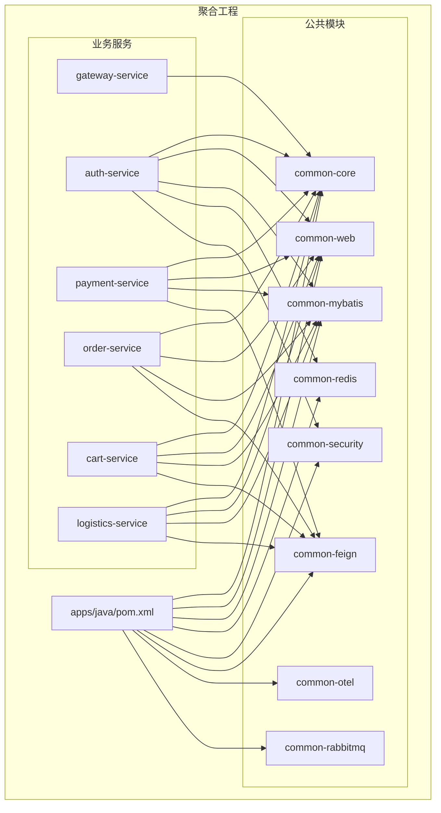
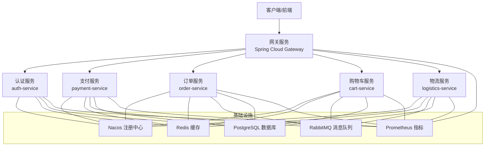
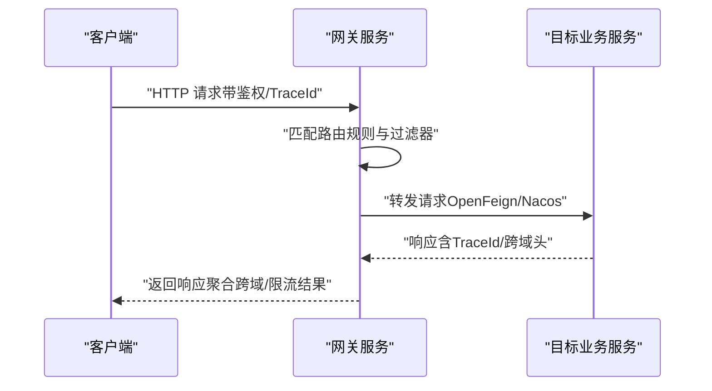
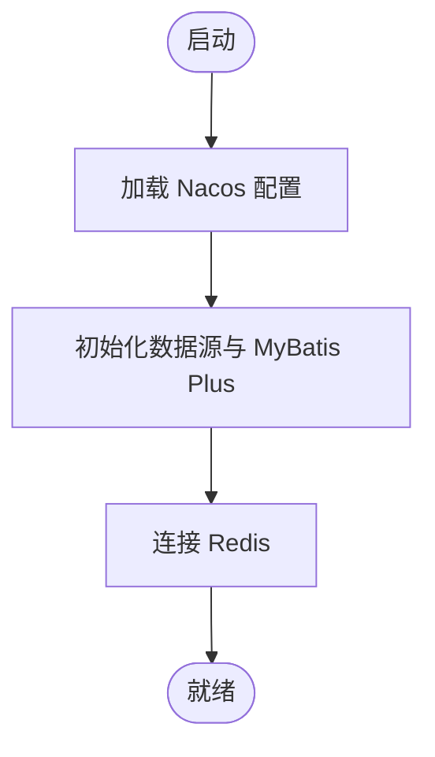
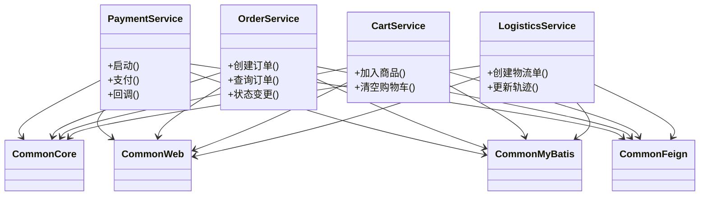
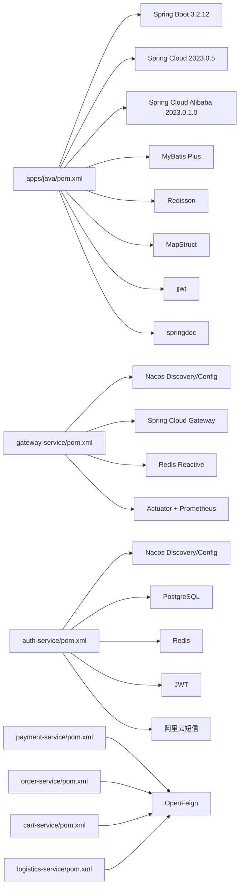

# Java 微服务集群

<cite>
**本文引用的文件**
- [apps/java/pom.xml](file://apps/java/pom.xml)
- [apps/java/gateway-service/pom.xml](file://apps/java/gateway-service/pom.xml)
- [apps/java/gateway-service/src/main/resources/application.yml](file://apps/java/gateway-service/src/main/resources/application.yml)
- [apps/java/auth-service/pom.xml](file://apps/java/auth-service/pom.xml)
- [apps/java/auth-service/src/main/resources/application.yml](file://apps/java/auth-service/src/main/resources/application.yml)
- [apps/java/payment-service/pom.xml](file://apps/java/payment-service/pom.xml)
- [apps/java/order-service/pom.xml](file://apps/java/order-service/pom.xml)
- [apps/java/cart-service/pom.xml](file://apps/java/cart-service/pom.xml)
- [apps/java/logistics-service/pom.xml](file://apps/java/logistics-service/pom.xml)
- [apps/java/common/common-web/src/main/java/com/agenthive/common/web/config/WebMvcConfig.java](file://apps/java/common/common-web/src/main/java/com/agenthive/common/web/config/WebMvcConfig.java)
</cite>

## 目录
1. [简介](#简介)
2. [项目结构](#项目结构)
3. [核心组件](#核心组件)
4. [架构总览](#架构总览)
5. [详细组件分析](#详细组件分析)
6. [依赖关系分析](#依赖关系分析)
7. [性能考量](#性能考量)
8. [故障排查指南](#故障排查指南)
9. [结论](#结论)
10. [附录](#附录)

## 简介
本技术文档面向基于 Spring Boot 3.2.12 与 Spring Cloud 的 Java 微服务集群，系统性阐述服务拆分原则、服务间通信机制、统一网关设计、服务注册与发现、负载均衡、熔断与限流、数据库与分布式能力、监控与可观测性、以及部署与运维最佳实践。文档覆盖以下核心服务：网关服务、认证服务、支付服务、订单服务、购物车服务、物流服务，并给出架构图、流程图与依赖图以帮助读者快速理解。

## 项目结构
该 Java 微服务采用多模块聚合工程组织，顶层 POM 定义了统一的版本与依赖管理，子模块按领域划分服务与通用公共模块。核心模块包括：
- 网关服务：统一入口、路由转发、鉴权与限流
- 认证服务：用户认证、授权、短信等安全能力
- 支付服务：支付与钱包相关业务
- 订单服务：订单核心域
- 购物车服务：购物车域
- 物流服务：物流与轨迹域
- 公共模块：web、mybatis、redis、security、feign、otel、rabbitmq 等

**图表来源**
- [apps/java/pom.xml:64-79](file://apps/java/pom.xml#L64-L79)
- [apps/java/gateway-service/pom.xml:18-85](file://apps/java/gateway-service/pom.xml#L18-L85)
- [apps/java/auth-service/pom.xml:18-116](file://apps/java/auth-service/pom.xml#L18-L116)
- [apps/java/payment-service/pom.xml:23-126](file://apps/java/payment-service/pom.xml#L23-L126)
- [apps/java/order-service/pom.xml:23-119](file://apps/java/order-service/pom.xml#L23-L119)
- [apps/java/cart-service/pom.xml:24-120](file://apps/java/cart-service/pom.xml#L24-L120)
- [apps/java/logistics-service/pom.xml:24-120](file://apps/java/logistics-service/pom.xml#L24-L120)

**章节来源**
- [apps/java/pom.xml:15-31](file://apps/java/pom.xml#L15-L31)
- [apps/java/pom.xml:64-79](file://apps/java/pom.xml#L64-L79)

## 核心组件
- 统一网关：基于 Spring Cloud Gateway，负责路由、鉴权、限流、跨域、OpenAPI 聚合等
- 认证服务：基于 Nacos 注册发现、PostgreSQL 数据源、Redis 缓存、JWT 令牌、短信服务集成
- 支付/订单/购物车/物流服务：均采用 Spring Web、MyBatis Plus、Redis、RabbitMQ、OpenFeign、Nacos 注册发现
- 公共模块：提供拦截器、跨域、限流、Web MVC 配置、安全工具、SQL 映射、消息队列、遥测等

**章节来源**
- [apps/java/gateway-service/pom.xml:18-85](file://apps/java/gateway-service/pom.xml#L18-L85)
- [apps/java/gateway-service/src/main/resources/application.yml:10-55](file://apps/java/gateway-service/src/main/resources/application.yml#L10-L55)
- [apps/java/auth-service/pom.xml:18-116](file://apps/java/auth-service/pom.xml#L18-L116)
- [apps/java/auth-service/src/main/resources/application.yml:14-82](file://apps/java/auth-service/src/main/resources/application.yml#L14-L82)
- [apps/java/common/common-web/src/main/java/com/agenthive/common/web/config/WebMvcConfig.java:13-36](file://apps/java/common/common-web/src/main/java/com/agenthive/common/web/config/WebMvcConfig.java#L13-L36)

## 架构总览
微服务采用“统一网关 + 多业务服务 + 公共能力”的分层架构。网关作为单一入口，根据路径将请求路由到对应后端服务；各业务服务通过 Nacos 进行注册与发现，使用 OpenFeign 实现服务间调用，结合 Redis 与 RabbitMQ 实现缓存与异步解耦；Prometheus/Micrometer 提供指标采集，OpenAPI/Swagger 聚合接口文档。

**图表来源**
- [apps/java/gateway-service/src/main/resources/application.yml:13-55](file://apps/java/gateway-service/src/main/resources/application.yml#L13-L55)
- [apps/java/auth-service/src/main/resources/application.yml:14-28](file://apps/java/auth-service/src/main/resources/application.yml#L14-L28)
- [apps/java/payment-service/pom.xml:47-102](file://apps/java/payment-service/pom.xml#L47-L102)
- [apps/java/order-service/pom.xml:47-106](file://apps/java/order-service/pom.xml#L47-L106)
- [apps/java/cart-service/pom.xml:48-96](file://apps/java/cart-service/pom.xml#L48-L96)
- [apps/java/logistics-service/pom.xml:48-96](file://apps/java/logistics-service/pom.xml#L48-L96)

## 详细组件分析

### 网关服务（Gateway）
- 路由规则：按 /api/auth、/api/users、/api/payments、/api/orders、/api/carts、/api/logistics、/api/agents 等路径转发至对应服务；部分代理到 Node.js API 服务
- 过滤器：默认去重响应头、路径前缀剥离
- 鉴权与限流：通过拦截器与限流策略在公共 web 模块中实现
- 跨域：全局 CORS 配置，暴露 traceparent 与 x-trace-id
- 文档聚合：Swagger UI 聚合多个服务的 OpenAPI 文档
- 指标：Prometheus 指标导出

**图表来源**
- [apps/java/gateway-service/src/main/resources/application.yml:13-55](file://apps/java/gateway-service/src/main/resources/application.yml#L13-L55)
- [apps/java/common/common-web/src/main/java/com/agenthive/common/web/config/WebMvcConfig.java:18-35](file://apps/java/common/common-web/src/main/java/com/agenthive/common/web/config/WebMvcConfig.java#L18-L35)

**章节来源**
- [apps/java/gateway-service/src/main/resources/application.yml:1-83](file://apps/java/gateway-service/src/main/resources/application.yml#L1-L83)
- [apps/java/common/common-web/src/main/java/com/agenthive/common/web/config/WebMvcConfig.java:13-36](file://apps/java/common/common-web/src/main/java/com/agenthive/common/web/config/WebMvcConfig.java#L13-L36)

### 认证服务（Auth）
- 注册与配置：Nacos 注册发现与配置导入
- 数据访问：PostgreSQL + MyBatis Plus（驼峰映射、逻辑删除、Mapper 扫描）
- 缓存：Redis 连接池参数配置
- 安全：JWT 密钥与过期时间配置
- 短信：阿里云短信参数（区域、签名、模板、频率限制等）
- 指标：Prometheus 指标导出
- 文档：OpenAPI 文档

**图表来源**
- [apps/java/auth-service/src/main/resources/application.yml:14-82](file://apps/java/auth-service/src/main/resources/application.yml#L14-L82)

**章节来源**
- [apps/java/auth-service/pom.xml:18-116](file://apps/java/auth-service/pom.xml#L18-L116)
- [apps/java/auth-service/src/main/resources/application.yml:14-82](file://apps/java/auth-service/src/main/resources/application.yml#L14-L82)

### 支付服务（Payment）、订单服务（Order）、购物车服务（Cart）、物流服务（Logistics）
- 共同点：均引入 common-core、common-web、common-mybatis、common-feign；使用 Spring Web、Validation、Actuator、Prometheus、Nacos 注册发现、PostgreSQL、Redis、RabbitMQ、MapStruct、Lombok、OpenAPI
- 差异点：支付/订单侧重与支付、订单生命周期相关的业务与异步消息；购物车/物流侧重与缓存与物流轨迹相关的业务

**图表来源**
- [apps/java/payment-service/pom.xml:23-126](file://apps/java/payment-service/pom.xml#L23-L126)
- [apps/java/order-service/pom.xml:23-119](file://apps/java/order-service/pom.xml#L23-L119)
- [apps/java/cart-service/pom.xml:24-120](file://apps/java/cart-service/pom.xml#L24-L120)
- [apps/java/logistics-service/pom.xml:24-120](file://apps/java/logistics-service/pom.xml#L24-L120)

**章节来源**
- [apps/java/payment-service/pom.xml:23-126](file://apps/java/payment-service/pom.xml#L23-L126)
- [apps/java/order-service/pom.xml:23-119](file://apps/java/order-service/pom.xml#L23-L119)
- [apps/java/cart-service/pom.xml:24-120](file://apps/java/cart-service/pom.xml#L24-L120)
- [apps/java/logistics-service/pom.xml:24-120](file://apps/java/logistics-service/pom.xml#L24-L120)

## 依赖关系分析
- 版本与依赖管理：顶层 POM 使用 Spring Boot 3.2.12、Spring Cloud 2023.0.5、Spring Cloud Alibaba 2023.0.1.0，统一管理 MyBatis Plus、Redisson、MapStruct、Lombok、JWT、Fastjson2、Flyway、SpringDoc 等
- 模块依赖：各业务服务依赖 common-* 模块，网关服务依赖 common-core；服务间通过 OpenFeign 与 Nacos 协作
- 外部依赖：Nacos、Redis、PostgreSQL、RabbitMQ、Prometheus、Micrometer

**图表来源**
- [apps/java/pom.xml:81-155](file://apps/java/pom.xml#L81-L155)
- [apps/java/gateway-service/pom.xml:18-85](file://apps/java/gateway-service/pom.xml#L18-L85)
- [apps/java/auth-service/pom.xml:18-116](file://apps/java/auth-service/pom.xml#L18-L116)
- [apps/java/payment-service/pom.xml:23-126](file://apps/java/payment-service/pom.xml#L23-L126)
- [apps/java/order-service/pom.xml:23-119](file://apps/java/order-service/pom.xml#L23-L119)
- [apps/java/cart-service/pom.xml:24-120](file://apps/java/cart-service/pom.xml#L24-L120)
- [apps/java/logistics-service/pom.xml:24-120](file://apps/java/logistics-service/pom.xml#L24-L120)

**章节来源**
- [apps/java/pom.xml:81-155](file://apps/java/pom.xml#L81-L155)

## 性能考量
- 连接池与超时：数据库连接池最大并发、空闲与生命周期参数已配置，建议结合压测调整
- 缓存命中：Redis 连接池参数与键空间设计需配合热点数据与失效策略
- 异步解耦：RabbitMQ 消息队列用于削峰填谷与最终一致性
- 指标监控：Prometheus + Micrometer 采集 CPU、内存、JVM、请求延迟与错误率
- 熔断与限流：建议在网关与服务侧结合 Resilience4j 或 Sentinel 实施断路器与限流策略（当前公共 web 模块提供拦截器扩展点）

[本节为通用指导，无需列出具体文件来源]

## 故障排查指南
- 网关路由失败：检查路由 ID、URI、Predicate 与 StripPrefix 配置
- 认证异常：核对 JWT 密钥、过期时间、Redis 连接与数据库连通性
- 服务间调用失败：确认 Nacos 注册状态、服务名大小写、负载均衡策略
- 数据库连接问题：核对 JDBC URL、用户名密码、连接池参数与网络连通
- 指标不可见：确认 Actuator 与 Prometheus 端点暴露、抓取间隔与标签

**章节来源**
- [apps/java/gateway-service/src/main/resources/application.yml:13-55](file://apps/java/gateway-service/src/main/resources/application.yml#L13-L55)
- [apps/java/auth-service/src/main/resources/application.yml:14-28](file://apps/java/auth-service/src/main/resources/application.yml#L14-L28)

## 结论
该 Java 微服务集群以 Spring Boot 3.2.12 为基础，结合 Spring Cloud 与 Spring Cloud Alibaba，构建了清晰的服务边界与可复用的公共能力。通过统一网关实现路由、鉴权与限流，借助 Nacos、Redis、PostgreSQL、RabbitMQ 与 Prometheus 形成完整的运行时支撑。

> **重构计划**：根据 [技术规划](file://.qoder/specs/agenthive-cloud-spec.md) ，项目正在经历以下架构调整：
> - `cart-service` 和 `logistics-service` 为纯电商模块，已规划从低代码平台中移除
> - `payment-service` 将重构为 `economy-service`，整合 Credits 计费、Marketplace、托管计费、提现等经济系统
> - `order-service` 的电商订单部分将移除，Creator 功能合并入 `economy-service`
> - `user-service` 从未实体化，用户管理已在 `auth-service` 中
>
> 本文档描述的是当前代码库状态，上述重构完成后需同步更新。

建议后续完善熔断与限流策略、数据库事务与分布式锁方案、以及统一的链路追踪与日志聚合配置，以进一步提升稳定性与可观测性。

## 附录

### 服务注册与发现、负载均衡、熔断降级
- 注册与发现：各服务引入 Nacos Discovery/Config，自动注册与动态配置
- 负载均衡：Spring Cloud LoadBalancer 与 OpenFeign 默认支持轮询策略
- 熔断降级：建议引入 Resilience4j 或 Sentinel，在网关与服务侧实施断路器与限流

**章节来源**
- [apps/java/gateway-service/pom.xml:37-40](file://apps/java/gateway-service/pom.xml#L37-L40)
- [apps/java/auth-service/pom.xml:62-67](file://apps/java/auth-service/pom.xml#L62-L67)
- [apps/java/payment-service/pom.xml:77-88](file://apps/java/payment-service/pom.xml#L77-L88)
- [apps/java/order-service/pom.xml:77-88](file://apps/java/order-service/pom.xml#L77-L88)
- [apps/java/cart-service/pom.xml:78-89](file://apps/java/cart-service/pom.xml#L78-L89)
- [apps/java/logistics-service/pom.xml:78-89](file://apps/java/logistics-service/pom.xml#L78-L89)

### 数据库设计、事务处理与分布式锁
- 数据库：PostgreSQL 作为主存储，MyBatis Plus 提供 ORM 能力
- 事务：建议在服务边界内使用 Spring 声明式事务；跨服务事务采用 Saga 或 TCC 模式
- 分布式锁：Redisson 提供 RedLock 实现，适用于库存扣减、幂等校验等场景

**章节来源**
- [apps/java/auth-service/pom.xml:91-106](file://apps/java/auth-service/pom.xml#L91-L106)
- [apps/java/payment-service/pom.xml:99-102](file://apps/java/payment-service/pom.xml#L99-L102)

### 服务监控、日志聚合与链路追踪
- 指标：Actuator + Micrometer + Prometheus
- 日志：建议统一输出 JSON 并接入 Loki/ELK
- 链路追踪：建议引入 OpenTelemetry Collector 与 Jaeger/Tempo

**章节来源**
- [apps/java/gateway-service/pom.xml:48-51](file://apps/java/gateway-service/pom.xml#L48-L51)
- [apps/java/auth-service/pom.xml:52-59](file://apps/java/auth-service/pom.xml#L52-L59)
- [apps/java/payment-service/pom.xml:65-70](file://apps/java/payment-service/pom.xml#L65-L70)
- [apps/java/order-service/pom.xml:64-69](file://apps/java/order-service/pom.xml#L64-L69)
- [apps/java/cart-service/pom.xml:66-71](file://apps/java/cart-service/pom.xml#L66-L71)
- [apps/java/logistics-service/pom.xml:66-71](file://apps/java/logistics-service/pom.xml#L66-L71)

### 部署、扩缩容与故障恢复
- 容器化：各服务提供 Dockerfile，建议统一镜像构建与推送流程
- 编排：Helm Charts 与 Kustomize 配置，定义 Deployment、Service、HPA、Ingress、PDB 等
- 扩缩容：HPA 基于 CPU/自定义指标；PodDisruptionBudget 保障可用性
- 故障恢复：滚动升级、健康检查、灰度发布与回滚策略

**章节来源**
- [apps/java/gateway-service/Dockerfile](file://apps/java/gateway-service/Dockerfile)
- [apps/java/auth-service/Dockerfile](file://apps/java/auth-service/Dockerfile)
- [apps/java/payment-service/Dockerfile](file://apps/java/payment-service/Dockerfile)
- [apps/java/order-service/Dockerfile](file://apps/java/order-service/Dockerfile)
- [apps/java/cart-service/Dockerfile](file://apps/java/cart-service/Dockerfile)
- [apps/java/logistics-service/Dockerfile](file://apps/java/logistics-service/Dockerfile)