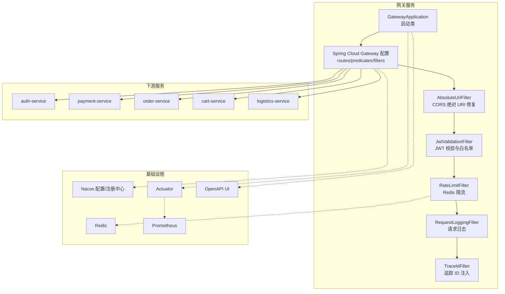
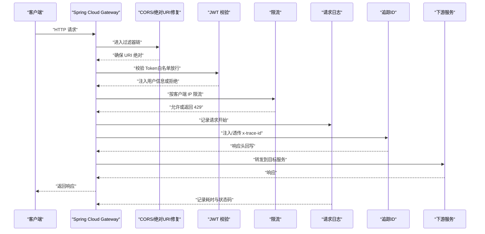
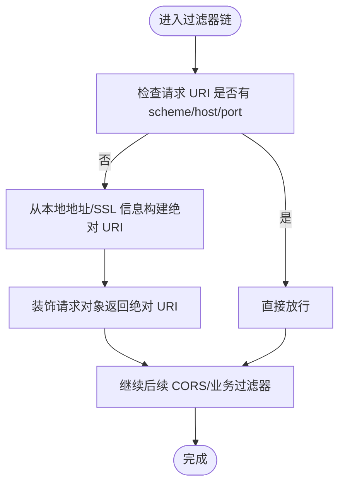
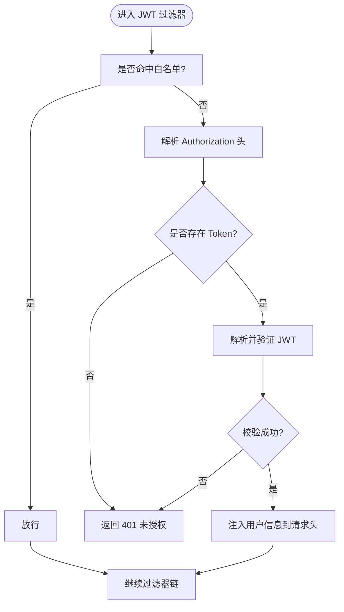
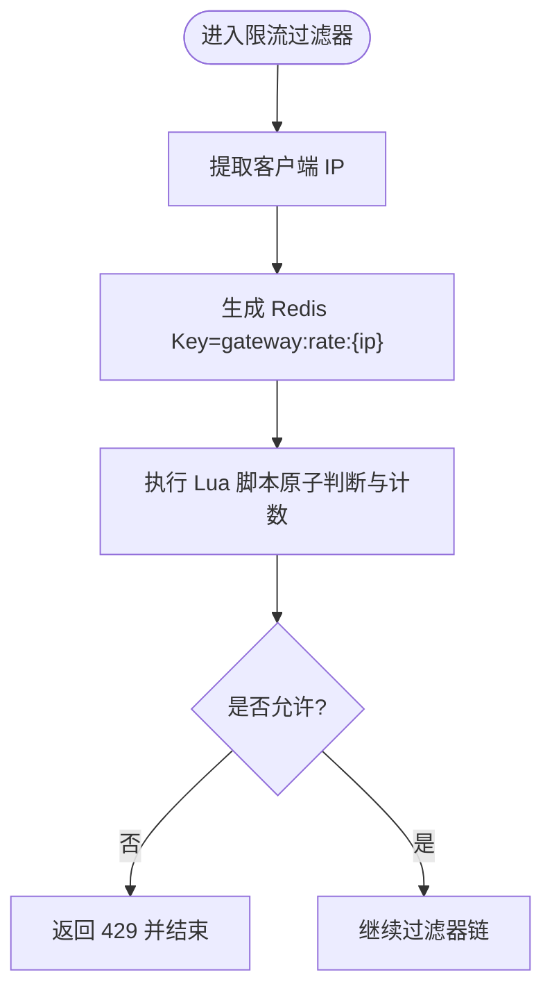
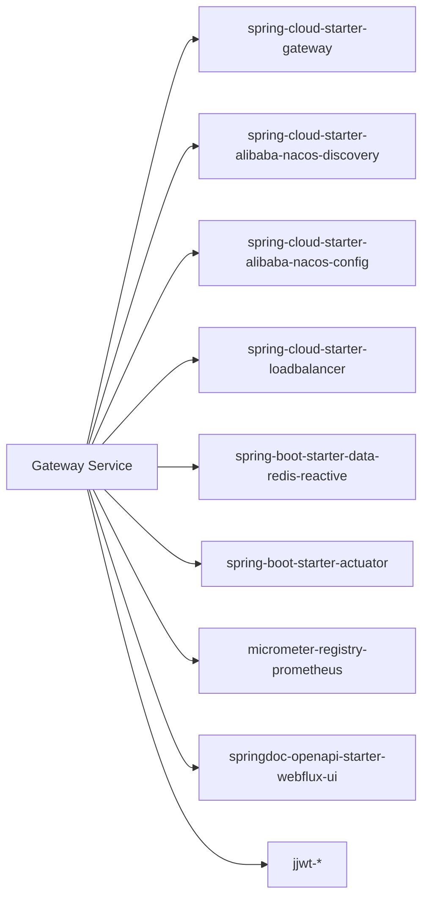

# 网关服务（Gateway Service）

<cite>
**本文引用的文件**
- [GatewayApplication.java](file://apps/java/gateway-service/src/main/java/com/agenthive/gateway/GatewayApplication.java)
- [pom.xml](file://apps/java/gateway-service/pom.xml)
- [gateway-application-docker.yml](file://apps/java/temp-config/gateway-application-docker.yml)
- [AbsoluteUriFilter.java](file://apps/java/gateway-service/src/main/java/com/agenthive/gateway/config/AbsoluteUriFilter.java)
- [JwtValidationFilter.java](file://apps/java/gateway-service/src/main/java/com/agenthive/gateway/filter/JwtValidationFilter.java)
- [RateLimitFilter.java](file://apps/java/gateway-service/src/main/java/com/agenthive/gateway/filter/RateLimitFilter.java)
- [RequestLoggingFilter.java](file://apps/java/gateway-service/src/main/java/com/agenthive/gateway/filter/RequestLoggingFilter.java)
- [TraceIdFilter.java](file://apps/java/gateway-service/src/main/java/com/agenthive/gateway/filter/TraceIdFilter.java)
- [SecurityConfig.java](file://apps/java/common/common-security/src/main/java/com/agenthive/common/security/config/SecurityConfig.java)
- [AuthenticationFilter.java](file://apps/java/common/common-security/src/main/java/com/agenthive/common/security/filter/AuthenticationFilter.java)
</cite>

## 目录
1. [简介](#简介)
2. [项目结构](#项目结构)
3. [核心组件](#核心组件)
4. [架构总览](#架构总览)
5. [详细组件分析](#详细组件分析)
6. [依赖关系分析](#依赖关系分析)
7. [性能考虑](#性能考虑)
8. [故障排查指南](#故障排查指南)
9. [结论](#结论)
10. [附录](#附录)

## 简介
本文件面向“网关服务（Gateway Service）”的技术文档，基于 Spring Cloud Gateway 实现统一入口，覆盖路由配置、请求转发机制、安全过滤器链（CORS、JWT 验证、限流、请求日志）、负载均衡与熔断降级、错误处理、监控与日志、以及性能优化与故障排查建议。本文同时结合仓库中现有的 Java 网关工程、过滤器实现与临时配置文件进行说明。

## 项目结构
网关服务采用 Spring Boot + Spring Cloud Gateway 架构，并通过 Nacos 进行服务发现与配置管理；使用 Redis 实现限流；通过 Actuator 与 Micrometer Prometheus 暴露监控指标；OpenAPI 提供在线文档。

图表来源
- [GatewayApplication.java:1-15](file://apps/java/gateway-service/src/main/java/com/agenthive/gateway/GatewayApplication.java#L1-L15)
- [gateway-application-docker.yml:12-49](file://apps/java/temp-config/gateway-application-docker.yml#L12-L49)
- [AbsoluteUriFilter.java:16-28](file://apps/java/gateway-service/src/main/java/com/agenthive/gateway/config/AbsoluteUriFilter.java#L16-L28)
- [JwtValidationFilter.java:35-44](file://apps/java/gateway-service/src/main/java/com/agenthive/gateway/filter/JwtValidationFilter.java#L35-L44)
- [RateLimitFilter.java:25-45](file://apps/java/gateway-service/src/main/java/com/agenthive/gateway/filter/RateLimitFilter.java#L25-L45)
- [RequestLoggingFilter.java:14-37](file://apps/java/gateway-service/src/main/java/com/agenthive/gateway/filter/RequestLoggingFilter.java#L14-L37)
- [TraceIdFilter.java:14-39](file://apps/java/gateway-service/src/main/java/com/agenthive/gateway/filter/TraceIdFilter.java#L14-L39)

章节来源
- [GatewayApplication.java:1-15](file://apps/java/gateway-service/src/main/java/com/agenthive/gateway/GatewayApplication.java#L1-L15)
- [pom.xml:18-84](file://apps/java/gateway-service/pom.xml#L18-L84)
- [gateway-application-docker.yml:1-61](file://apps/java/temp-config/gateway-application-docker.yml#L1-L61)

## 核心组件
- 启动与注册：启用网关与服务发现客户端，接入 Nacos。
- 路由与转发：基于路径前缀将请求转发至对应后端服务。
- 安全过滤器链：CORS 绝对 URI 修复、JWT 校验（白名单放行）、限流、请求日志、追踪 ID。
- 监控与可观测性：Actuator + Prometheus 指标导出、OpenAPI 文档。

章节来源
- [GatewayApplication.java:7-8](file://apps/java/gateway-service/src/main/java/com/agenthive/gateway/GatewayApplication.java#L7-L8)
- [gateway-application-docker.yml:12-49](file://apps/java/temp-config/gateway-application-docker.yml#L12-L49)
- [pom.xml:24-39](file://apps/java/gateway-service/pom.xml#L24-L39)

## 架构总览
下图展示从客户端到网关再到下游服务的典型调用链，以及关键过滤器在链路中的位置与职责。

图表来源
- [AbsoluteUriFilter.java:32-43](file://apps/java/gateway-service/src/main/java/com/agenthive/gateway/config/AbsoluteUriFilter.java#L32-L43)
- [JwtValidationFilter.java:56-91](file://apps/java/gateway-service/src/main/java/com/agenthive/gateway/filter/JwtValidationFilter.java#L56-L91)
- [RateLimitFilter.java:47-67](file://apps/java/gateway-service/src/main/java/com/agenthive/gateway/filter/RateLimitFilter.java#L47-L67)
- [RequestLoggingFilter.java:16-31](file://apps/java/gateway-service/src/main/java/com/agenthive/gateway/filter/RequestLoggingFilter.java#L16-L31)
- [TraceIdFilter.java:18-34](file://apps/java/gateway-service/src/main/java/com/agenthive/gateway/filter/TraceIdFilter.java#L18-L34)

## 详细组件分析

### 路由配置与请求转发
- 路由定义：基于路径前缀匹配，将 /api/auth/**、/api/users/**、/api/payments/**、/api/orders/**、/api/carts/**、/api/logistics/** 分发到对应服务。
- 转发行为：StripPrefix=1 去除第一个路径段，使下游服务无需感知网关层的前缀。
- 服务发现：通过 Nacos Discovery 与 Config 进行集中式配置与服务注册。

章节来源
- [gateway-application-docker.yml:13-49](file://apps/java/temp-config/gateway-application-docker.yml#L13-L49)
- [pom.xml:29-35](file://apps/java/gateway-service/pom.xml#L29-L35)

### CORS 配置与绝对 URI 修复
- 问题背景：Spring Framework 6.1.x 在 WebFlux 中要求 CORS 处理的 URI 为绝对地址，测试或反向代理场景可能产生相对 URI 导致异常。
- 解决方案：在 CORS 过滤器执行前，将相对 URI 重建为绝对 URI，保证跨域处理正常。

图表来源
- [AbsoluteUriFilter.java:32-43](file://apps/java/gateway-service/src/main/java/com/agenthive/gateway/config/AbsoluteUriFilter.java#L32-L43)
- [AbsoluteUriFilter.java:54-84](file://apps/java/gateway-service/src/main/java/com/agenthive/gateway/config/AbsoluteUriFilter.java#L54-L84)

章节来源
- [AbsoluteUriFilter.java:16-28](file://apps/java/gateway-service/src/main/java/com/agenthive/gateway/config/AbsoluteUriFilter.java#L16-L28)

### JWT 验证过滤器
- 白名单：对注册、登录、短信、刷新、健康检查、演示接口与监控端点放行。
- 校验逻辑：从 Authorization 头解析 Bearer Token，使用 HS256 校验签名，提取用户信息并注入自定义头部（如 X-User-Id、X-User-Name、X-User-Role）。
- 异常处理：校验失败或缺失 Token 返回 401。

图表来源
- [JwtValidationFilter.java:56-91](file://apps/java/gateway-service/src/main/java/com/agenthive/gateway/filter/JwtValidationFilter.java#L56-L91)

章节来源
- [JwtValidationFilter.java:35-44](file://apps/java/gateway-service/src/main/java/com/agenthive/gateway/filter/JwtValidationFilter.java#L35-L44)
- [JwtValidationFilter.java:97-103](file://apps/java/gateway-service/src/main/java/com/agenthive/gateway/filter/JwtValidationFilter.java#L97-L103)
- [JwtValidationFilter.java:105-108](file://apps/java/gateway-service/src/main/java/com/agenthive/gateway/filter/JwtValidationFilter.java#L105-L108)

### 限流过滤器（基于 Redis）
- 策略：按客户端 IP 维度统计请求次数，滑动时间窗（默认窗口大小与阈值见实现）。
- 存储：使用 Redis Lua 脚本原子计数，避免竞态。
- 触发：超过阈值返回 429 Too Many Requests。

图表来源
- [RateLimitFilter.java:47-67](file://apps/java/gateway-service/src/main/java/com/agenthive/gateway/filter/RateLimitFilter.java#L47-L67)
- [RateLimitFilter.java:69-81](file://apps/java/gateway-service/src/main/java/com/agenthive/gateway/filter/RateLimitFilter.java#L69-L81)

章节来源
- [RateLimitFilter.java:27-45](file://apps/java/gateway-service/src/main/java/com/agenthive/gateway/filter/RateLimitFilter.java#L27-L45)
- [RateLimitFilter.java:69-81](file://apps/java/gateway-service/src/main/java/com/agenthive/gateway/filter/RateLimitFilter.java#L69-L81)

### 请求日志过滤器
- 记录：请求开始与结束时的日志，包含追踪 ID、方法、路径、状态码与耗时。
- 时机：在链路尾部输出，确保响应状态已确定。

章节来源
- [RequestLoggingFilter.java:16-31](file://apps/java/gateway-service/src/main/java/com/agenthive/gateway/filter/RequestLoggingFilter.java#L16-L31)

### 追踪 ID 过滤器
- 生成：若请求无追踪 ID，则随机生成并注入到请求头与响应头。
- 传播：贯穿整个请求生命周期，便于跨服务链路追踪。

章节来源
- [TraceIdFilter.java:18-34](file://apps/java/gateway-service/src/main/java/com/agenthive/gateway/filter/TraceIdFilter.java#L18-L34)

### 安全配置与认证过滤器（通用模块）
- 通用安全模块提供安全配置与认证过滤器，可作为网关侧鉴权的补充或统一认证策略的一部分。

章节来源
- [SecurityConfig.java](file://apps/java/common/common-security/src/main/java/com/agenthive/common/security/config/SecurityConfig.java)
- [AuthenticationFilter.java](file://apps/java/common/common-security/src/main/java/com/agenthive/common/security/filter/AuthenticationFilter.java)

## 依赖关系分析
- 启动与注册：启用 @EnableDiscoveryClient，接入 Nacos。
- 网关与路由：spring-cloud-starter-gateway 提供路由与过滤器能力。
- 服务发现与配置：spring-cloud-starter-alibaba-nacos-discovery、spring-cloud-starter-alibaba-nacos-config。
- 负载均衡：spring-cloud-starter-loadbalancer。
- 缓存与限流：spring-boot-starter-data-redis-reactive。
- 监控与指标：spring-boot-starter-actuator + micrometer-registry-prometheus。
- 文档：springdoc-openapi-starter-webflux-ui。
- JSON Web Token：jjwt-api/jackson/impl。

图表来源
- [pom.xml:18-84](file://apps/java/gateway-service/pom.xml#L18-L84)

章节来源
- [pom.xml:18-84](file://apps/java/gateway-service/pom.xml#L18-L84)

## 性能考虑
- 过滤器顺序：通过 getOrder 控制执行顺序，确保追踪 ID 先注入、CORS 修复先于跨域处理、JWT 校验与限流在转发前完成，日志在最后输出。
- Redis 限流：Lua 原子脚本减少往返与竞态，建议根据业务峰值调整窗口与阈值。
- 负载均衡：结合 Nacos 与 LoadBalancer，合理设置实例权重与健康检查。
- 监控指标：开启 Actuator 与 Prometheus，关注请求量、错误率、响应时间、Redis 命中率等。
- 日志：控制日志级别，避免高频接口造成 IO 压力；建议使用异步日志或采样。

## 故障排查指南
- CORS 403 或异常：确认是否处于测试环境导致相对 URI，检查 AbsoluteUriFilter 是否生效。
- 401 未授权：核对 Authorization 头格式与签名密钥长度（至少 32 字节），检查白名单路径是否正确。
- 429 限流：检查 Redis 连通性与键空间，确认窗口与阈值配置是否合理。
- 无追踪 ID：确认 TraceIdFilter 是否在链路最前端执行，响应头是否被上游代理覆盖。
- 监控缺失：确认 Actuator 与 Prometheus 配置，暴露端点与抓取任务是否正确。

章节来源
- [AbsoluteUriFilter.java:32-43](file://apps/java/gateway-service/src/main/java/com/agenthive/gateway/config/AbsoluteUriFilter.java#L32-L43)
- [JwtValidationFilter.java:47-54](file://apps/java/gateway-service/src/main/java/com/agenthive/gateway/filter/JwtValidationFilter.java#L47-L54)
- [RateLimitFilter.java:58-66](file://apps/java/gateway-service/src/main/java/com/agenthive/gateway/filter/RateLimitFilter.java#L58-L66)
- [TraceIdFilter.java:18-34](file://apps/java/gateway-service/src/main/java/com/agenthive/gateway/filter/TraceIdFilter.java#L18-L34)

## 结论
该网关服务以 Spring Cloud Gateway 为核心，结合 Nacos、Redis、Actuator/Prometheus 与 OpenAPI，构建了具备统一入口、安全过滤、限流与可观测性的微服务网关。通过合理的过滤器顺序与配置，能够满足跨域、鉴权、流量治理与可观测性需求。建议在生产环境中进一步完善路由规则、限流策略、熔断降级与告警体系，并持续优化日志与监控指标。

## 附录

### 路由规则配置要点
- 路径前缀与服务映射清晰，避免重叠。
- StripPrefix 使用需与下游服务路由保持一致。
- 可扩展添加重试、熔断、缓存等过滤器。

章节来源
- [gateway-application-docker.yml:13-49](file://apps/java/temp-config/gateway-application-docker.yml#L13-L49)

### 服务发现与配置
- 使用 Nacos 进行集中式配置与服务注册，建议开启配置导入检查与健康检查。
- 将路由、限流、日志级别等参数纳入配置中心，支持动态更新。

章节来源
- [gateway-application-docker.yml:8-11](file://apps/java/temp-config/gateway-application-docker.yml#L8-L11)
- [pom.xml:29-35](file://apps/java/gateway-service/pom.xml#L29-L35)

### API 网关性能优化清单
- 过滤器链最小化：仅保留必要过滤器，避免重复解析与转换。
- Redis 限流参数：根据 QPS 与窗口调整阈值，降低误伤。
- 日志采样：对高频接口进行采样或异步落盘。
- 监控指标：建立关键指标看板，设置告警阈值。

### 错误处理流程
- 未授权：返回 401，记录警告日志。
- 限流：返回 429，记录告警日志。
- 其他异常：结合 Actuator 与日志定位上游服务错误或网络问题。

章节来源
- [JwtValidationFilter.java:87-90](file://apps/java/gateway-service/src/main/java/com/agenthive/gateway/filter/JwtValidationFilter.java#L87-L90)
- [RateLimitFilter.java:58-66](file://apps/java/gateway-service/src/main/java/com/agenthive/gateway/filter/RateLimitFilter.java#L58-L66)