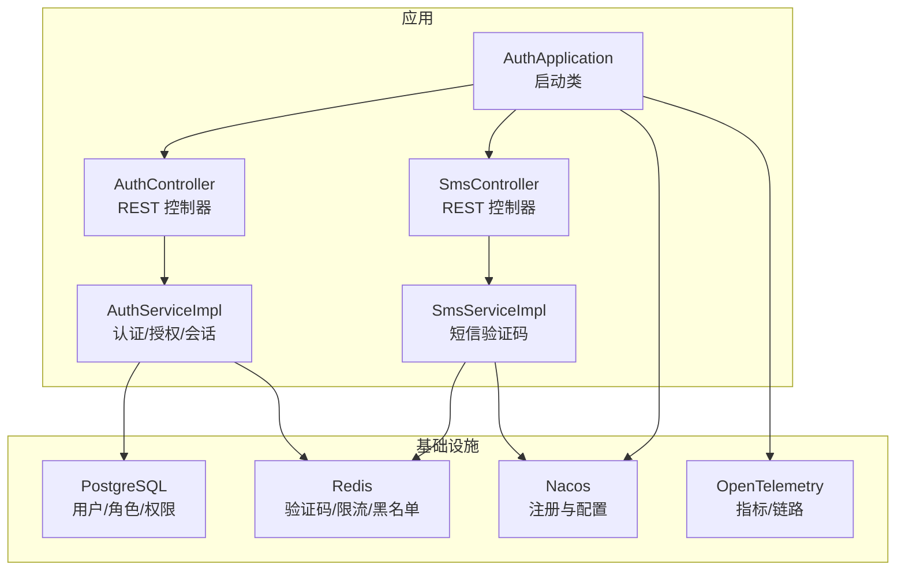
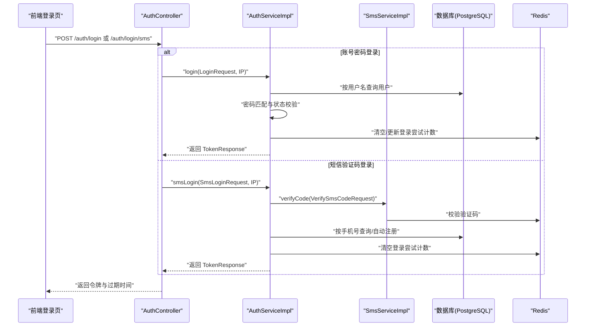
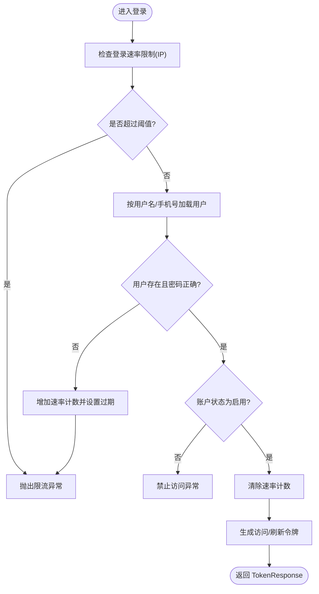
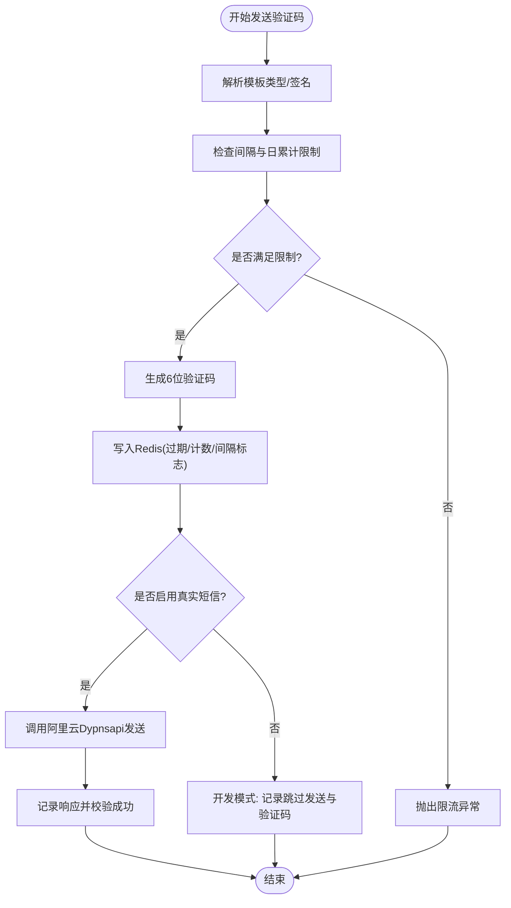
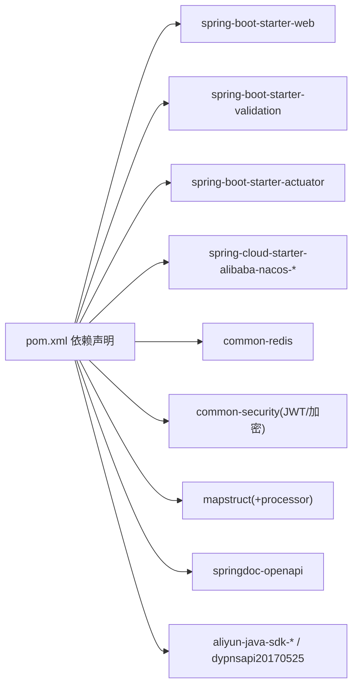

# 认证服务 (Auth Service)

<cite>
**本文引用的文件**
- [AuthApplication.java](file://apps/java/auth-service/src/main/java/com/agenthive/auth/AuthApplication.java)
- [AuthController.java](file://apps/java/auth-service/src/main/java/com/agenthive/auth/controller/AuthController.java)
- [SmsController.java](file://apps/java/auth-service/src/main/java/com/agenthive/auth/controller/SmsController.java)
- [AuthServiceImpl.java](file://apps/java/auth-service/src/main/java/com/agenthive/auth/service/impl/AuthServiceImpl.java)
- [SmsServiceImpl.java](file://apps/java/auth-service/src/main/java/com/agenthive/auth/service/impl/SmsServiceImpl.java)
- [pom.xml](file://apps/java/auth-service/pom.xml)
- [docker-compose.dev.yml](file://docker-compose.dev.yml)
- [login.vue](file://apps/landing/pages/login.vue)
</cite>

## 目录
1. [简介](#简介)
2. [项目结构](#项目结构)
3. [核心组件](#核心组件)
4. [架构总览](#架构总览)
5. [详细组件分析](#详细组件分析)
6. [依赖分析](#依赖分析)
7. [性能考虑](#性能考虑)
8. [故障排查指南](#故障排查指南)
9. [结论](#结论)
10. [附录](#附录)

## 简介
本文件面向认证服务（Auth Service），基于 Spring Boot 实现用户认证与授权，涵盖以下能力：
- 用户注册与登录（账号密码、短信验证码）
- JWT 令牌管理（访问令牌与刷新令牌）
- 密码加密与强口令校验
- 角色权限控制与当前用户查询
- 短信验证码发送与校验（集成阿里云 Dypnsapi）
- 会话管理与令牌黑名单（Redis 黑名单）
- 安全策略、限流与异常处理
- OpenAPI 文档与可观测性配置

该服务采用分层架构：控制器层负责请求入口与参数校验；业务层封装认证、授权与短信逻辑；持久层通过 MyBatis Plus 访问 PostgreSQL；缓存层使用 Redis 存储验证码与限流状态。

## 项目结构
认证服务位于 Java 应用目录下，核心结构如下：
- 应用入口：AuthApplication（Spring Boot 启动类）
- 控制器：AuthController、SmsController
- 业务实现：AuthServiceImpl、SmsServiceImpl
- 依赖：Spring Web、Validation、Actuator、Nacos Discovery/Config、PostgreSQL、Lombok、MapStruct、OpenAPI、Redis、安全工具等
- 配置：Docker Compose 开发环境变量（含 JWT Secret、阿里云短信）

图表来源
- [AuthApplication.java:1-17](file://apps/java/auth-service/src/main/java/com/agenthive/auth/AuthApplication.java#L1-L17)
- [AuthController.java:1-89](file://apps/java/auth-service/src/main/java/com/agenthive/auth/controller/AuthController.java#L1-L89)
- [SmsController.java:1-49](file://apps/java/auth-service/src/main/java/com/agenthive/auth/controller/SmsController.java#L1-L49)
- [AuthServiceImpl.java:1-274](file://apps/java/auth-service/src/main/java/com/agenthive/auth/service/impl/AuthServiceImpl.java#L1-L274)
- [SmsServiceImpl.java:1-210](file://apps/java/auth-service/src/main/java/com/agenthive/auth/service/impl/SmsServiceImpl.java#L1-L210)

章节来源
- [AuthApplication.java:1-17](file://apps/java/auth-service/src/main/java/com/agenthive/auth/AuthApplication.java#L1-L17)
- [pom.xml:1-127](file://apps/java/auth-service/pom.xml#L1-L127)
- [docker-compose.dev.yml:407-437](file://docker-compose.dev.yml#L407-L437)

## 核心组件
- 应用入口与扫描路径：启用发现客户端、MyBatis Mapper 扫描、包扫描范围覆盖认证与公共模块。
- 控制器层：
  - AuthController：提供注册、登录（账号密码/短信）、刷新、登出、当前用户信息、更新资料、查询用户角色等接口。
  - SmsController：提供发送验证码与校验验证码接口，并进行类型映射。
- 业务层：
  - AuthServiceImpl：实现注册、登录、短信登录、令牌刷新、登出（加入黑名单）、当前用户查询、角色查询、资料更新、令牌生成与强口令校验。
  - SmsServiceImpl：实现验证码生成、Redis 缓存、模板类型解析、签名名称解析、每日/间隔限流、阿里云短信发送与异常处理。
- 数据访问层：通过 MyBatis Plus Mapper 访问用户、角色、用户角色关联表。
- 缓存与安全：Redis 存储验证码、限流与黑名单；JWT 工具生成与校验访问/刷新令牌；Spring Security PasswordEncoder 进行密码加密。

章节来源
- [AuthController.java:1-89](file://apps/java/auth-service/src/main/java/com/agenthive/auth/controller/AuthController.java#L1-L89)
- [SmsController.java:1-49](file://apps/java/auth-service/src/main/java/com/agenthive/auth/controller/SmsController.java#L1-L49)
- [AuthServiceImpl.java:1-274](file://apps/java/auth-service/src/main/java/com/agenthive/auth/service/impl/AuthServiceImpl.java#L1-L274)
- [SmsServiceImpl.java:1-210](file://apps/java/auth-service/src/main/java/com/agenthive/auth/service/impl/SmsServiceImpl.java#L1-L210)

## 架构总览
认证服务采用分层与微服务架构：
- 外部交互：前端登录页通过 REST 接口与认证服务交互；短信验证码通过阿里云 Dypnsapi 发送。
- 内部交互：控制器将请求委派给业务层；业务层协调数据访问与缓存；安全工具负责 JWT 与密码加密。
- 配置与发现：Nacos 提供注册与配置中心；Actuator 与 OpenAPI 提供健康检查与接口文档。

图表来源
- [AuthController.java:31-41](file://apps/java/auth-service/src/main/java/com/agenthive/auth/controller/AuthController.java#L31-L41)
- [AuthServiceImpl.java:82-138](file://apps/java/auth-service/src/main/java/com/agenthive/auth/service/impl/AuthServiceImpl.java#L82-L138)
- [SmsServiceImpl.java:114-133](file://apps/java/auth-service/src/main/java/com/agenthive/auth/service/impl/SmsServiceImpl.java#L114-L133)

## 详细组件分析

### 认证控制器（AuthController）
职责与行为：
- 注册：接收注册请求，调用业务层完成用户创建与角色分配，返回访问/刷新令牌。
- 登录：支持账号密码登录，记录客户端 IP，进行速率限制与凭据校验，返回令牌。
- 短信登录：先校验验证码，再按手机号查找或自动注册用户，返回令牌。
- 刷新：校验刷新令牌有效性，重新签发新的访问/刷新令牌。
- 登出：将当前访问令牌加入 Redis 黑名单，有效期为剩余存活时间。
- 当前用户：校验访问令牌，查询用户信息并返回。
- 更新资料：支持用户名、密码、头像更新，密码需满足强口令规则。
- 查询角色：按用户 ID 查询角色编码列表。

章节来源
- [AuthController.java:26-73](file://apps/java/auth-service/src/main/java/com/agenthive/auth/controller/AuthController.java#L26-L73)

### 短信控制器（SmsController）
职责与行为：
- 发送验证码：根据请求类型映射模板类型，调用短信服务发送验证码，并写入 Redis 缓存。
- 校验验证码：默认模板类型为登录/注册，校验通过后删除缓存键。
- 类型映射：将前端 type 映射为模板类型枚举值。

章节来源
- [SmsController.java:21-39](file://apps/java/auth-service/src/main/java/com/agenthive/auth/controller/SmsController.java#L21-L39)

### 认证服务实现（AuthServiceImpl）
关键流程与策略：
- 注册流程：
  - 强口令校验（大小写字母、数字、特殊字符、长度≥8）。
  - 去重检查用户名是否存在。
  - 密码加密后插入用户表，分配默认角色。
  - 生成访问/刷新令牌并返回。
- 登录流程：
  - 基于客户端 IP 的速率限制（Redis 计数器，1 分钟窗口最多 5 次）。
  - 用户存在性与密码匹配校验，账户状态为启用才允许登录。
  - 成功后清理速率限制计数，生成令牌。
- 短信登录流程：
  - 先调用短信服务校验验证码。
  - 按手机号查询用户，若不存在则自动注册（随机临时密码、分配默认角色）。
  - 校验账户状态，生成令牌并标记是否新用户。
- 刷新流程：
  - 校验刷新令牌有效性，解析用户 ID，查询用户状态，重新签发令牌。
- 登出流程：
  - 若访问令牌有效，计算剩余有效期并将令牌加入 Redis 黑名单。
- 当前用户与角色：
  - 校验访问令牌，解析用户 ID，查询用户与角色列表。
- 更新资料：
  - 支持用户名去重校验、强口令校验、头像更新。
- 令牌生成：
  - 访问令牌包含用户 ID 与角色信息，刷新令牌用于续期。

图表来源
- [AuthServiceImpl.java:82-105](file://apps/java/auth-service/src/main/java/com/agenthive/auth/service/impl/AuthServiceImpl.java#L82-L105)

章节来源
- [AuthServiceImpl.java:54-80](file://apps/java/auth-service/src/main/java/com/agenthive/auth/service/impl/AuthServiceImpl.java#L54-L80)
- [AuthServiceImpl.java:82-138](file://apps/java/auth-service/src/main/java/com/agenthive/auth/service/impl/AuthServiceImpl.java#L82-L138)
- [AuthServiceImpl.java:140-162](file://apps/java/auth-service/src/main/java/com/agenthive/auth/service/impl/AuthServiceImpl.java#L140-L162)
- [AuthServiceImpl.java:164-175](file://apps/java/auth-service/src/main/java/com/agenthive/auth/service/impl/AuthServiceImpl.java#L164-L175)
- [AuthServiceImpl.java:177-216](file://apps/java/auth-service/src/main/java/com/agenthive/auth/service/impl/AuthServiceImpl.java#L177-L216)
- [AuthServiceImpl.java:218-235](file://apps/java/auth-service/src/main/java/com/agenthive/auth/service/impl/AuthServiceImpl.java#L218-L235)
- [AuthServiceImpl.java:237-258](file://apps/java/auth-service/src/main/java/com/agenthive/auth/service/impl/AuthServiceImpl.java#L237-L258)

### 短信服务实现（SmsServiceImpl）
关键流程与策略：
- 发送验证码：
  - 解析模板类型与签名名称，校验速率限制（间隔与当日上限）。
  - 生成 6 位随机验证码，写入 Redis 并设置过期时间。
  - 记录当日发送次数与间隔标志。
  - 若启用真实短信，则调用阿里云 Dypnsapi 发送并记录响应。
- 校验验证码：
  - 从 Redis 读取缓存验证码，比较一致则删除缓存并返回成功。
  - 若过期或不一致，抛出相应异常。
- 模板与签名解析：
  - 模板类型映射到配置中的模板 Code，签名名称需在可用签名集合内。
- 速率限制：
  - 间隔限制：同一手机号发送间隔秒级标志。
  - 日累计限制：当日发送次数计数，至午夜过期。

图表来源
- [SmsServiceImpl.java:40-112](file://apps/java/auth-service/src/main/java/com/agenthive/auth/service/impl/SmsServiceImpl.java#L40-L112)
- [SmsServiceImpl.java:114-133](file://apps/java/auth-service/src/main/java/com/agenthive/auth/service/impl/SmsServiceImpl.java#L114-L133)
- [SmsServiceImpl.java:154-167](file://apps/java/auth-service/src/main/java/com/agenthive/auth/service/impl/SmsServiceImpl.java#L154-L167)

章节来源
- [SmsServiceImpl.java:40-112](file://apps/java/auth-service/src/main/java/com/agenthive/auth/service/impl/SmsServiceImpl.java#L40-L112)
- [SmsServiceImpl.java:114-133](file://apps/java/auth-service/src/main/java/com/agenthive/auth/service/impl/SmsServiceImpl.java#L114-L133)
- [SmsServiceImpl.java:154-167](file://apps/java/auth-service/src/main/java/com/agenthive/auth/service/impl/SmsServiceImpl.java#L154-L167)

### 前端交互（登录页）
- 支持两种登录模式：验证码登录与密码登录。
- 验证码登录：先发送验证码，再提交验证码进行登录。
- 密码登录：输入用户名与密码进行登录。
- 协议勾选：登录前需同意服务协议与隐私政策。
- 自动重定向：已登录用户访问登录页时自动跳转至目标路径。

章节来源
- [login.vue:23-43](file://apps/landing/pages/login.vue#L23-L43)
- [login.vue:96-102](file://apps/landing/pages/login.vue#L96-L102)
- [login.vue:129-140](file://apps/landing/pages/login.vue#L129-L140)
- [login.vue:112-118](file://apps/landing/pages/login.vue#L112-L118)

## 依赖分析
认证服务的关键依赖与集成点：
- Spring 生态：Web、Validation、Actuator、OpenAPI
- 配置与注册：Nacos Discovery/Config
- 数据库：PostgreSQL
- 缓存：Redis
- 安全：Spring Security PasswordEncoder、自研 JWT 工具
- 短信：阿里云 Dypnsapi、STS、SDK（含号码认证与短信 API）
- 工具：Lombok、MapStruct
- 监控：Micrometer Prometheus

图表来源
- [pom.xml:18-115](file://apps/java/auth-service/pom.xml#L18-L115)

章节来源
- [pom.xml:18-115](file://apps/java/auth-service/pom.xml#L18-L115)

## 性能考虑
- 令牌生成与校验：JWT 工具在内存中进行签名与解析，避免额外网络开销。
- 缓存优先：登录速率限制、验证码、短信间隔与日累计计数均使用 Redis，降低数据库压力。
- 事务边界：注册与自动注册涉及多表写入，使用事务保证一致性。
- 限流策略：基于 IP 的速率限制与短信发送间隔/日累计限制，防止滥用。
- 监控与可观测性：Actuator + Prometheus 指标导出，OpenAPI 文档便于联调与压测。

## 故障排查指南
常见问题与定位建议：
- 登录失败/限流：
  - 现象：频繁登录提示“尝试过多”。
  - 排查：检查 Redis 中以“login:rate:”开头的键是否存在与过期时间。
  - 关联实现：[AuthServiceImpl.java:84-96](file://apps/java/auth-service/src/main/java/com/agenthive/auth/service/impl/AuthServiceImpl.java#L84-L96)
- 凭据错误：
  - 现象：用户名或密码错误。
  - 排查：确认用户状态为启用；核对密码是否加密存储。
  - 关联实现：[AuthServiceImpl.java:93-97](file://apps/java/auth-service/src/main/java/com/agenthive/auth/service/impl/AuthServiceImpl.java#L93-L97)
- 令牌无效：
  - 现象：刷新/登出/当前用户查询报无效令牌。
  - 排查：确认令牌未过期、未被加入黑名单；检查 JWT Secret 一致性。
  - 关联实现：[AuthServiceImpl.java:141-150](file://apps/java/auth-service/src/main/java/com/agenthive/auth/service/impl/AuthServiceImpl.java#L141-L150)，[AuthServiceImpl.java:165-175](file://apps/java/auth-service/src/main/java/com/agenthive/auth/service/impl/AuthServiceImpl.java#L165-L175)
- 短信发送失败：
  - 现象：发送验证码报错或返回空响应。
  - 排查：检查阿里云凭证与模板 Code 配置；查看日志中请求 ID 与响应码。
  - 关联实现：[SmsServiceImpl.java:54-100](file://apps/java/auth-service/src/main/java/com/agenthive/auth/service/impl/SmsServiceImpl.java#L54-L100)
- 验证码过期/错误：
  - 现象：校验验证码失败。
  - 排查：确认 Redis 中验证码键是否存在与过期时间；核对模板类型。
  - 关联实现：[SmsServiceImpl.java:123-132](file://apps/java/auth-service/src/main/java/com/agenthive/auth/service/impl/SmsServiceImpl.java#L123-L132)

章节来源
- [AuthServiceImpl.java:84-105](file://apps/java/auth-service/src/main/java/com/agenthive/auth/service/impl/AuthServiceImpl.java#L84-L105)
- [AuthServiceImpl.java:141-175](file://apps/java/auth-service/src/main/java/com/agenthive/auth/service/impl/AuthServiceImpl.java#L141-L175)
- [SmsServiceImpl.java:54-100](file://apps/java/auth-service/src/main/java/com/agenthive/auth/service/impl/SmsServiceImpl.java#L54-L100)
- [SmsServiceImpl.java:123-132](file://apps/java/auth-service/src/main/java/com/agenthive/auth/service/impl/SmsServiceImpl.java#L123-L132)

## 结论
认证服务通过清晰的分层设计与完善的基础设施集成，提供了安全、可扩展的用户认证与授权能力。其特性包括：
- 强口令策略与密码加密
- JWT 令牌生命周期管理
- 短信验证码与速率限制
- Redis 缓存优化与黑名单机制
- 微服务注册与配置、可观测性与接口文档

建议在生产环境中：
- 统一管理 JWT Secret 与阿里云凭证，避免明文配置
- 对敏感接口开启鉴权与细粒度权限控制
- 增加审计日志与告警，监控异常登录与短信发送

## 附录

### API 接口概览
- 注册：POST /auth/register
- 账号密码登录：POST /auth/login
- 短信验证码登录：POST /auth/login/sms
- 刷新令牌：POST /auth/refresh
- 登出：POST /auth/logout
- 当前用户：GET /auth/me
- 更新资料：PATCH /auth/profile
- 查询用户角色：GET /auth/users/{id}/roles
- 发送验证码：POST /auth/sms/send
- 校验验证码：POST /auth/sms/verify

章节来源
- [AuthController.java:26-73](file://apps/java/auth-service/src/main/java/com/agenthive/auth/controller/AuthController.java#L26-L73)
- [SmsController.java:21-39](file://apps/java/auth-service/src/main/java/com/agenthive/auth/controller/SmsController.java#L21-L39)

### 配置要点（开发环境）
- Redis：主机、端口、密码
- JWT Secret：用于签发与校验令牌
- 阿里云短信：开关、签名、模板 Code、OIDC 角色/提供者 ARN、默认签名
- OpenTelemetry：服务名、导出端点、资源属性、日志/链路导出器

章节来源
- [docker-compose.dev.yml:407-437](file://docker-compose.dev.yml#L407-L437)