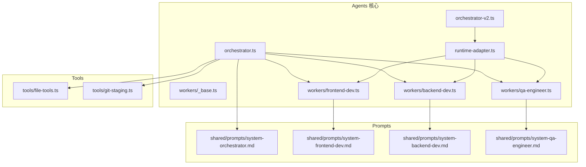
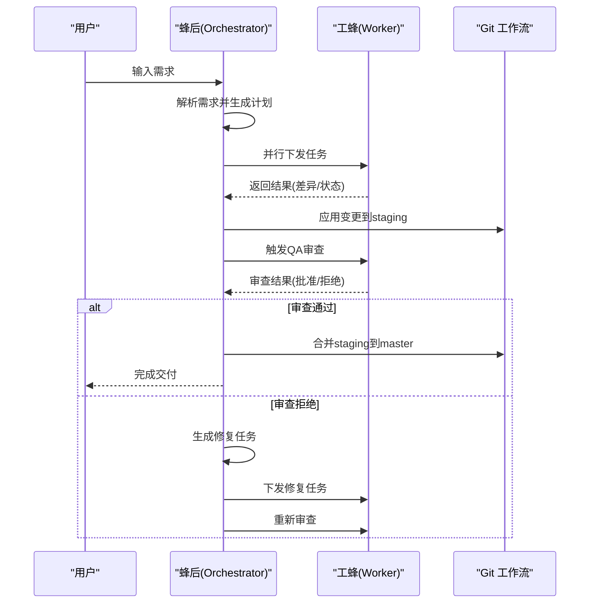
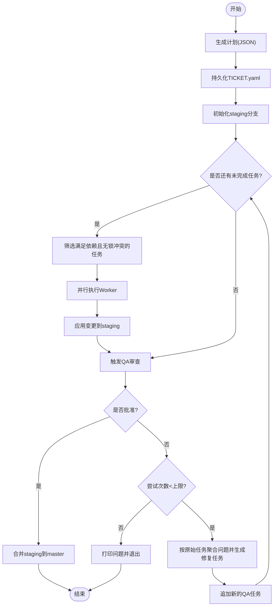
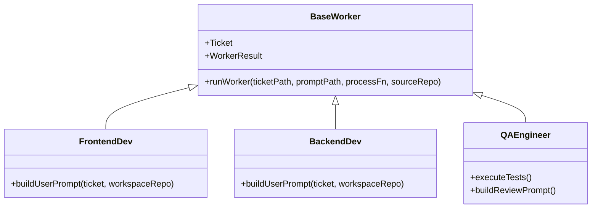
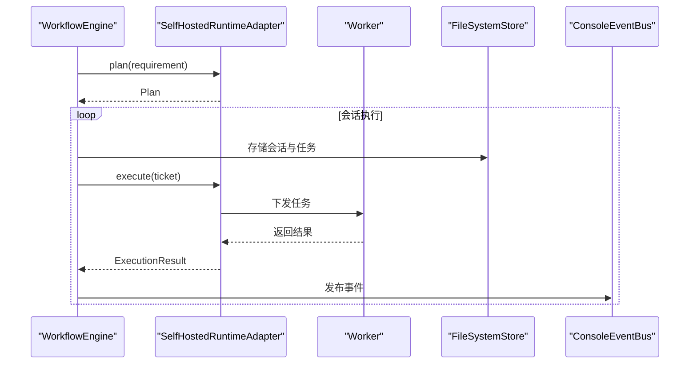
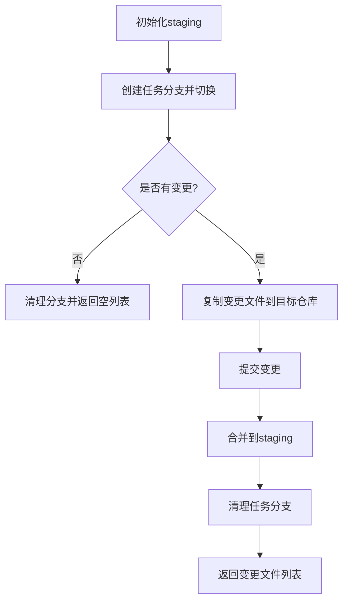
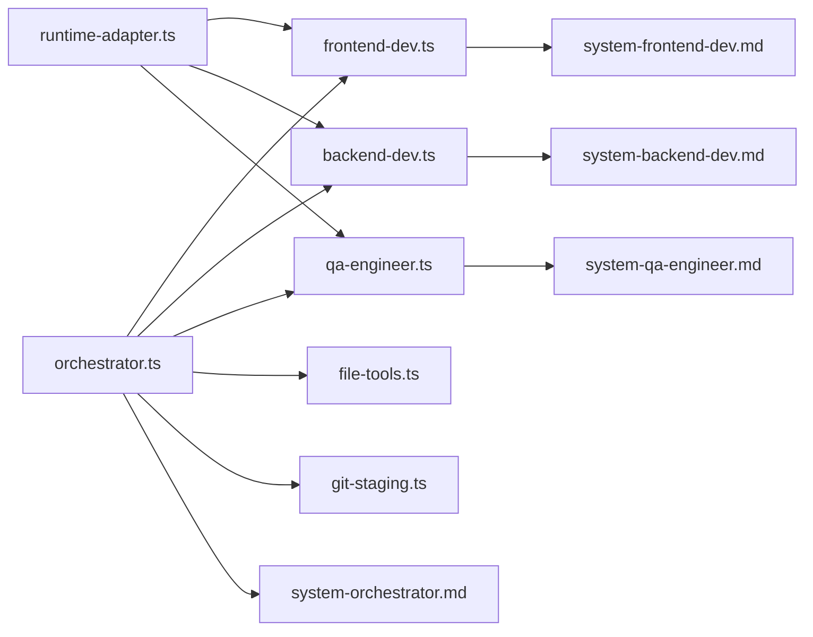

# Multi-Agent 协作系统

<cite>
**本文引用的文件**
- [orchestrator.ts](file://AGENTS/orchestrator.ts)
- [orchestrator-v2.ts](file://AGENTS/orchestrator-v2.ts)
- [_base.ts](file://AGENTS/workers/_base.ts)
- [backend-dev.ts](file://AGENTS/workers/backend-dev.ts)
- [frontend-dev.ts](file://AGENTS/workers/frontend-dev.ts)
- [qa-engineer.ts](file://AGENTS/workers/qa-engineer.ts)
- [runtime-adapter.ts](file://AGENTS/adapters/runtime-adapter.ts)
- [file-tools.ts](file://AGENTS/tools/file-tools.ts)
- [git-staging.ts](file://AGENTS/tools/git-staging.ts)
- [system-orchestrator.md](file://AGENTS/shared/prompts/system-orchestrator.md)
- [system-backend-dev.md](file://AGENTS/shared/prompts/system-backend-dev.md)
- [system-frontend-dev.md](file://AGENTS/shared/prompts/system-frontend-dev.md)
- [system-qa-engineer.md](file://AGENTS/shared/prompts/system-qa-engineer.md)
- [package.json](file://AGENTS/package.json)
- [tsconfig.json](file://AGENTS/tsconfig.json)
</cite>

## 目录
1. [简介](#简介)
2. [项目结构](#项目结构)
3. [核心组件](#核心组件)
4. [架构总览](#架构总览)
5. [详细组件分析](#详细组件分析)
6. [依赖关系分析](#依赖关系分析)
7. [性能考量](#性能考量)
8. [故障排查指南](#故障排查指南)
9. [结论](#结论)
10. [附录](#附录)

## 简介
本项目是一个基于多智能体（Agent）的协作系统，采用“蜂群模式”（Swarm Pattern）设计，由蜂后（Orchestrator）统一规划与调度，Worker Agents 分工协作完成前端开发、后端开发与测试审查任务。系统具备以下关键能力：
- 计划与分解：将用户需求拆解为结构化的任务（Ticket），明确角色、上下文与依赖。
- 并行调度：在无文件锁冲突且前置依赖满足的前提下，最大化并行执行。
- 自动修复循环：当测试或审查未通过时，自动拆分问题生成修复任务并重新审查。
- 状态持久化与恢复：以 YAML 元数据记录任务状态，支持断点续跑。
- Git 工作流集成：通过临时分支与合并，将变更安全地合入目标仓库。

## 项目结构
系统主要由以下模块组成：
- Orchestrator（蜂后）：负责需求解析、任务分解、并行调度、自动修复循环与最终合并。
- Workers（工蜂）：前端开发、后端开发、测试工程师三类 Worker，按角色执行具体任务。
- Adapters（适配层）：运行时适配器，桥接 Orchestrator 与 Worker。
- Tools（工具集）：文件操作、Git 操作等基础设施。
- Prompts（提示词）：各角色的系统提示词模板，约束行为边界与输出格式。
- 配置与脚本：包管理与构建脚本。

图表来源
- [orchestrator.ts:1-650](file://AGENTS/orchestrator.ts#L1-L650)
- [orchestrator-v2.ts:1-72](file://AGENTS/orchestrator-v2.ts#L1-L72)
- [runtime-adapter.ts:1-110](file://AGENTS/adapters/runtime-adapter.ts#L1-L110)
- [_base.ts:1-89](file://AGENTS/workers/_base.ts#L1-L89)
- [frontend-dev.ts:1-46](file://AGENTS/workers/frontend-dev.ts#L1-L46)
- [backend-dev.ts:1-45](file://AGENTS/workers/backend-dev.ts#L1-L45)
- [qa-engineer.ts:1-121](file://AGENTS/workers/qa-engineer.ts#L1-L121)
- [file-tools.ts:1-55](file://AGENTS/tools/file-tools.ts#L1-L55)
- [git-staging.ts:1-141](file://AGENTS/tools/git-staging.ts#L1-L141)
- [system-orchestrator.md:1-46](file://AGENTS/shared/prompts/system-orchestrator.md#L1-L46)
- [system-frontend-dev.md:1-40](file://AGENTS/shared/prompts/system-frontend-dev.md#L1-L40)
- [system-backend-dev.md:1-40](file://AGENTS/shared/prompts/system-backend-dev.md#L1-L40)
- [system-qa-engineer.md:1-40](file://AGENTS/shared/prompts/system-qa-engineer.md#L1-L40)

章节来源
- [orchestrator.ts:1-650](file://AGENTS/orchestrator.ts#L1-L650)
- [orchestrator-v2.ts:1-72](file://AGENTS/orchestrator-v2.ts#L1-L72)
- [runtime-adapter.ts:1-110](file://AGENTS/adapters/runtime-adapter.ts#L1-L110)
- [_base.ts:1-89](file://AGENTS/workers/_base.ts#L1-L89)
- [frontend-dev.ts:1-46](file://AGENTS/workers/frontend-dev.ts#L1-L46)
- [backend-dev.ts:1-45](file://AGENTS/workers/backend-dev.ts#L1-L45)
- [qa-engineer.ts:1-121](file://AGENTS/workers/qa-engineer.ts#L1-L121)
- [file-tools.ts:1-55](file://AGENTS/tools/file-tools.ts#L1-L55)
- [git-staging.ts:1-141](file://AGENTS/tools/git-staging.ts#L1-L141)
- [system-orchestrator.md:1-46](file://AGENTS/shared/prompts/system-orchestrator.md#L1-L46)
- [system-frontend-dev.md:1-40](file://AGENTS/shared/prompts/system-frontend-dev.md#L1-L40)
- [system-backend-dev.md:1-40](file://AGENTS/shared/prompts/system-backend-dev.md#L1-L40)
- [system-qa-engineer.md:1-40](file://AGENTS/shared/prompts/system-qa-engineer.md#L1-L40)
- [package.json:1-22](file://AGENTS/package.json#L1-L22)
- [tsconfig.json:1-17](file://AGENTS/tsconfig.json#L1-L17)

## 核心组件
- 蜂后（Orchestrator）
  - 角色：任务规划者、调度器、质量门控与自动修复编排者。
  - 能力：需求解析、任务分解、文件锁冲突检测、并行调度、依赖排序、自动修复循环、最终合并。
- 工蜂（Workers）
  - 前端开发（frontend-dev）：仅修改前端应用目录，遵循最小改动与风格一致性。
  - 后端开发（backend-dev）：仅修改后端服务与共享库，保证接口与类型定义更新。
  - 测试工程师（qa-engineer）：静态审查+真实测试执行（类型检查、单元测试），严格判定审批。
- 适配层（Runtime Adapter）
  - v2 版本引入，封装计划与执行流程，统一 Worker 调度与结果提取。
- 工具集（Tools）
  - 文件工具：复制目录、读写文件、列出文件。
  - Git 工具：初始化 staging 分支、将单个任务变更应用到 staging、合并到 master。
- 提示词（Prompts）
  - 为各角色定义权威范围、工作流与输出格式，确保行为可预期。

章节来源
- [orchestrator.ts:29-80](file://AGENTS/orchestrator.ts#L29-L80)
- [system-orchestrator.md:1-46](file://AGENTS/shared/prompts/system-orchestrator.md#L1-L46)
- [system-frontend-dev.md:1-40](file://AGENTS/shared/prompts/system-frontend-dev.md#L1-L40)
- [system-backend-dev.md:1-40](file://AGENTS/shared/prompts/system-backend-dev.md#L1-L40)
- [system-qa-engineer.md:1-40](file://AGENTS/shared/prompts/system-qa-engineer.md#L1-L40)
- [runtime-adapter.ts:18-72](file://AGENTS/adapters/runtime-adapter.ts#L18-L72)

## 架构总览
系统采用“蜂后-工蜂”两级架构：
- 蜂后负责全局规划与控制流，Worker 负责具体任务执行。
- v1 使用本地调度与文件锁；v2 使用工作流引擎适配器，增强可扩展性与事件驱动能力。
- 通过 Git 工作流将变更从任务分支合并到 staging，最终 fast-forward 到 master。

图表来源
- [orchestrator.ts:246-431](file://AGENTS/orchestrator.ts#L246-L431)
- [runtime-adapter.ts:35-71](file://AGENTS/adapters/runtime-adapter.ts#L35-L71)
- [git-staging.ts:44-140](file://AGENTS/tools/git-staging.ts#L44-L140)

## 详细组件分析

### 蜂后（Orchestrator）设计与实现
- 任务分解与持久化
  - 依据系统提示词进行 JSON 输出，确保包含任务 ID、角色、任务描述、相关文件、约束与依赖。
  - 在执行前将每个任务持久化为 YAML，便于断点续跑与离线恢复。
- 文件锁与并行调度
  - 在计划阶段预检相关文件冲突，执行阶段使用文件锁避免并发写冲突。
  - 基于依赖图进行拓扑排序，优先满足前置依赖且无锁冲突的任务。
- 自动修复循环
  - 若 QA 审查未通过，根据审查结果按原始任务聚合问题，生成修复任务并追加新的 QA 任务。
  - 支持最多 N 次自动修复尝试，失败则终止并打印问题清单。
- Git 工作流
  - 初始化 staging 分支，将每个任务的变更应用到对应分支并合并到 staging。
  - 审查通过后 fast-forward 合并到 master。

图表来源
- [orchestrator.ts:275-420](file://AGENTS/orchestrator.ts#L275-L420)
- [system-orchestrator.md:23-46](file://AGENTS/shared/prompts/system-orchestrator.md#L23-L46)

章节来源
- [orchestrator.ts:275-420](file://AGENTS/orchestrator.ts#L275-L420)
- [system-orchestrator.md:10-22](file://AGENTS/shared/prompts/system-orchestrator.md#L10-L22)

### 工蜂（Workers）角色与协作
- 基础框架（_base.ts）
  - 统一的工作空间准备、系统提示词加载、LLM 调用、差异与状态生成、结果落盘。
  - 错误捕获与失败结果输出，确保流程健壮性。
- 前端开发（frontend-dev.ts）
  - 仅修改前端应用目录，输出完整文件内容，遵循现有风格与命名规范。
- 后端开发（backend-dev.ts）
  - 仅修改后端服务与共享库，必要时更新 OpenAPI 或类型定义。
- 测试工程师（qa-engineer.ts）
  - 综合静态审查与真实测试（类型检查、单元测试），若测试失败强制标记为拒绝。
  - 输出结构化问题列表，包含严重级别、文件、行号、描述与修复建议。

图表来源
- [_base.ts:33-86](file://AGENTS/workers/_base.ts#L33-L86)
- [frontend-dev.ts:25-44](file://AGENTS/workers/frontend-dev.ts#L25-L44)
- [backend-dev.ts:25-39](file://AGENTS/workers/backend-dev.ts#L25-L39)
- [qa-engineer.ts:38-120](file://AGENTS/workers/qa-engineer.ts#L38-L120)

章节来源
- [_base.ts:11-31](file://AGENTS/workers/_base.ts#L11-L31)
- [frontend-dev.ts:18-44](file://AGENTS/workers/frontend-dev.ts#L18-L44)
- [backend-dev.ts:18-39](file://AGENTS/workers/backend-dev.ts#L18-L39)
- [qa-engineer.ts:25-120](file://AGENTS/workers/qa-engineer.ts#L25-L120)

### 适配层（Runtime Adapter）与 v2 工作流引擎
- v2 通过适配器将 Orchestrator 与 Worker 解耦，统一计划与执行接口。
- 执行阶段根据角色选择对应 Worker，读取结果并提取变更文件列表。
- 结合文件系统存储与控制台事件总线，形成可观察、可恢复的执行会话。

图表来源
- [runtime-adapter.ts:26-71](file://AGENTS/adapters/runtime-adapter.ts#L26-L71)
- [orchestrator-v2.ts:19-65](file://AGENTS/orchestrator-v2.ts#L19-L65)

章节来源
- [runtime-adapter.ts:18-110](file://AGENTS/adapters/runtime-adapter.ts#L18-L110)
- [orchestrator-v2.ts:19-65](file://AGENTS/orchestrator-v2.ts#L19-L65)

### 工具集与基础设施
- 文件工具
  - 递归复制目录（忽略 node_modules/.git/dist），读写文件，按正则列出文件。
- Git 工具
  - 初始化 staging 分支并重置到 master，将任务变更应用到对应分支并合并到 staging。
  - 使用互斥锁串行化 Git 操作，避免竞态。
  - 合并成功后 fast-forward 到 master。

图表来源
- [git-staging.ts:44-140](file://AGENTS/tools/git-staging.ts#L44-L140)

章节来源
- [file-tools.ts:22-54](file://AGENTS/tools/file-tools.ts#L22-L54)
- [git-staging.ts:44-140](file://AGENTS/tools/git-staging.ts#L44-L140)

## 依赖关系分析
- Orchestrator 依赖
  - LLM 客户端：用于计划与对话式交互。
  - 文件工具：读写 YAML/TICKET、复制工作空间。
  - Git 工具：初始化与合并分支。
  - Worker：按角色调用前端/后端/测试。
- Runtime Adapter 依赖
  - Worker：执行具体任务。
  - 文件系统存储：会话与任务持久化。
  - 控制台事件总线：事件发布。
- Workers 依赖
  - LLM 客户端：生成结构化输出。
  - 文件工具：写入修改/创建的文件。
  - Git 工具：生成差异与状态。

图表来源
- [orchestrator.ts:20-22](file://AGENTS/orchestrator.ts#L20-L22)
- [runtime-adapter.ts:12-13](file://AGENTS/adapters/runtime-adapter.ts#L12-L13)
- [frontend-dev.ts:10](file://AGENTS/workers/frontend-dev.ts#L10)
- [backend-dev.ts:10](file://AGENTS/workers/backend-dev.ts#L10)
- [qa-engineer.ts:17](file://AGENTS/workers/qa-engineer.ts#L17)
- [system-orchestrator.md:1-46](file://AGENTS/shared/prompts/system-orchestrator.md#L1-L46)
- [system-frontend-dev.md:1-40](file://AGENTS/shared/prompts/system-frontend-dev.md#L1-L40)
- [system-backend-dev.md:1-40](file://AGENTS/shared/prompts/system-backend-dev.md#L1-L40)
- [system-qa-engineer.md:1-40](file://AGENTS/shared/prompts/system-qa-engineer.md#L1-L40)

章节来源
- [orchestrator.ts:20-22](file://AGENTS/orchestrator.ts#L20-L22)
- [runtime-adapter.ts:12-13](file://AGENTS/adapters/runtime-adapter.ts#L12-L13)

## 性能考量
- 并行度优化
  - 通过文件锁与依赖图减少等待时间，最大化无冲突任务并行。
  - 建议合理拆分任务，避免大量重叠相关文件导致频繁串行。
- I/O 与 Git 操作
  - 使用互斥锁串行化 Git 操作，避免竞态与合并冲突。
  - 复制工作空间时忽略 node_modules/.git/dist，减少不必要的 I/O。
- LLM 调用成本
  - 将系统提示词与任务上下文精简，避免冗余信息导致 token 消耗过高。
- 重试与失败回滚
  - 自动修复循环限制最大尝试次数，防止无限重试造成资源浪费。
  - 合并失败自动回滚，保障仓库状态一致。

## 故障排查指南
- 常见问题与定位
  - 文件锁死锁：检查计划中相关文件是否存在循环依赖或过度重叠，必要时拆分任务。
  - QA 拒绝：查看审查输出中的问题列表，结合真实测试失败日志定位根因。
  - 合并失败：检查合并冲突与权限问题，确认 staging 分支状态。
  - Worker 异常：查看 result.json 中的错误信息，确认 LLM 输出格式与文件路径。
- 排障步骤
  - 断点续跑：使用 --resume 指定任务 ID 或环境变量 RESUME_TICKET_ID，从持久化状态恢复。
  - 日志与输出：关注控制台输出与 workspace 下的中间文件（TICKET.yaml、result.json）。
  - 回滚与清理：若出现异常，确保清理临时分支与工作区，避免污染后续执行。

章节来源
- [orchestrator.ts:484-488](file://AGENTS/orchestrator.ts#L484-L488)
- [git-staging.ts:110-121](file://AGENTS/tools/git-staging.ts#L110-L121)
- [_base.ts:56-69](file://AGENTS/workers/_base.ts#L56-L69)

## 结论
该 Multi-Agent 协作系统以蜂后-工蜂为核心，通过严格的任务分解、并行调度、文件锁与自动修复循环，实现了高效、稳定与可恢复的软件交付流水线。v2 版本进一步通过工作流引擎与适配层提升了可扩展性与可观测性。配合完善的提示词模板与 Git 工作流，系统能够持续产出高质量的变更并安全合并到主干。

## 附录
- 使用示例
  - v1：npx tsx AGENTS/orchestrator.ts "为 Dashboard 增加导出按钮"
  - v2：npx tsx AGENTS/orchestrator-v2.ts "为用户中心新增统计卡片"
  - 断点续跑：npx tsx AGENTS/orchestrator.ts --resume T001
- 最佳实践
  - 将需求拆分为最小可行任务，明确相关文件与约束。
  - 避免跨角色共享同一文件，减少冲突与审查成本。
  - 为关键流程添加测试，确保类型检查与单元测试覆盖。
  - 使用断点续跑功能处理长时间任务与突发中断。