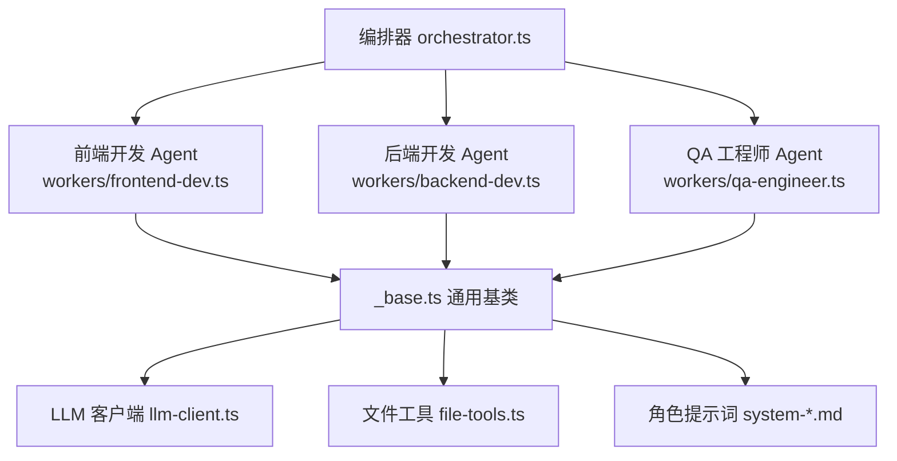
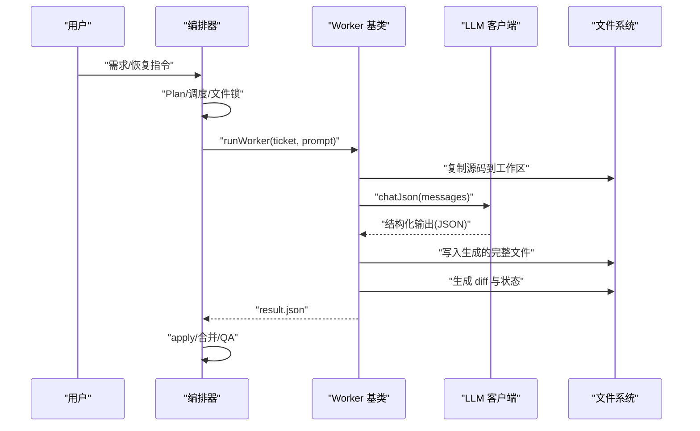
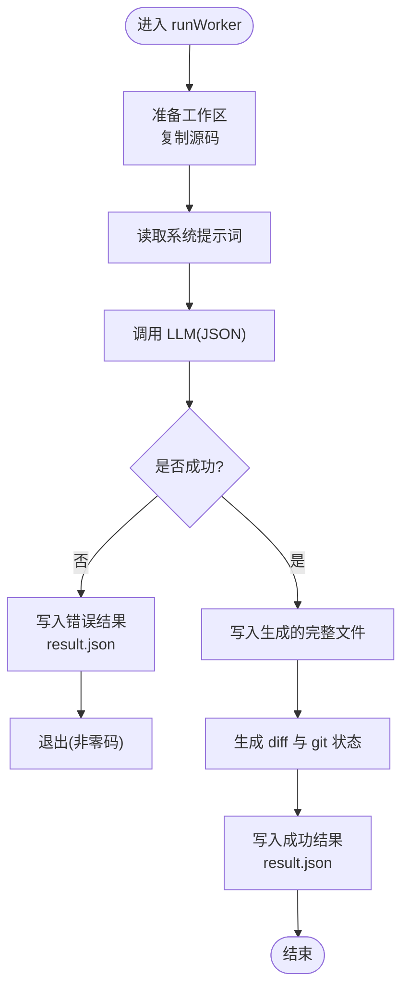
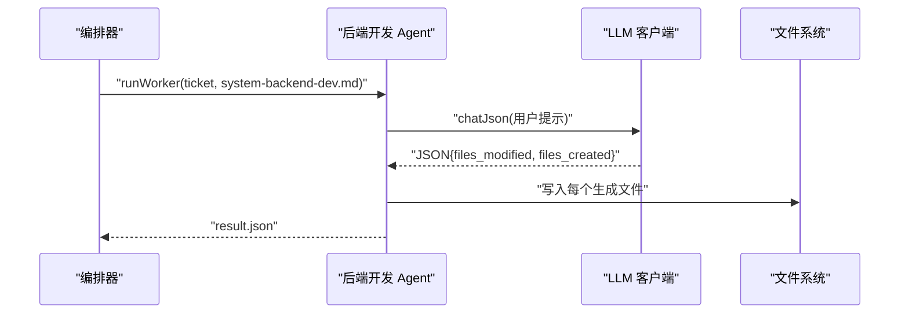
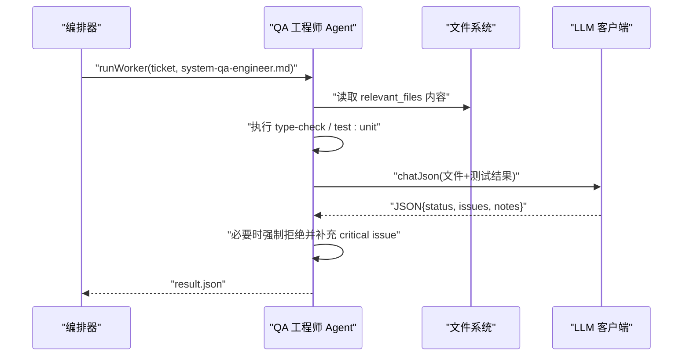
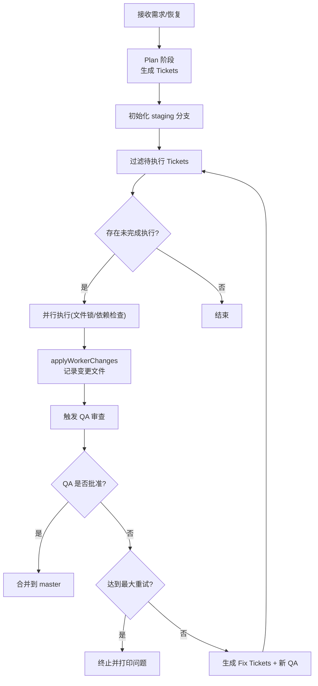
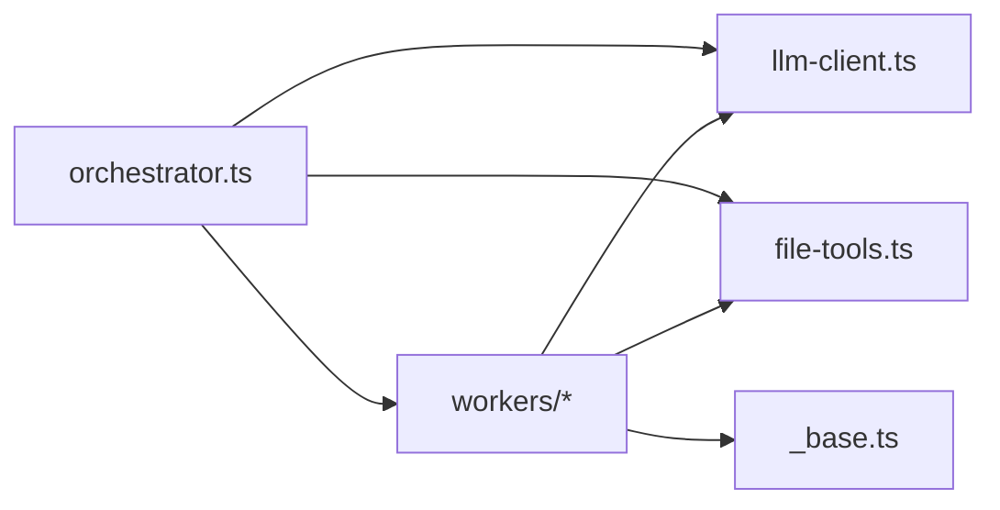

# Worker Agents 工作代理

<cite>
**本文引用的文件**
- [AGENTS/workers/_base.ts](file://AGENTS/workers/_base.ts)
- [AGENTS/workers/backend-dev.ts](file://AGENTS/workers/backend-dev.ts)
- [AGENTS/workers/frontend-dev.ts](file://AGENTS/workers/frontend-dev.ts)
- [AGENTS/workers/qa-engineer.ts](file://AGENTS/workers/qa-engineer.ts)
- [AGENTS/orchestrator.ts](file://AGENTS/orchestrator.ts)
- [AGENTS/tools/llm-client.ts](file://AGENTS/tools/llm-client.ts)
- [AGENTS/tools/file-tools.ts](file://AGENTS/tools/file-tools.ts)
- [AGENTS/shared/prompts/system-backend-dev.md](file://AGENTS/shared/prompts/system-backend-dev.md)
- [AGENTS/shared/prompts/system-frontend-dev.md](file://AGENTS/shared/prompts/system-frontend-dev.md)
- [AGENTS/shared/prompts/system-qa-engineer.md](file://AGENTS/shared/prompts/system-qa-engineer.md)
- [AGENTS/package.json](file://AGENTS/package.json)
- [AGENTS/README.md](file://AGENTS/README.md)
</cite>

## 目录
1. [引言](#引言)
2. [项目结构](#项目结构)
3. [核心组件](#核心组件)
4. [架构总览](#架构总览)
5. [详细组件分析](#详细组件分析)
6. [依赖关系分析](#依赖关系分析)
7. [性能考量](#性能考量)
8. [故障排查指南](#故障排查指南)
9. [结论](#结论)
10. [附录](#附录)

## 引言
本文件为 Worker Agents 工作代理系统的技术文档，聚焦于三种核心 Worker Agent 的角色分工与功能特性：后端开发 Agent、前端开发 Agent 与 QA 工程师 Agent。文档阐述各 Agent 的工作流程、代码生成能力与文件操作机制，解析 Agent 基类的设计模式与通用功能（任务执行、结果处理、状态管理），并说明 Agent 间的协作机制与通信协议。最后提供配置、扩展与自定义实践指南，帮助读者添加新的 Agent 类型与调整既有 Agent 的行为。

## 项目结构
- 核心入口与编排：orchestrator.ts
- Worker Agent 实现：workers/backend-dev.ts、workers/frontend-dev.ts、workers/qa-engineer.ts
- 通用基类与工具：workers/_base.ts、tools/llm-client.ts、tools/file-tools.ts
- 角色提示词：shared/prompts/system-*.md
- 包脚本与运行方式：package.json、README.md

图表来源
- [AGENTS/orchestrator.ts:528-555](file://AGENTS/orchestrator.ts#L528-L555)
- [AGENTS/workers/_base.ts:33-86](file://AGENTS/workers/_base.ts#L33-L86)
- [AGENTS/workers/frontend-dev.ts:25-40](file://AGENTS/workers/frontend-dev.ts#L25-L40)
- [AGENTS/workers/backend-dev.ts:25-40](file://AGENTS/workers/backend-dev.ts#L25-L40)
- [AGENTS/workers/qa-engineer.ts:38-120](file://AGENTS/workers/qa-engineer.ts#L38-L120)
- [AGENTS/tools/llm-client.ts:20-85](file://AGENTS/tools/llm-client.ts#L20-L85)
- [AGENTS/tools/file-tools.ts:1-55](file://AGENTS/tools/file-tools.ts#L1-L55)

章节来源
- [AGENTS/README.md:1-103](file://AGENTS/README.md#L1-L103)
- [AGENTS/package.json:1-22](file://AGENTS/package.json#L1-L22)

## 核心组件
- 通用基类 runWorker：统一工作区准备、系统提示词加载、LLM 调用、差异生成与结果落盘。
- LLM 客户端 LLMClient：OpenAI 兼容接口封装，支持 JSON 输出。
- 文件工具 file-tools：读写、复制、遍历、存在性判断。
- 角色提示词：后端、前端、QA 的系统提示词模板。
- 编排器 orchestrator：任务拆解、并行调度、文件锁、自动修复循环、QA 审查与合并。

章节来源
- [AGENTS/workers/_base.ts:11-89](file://AGENTS/workers/_base.ts#L11-L89)
- [AGENTS/tools/llm-client.ts:20-85](file://AGENTS/tools/llm-client.ts#L20-L85)
- [AGENTS/tools/file-tools.ts:1-55](file://AGENTS/tools/file-tools.ts#L1-L55)
- [AGENTS/shared/prompts/system-backend-dev.md:1-40](file://AGENTS/shared/prompts/system-backend-dev.md#L1-L40)
- [AGENTS/shared/prompts/system-frontend-dev.md:1-40](file://AGENTS/shared/prompts/system-frontend-dev.md#L1-L40)
- [AGENTS/shared/prompts/system-qa-engineer.md:1-40](file://AGENTS/shared/prompts/system-qa-engineer.md#L1-L40)
- [AGENTS/orchestrator.ts:246-431](file://AGENTS/orchestrator.ts#L246-L431)

## 架构总览
Worker Agents 采用“编排器 + 多 Worker + 通用基类”的分层架构。编排器负责任务规划、并行调度与质量门禁；Worker 通过统一基类对接 LLM 与文件系统，按角色职责生成完整文件内容；QA Worker 在审查阶段结合静态分析与真实测试执行，形成闭环。

图表来源
- [AGENTS/orchestrator.ts:275-313](file://AGENTS/orchestrator.ts#L275-L313)
- [AGENTS/orchestrator.ts:437-524](file://AGENTS/orchestrator.ts#L437-L524)
- [AGENTS/workers/_base.ts:33-86](file://AGENTS/workers/_base.ts#L33-L86)
- [AGENTS/tools/llm-client.ts:73-84](file://AGENTS/tools/llm-client.ts#L73-L84)
- [AGENTS/tools/file-tools.ts:8-11](file://AGENTS/tools/file-tools.ts#L8-L11)

## 详细组件分析

### Agent 基类与通用功能（_base.ts）
- 任务执行：runWorker 统一流程包括工作区准备、系统提示词加载、调用 LLM、写入文件、生成 diff 与状态，并落盘结果。
- 结果处理：WorkerResult 结构化输出，包含状态、diff、git 状态与 LLM 输出。
- 状态管理：通过 workspace 目录下的 result.json 与 TICKET.yaml 记录执行状态与元数据。
- 错误处理：捕获 LLM/文件/子进程异常，记录错误并退出。

图表来源
- [AGENTS/workers/_base.ts:33-86](file://AGENTS/workers/_base.ts#L33-L86)

章节来源
- [AGENTS/workers/_base.ts:11-89](file://AGENTS/workers/_base.ts#L11-L89)

### 后端开发 Agent（backend-dev.ts）
- 角色定位：Node.js 与 API 设计专家，仅修改后端代码与类型定义。
- 工作流程：读取任务与约束，调用 LLM 生成完整文件内容，写入目标路径（支持绝对/相对路径），返回结构化结果。
- 代码生成能力：返回 files_modified 与 files_created，内容为完整文件体，避免 patch 误差。
- 文件操作机制：统一通过 file-tools 写入，遵循工作区 repo 目录。

图表来源
- [AGENTS/workers/backend-dev.ts:25-40](file://AGENTS/workers/backend-dev.ts#L25-L40)
- [AGENTS/shared/prompts/system-backend-dev.md:1-40](file://AGENTS/shared/prompts/system-backend-dev.md#L1-L40)

章节来源
- [AGENTS/workers/backend-dev.ts:1-45](file://AGENTS/workers/backend-dev.ts#L1-L45)
- [AGENTS/shared/prompts/system-backend-dev.md:1-40](file://AGENTS/shared/prompts/system-backend-dev.md#L1-L40)

### 前端开发 Agent（frontend-dev.ts）
- 角色定位：Vue 3 + TypeScript 专家，仅修改前端应用与页面。
- 工作流程：与后端类似，但职责限定在前端应用目录，保持最小改动与风格一致。
- 代码生成能力：同样返回完整文件内容，确保一致性与可维护性。
- 文件操作机制：支持绝对/相对路径写入，统一到工作区 repo。

图表来源
- [AGENTS/workers/frontend-dev.ts:25-40](file://AGENTS/workers/frontend-dev.ts#L25-L40)
- [AGENTS/shared/prompts/system-frontend-dev.md:1-40](file://AGENTS/shared/prompts/system-frontend-dev.md#L1-L40)

章节来源
- [AGENTS/workers/frontend-dev.ts:1-46](file://AGENTS/workers/frontend-dev.ts#L1-L46)
- [AGENTS/shared/prompts/system-frontend-dev.md:1-40](file://AGENTS/shared/prompts/system-frontend-dev.md#L1-L40)

### QA 工程师 Agent（qa-engineer.ts）
- 角色定位：代码审查与测试执行专家，不写生产代码，专注问题发现与修复建议。
- 工作流程：收集 relevant_files 内容，执行类型检查与单元测试，汇总测试结果与 LLM 审查意见，输出审批状态与问题清单。
- 代码生成能力：不生成文件，仅返回结构化审查结果。
- 文件操作机制：读取工作区文件内容，执行 shell 命令，不修改文件。
- 质量门禁：若测试失败而 LLM 仍批准，则强制降级为拒绝，确保质量门槛。

图表来源
- [AGENTS/workers/qa-engineer.ts:38-120](file://AGENTS/workers/qa-engineer.ts#L38-L120)
- [AGENTS/shared/prompts/system-qa-engineer.md:1-40](file://AGENTS/shared/prompts/system-qa-engineer.md#L1-L40)

章节来源
- [AGENTS/workers/qa-engineer.ts:1-121](file://AGENTS/workers/qa-engineer.ts#L1-L121)
- [AGENTS/shared/prompts/system-qa-engineer.md:1-40](file://AGENTS/shared/prompts/system-qa-engineer.md#L1-L40)

### 编排器（orchestrator.ts）
- 任务拆解：基于用户需求生成 Plan 与 Tickets，支持 Prompt-Replay 与离线恢复。
- 并行调度：检测文件冲突与依赖关系，无冲突且满足依赖的任务并行执行。
- 文件锁：通过 FileLockManager 避免并行覆盖同一文件。
- 自动修复循环：QA 拒绝后自动生成 Fix Tickets 并追加新的 QA Ticket。
- 合并策略：仅在 QA 批准后将修改合并回目标仓库。

图表来源
- [AGENTS/orchestrator.ts:246-431](file://AGENTS/orchestrator.ts#L246-L431)
- [AGENTS/orchestrator.ts:437-524](file://AGENTS/orchestrator.ts#L437-L524)
- [AGENTS/orchestrator.ts:528-555](file://AGENTS/orchestrator.ts#L528-L555)

章节来源
- [AGENTS/orchestrator.ts:1-650](file://AGENTS/orchestrator.ts#L1-L650)

## 依赖关系分析
- 编排器依赖：LLM 客户端、文件工具、Git 工具（由编排器内部封装）、Worker 子进程。
- Worker 依赖：基类 runWorker、LLM 客户端、文件工具。
- LLM 客户端：OpenAI 兼容接口，支持 JSON 输出。
- 文件工具：复制目录、读写文件、遍历与存在性判断。

图表来源
- [AGENTS/orchestrator.ts:20-22](file://AGENTS/orchestrator.ts#L20-L22)
- [AGENTS/workers/_base.ts:3-5](file://AGENTS/workers/_base.ts#L3-L5)
- [AGENTS/tools/llm-client.ts:20-33](file://AGENTS/tools/llm-client.ts#L20-L33)
- [AGENTS/tools/file-tools.ts:1-11](file://AGENTS/tools/file-tools.ts#L1-L11)

章节来源
- [AGENTS/orchestrator.ts:1-650](file://AGENTS/orchestrator.ts#L1-L650)
- [AGENTS/workers/_base.ts:1-89](file://AGENTS/workers/_base.ts#L1-L89)
- [AGENTS/tools/llm-client.ts:1-86](file://AGENTS/tools/llm-client.ts#L1-L86)
- [AGENTS/tools/file-tools.ts:1-55](file://AGENTS/tools/file-tools.ts#L1-L55)

## 性能考量
- LLM 调用成本：Plan、每个 Worker 与 QA 各一次调用，复杂任务 token 消耗较高。
- 并行执行：通过文件锁与依赖检查提升吞吐，避免冲突导致的重试。
- 文件操作：复制目录与写入完整文件会带来 IO 开销，建议控制 relevant_files 范围。
- 测试执行：类型检查与单元测试可能耗时较长，建议在必要时才执行。

## 故障排查指南
- LLM API 错误：检查 LLM_BASE_URL、LLM_API_KEY、LLM_MODEL 环境变量配置。
- 权限与路径：确认 TARGET_REPO 与工作区目录权限，以及绝对/相对路径处理。
- 文件锁死锁：若出现“所有待执行 Ticket 都被文件锁阻塞”，检查 Plan 中 relevant_files 是否存在循环依赖或重叠。
- QA 拒绝：查看 result.json 中 issues 列表与测试输出，按严重级别逐项修复。
- 子进程异常：Worker 退出码非零时，检查日志与提示词格式。

章节来源
- [AGENTS/tools/llm-client.ts:25-33](file://AGENTS/tools/llm-client.ts#L25-L33)
- [AGENTS/orchestrator.ts:471-488](file://AGENTS/orchestrator.ts#L471-L488)
- [AGENTS/workers/_base.ts:54-69](file://AGENTS/workers/_base.ts#L54-L69)

## 结论
Worker Agents 通过统一的基类与严格的提示词约束，实现了后端、前端与 QA 的专业化分工与高效协作。编排器负责任务规划、并行调度与质量门禁，Worker 专注于各自领域的代码生成，QA 则提供静态审查与真实测试验证。该体系具备良好的扩展性与可维护性，适合在持续集成与交付场景中迭代演进。

## 附录

### Agent 配置与运行
- 环境变量：LLM_BASE_URL、LLM_API_KEY、LLM_MODEL、TARGET_REPO。
- 运行方式：通过 package.json 脚本或直接 npx tsx orchestrator.ts “需求描述”。

章节来源
- [AGENTS/README.md:28-50](file://AGENTS/README.md#L28-L50)
- [AGENTS/package.json:6-12](file://AGENTS/package.json#L6-L12)

### 扩展与自定义实践
- 添加新的 Agent 类型
  - 新建 workers/my-agent.ts，复用 runWorker 并编写 processFn。
  - 准备 shared/prompts/system-my-agent.md。
  - 在编排器中注册并调度该 Worker。
- 修改现有 Agent 行为
  - 调整提示词以细化输出格式与约束。
  - 在 processFn 中扩展文件写入逻辑或引入额外工具。
  - 如需真实测试，可在 QA Agent 中扩展测试执行与结果解析。

章节来源
- [AGENTS/workers/_base.ts:33-86](file://AGENTS/workers/_base.ts#L33-L86)
- [AGENTS/shared/prompts/system-backend-dev.md:1-40](file://AGENTS/shared/prompts/system-backend-dev.md#L1-L40)
- [AGENTS/shared/prompts/system-frontend-dev.md:1-40](file://AGENTS/shared/prompts/system-frontend-dev.md#L1-L40)
- [AGENTS/shared/prompts/system-qa-engineer.md:1-40](file://AGENTS/shared/prompts/system-qa-engineer.md#L1-L40)
- [AGENTS/orchestrator.ts:501-506](file://AGENTS/orchestrator.ts#L501-L506)