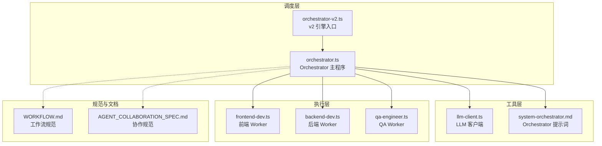
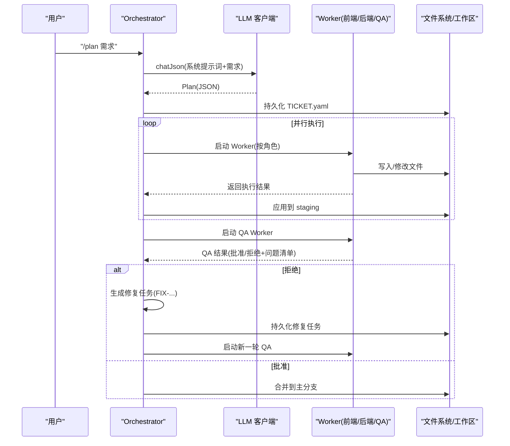
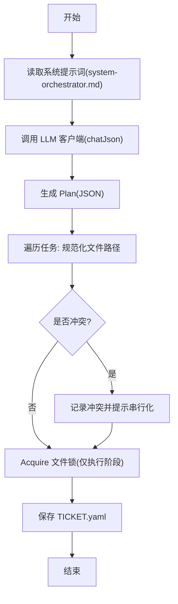
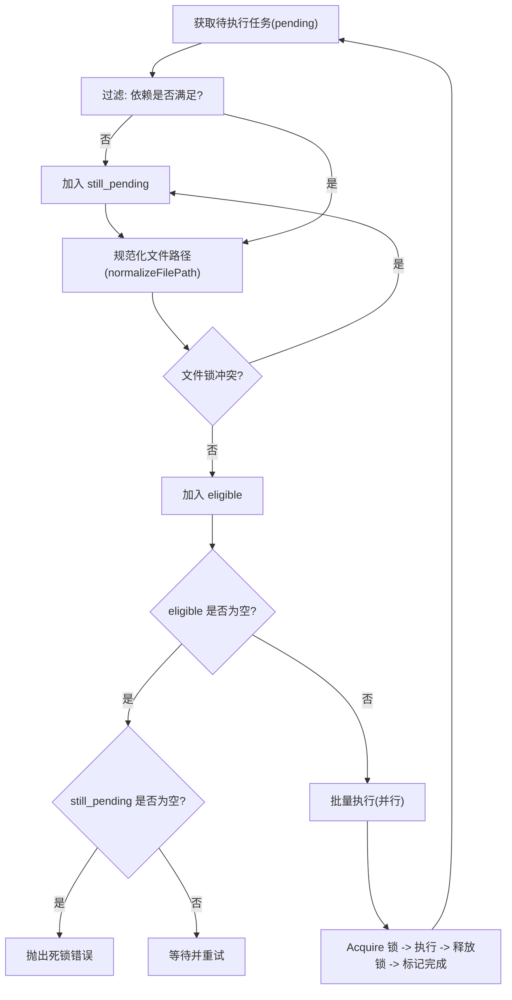
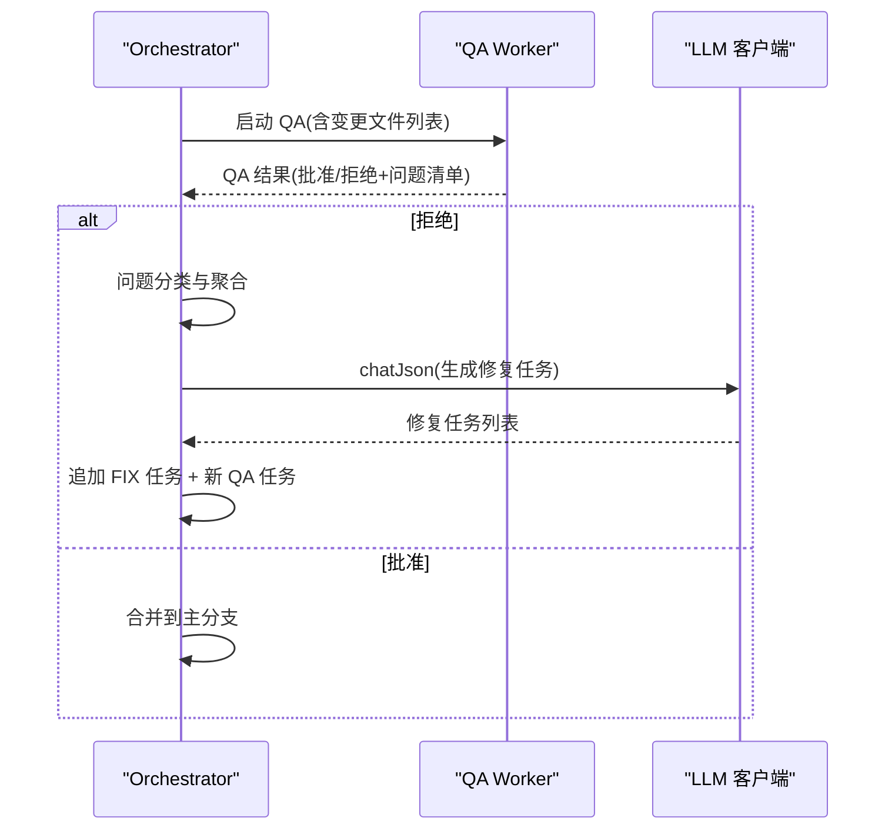
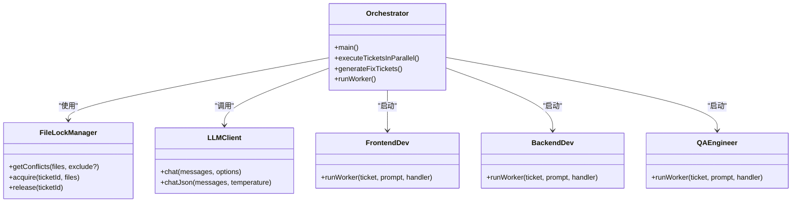
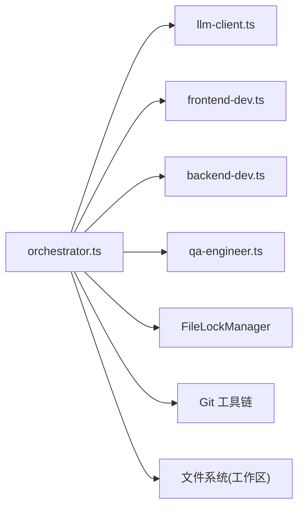

# 任务调度器核心

<cite>
**本文引用的文件**
- [orchestrator.ts](file://AGENTS/orchestrator.ts)
- [orchestrator-v2.ts](file://AGENTS/orchestrator-v2.ts)
- [system-orchestrator.md](file://AGENTS/shared/prompts/system-orchestrator.md)
- [llm-client.ts](file://AGENTS/tools/llm-client.ts)
- [frontend-dev.ts](file://AGENTS/workers/frontend-dev.ts)
- [backend-dev.ts](file://AGENTS/workers/backend-dev.ts)
- [qa-engineer.ts](file://AGENTS/workers/qa-engineer.ts)
- [WORKFLOW.md](file://WORKFLOW.md)
- [AGENT_COLLABORATION_SPEC.md](file://AGENT_COLLABORATION_SPEC.md)
</cite>

## 目录
1. [引言](#引言)
2. [项目结构](#项目结构)
3. [核心组件](#核心组件)
4. [架构总览](#架构总览)
5. [详细组件分析](#详细组件分析)
6. [依赖分析](#依赖分析)
7. [性能考虑](#性能考虑)
8. [故障排查指南](#故障排查指南)
9. [结论](#结论)
10. [附录](#附录)

## 引言
本文面向任务调度器核心组件，聚焦 Orchestrator（蜂后，Tech Lead）的设计理念与实现细节，系统阐述：
- 计划阶段（Plan）：如何通过 LLM 客户端生成结构化任务分解方案，并在生成阶段进行文件冲突预检。
- 并行执行调度：基于依赖关系与文件锁的无冲突并行策略，包含死锁检测与自动串行化。
- 自动修复循环：QA 审查、问题分类与修复任务生成，形成“修复-再审”的闭环。
- 可扩展性与自定义：持久化与恢复、提示词定制、Worker 扩展点、配置项与环境变量。

## 项目结构
围绕 Orchestrator 的核心文件组织如下：
- Orchestrator 主程序：负责计划生成、文件锁、并行调度、自动修复循环与最终合并。
- LLM 客户端：封装 OpenAI 兼容接口，支持 JSON 输出。
- Worker：前端开发、后端开发、QA 工程师三类 Worker，按角色执行具体任务。
- Prompts：系统提示词，约束 Orchestrator 的输出格式与规则。
- 工作流与协作规范：定义任务单、响应与评审流程，支撑调度器的协作契约。

图表来源
- [orchestrator.ts:1-650](file://AGENTS/orchestrator.ts#L1-L650)
- [orchestrator-v2.ts:1-72](file://AGENTS/orchestrator-v2.ts#L1-L72)
- [llm-client.ts:1-86](file://AGENTS/tools/llm-client.ts#L1-L86)
- [system-orchestrator.md:1-46](file://AGENTS/shared/prompts/system-orchestrator.md#L1-L46)
- [frontend-dev.ts:1-46](file://AGENTS/workers/frontend-dev.ts#L1-L46)
- [backend-dev.ts:1-45](file://AGENTS/workers/backend-dev.ts#L1-L45)
- [qa-engineer.ts:1-121](file://AGENTS/workers/qa-engineer.ts#L1-L121)
- [WORKFLOW.md:1-581](file://WORKFLOW.md#L1-L581)
- [AGENT_COLLABORATION_SPEC.md:105-152](file://AGENT_COLLABORATION_SPEC.md#L105-L152)

章节来源
- [orchestrator.ts:1-650](file://AGENTS/orchestrator.ts#L1-L650)
- [WORKFLOW.md:1-145](file://WORKFLOW.md#L1-L145)

## 核心组件
- Orchestrator（蜂后）：Tech Lead，负责需求分析、任务拆解、并行调度、自动修复循环与最终合并。
- LLM 客户端：统一的 OpenAI 兼容接口，支持 JSON 输出，用于计划生成与各 Worker 的推理。
- Worker：前端开发、后端开发、QA 工程师三类执行单元，按角色与依赖关系并行执行。
- 文件锁管理器：在执行阶段检测文件冲突，避免并发修改同一文件导致的冲突。
- YAML/TICKET 持久化：将任务元数据持久化为 TICKET.yaml，支持恢复执行与离线回放。

章节来源
- [orchestrator.ts:275-313](file://AGENTS/orchestrator.ts#L275-L313)
- [llm-client.ts:20-85](file://AGENTS/tools/llm-client.ts#L20-L85)
- [frontend-dev.ts:25-41](file://AGENTS/workers/frontend-dev.ts#L25-L41)
- [backend-dev.ts:25-40](file://AGENTS/workers/backend-dev.ts#L25-L40)
- [qa-engineer.ts:38-120](file://AGENTS/workers/qa-engineer.ts#L38-L120)

## 架构总览
调度器采用“计划-并行-审查-修复-合并”的流水线式架构。Orchestrator 作为中枢，协调 LLM 生成计划、Worker 执行任务、文件锁保障一致性、QA 审查与自动修复循环，最终将变更合并至目标仓库。

图表来源
- [orchestrator.ts:275-431](file://AGENTS/orchestrator.ts#L275-L431)
- [llm-client.ts:73-84](file://AGENTS/tools/llm-client.ts#L73-L84)
- [frontend-dev.ts:25-41](file://AGENTS/workers/frontend-dev.ts#L25-L41)
- [backend-dev.ts:25-40](file://AGENTS/workers/backend-dev.ts#L25-L40)
- [qa-engineer.ts:38-120](file://AGENTS/workers/qa-engineer.ts#L38-L120)

## 详细组件分析

### 计划阶段（Plan）与 LLM 驱动
- 角色与职责：Orchestrator 作为 Tech Lead，接收用户需求，调用 LLM 客户端生成结构化 Plan，包含任务摘要、任务列表与备注。
- 输出规范：Plan 必须包含任务 ID、角色、任务描述、相关文件、约束与依赖关系，且必须包含一个 QA 审查任务。
- 预检与冲突：在生成阶段对 Plan 中的 relevant_files 进行冲突检测，若发现冲突，将在执行阶段通过文件锁自动串行化。
- 持久化与恢复：每个任务在启动前都会保存为 TICKET.yaml，支持 --resume 恢复执行。

图表来源
- [system-orchestrator.md:10-42](file://AGENTS/shared/prompts/system-orchestrator.md#L10-L42)
- [orchestrator.ts:275-313](file://AGENTS/orchestrator.ts#L275-L313)
- [orchestrator.ts:288-301](file://AGENTS/orchestrator.ts#L288-L301)
- [llm-client.ts:73-84](file://AGENTS/tools/llm-client.ts#L73-L84)

章节来源
- [system-orchestrator.md:10-42](file://AGENTS/shared/prompts/system-orchestrator.md#L10-L42)
- [orchestrator.ts:275-313](file://AGENTS/orchestrator.ts#L275-L313)
- [llm-client.ts:73-84](file://AGENTS/tools/llm-client.ts#L73-L84)

### 并行执行调度与文件锁机制
- 依赖检查：仅当任务的所有前置依赖均完成时，才将其纳入可执行集合。
- 文件锁：对 relevant_files 进行冲突检测，若被其他任务占用则等待；执行完成后释放锁。
- 死锁检测：若无可执行任务但仍有待执行任务被锁阻塞，则抛出死锁错误，提示检查 Plan 的文件分配与依赖关系。
- 并行策略：对可执行任务批量启动，使用 Promise.all 并行等待完成，最大化吞吐。

图表来源
- [orchestrator.ts:437-524](file://AGENTS/orchestrator.ts#L437-L524)
- [orchestrator.ts:471-488](file://AGENTS/orchestrator.ts#L471-L488)

章节来源
- [orchestrator.ts:437-524](file://AGENTS/orchestrator.ts#L437-L524)

### 自动修复循环（QA 审查 → 问题分类 → 修复任务生成）
- QA 审查：收集所有变更文件，执行类型检查与单元测试，结合代码审查输出最终结果。
- 问题分类：将 QA 输出的问题按严重级别与文件进行分类。
- 修复任务生成：按原始任务聚合问题，生成 FIX- 前缀的修复任务，设置父任务与重试计数，追加新的 QA 任务进行二次审查。
- 最大重试次数：超过阈值仍未通过则终止并输出问题清单。

图表来源
- [orchestrator.ts:332-420](file://AGENTS/orchestrator.ts#L332-L420)
- [orchestrator.ts:569-634](file://AGENTS/orchestrator.ts#L569-L634)
- [qa-engineer.ts:38-120](file://AGENTS/workers/qa-engineer.ts#L38-L120)
- [llm-client.ts:73-84](file://AGENTS/tools/llm-client.ts#L73-L84)

章节来源
- [orchestrator.ts:332-420](file://AGENTS/orchestrator.ts#L332-L420)
- [orchestrator.ts:569-634](file://AGENTS/orchestrator.ts#L569-L634)
- [qa-engineer.ts:38-120](file://AGENTS/workers/qa-engineer.ts#L38-L120)

### Worker 执行模型
- 前端开发（frontend-dev）：根据任务描述与约束，生成/修改前端文件，写入工作区。
- 后端开发（backend-dev）：根据任务描述与约束，生成/修改后端文件，写入工作区。
- QA 工程师（qa-engineer）：读取相关文件内容，执行类型检查与单元测试，输出审查意见与问题清单。

图表来源
- [orchestrator.ts:246-431](file://AGENTS/orchestrator.ts#L246-L431)
- [orchestrator.ts:210-237](file://AGENTS/orchestrator.ts#L210-L237)
- [llm-client.ts:20-85](file://AGENTS/tools/llm-client.ts#L20-L85)
- [frontend-dev.ts:25-41](file://AGENTS/workers/frontend-dev.ts#L25-L41)
- [backend-dev.ts:25-40](file://AGENTS/workers/backend-dev.ts#L25-L40)
- [qa-engineer.ts:38-120](file://AGENTS/workers/qa-engineer.ts#L38-L120)

章节来源
- [frontend-dev.ts:25-41](file://AGENTS/workers/frontend-dev.ts#L25-L41)
- [backend-dev.ts:25-40](file://AGENTS/workers/backend-dev.ts#L25-L40)
- [qa-engineer.ts:38-120](file://AGENTS/workers/qa-engineer.ts#L38-L120)

### v2 引擎与工作流引擎（可选）
- v2 版本通过 WorkflowEngine 抽象，将执行、存储、事件总线与进程执行器解耦，便于扩展与测试。
- 支持会话创建、恢复与回调钩子（如任务完成时应用变更到 staging）。

章节来源
- [orchestrator-v2.ts:19-66](file://AGENTS/orchestrator-v2.ts#L19-L66)

## 依赖分析
- 组件耦合
  - Orchestrator 与 LLM 客户端：强耦合（计划生成依赖 JSON 输出）。
  - Orchestrator 与 Worker：弱耦合（通过文件系统与命令行交互）。
  - Orchestrator 与文件锁：强耦合（执行阶段一致性保障）。
- 外部依赖
  - LLM API：DashScope（可配置）。
  - Git 工具链：初始化 staging 分支、应用补丁、合并主分支。
  - 文件系统：工作区目录、TICKET.yaml、result.json。

图表来源
- [orchestrator.ts:20-22](file://AGENTS/orchestrator.ts#L20-L22)
- [orchestrator.ts:210-237](file://AGENTS/orchestrator.ts#L210-L237)
- [llm-client.ts:25-33](file://AGENTS/tools/llm-client.ts#L25-L33)

章节来源
- [orchestrator.ts:20-22](file://AGENTS/orchestrator.ts#L20-L22)
- [llm-client.ts:25-33](file://AGENTS/tools/llm-client.ts#L25-L33)

## 性能考虑
- 并行度：并行执行可显著缩短整体时长，但需平衡 CPU/IO 与 LLM 调用频率。
- 文件锁粒度：按文件粒度锁定，避免过度串行化；建议在 Plan 阶段尽量减少文件重叠。
- LLM 成本：JSON 输出与温度参数影响 token 消耗；可调整温度与提示词长度以平衡质量与成本。
- 存储与 I/O：频繁写入工作区与应用补丁可能成为瓶颈，建议在磁盘与网络带宽允许范围内规划并发。

## 故障排查指南
- LLM API 错误
  - 现象：调用 LLM 返回错误或无 choices。
  - 排查：确认 LLM_API_KEY、LLM_BASE_URL、LLM_MODEL 环境变量；检查网络连通性。
  - 参考
    - [llm-client.ts:35-68](file://AGENTS/tools/llm-client.ts#L35-L68)
- 死锁
  - 现象：所有待执行任务都被文件锁阻塞。
  - 排查：检查 Plan 中 relevant_files 是否存在循环依赖或过度重叠；必要时拆分任务。
  - 参考
    - [orchestrator.ts:471-488](file://AGENTS/orchestrator.ts#L471-L488)
- QA 拒绝且无法生成修复任务
  - 现象：QA 输出问题但无法映射到具体任务。
  - 排查：确认 QA 输出的文件路径与工作区文件一致；检查文件到任务的映射逻辑。
  - 参考
    - [orchestrator.ts:569-634](file://AGENTS/orchestrator.ts#L569-L634)
- 测试失败但 LLM 仍批准
  - 现象：自动化测试失败，但 LLM 返回 approved。
  - 处理：强制将状态改为 rejected，并补充 critical 问题。
  - 参考
    - [qa-engineer.ts:105-116](file://AGENTS/workers/qa-engineer.ts#L105-L116)

章节来源
- [llm-client.ts:35-68](file://AGENTS/tools/llm-client.ts#L35-L68)
- [orchestrator.ts:471-488](file://AGENTS/orchestrator.ts#L471-L488)
- [orchestrator.ts:569-634](file://AGENTS/orchestrator.ts#L569-L634)
- [qa-engineer.ts:105-116](file://AGENTS/workers/qa-engineer.ts#L105-L116)

## 结论
本文档系统梳理了 Orchestrator 的设计与实现，重点覆盖计划生成、文件锁与并行调度、自动修复循环与持久化恢复。通过明确的角色分工、严格的依赖与文件锁约束、以及 QA 驱动的闭环修复，调度器实现了高效、可靠且可扩展的任务编排。建议在实际使用中：
- 在 Plan 阶段充分考虑文件分布与依赖，减少冲突与串行化。
- 通过提示词与约束细化任务边界，提升 LLM 输出质量。
- 借助 TICKET.yaml 与恢复机制，保障中断后的连续性。

## 附录

### 配置与环境变量
- LLM 相关
  - LLM_API_KEY：必需，LLM 访问密钥。
  - LLM_BASE_URL：可选，默认 DashScope 兼容模式地址。
  - LLM_MODEL：可选，默认模型名称。
  - 参考
    - [llm-client.ts:25-33](file://AGENTS/tools/llm-client.ts#L25-L33)
- Orchestrator 行为
  - TARGET_REPO：目标仓库路径，默认指向根目录下的 apps。
  - RESUME_TICKET_ID：恢复执行时指定的 Ticket ID。
  - 参考
    - [orchestrator.ts:26](file://AGENTS/orchestrator.ts#L26)
    - [orchestrator.ts:248-249](file://AGENTS/orchestrator.ts#L248-L249)

### 关键流程图（再次呈现）
- 计划生成与冲突预检
  - [orchestrator.ts:275-313](file://AGENTS/orchestrator.ts#L275-L313)
  - [system-orchestrator.md:10-42](file://AGENTS/shared/prompts/system-orchestrator.md#L10-L42)
- 并行执行与死锁检测
  - [orchestrator.ts:437-524](file://AGENTS/orchestrator.ts#L437-L524)
- 自动修复循环
  - [orchestrator.ts:332-420](file://AGENTS/orchestrator.ts#L332-L420)
  - [orchestrator.ts:569-634](file://AGENTS/orchestrator.ts#L569-L634)