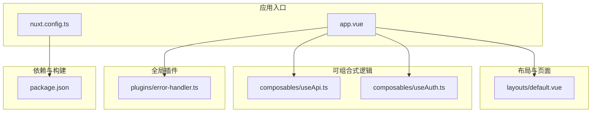
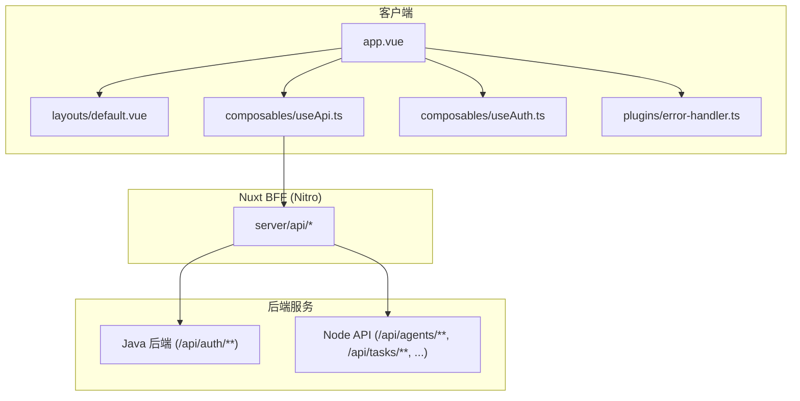
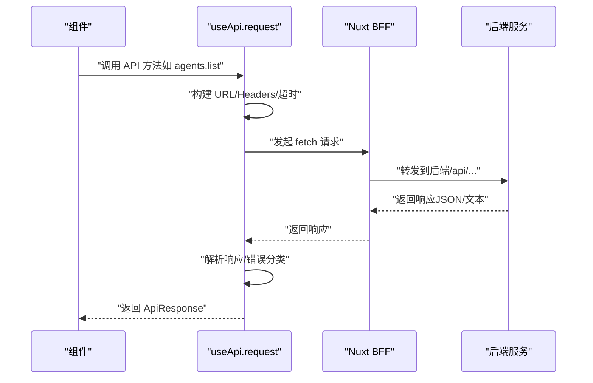
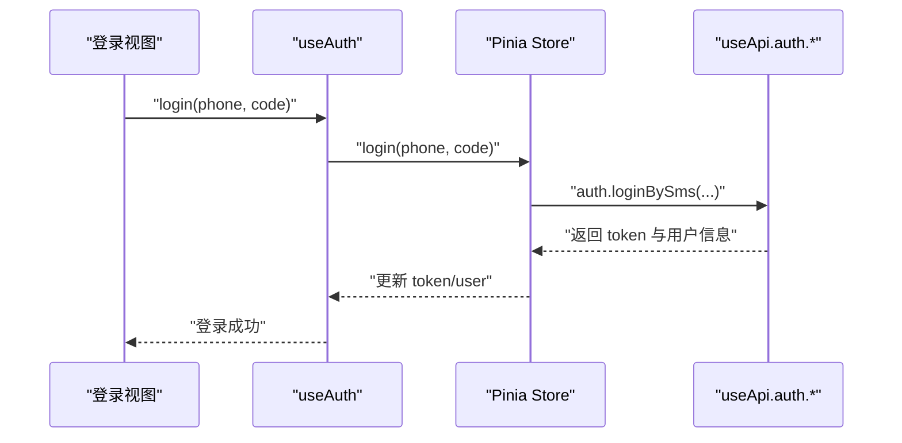
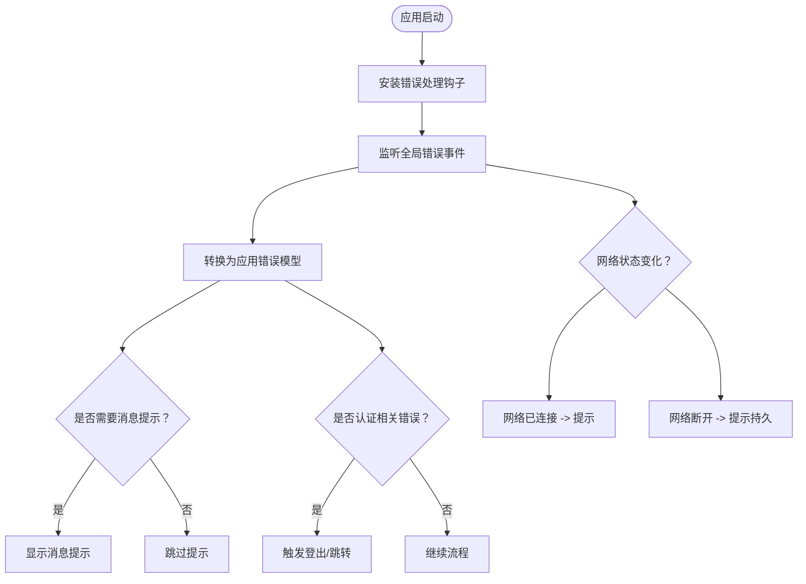
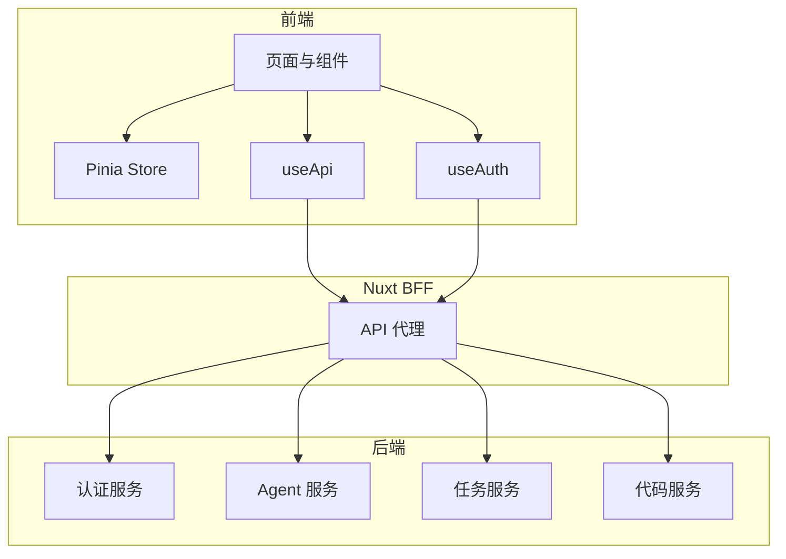
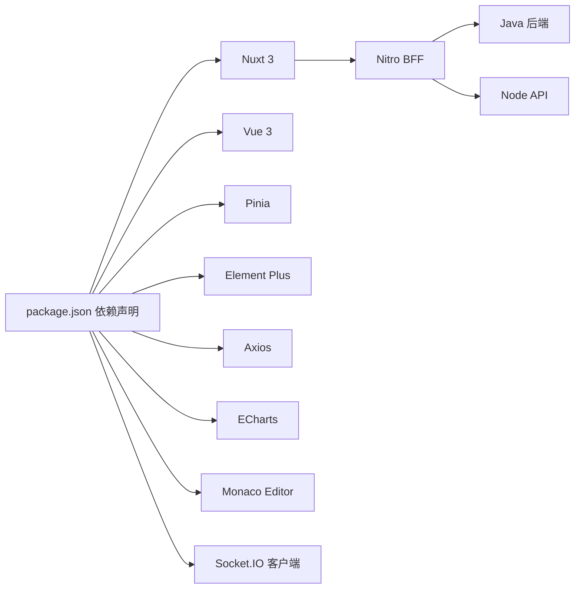

# Web 控制台应用

<cite>
**本文档引用的文件**
- [nuxt.config.ts](file://apps/landing/nuxt.config.ts)
- [package.json](file://apps/landing/package.json)
- [app.vue](file://apps/landing/app.vue)
- [default.vue](file://apps/landing/layouts/default.vue)
- [useApi.ts](file://apps/landing/composables/useApi.ts)
- [useAuth.ts](file://apps/landing/composables/useAuth.ts)
- [error-handler.ts](file://apps/landing/plugins/error-handler.ts)
</cite>

## 目录
1. [简介](#简介)
2. [项目结构](#项目结构)
3. [核心组件](#核心组件)
4. [架构总览](#架构总览)
5. [详细组件分析](#详细组件分析)
6. [依赖关系分析](#依赖关系分析)
7. [性能考虑](#性能考虑)
8. [故障排查指南](#故障排查指南)
9. [结论](#结论)
10. [附录](#附录)

## 简介
本项目为基于 Nuxt 3 + Vue 3 的 Web 控制台前端应用，采用模块化架构与组合式 API 设计，提供统一的 API 访问层、认证与鉴权、全局错误处理以及现代化的 UI 交互体验。应用通过 Pinia 进行状态管理，结合 Element Plus、ECharts、Monaco Editor 等生态组件，支撑 Agent 配置中心、工作流可视化编辑器与实时监控面板等核心功能模块。

## 项目结构
前端应用位于 apps/landing，采用 Nuxt 3 的约定式路由与分层目录组织，关键目录与职责如下：
- app.vue：根组件，承载全局布局与页面切换动画
- layouts/default.vue：默认布局，负责页面主体与页脚
- composables：可复用逻辑（API、认证、加载状态等）
- plugins：全局插件（错误处理、第三方集成等）
- vite-plugins：Vite 构建期插件（ESM/CJS 兼容）
- server：Nuxt BFF 层（Nitro），用于 API 代理与服务端逻辑
- stores：Pinia 状态管理（认证、聊天、工作区等）
- types：共享类型定义
- utils：工具库（错误处理、本地存储、国际化等）

**图表来源**
- [app.vue:1-76](file://apps/landing/app.vue#L1-L76)
- [nuxt.config.ts:1-146](file://apps/landing/nuxt.config.ts#L1-L146)
- [useApi.ts:1-794](file://apps/landing/composables/useApi.ts#L1-L794)
- [useAuth.ts:1-82](file://apps/landing/composables/useAuth.ts#L1-L82)
- [error-handler.ts:1-217](file://apps/landing/plugins/error-handler.ts#L1-L217)
- [package.json:1-58](file://apps/landing/package.json#L1-L58)

**章节来源**
- [nuxt.config.ts:1-146](file://apps/landing/nuxt.config.ts#L1-L146)
- [package.json:1-58](file://apps/landing/package.json#L1-L58)
- [app.vue:1-76](file://apps/landing/app.vue#L1-L76)
- [default.vue:1-16](file://apps/landing/layouts/default.vue#L1-L16)

## 核心组件
本节聚焦于前端架构中的三大核心能力：统一 API 访问层、认证与鉴权、全局错误处理。

- 统一 API 访问层（useApi）
  - 提供统一的请求封装、超时控制、JSON/文本响应解析、业务错误与 HTTP 错误分离处理
  - 内置分页参数、请求头注入（含 Authorization）、静默模式与全局 Loading 控制
  - 按业务域划分 API 命名空间：auth、agents、tasks、chat、code、credits
  - 提供 useApiRequest 辅助 Hook，简化组件内请求与状态管理

- 认证与鉴权（useAuth）
  - 基于 Pinia Store 统一管理 token 与用户信息，提供只读访问与方法委托
  - 支持短信登录、用户名密码登录、登出、刷新用户信息等
  - 与 useApi 协作，自动注入 Authorization 头

- 全局错误处理（plugins/error-handler）
  - 捕获 Vue 渲染错误、应用启动错误、未处理 Promise 拒绝、网络状态变化
  - 将错误转换为统一的应用错误模型，支持消息提示与认证跳转
  - 提供错误上报接口，便于接入错误监控服务

**章节来源**
- [useApi.ts:253-733](file://apps/landing/composables/useApi.ts#L253-L733)
- [useAuth.ts:6-81](file://apps/landing/composables/useAuth.ts#L6-L81)
- [error-handler.ts:15-216](file://apps/landing/plugins/error-handler.ts#L15-L216)

## 架构总览
前端采用“根组件 + 布局 + 可组合式逻辑 + 全局插件”的分层架构，配合 Nuxt BFF（Nitro）实现 API 代理与服务端逻辑，形成前后端一体化的开发体验。

**图表来源**
- [app.vue:1-76](file://apps/landing/app.vue#L1-L76)
- [default.vue:1-16](file://apps/landing/layouts/default.vue#L1-L16)
- [useApi.ts:253-733](file://apps/landing/composables/useApi.ts#L253-L733)
- [nuxt.config.ts:125-136](file://apps/landing/nuxt.config.ts#L125-L136)

**章节来源**
- [nuxt.config.ts:125-136](file://apps/landing/nuxt.config.ts#L125-L136)

## 详细组件分析

### 组件 A：统一 API 访问层（useApi）
- 设计模式
  - 组合式函数 + 命名空间 API：将不同业务域的请求封装为独立命名空间，提升可维护性
  - 请求中间件：统一注入 Authorization、超时控制、静默模式、全局 Loading
  - 错误处理：区分 HTTP 错误与业务错误，支持认证过期提示
- 数据结构与复杂度
  - 请求参数与响应结构采用泛型约束，保证类型安全
  - 分页查询通过请求头传递参数，避免 URL 过长与缓存污染
- 性能与优化
  - 使用 AbortController 控制请求超时，避免内存泄漏
  - 通过 useApiRequest Hook 减少重复样板代码，提升开发效率
- 错误处理
  - 网络错误、超时错误、未知错误均有明确分类与提示
  - 401 认证错误可触发登出逻辑，保障安全性

**图表来源**
- [useApi.ts:320-459](file://apps/landing/composables/useApi.ts#L320-L459)
- [nuxt.config.ts:125-136](file://apps/landing/nuxt.config.ts#L125-L136)

**章节来源**
- [useApi.ts:253-733](file://apps/landing/composables/useApi.ts#L253-L733)

### 组件 B：认证与鉴权（useAuth）
- 设计模式
  - 方法委托：将具体登录、登出、刷新等操作委托给 Pinia Store，保持状态一致性
  - 只读暴露：对外仅暴露只读引用，防止外部直接修改状态
- 数据流
  - 登录成功后写入 token 与用户信息，后续请求自动注入 Authorization
  - 支持刷新用户信息与登出清理
- 错误处理
  - 与全局错误处理插件协同，统一处理认证相关的异常

**图表来源**
- [useAuth.ts:25-50](file://apps/landing/composables/useAuth.ts#L25-L50)
- [useApi.ts:480-505](file://apps/landing/composables/useApi.ts#L480-L505)

**章节来源**
- [useAuth.ts:6-81](file://apps/landing/composables/useAuth.ts#L6-L81)
- [useApi.ts:480-505](file://apps/landing/composables/useApi.ts#L480-L505)

### 组件 C：全局错误处理（plugins/error-handler）
- 设计模式
  - 插件钩子：利用 Nuxt 生命周期钩子处理 Vue 渲染错误、应用启动错误
  - 事件监听：监听 window.error、unhandledrejection、online/offline 等事件
  - 工具函数：提供错误转换、消息提示、认证跳转与错误上报
- 错误分类
  - Vue 渲染错误、应用启动错误、网络错误、资源加载错误、未处理 Promise 拒绝
- 用户体验
  - 网络断开/恢复提示，避免重复消息
  - 开发环境增强日志输出，便于定位问题

**图表来源**
- [error-handler.ts:15-216](file://apps/landing/plugins/error-handler.ts#L15-L216)

**章节来源**
- [error-handler.ts:15-216](file://apps/landing/plugins/error-handler.ts#L15-L216)

### 概念性概览
以下为概念性流程图，展示前端与后端的整体协作方式，不对应具体源码文件。

[此图为概念性示意，无需图表来源]

## 依赖关系分析
- 构建与运行时
  - Nuxt 3、Vue 3、Pinia、@vueuse、@nuxtjs/tailwindcss
  - Axios、Element Plus、ECharts、Monaco Editor、Socket.IO 客户端
- 开发与测试
  - Vitest、Playwright、TypeScript、Vue TSC
- 关键依赖特性
  - ESM/CJS 混合模块兼容（dayjs、element-plus 等），通过 Vite 插件与 optimizeDeps 配置解决
  - Nitro BFF 代理开发环境 API 请求，统一走 /api 前缀

**图表来源**
- [package.json:18-46](file://apps/landing/package.json#L18-L46)
- [nuxt.config.ts:77-110](file://apps/landing/nuxt.config.ts#L77-L110)

**章节来源**
- [package.json:1-58](file://apps/landing/package.json#L1-L58)
- [nuxt.config.ts:77-110](file://apps/landing/nuxt.config.ts#L77-L110)

## 性能考虑
- 构建与加载
  - 通过 optimizeDeps 排除 dayjs，交由 ESM 插件处理，减少预构建开销
  - commonjsOptions.transformMixedEsModules=true，确保混合模块正确打包
- 请求与缓存
  - 使用 AbortController 控制超时，避免长时间挂起
  - 分页查询通过请求头传递参数，降低 URL 缓存风险
- 交互与体验
  - 全局 Loading 计数器确保并发请求结束后再关闭，避免闪烁
  - 页面与布局过渡动画平滑，提升感知性能

[本节为通用指导，无需章节来源]

## 故障排查指南
- 认证相关
  - 401 错误：检查 token 是否存在与有效；必要时触发刷新或登出
  - 登录失败：确认短信/用户名密码参数与后端契约一致
- 网络与超时
  - 超时错误：检查网络状况与后端响应时间；适当调整超时配置
  - 网络断开：关注 offline/online 事件处理，确保提示与恢复逻辑正常
- 错误上报
  - 使用 provide 的 reportError 接口收集上下文信息，便于定位问题

**章节来源**
- [useApi.ts:378-452](file://apps/landing/composables/useApi.ts#L378-L452)
- [error-handler.ts:99-149](file://apps/landing/plugins/error-handler.ts#L99-L149)

## 结论
本前端应用通过清晰的分层架构与可组合式逻辑，实现了统一的 API 访问、完善的认证体系与健壮的错误处理机制。配合 Nuxt BFF 与现代化 UI 组件，能够高效支撑 Agent 配置中心、工作流可视化编辑器与实时监控面板等核心功能模块。建议在后续迭代中持续完善类型约束、错误监控与性能观测，进一步提升稳定性与可维护性。

[本节为总结性内容，无需章节来源]

## 附录
- 组件开发指南
  - 使用 useApiRequest 简化请求与状态管理
  - 在组件内通过 useAuth 获取只读 token 与用户信息
  - 全局错误通过插件自动处理，必要时使用 provide 的 handleError
- 样式定制与响应式设计
  - 基于 Tailwind CSS 与 Element Plus 主题变量进行定制
  - 使用布局过渡与页面过渡提升交互体验
- 调试技巧
  - 开启 DevTools 观察组件树与状态变更
  - 利用浏览器网络面板与控制台日志定位问题
- 性能优化建议
  - 合理使用懒加载与虚拟列表
  - 控制并发请求数量，避免过度渲染
  - 使用浏览器缓存与 CDN 加速静态资源

[本节为通用指导，无需章节来源]