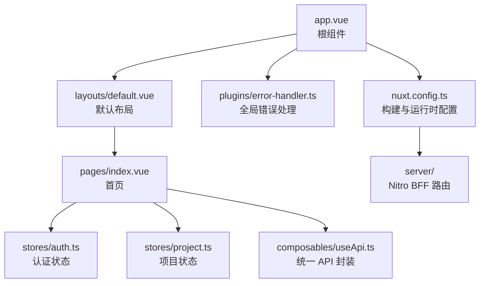
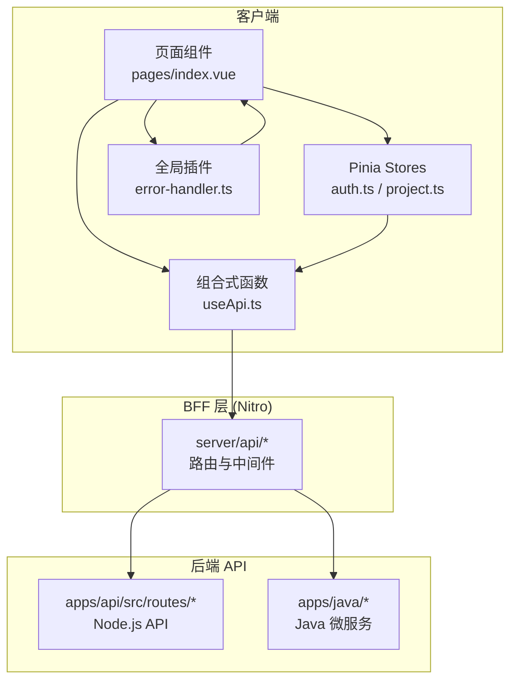
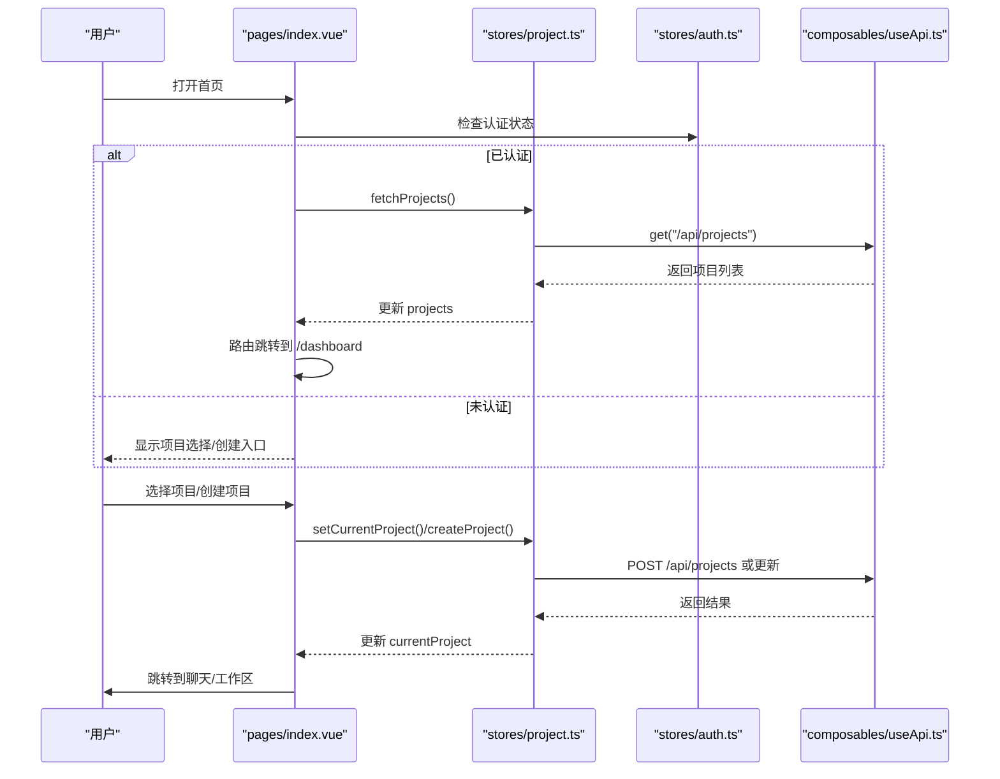
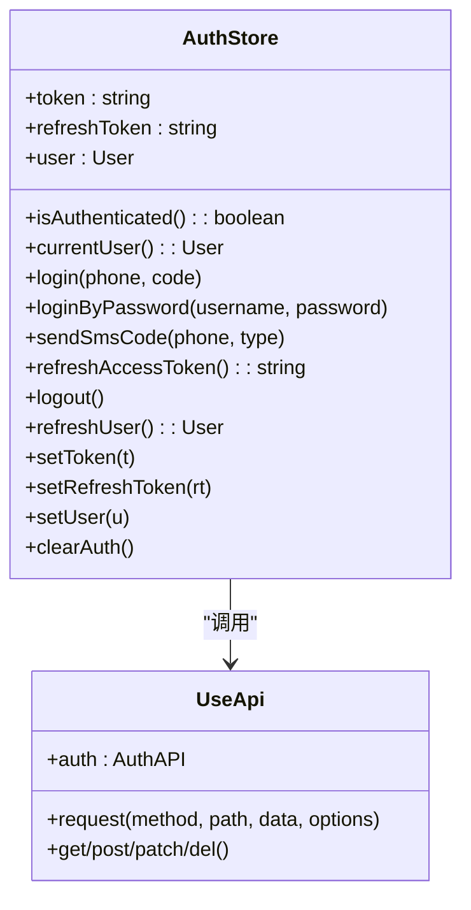
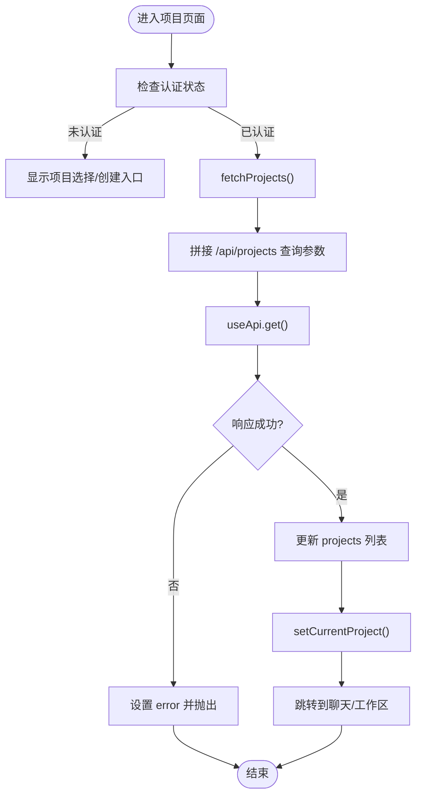
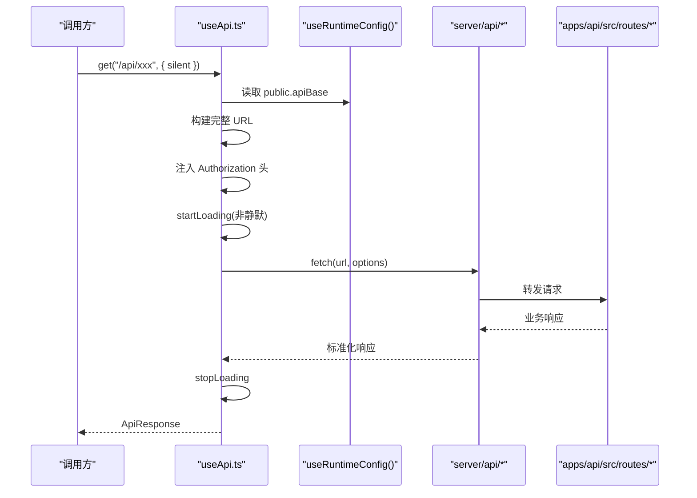
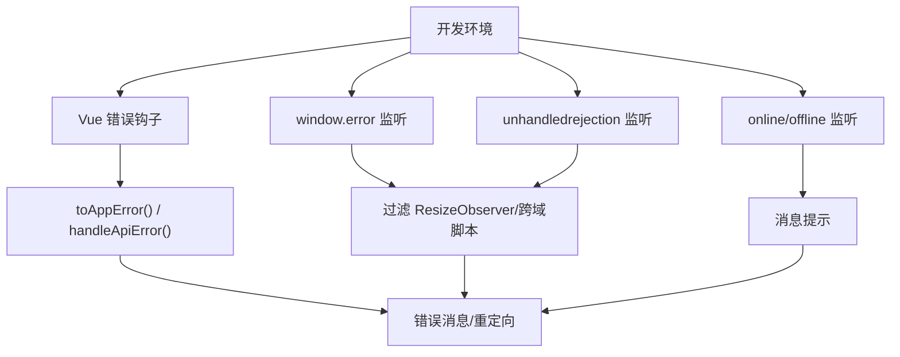
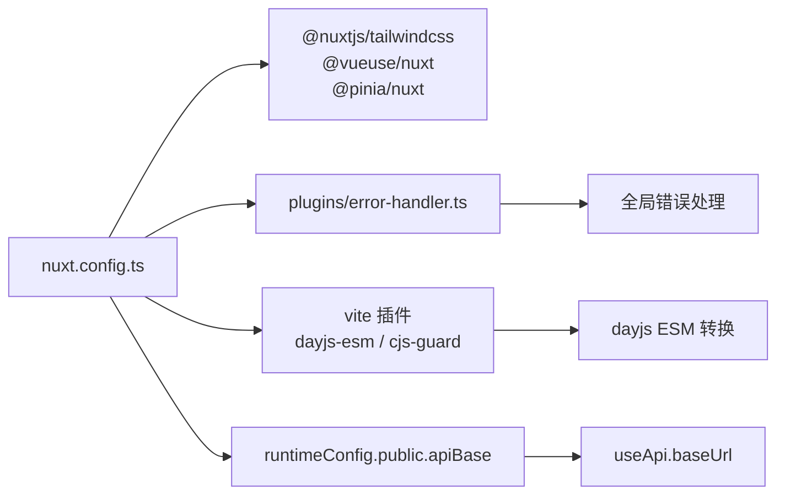

# 前端架构设计

<cite>
**本文引用的文件**
- [nuxt.config.ts](file://apps/landing/nuxt.config.ts)
- [package.json](file://apps/landing/package.json)
- [tsconfig.json](file://apps/landing/tsconfig.json)
- [app.vue](file://apps/landing/app.vue)
- [layouts/default.vue](file://apps/landing/layouts/default.vue)
- [pages/index.vue](file://apps/landing/pages/index.vue)
- [stores/auth.ts](file://apps/landing/stores/auth.ts)
- [stores/project.ts](file://apps/landing/stores/project.ts)
- [composables/useApi.ts](file://apps/landing/composables/useApi.ts)
- [plugins/error-handler.ts](file://apps/landing/plugins/error-handler.ts)
</cite>

## 目录
1. [简介](#简介)
2. [项目结构](#项目结构)
3. [核心组件](#核心组件)
4. [架构总览](#架构总览)
5. [详细组件分析](#详细组件分析)
6. [依赖关系分析](#依赖关系分析)
7. [性能考虑](#性能考虑)
8. [故障排查指南](#故障排查指南)
9. [结论](#结论)
10. [附录](#附录)

## 简介
本文件面向基于 Nuxt 3 + Vue 3 的现代化前端架构，聚焦 AgentHive Cloud 的 Landing 应用。文档涵盖项目结构组织、模块化设计、构建配置、自动导入、路由生成、服务端渲染与静态生成、TypeScript 集成、ESLint 配置现状、代码规范建议、构建优化策略（代码分割、懒加载、性能优化）、开发环境配置（热重载、调试工具）、以及与后端 API 的集成架构与数据流设计。

## 项目结构
Landing 应用采用 Nuxt 3 的约定式路由与模块化目录结构，关键目录与职责如下：
- app.vue：根组件，承载全局布局与页面容器
- layouts/：布局模板，如 default.vue
- pages/：页面级组件，按路由约定自动生成
- components/：可复用组件
- composables/：组合式函数（含 useApi、useAuth 等）
- stores/：Pinia 状态管理（如 auth、project）
- plugins/：Nuxt 插件（如全局错误处理）
- server/：Nitro 服务端路由与中间件（BFF 层）
- utils/：工具函数
- vite-plugins/：Vite 插件（如 dayjs ESM 转换）
- 公共配置：nuxt.config.ts、package.json、tsconfig.json

图表来源
- [app.vue:1-76](file://apps/landing/app.vue#L1-L76)
- [layouts/default.vue:1-16](file://apps/landing/layouts/default.vue#L1-L16)
- [pages/index.vue:1-408](file://apps/landing/pages/index.vue#L1-L408)
- [stores/auth.ts:1-163](file://apps/landing/stores/auth.ts#L1-L163)
- [stores/project.ts:1-377](file://apps/landing/stores/project.ts#L1-L377)
- [composables/useApi.ts:1-794](file://apps/landing/composables/useApi.ts#L1-L794)
- [plugins/error-handler.ts:1-217](file://apps/landing/plugins/error-handler.ts#L1-L217)
- [nuxt.config.ts:1-146](file://apps/landing/nuxt.config.ts#L1-L146)

章节来源
- [nuxt.config.ts:1-146](file://apps/landing/nuxt.config.ts#L1-L146)
- [package.json:1-58](file://apps/landing/package.json#L1-L58)
- [tsconfig.json:1-8](file://apps/landing/tsconfig.json#L1-L8)
- [app.vue:1-76](file://apps/landing/app.vue#L1-L76)

## 核心组件
- 根组件与全局样式：app.vue 负责全局样式引入与 SEO 元数据注入，并通过 NuxtLayout/NuxtPage 组织页面与布局。
- 默认布局：default.vue 提供基础页面骨架与页脚挂载点。
- 首页页面：index.vue 负责项目选择、创建与跳转，整合认证与项目状态管理。
- 状态管理：Pinia stores 提供认证与项目数据的集中管理，并持久化关键状态。
- API 封装：useApi 统一处理请求、鉴权、超时、错误与响应格式。
- 全局错误处理：error-handler 插件负责 Vue 错误、Promise 拒绝、网络状态与资源加载错误的统一处理。

章节来源
- [app.vue:1-76](file://apps/landing/app.vue#L1-L76)
- [layouts/default.vue:1-16](file://apps/landing/layouts/default.vue#L1-L16)
- [pages/index.vue:1-408](file://apps/landing/pages/index.vue#L1-L408)
- [stores/auth.ts:1-163](file://apps/landing/stores/auth.ts#L1-L163)
- [stores/project.ts:1-377](file://apps/landing/stores/project.ts#L1-L377)
- [composables/useApi.ts:1-794](file://apps/landing/composables/useApi.ts#L1-L794)
- [plugins/error-handler.ts:1-217](file://apps/landing/plugins/error-handler.ts#L1-L217)

## 架构总览
前端采用“组件 + 组合式函数 + 状态管理 + 插件 + BFF”的分层架构：
- 组件层：页面与可复用组件
- 组合式层：useApi、useAuth 等封装通用能力
- 状态层：Pinia stores 管理认证与业务状态
- 插件层：全局错误处理、SEO、性能与兼容性增强
- BFF 层：Nitro server 路由，统一代理与格式转换

图表来源
- [pages/index.vue:1-408](file://apps/landing/pages/index.vue#L1-L408)
- [stores/auth.ts:1-163](file://apps/landing/stores/auth.ts#L1-L163)
- [stores/project.ts:1-377](file://apps/landing/stores/project.ts#L1-L377)
- [composables/useApi.ts:1-794](file://apps/landing/composables/useApi.ts#L1-L794)
- [plugins/error-handler.ts:1-217](file://apps/landing/plugins/error-handler.ts#L1-L217)
- [nuxt.config.ts:125-136](file://apps/landing/nuxt.config.ts#L125-L136)

## 详细组件分析

### 组件 A：首页页面（项目选择与创建）
- 功能要点
  - 项目列表展示与筛选
  - 项目搜索与最近项目展示
  - 两种创建方式：需求描述自动生成与手动填写
  - 选择项目后跳转至聊天或工作区
- 关键交互
  - 认证状态判断与路由跳转
  - 项目状态管理与会话加载
  - 全局消息提示与加载态

图表来源
- [pages/index.vue:151-179](file://apps/landing/pages/index.vue#L151-L179)
- [stores/project.ts:146-246](file://apps/landing/stores/project.ts#L146-L246)
- [stores/auth.ts:31-48](file://apps/landing/stores/auth.ts#L31-L48)
- [composables/useApi.ts:463-477](file://apps/landing/composables/useApi.ts#L463-L477)

章节来源
- [pages/index.vue:1-408](file://apps/landing/pages/index.vue#L1-L408)
- [stores/project.ts:1-377](file://apps/landing/stores/project.ts#L1-L377)
- [stores/auth.ts:1-163](file://apps/landing/stores/auth.ts#L1-L163)
- [composables/useApi.ts:1-794](file://apps/landing/composables/useApi.ts#L1-L794)

### 组件 B：认证状态管理（Pinia）
- 能力概览
  - 登录/登出/刷新令牌
  - 用户信息获取与缓存
  - 本地存储持久化
- 设计要点
  - 与 useApi 协作，自动注入 Authorization 头
  - 支持短信登录与密码登录
  - 刷新令牌失败时清理本地状态

图表来源
- [stores/auth.ts:1-163](file://apps/landing/stores/auth.ts#L1-L163)
- [composables/useApi.ts:480-505](file://apps/landing/composables/useApi.ts#L480-L505)

章节来源
- [stores/auth.ts:1-163](file://apps/landing/stores/auth.ts#L1-L163)
- [composables/useApi.ts:1-794](file://apps/landing/composables/useApi.ts#L1-L794)

### 组件 C：项目状态管理（Pinia）
- 能力概览
  - 项目列表分页与过滤
  - 当前项目选择与同步
  - 项目 CRUD 操作
  - 视图模式与分页参数持久化
- 设计要点
  - 与 useApi 协作，统一处理分页查询参数
  - getter 实现过滤与分页计算，减少重复逻辑

图表来源
- [stores/project.ts:146-182](file://apps/landing/stores/project.ts#L146-L182)
- [composables/useApi.ts:463-477](file://apps/landing/composables/useApi.ts#L463-L477)

章节来源
- [stores/project.ts:1-377](file://apps/landing/stores/project.ts#L1-L377)
- [composables/useApi.ts:1-794](file://apps/landing/composables/useApi.ts#L1-L794)

### 组件 D：统一 API 封装（useApi）
- 能力概览
  - 统一请求头（Content-Type、Authorization、Accept）
  - URL 构建与 BFF 代理支持
  - 超时控制与错误分类
  - 全局 loading 管理
  - 业务模块化 API：auth、agents、tasks、chat、code、credits
- 设计要点
  - 支持相对路径 /api，由 Nitro server/api 统一代理
  - 支持生产环境通过运行时配置覆盖 apiBase
  - 静默模式与自定义 loading 文本

图表来源
- [composables/useApi.ts:253-477](file://apps/landing/composables/useApi.ts#L253-L477)
- [nuxt.config.ts:118-123](file://apps/landing/nuxt.config.ts#L118-L123)
- [nuxt.config.ts:125-136](file://apps/landing/nuxt.config.ts#L125-L136)

章节来源
- [composables/useApi.ts:1-794](file://apps/landing/composables/useApi.ts#L1-L794)
- [nuxt.config.ts:1-146](file://apps/landing/nuxt.config.ts#L1-L146)

### 组件 E：全局错误处理插件
- 能力概览
  - Vue 渲染错误与应用错误钩子
  - 全局 window.error/unhandledrejection 监听
  - 网络状态在线/离线提示
  - 资源加载错误检测
  - 错误上报与转换工具提供

图表来源
- [plugins/error-handler.ts:15-217](file://apps/landing/plugins/error-handler.ts#L15-L217)

章节来源
- [plugins/error-handler.ts:1-217](file://apps/landing/plugins/error-handler.ts#L1-L217)

## 依赖关系分析
- 模块与插件
  - TailwindCSS、VueUse、Pinia：通过 modules 配置启用
  - 自定义插件：全局错误处理
- 构建与运行时
  - Vite 插件：dayjs ESM 转换、CJS Guard
  - 依赖预构建：element-plus（ESM），排除 dayjs（通过插件处理）
  - 运行时配置：public.apiBase 作为 API 基础地址
- 路由与页面
  - pages 下的文件按约定生成路由
  - layouts/default.vue 作为默认布局

图表来源
- [nuxt.config.ts:12-145](file://apps/landing/nuxt.config.ts#L12-L145)
- [plugins/error-handler.ts:1-217](file://apps/landing/plugins/error-handler.ts#L1-L217)
- [composables/useApi.ts:253-261](file://apps/landing/composables/useApi.ts#L253-L261)

章节来源
- [nuxt.config.ts:1-146](file://apps/landing/nuxt.config.ts#L1-L146)
- [package.json:1-58](file://apps/landing/package.json#L1-L58)

## 性能考虑
- 代码分割与懒加载
  - Nuxt 3 默认按页面拆分包；建议将大组件与第三方库在组件内部动态导入，进一步提升首屏性能
- 构建优化
  - Vite optimizeDeps 排除 dayjs，避免重复预构建；保留 element-plus 以确保 ESM 正常打包
  - commonjsOptions.transformMixedEsModules=true，保证混合模块正确打包
- 图片与字体
  - 预连接 fonts.googleapis.com 与 gstatic.com，减少阻塞
- 运行时
  - 全局 loading 与错误提示减少不必要的重绘与闪烁
  - 本地存储持久化减少重复请求

章节来源
- [nuxt.config.ts:76-110](file://apps/landing/nuxt.config.ts#L76-L110)
- [app.vue:17-31](file://apps/landing/app.vue#L17-L31)

## 故障排查指南
- 开发模式热更新问题
  - 禁用 experimental.appManifest，避免热更新异常
- CJS/ESM 混合模块
  - 使用 dayjs-esm 插件进行 UMD→ESM 转换；CJS Guard 在 dev 模式下预警未预构建的 CJS 模块
- API 代理与 BFF
  - dev 环境可通过 nitro.devProxy 统一代理 /api；若需 BFF 生效请保持注释开启
- 错误处理
  - 全局错误插件会过滤常见良性错误（如 ResizeObserver 循环），并对认证错误进行提示
  - 网络断开时提供持续提示，恢复后自动关闭

章节来源
- [nuxt.config.ts:138-144](file://apps/landing/nuxt.config.ts#L138-L144)
- [nuxt.config.ts:125-136](file://apps/landing/nuxt.config.ts#L125-L136)
- [plugins/error-handler.ts:79-126](file://apps/landing/plugins/error-handler.ts#L79-L126)

## 结论
该前端架构以 Nuxt 3 为核心，结合 Pinia、组合式函数与插件体系，实现了清晰的分层与高内聚低耦合的设计。通过统一的 API 封装与 BFF 代理，前后端协作顺畅；通过全局错误处理与性能优化策略，提升了开发体验与用户体验。建议后续完善 ESLint 配置与测试覆盖率，持续优化代码质量与稳定性。

## 附录

### 开发环境配置与脚本
- 开发：nuxt dev
- 构建：nuxt build
- 静态生成：nuxt generate
- 预览：nuxt preview
- 类型检查：nuxt typecheck
- 清理：clean 脚本清理 .nuxt-build/.vite-cache/.output

章节来源
- [package.json:6-16](file://apps/landing/package.json#L6-L16)

### TypeScript 与严格模式
- extends 自 Nuxt 生成的 tsconfig
- 严格模式开启
- 排除 e2e 目录

章节来源
- [tsconfig.json:1-8](file://apps/landing/tsconfig.json#L1-L8)