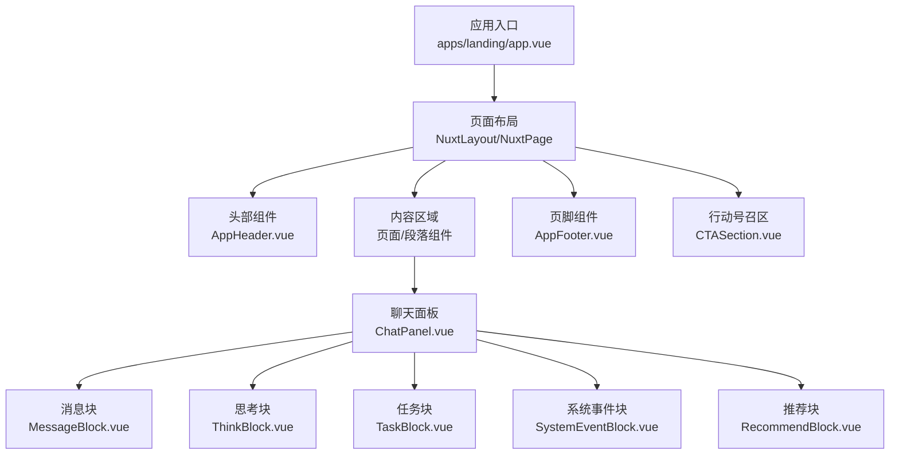
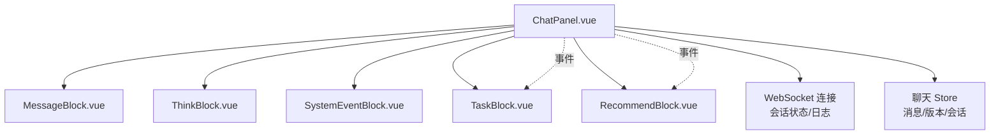
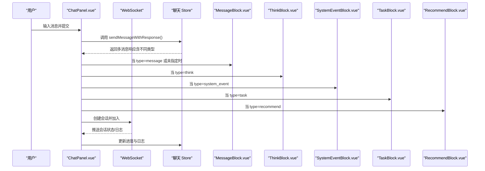
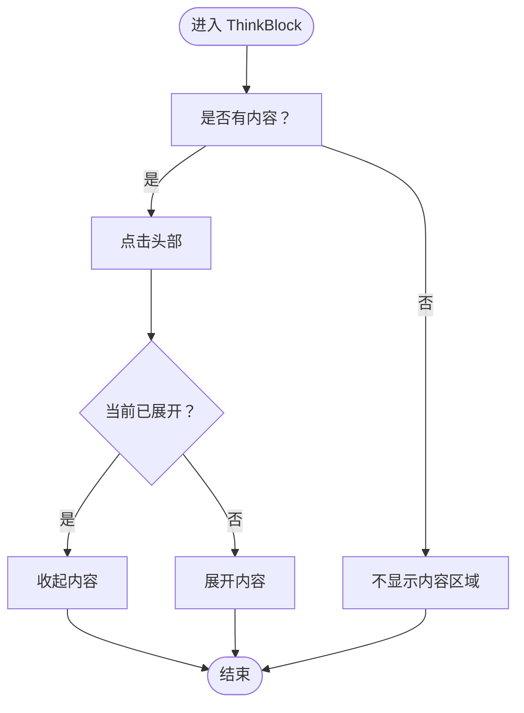
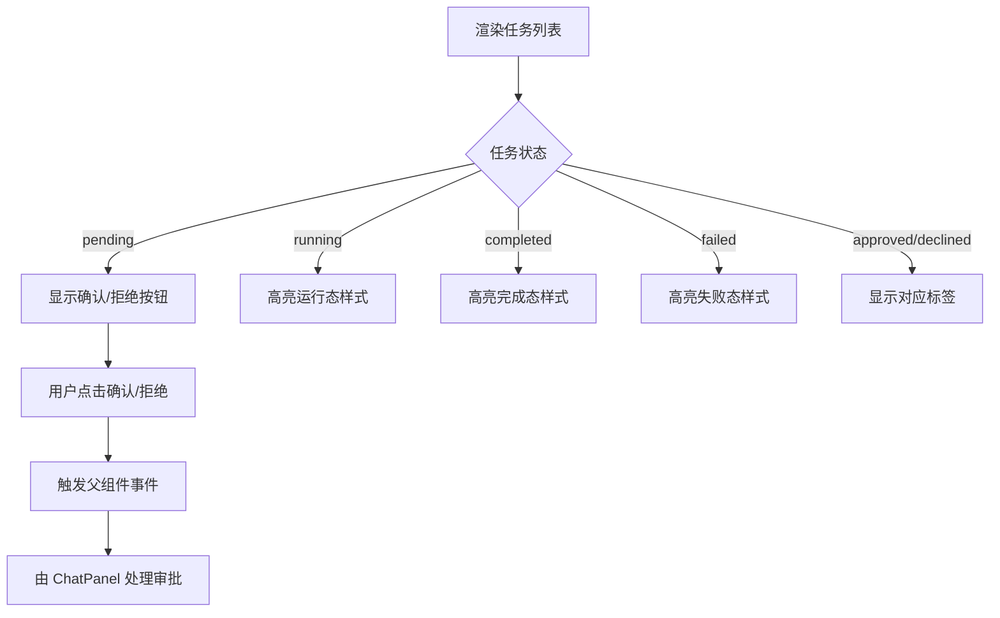
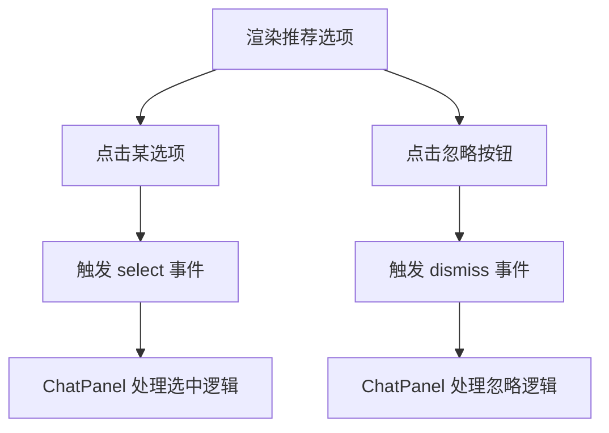
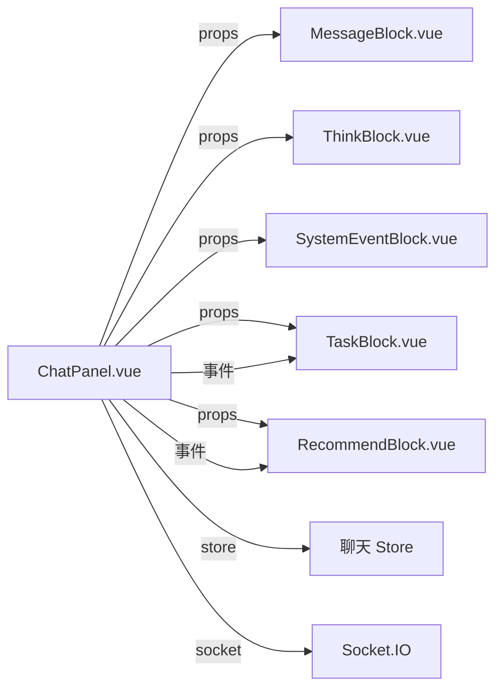

# 组件系统

<cite>
**本文引用的文件**
- [apps/landing/app.vue](file://apps/landing/app.vue)
- [apps/landing/components/AppHeader.vue](file://apps/landing/components/AppHeader.vue)
- [apps/landing/components/AppFooter.vue](file://apps/landing/components/AppFooter.vue)
- [apps/landing/components/CTASection.vue](file://apps/landing/components/CTASection.vue)
- [apps/landing/components/ChatPanel.vue](file://apps/landing/components/ChatPanel.vue)
- [apps/landing/components/chat/MessageBlock.vue](file://apps/landing/components/chat/MessageBlock.vue)
- [apps/landing/components/chat/ThinkBlock.vue](file://apps/landing/components/chat/ThinkBlock.vue)
- [apps/landing/components/chat/TaskBlock.vue](file://apps/landing/components/chat/TaskBlock.vue)
- [apps/landing/components/chat/SystemEventBlock.vue](file://apps/landing/components/chat/SystemEventBlock.vue)
- [apps/landing/components/chat/RecommendBlock.vue](file://apps/landing/components/chat/RecommendBlock.vue)
</cite>

## 目录
1. [引言](#引言)
2. [项目结构](#项目结构)
3. [核心组件](#核心组件)
4. [架构总览](#架构总览)
5. [详细组件分析](#详细组件分析)
6. [依赖关系分析](#依赖关系分析)
7. [性能考量](#性能考量)
8. [故障排查指南](#故障排查指南)
9. [结论](#结论)
10. [附录](#附录)

## 引言
本文件面向前端开发者与产品团队，系统化梳理基于 Vue 3 Composition API 的组件体系与设计模式，重点覆盖以下方面：
- 可复用组件的抽象与封装：通过统一的 props、事件与样式约定，提升跨页面一致性与可维护性。
- 聊天组件体系：消息块、思考块、任务块、系统事件块、推荐块等，围绕消息类型进行组件分发与渲染。
- 布局组件：头部导航、页脚、行动号召区等，强调响应式与可访问性。
- 组件通信：props 向下传递、事件向上冒泡、provide/inject 在多层级组件中的使用场景与注意事项。
- 最佳实践：性能优化、内存管理、可访问性与可测试性。
- 测试策略与调试技巧：结合现有组件结构给出落地建议。

## 项目结构
本项目采用 Nuxt 3 应用作为前端入口，组件集中在 apps/landing/components 下，并按功能域拆分为页面级布局组件与聊天相关子组件。整体组织方式体现“按功能域分层”的思想，便于扩展与复用。

图表来源
- [apps/landing/app.vue:1-76](file://apps/landing/app.vue#L1-L76)
- [apps/landing/components/AppHeader.vue:1-164](file://apps/landing/components/AppHeader.vue#L1-L164)
- [apps/landing/components/AppFooter.vue:1-69](file://apps/landing/components/AppFooter.vue#L1-L69)
- [apps/landing/components/CTASection.vue:1-50](file://apps/landing/components/CTASection.vue#L1-L50)
- [apps/landing/components/ChatPanel.vue:1-1170](file://apps/landing/components/ChatPanel.vue#L1-L1170)
- [apps/landing/components/chat/MessageBlock.vue:1-315](file://apps/landing/components/chat/MessageBlock.vue#L1-L315)
- [apps/landing/components/chat/ThinkBlock.vue:1-206](file://apps/landing/components/chat/ThinkBlock.vue#L1-L206)
- [apps/landing/components/chat/TaskBlock.vue:1-183](file://apps/landing/components/chat/TaskBlock.vue#L1-L183)
- [apps/landing/components/chat/SystemEventBlock.vue:1-53](file://apps/landing/components/chat/SystemEventBlock.vue#L1-L53)
- [apps/landing/components/chat/RecommendBlock.vue:1-142](file://apps/landing/components/chat/RecommendBlock.vue#L1-L142)

章节来源
- [apps/landing/app.vue:1-76](file://apps/landing/app.vue#L1-L76)

## 核心组件
本节聚焦于可复用组件与聊天组件体系，总结其职责边界、数据流与交互模式。

- 头部导航 AppHeader.vue
  - 职责：固定定位的导航条，支持登录/登出、侧边栏开关、模式切换（landing/app/studio），滚动时背景与阴影变化。
  - 设计要点：通过 withDefaults 提供默认属性；使用 computed 从全局状态派生认证态与用户信息；监听滚动事件控制视觉状态。
  - 通信：向上传递登录与侧边栏开关事件，向下接收模式参数。

- 页脚 AppFooter.vue
  - 职责：多列导航与版权信息展示，提供品牌与法律链接。
  - 设计要点：网格布局适配移动端与桌面端；使用主题变量保证风格一致。

- 行动号召区 CTASection.vue
  - 职责：引导用户注册/观看演示，提供平滑滚动与外部跳转。
  - 设计要点：渐变背景与按钮组合，强调可点击性与无障碍。

- 聊天面板 ChatPanel.vue
  - 职责：承载消息列表、输入框、版本切换、实时进度面板与 WebSocket 连接管理。
  - 数据流：通过 store 获取可见消息、版本列表与当前版本；发送消息时调用 store 的动作以处理多消息响应；任务创建后轮询进度并更新状态。
  - 通信：向上传递展开事件；向子组件分发不同类型的消息块；处理任务审批/拒绝、推荐选择/忽略等交互。
  - 性能：限制滚动日志数量、限制输入高度、延迟滚动至底部、清理轮询与事件监听。

- 消息块 MessageBlock.vue
  - 职责：渲染文本、代码、图片/文件占位、内联思考片段等富内容。
  - 设计要点：支持数组型内容与字符串内容；提供代码复制能力；使用深选择器适配 Markdown 渲染结果。

- 思考块 ThinkBlock.vue
  - 职责：折叠/展开显示思考摘要与正文，支持动画过渡。
  - 设计要点：根据摘要或内容动态决定是否显示；提供脉冲动画增强感知。

- 任务块 TaskBlock.vue
  - 职责：展示任务卡片列表，支持审批/拒绝操作。
  - 设计要点：根据任务状态切换样式；按钮尺寸与颜色语义明确。

- 系统事件块 SystemEventBlock.vue
  - 职责：以标签形式展示系统事件文本，支持意图识别提示。
  - 设计要点：紧凑布局，居中对齐，强调可读性。

- 推荐块 RecommendBlock.vue
  - 职责：展示可选项卡片，支持选择与忽略。
  - 设计要点：悬停反馈与点击行为清晰；图标解析预留扩展点。

章节来源
- [apps/landing/components/AppHeader.vue:125-164](file://apps/landing/components/AppHeader.vue#L125-L164)
- [apps/landing/components/AppFooter.vue:1-69](file://apps/landing/components/AppFooter.vue#L1-L69)
- [apps/landing/components/CTASection.vue:37-50](file://apps/landing/components/CTASection.vue#L37-L50)
- [apps/landing/components/ChatPanel.vue:182-589](file://apps/landing/components/ChatPanel.vue#L182-L589)
- [apps/landing/components/chat/MessageBlock.vue:58-113](file://apps/landing/components/chat/MessageBlock.vue#L58-L113)
- [apps/landing/components/chat/ThinkBlock.vue:21-59](file://apps/landing/components/chat/ThinkBlock.vue#L21-L59)
- [apps/landing/components/chat/TaskBlock.vue:32-57](file://apps/landing/components/chat/TaskBlock.vue#L32-L57)
- [apps/landing/components/chat/SystemEventBlock.vue:8-27](file://apps/landing/components/chat/SystemEventBlock.vue#L8-L27)
- [apps/landing/components/chat/RecommendBlock.vue:29-49](file://apps/landing/components/chat/RecommendBlock.vue#L29-L49)

## 架构总览
下图展示页面级组件与聊天子组件之间的关系，以及消息类型到具体组件的分发逻辑。

图表来源
- [apps/landing/components/ChatPanel.vue:90-110](file://apps/landing/components/ChatPanel.vue#L90-L110)
- [apps/landing/components/chat/TaskBlock.vue:41-44](file://apps/landing/components/chat/TaskBlock.vue#L41-L44)
- [apps/landing/components/chat/RecommendBlock.vue:39-42](file://apps/landing/components/chat/RecommendBlock.vue#L39-L42)
- [apps/landing/components/ChatPanel.vue:378-434](file://apps/landing/components/ChatPanel.vue#L378-L434)

## 详细组件分析

### 聊天面板与消息分发序列

图表来源
- [apps/landing/components/ChatPanel.vue:436-488](file://apps/landing/components/ChatPanel.vue#L436-L488)
- [apps/landing/components/ChatPanel.vue:90-110](file://apps/landing/components/ChatPanel.vue#L90-L110)
- [apps/landing/components/ChatPanel.vue:414-433](file://apps/landing/components/ChatPanel.vue#L414-L433)

章节来源
- [apps/landing/components/ChatPanel.vue:182-589](file://apps/landing/components/ChatPanel.vue#L182-L589)

### 思考块展开流程

图表来源
- [apps/landing/components/chat/ThinkBlock.vue:33-59](file://apps/landing/components/chat/ThinkBlock.vue#L33-L59)

章节来源
- [apps/landing/components/chat/ThinkBlock.vue:21-59](file://apps/landing/components/chat/ThinkBlock.vue#L21-L59)

### 任务块交互流程

图表来源
- [apps/landing/components/chat/TaskBlock.vue:19-27](file://apps/landing/components/chat/TaskBlock.vue#L19-L27)
- [apps/landing/components/chat/TaskBlock.vue:46-57](file://apps/landing/components/chat/TaskBlock.vue#L46-L57)
- [apps/landing/components/ChatPanel.vue:285-293](file://apps/landing/components/ChatPanel.vue#L285-L293)

章节来源
- [apps/landing/components/chat/TaskBlock.vue:32-57](file://apps/landing/components/chat/TaskBlock.vue#L32-L57)
- [apps/landing/components/ChatPanel.vue:285-293](file://apps/landing/components/ChatPanel.vue#L285-L293)

### 推荐块交互流程

图表来源
- [apps/landing/components/chat/RecommendBlock.vue:10-25](file://apps/landing/components/chat/RecommendBlock.vue#L10-L25)
- [apps/landing/components/chat/RecommendBlock.vue:39-42](file://apps/landing/components/chat/RecommendBlock.vue#L39-L42)
- [apps/landing/components/ChatPanel.vue:294-301](file://apps/landing/components/ChatPanel.vue#L294-L301)

章节来源
- [apps/landing/components/chat/RecommendBlock.vue:29-49](file://apps/landing/components/chat/RecommendBlock.vue#L29-L49)
- [apps/landing/components/ChatPanel.vue:294-301](file://apps/landing/components/ChatPanel.vue#L294-L301)

### 布局组件设计模式与响应式实现
- 固定头部 AppHeader.vue
  - 使用 fixed 定位与 z-index 控制层级；根据滚动状态切换背景与阴影，提升可读性。
  - 通过 NuxtLink 与下拉菜单组件实现导航与更多入口，确保 SSR 安全。
- 页脚 AppFooter.vue
  - 使用 CSS Grid 在桌面端分栏，在移动端堆叠；品牌与社交图标采用主题色变量，保持一致性。
- 行动号召区 CTASection.vue
  - 渐变背景与按钮组合，强调主行动；提供滚动到顶部与外部跳转能力。

章节来源
- [apps/landing/components/AppHeader.vue:1-164](file://apps/landing/components/AppHeader.vue#L1-L164)
- [apps/landing/components/AppFooter.vue:1-69](file://apps/landing/components/AppFooter.vue#L1-L69)
- [apps/landing/components/CTASection.vue:1-50](file://apps/landing/components/CTASection.vue#L1-L50)

## 依赖关系分析
- 组件耦合
  - ChatPanel 与各消息块之间为弱耦合：通过 message.type 分发，便于新增类型与替换渲染组件。
  - ChatPanel 与 store 存在强耦合：集中处理消息、版本、会话与进度，避免重复逻辑。
- 外部依赖
  - Element Plus 图标与组件用于交互与视觉元素；Socket.IO 用于实时会话。
- 潜在风险
  - 若 store 数据结构变更，需同步更新 ChatPanel 的消息映射与事件处理。
  - 任务与推荐块的事件需在父组件统一收敛，避免事件散落导致维护困难。

图表来源
- [apps/landing/components/ChatPanel.vue:90-110](file://apps/landing/components/ChatPanel.vue#L90-L110)
- [apps/landing/components/ChatPanel.vue:285-301](file://apps/landing/components/ChatPanel.vue#L285-L301)
- [apps/landing/components/ChatPanel.vue:378-434](file://apps/landing/components/ChatPanel.vue#L378-L434)

章节来源
- [apps/landing/components/ChatPanel.vue:182-589](file://apps/landing/components/ChatPanel.vue#L182-L589)

## 性能考量
- 列表渲染与虚拟化
  - 对消息列表使用 v-for 渲染，建议在消息量较大时引入虚拟滚动库以降低 DOM 节点数。
- 事件与定时器
  - 轮询进度与滚动事件监听需在 onUnmounted 中清理，避免内存泄漏。
- 图片与媒体
  - 头像与占位图采用懒加载与合适的尺寸，减少首屏压力。
- 样式与动画
  - 过渡动画与阴影应适度使用，避免在低端设备上造成掉帧。
- 状态与计算属性
  - 将派生状态放入 computed，避免重复计算；对频繁更新的状态使用防抖/节流。

## 故障排查指南
- WebSocket 连接问题
  - 检查连接错误回调与重连尝试配置；确认鉴权 token 是否存在。
- 消息未显示或重复
  - 核对 store 中 messages 的去重逻辑与会话 ID 匹配；检查版本切换是否正确合并消息。
- 任务/推荐交互无效
  - 确认事件名称与参数一致；检查父组件是否正确绑定事件处理器。
- 输入框高度异常
  - 确认 autoResize 逻辑与最小/最大高度限制；在内容清空时重置高度。
- 滚动位置错乱
  - 在消息更新后使用 nextTick 再滚动到底部；监听容器滚动事件时注意节流。

章节来源
- [apps/landing/components/ChatPanel.vue:378-434](file://apps/landing/components/ChatPanel.vue#L378-L434)
- [apps/landing/components/ChatPanel.vue:490-510](file://apps/landing/components/ChatPanel.vue#L490-L510)
- [apps/landing/components/ChatPanel.vue:303-325](file://apps/landing/components/ChatPanel.vue#L303-L325)
- [apps/landing/components/ChatPanel.vue:582-588](file://apps/landing/components/ChatPanel.vue#L582-L588)

## 结论
本组件系统以 Composition API 为核心，结合 store 与事件驱动，实现了高内聚、低耦合的消息渲染体系。通过 props 与事件规范、统一的样式约定与响应式布局，提升了跨页面的一致性与可维护性。未来可在虚拟滚动、事件收敛与测试覆盖率等方面持续优化。

## 附录
- 组件开发最佳实践清单
  - 明确 props 默认值与校验；事件命名语义化；样式作用域化。
  - 将副作用（网络请求、定时器、事件监听）集中在生命周期钩子中统一管理与清理。
  - 对高频交互使用防抖/节流；对长列表使用虚拟滚动。
  - 为关键交互提供可访问性标签与键盘操作支持。
- 测试策略与调试技巧
  - 单元测试：针对复杂计算属性与事件处理编写断言；对异步流程使用 mock 与延迟。
  - 集成测试：模拟 store 与 socket，验证消息分发与 UI 更新。
  - 调试技巧：利用浏览器 DevTools 的组件面板查看 props 与状态；在关键路径添加日志但避免生产环境泄露敏感信息。