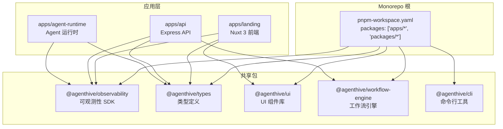
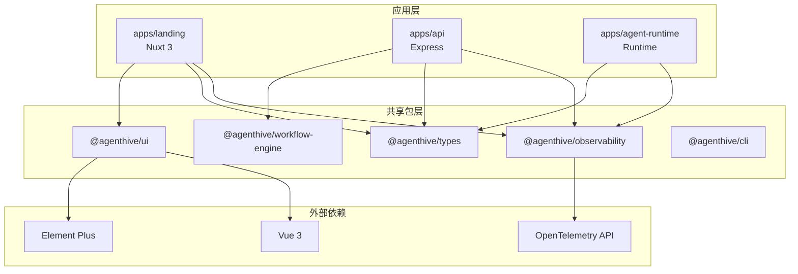
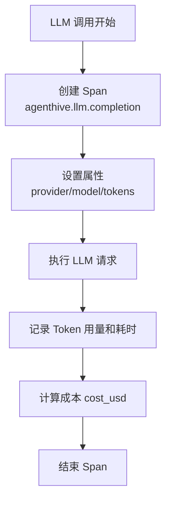
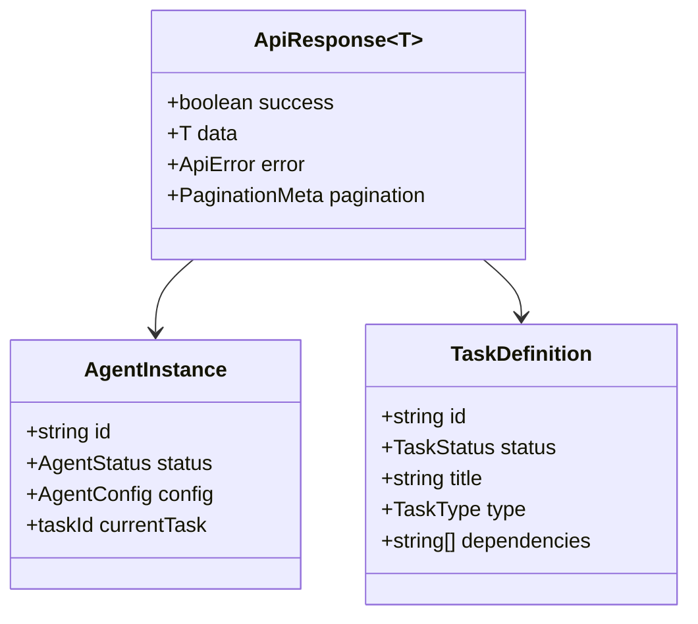
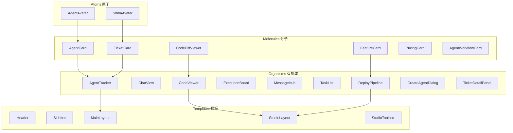
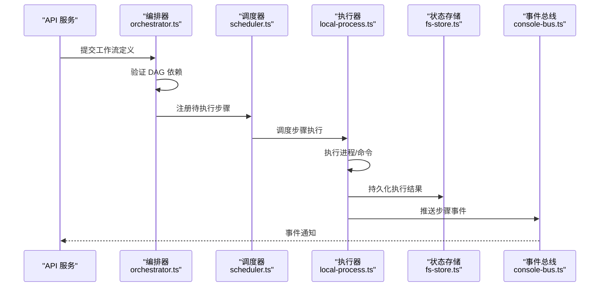
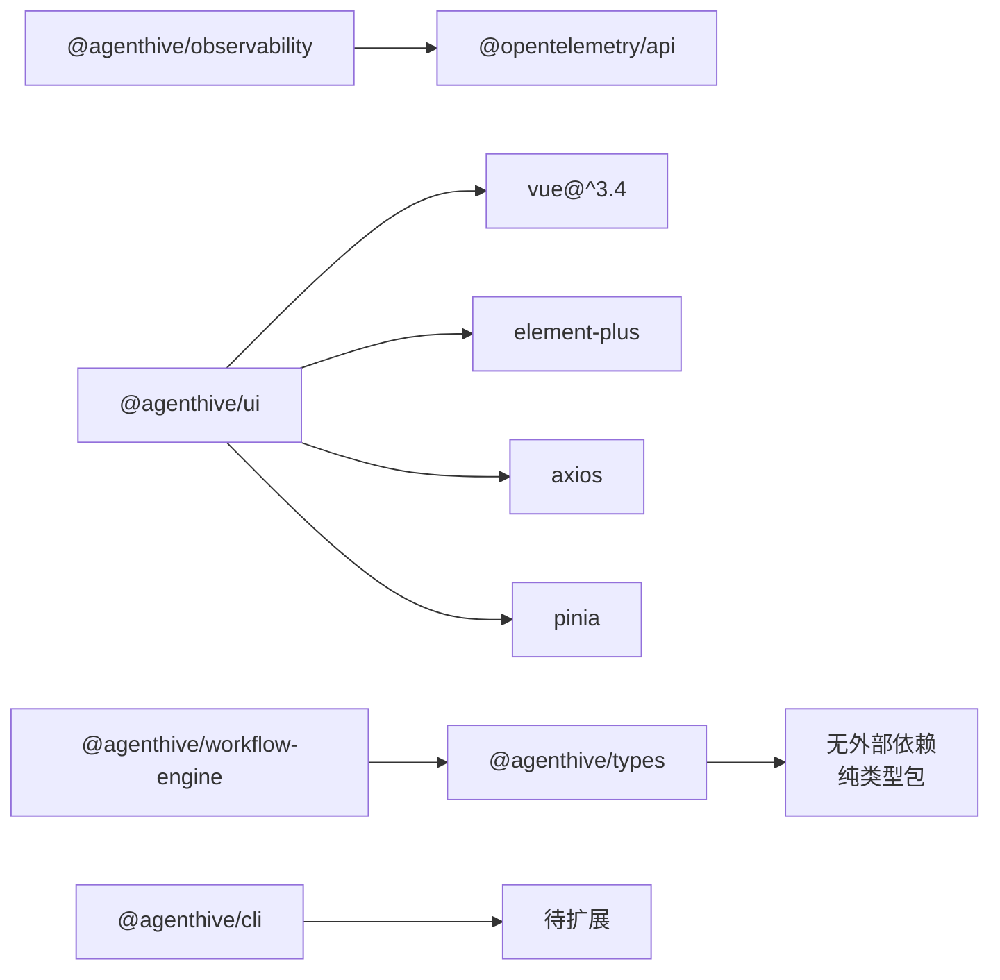

# 共享包架构

<cite>
**本文引用的文件**
- [packages/observability/package.json](file://packages/observability/package.json)
- [packages/observability/src/index.ts](file://packages/observability/src/index.ts)
- [packages/observability/src/ai-attributes.ts](file://packages/observability/src/ai-attributes.ts)
- [packages/observability/src/telemetry-utils.ts](file://packages/observability/src/telemetry-utils.ts)
- [packages/types/package.json](file://packages/types/package.json)
- [packages/types/src/index.ts](file://packages/types/src/index.ts)
- [packages/types/src/agent.ts](file://packages/types/src/agent.ts)
- [packages/types/src/task.ts](file://packages/types/src/task.ts)
- [packages/types/src/auth.ts](file://packages/types/src/auth.ts)
- [packages/types/src/api.ts](file://packages/types/src/api.ts)
- [packages/types/src/code.ts](file://packages/types/src/code.ts)
- [packages/types/src/user.ts](file://packages/types/src/user.ts)
- [packages/ui/package.json](file://packages/ui/package.json)
- [packages/ui/src/index.ts](file://packages/ui/src/index.ts)
- [packages/workflow-engine/package.json](file://packages/workflow-engine/package.json)
- [packages/workflow-engine/src/index.ts](file://packages/workflow-engine/src/index.ts)
- [packages/workflow-engine/src/orchestrator.ts](file://packages/workflow-engine/src/orchestrator.ts)
- [packages/workflow-engine/src/scheduler.ts](file://packages/workflow-engine/src/scheduler.ts)
- [packages/workflow-engine/src/types.ts](file://packages/workflow-engine/src/types.ts)
- [packages/cli/package.json](file://packages/cli/package.json)
- [pnpm-workspace.yaml](file://pnpm-workspace.yaml)
- [package.json](file://package.json)
</cite>

## 目录
1. [简介](#简介)
2. [项目结构](#项目结构)
3. [核心包](#核心包)
4. [架构总览](#架构总览)
5. [详细包分析](#详细包分析)
6. [依赖关系分析](#依赖关系分析)
7. [性能考虑](#性能考虑)
8. [开发指南](#开发指南)
9. [故障排查指南](#故障排查指南)
10. [结论](#结论)
11. [附录](#附录)

## 简介
AgentHive Cloud 采用 pnpm workspace 管理多包仓库（Monorepo），在 `packages/` 目录下维护了五个共享包，为 `apps/` 下的各应用提供类型定义、可观测性 SDK、UI 组件库、工作流引擎和 CLI 工具。本文档系统性介绍各共享包的设计理念、核心能力、导出接口与依赖关系。

- **@agenthive/observability**：统一可观测性工具，定义 AI 语义约定和遥测辅助函数
- **@agenthive/types**：全平台共享的 TypeScript 类型定义，确保前后端类型一致性
- **@agenthive/ui**：基于 Vue 3 + Element Plus 的共享 UI 组件库，采用原子设计方法论
- **@agenthive/workflow-engine**：Agent 工作流编排引擎，负责任务调度、执行器和状态管理
- **@agenthive/cli**：命令行工具入口，提供统一的开发体验

## 项目结构
共享包通过 pnpm workspace 协议（`workspace:*`）被各应用引用，实现了零拷贝依赖共享和统一版本管理。每个包独立构建、独立发布（或通过 workspace 协议内部引用）。

**图表来源**
- [pnpm-workspace.yaml:1-4](file://pnpm-workspace.yaml#L1-L4)
- [package.json:6-9](file://package.json#L6-L9)

**章节来源**
- [pnpm-workspace.yaml:1-4](file://pnpm-workspace.yaml#L1-L4)
- [package.json:1-23](file://package.json#L1-L23)

## 核心包

### @agenthive/observability — 可观测性 SDK
- **职责**：为 Node.js 和前端应用提供统一的 OpenTelemetry 集成，定义 AI Agent 专属语义约定
- **技术栈**：TypeScript + OpenTelemetry API
- **核心模块**：
  - `ai-attributes.ts`：定义 AI 语义属性（LLM 提供商、模型名称、Token 用量、成本等）
  - `telemetry-utils.ts`：提供 Span 创建、属性注入、状态记录等辅助函数
  - `index.ts`：统一导出入口
- **使用方**：apps/api、apps/landing、apps/agent-runtime

### @agenthive/types — 类型定义
- **职责**：全平台共享的 TypeScript 接口、类型和枚举，确保前后端数据契约一致
- **领域覆盖**：
  - Agent 类型（生命周期状态、配置、能力声明）
  - Task 类型（任务状态、子任务、执行结果）
  - Auth 类型（用户、角色、权限、JWT Payload）
  - API 类型（统一响应包装、分页、错误码）
  - Code 类型（文件元信息、语言识别、搜索参数）
  - User 类型（用户资料、偏好设置）
- **使用方**：所有 apps/ 和 packages/

### @agenthive/ui — UI 组件库
- **职责**：基于 Vue 3 Composition API + Element Plus 的共享组件库，采用原子设计方法论
- **组件层次**：
  - Atoms（原子）：AgentAvatar、ShibaAvatar
  - Molecules（分子）：AgentCard、AgentWorkflowCard、TicketCard、CodeDiffViewer、CodeEditor、FeatureCard、PricingCard
  - Organisms（有机体）：AgentDock、AgentList、AgentPanel、AgentTracker、ChatView、CodeViewer、CreateAgentDialog、DeployPipeline、ExecutionBoard、MessageHub、PromptInput、RequirementWizard、TaskList、TerminalView、TicketDetailPanel
  - Templates（模板）：Header、Sidebar、MainLayout、StudioLayout、StudioDrawer、StudioToolbox
  - Specials（特殊组件）：AsyncCodeViewer、ColorSchemePicker、ErrorBoundary、FeatureGate、LockedPanel
- **组合式函数（Composables）**：useApi、useAuth、useToast、useVisitorSession
- **状态管理（Stores）**：agent、execution、messageHub、task、websocket
- **样式系统**：统一的设计 Token（色彩、间距、圆角、阴影）
- **使用方**：apps/landing

### @agenthive/workflow-engine — 工作流引擎
- **职责**：Agent 任务编排核心，负责工作流定义、调度执行和状态持久化
- **核心模块**：
  - `orchestrator.ts`：工作流编排器，解析工作流定义并协调执行
  - `scheduler.ts`：任务调度器，管理并发和执行顺序
  - `executors/`：执行器实现（本地进程执行器）
  - `runtimes/`：运行环境适配（自托管运行时）
  - `buses/`：事件总线（控制台总线）
  - `stores/`：状态存储（文件系统存储）
  - `types.ts`：工作流相关类型定义（步骤、状态、事件、上下文）
- **使用方**：apps/api

### @agenthive/cli — 命令行工具
- **职责**：提供统一的 CLI 入口，用于开发、构建、部署等操作
- **入口**：`bin/agenthive` 可执行文件
- **当前状态**：基础框架就绪，功能模块持续扩展中
- **使用方**：开发者终端

## 架构总览
下图展示共享包与各应用之间的依赖关系和数据流向：

**图表来源**
- [packages/observability/package.json:22-24](file://packages/observability/package.json#L22-L24)
- [packages/ui/package.json:13-22](file://packages/ui/package.json#L13-L22)
- [apps/landing/package.json:18-21](file://apps/landing/package.json#L18-L21)
- [apps/api/package.json:26-28](file://apps/api/package.json#L26-L28)

## 详细包分析

### @agenthive/observability — AI 可观测性约定

该包是平台可观测性的核心基础，定义了 AgentHive 专属的 OpenTelemetry 语义约定，使得 AI Agent 的执行过程可以在 Grafana/Tempo 中进行端到端追踪。

**AI 语义属性（ai-attributes.ts）**
- LLM 属性：`llm.provider`（提供商）、`llm.model`（模型名）、`llm.request_type`（请求类型）
- Token 用量：`llm.tokens.prompt`、`llm.tokens.completion`、`llm.tokens.total`
- 成本追踪：`llm.cost_usd`（USD 计价成本）
- Agent 属性：`agent.id`、`agent.name`、`agent.task_id`、`agent.tool_name`
- 查询循环：`query_loop.iteration`、`query_loop.max_iterations`

**图表来源**
- [packages/observability/src/ai-attributes.ts:1-136](file://packages/observability/src/ai-attributes.ts#L1-L136)

**遥测工具函数（telemetry-utils.ts）**
- Span 构建器：提供流式 API 创建和配置 Span
- 自动化包装器：`withTelemetry(fn, attributes)` 自动记录执行耗时和结果
- 错误处理：自动捕获异常并设置 Span 状态为 ERROR

**章节来源**
- [packages/observability/src/telemetry-utils.ts:1-154](file://packages/observability/src/telemetry-utils.ts#L1-L154)
- [packages/observability/src/index.ts:1-26](file://packages/observability/src/index.ts#L1-L26)

### @agenthive/types — 全平台类型体系

作为平台的类型基石，该包确保前端（Nuxt 3）和后端（Express API、Agent Runtime）使用一致的数据结构，避免类型不匹配导致的运行时错误。

**Agent 类型体系**
- `AgentStatus`：`idle | running | paused | error | stopped`
- `AgentConfig`：名称、角色、能力声明、模型配置
- `AgentInstance`：运行时实例，包含状态、当前任务、资源使用

**Task 类型体系**
- `TaskStatus`：`pending | running | completed | failed | cancelled`
- `TaskDefinition`：ID、标题、描述、类型、优先级、依赖
- `TaskResult`：状态、输出、错误信息、耗时
- `SubTask`：父子关系、执行顺序

**API 统一响应**
- `ApiResponse<T>`：`{ success: boolean, data?: T, error?: ApiError, pagination?: PaginationMeta }`
- `ApiError`：`{ code: string, message: string, details?: any }`
- `PaginationMeta`：`{ page, pageSize, total, totalPages }`

**图表来源**
- [packages/types/src/api.ts:1-77](file://packages/types/src/api.ts#L1-L77)
- [packages/types/src/agent.ts:1-88](file://packages/types/src/agent.ts#L1-L88)
- [packages/types/src/task.ts:1-73](file://packages/types/src/task.ts#L1-L73)
- [packages/types/src/index.ts:1-62](file://packages/types/src/index.ts#L1-L62)

**章节来源**
- [packages/types/src/index.ts:1-62](file://packages/types/src/index.ts#L1-L62)

### @agenthive/ui — 原子设计组件库

该包基于原子设计方法论（Atomic Design）组织 50+ 个 Vue 3 组件，覆盖从基础原子到完整模板的五个层次。

**设计 Token 系统**
- 色彩：主色、辅色、强调色、语义色（成功/警告/错误/信息）
- 间距：基于 4px 基准的渐进尺度（xs=4, sm=8, md=16, lg=24, xl=32, 2xl=48）
- 圆角：sm=4px, md=8px, lg=12px, full=9999px
- 阴影：sm/md/lg/xl 四级阴影，适配浅色/深色模式

**组件层次架构**

**图表来源**
- [packages/ui/src/index.ts:1-71](file://packages/ui/src/index.ts#L1-L71)

**状态管理架构**
- `store/execution.ts`：管理 Agent 执行状态、进度、日志（422 行，最复杂的 Store）
- `store/messageHub.ts`：消息中心，管理聊天消息和 WebSocket 连接
- `store/websocket.ts`：WebSocket 连接管理、重连策略、心跳检测
- `store/agent.ts`：Agent 列表和详情缓存
- `store/task.ts`：任务列表和状态轮询

**章节来源**
- [packages/ui/src/stores/execution.ts:1-422](file://packages/ui/src/stores/execution.ts#L1-L422)
- [packages/ui/src/stores/messageHub.ts:1-157](file://packages/ui/src/stores/messageHub.ts#L1-L157)
- [packages/ui/src/stores/websocket.ts:1-227](file://packages/ui/src/stores/websocket.ts#L1-L227)
- [packages/ui/src/stores/agent.ts:1-60](file://packages/ui/src/stores/agent.ts#L1-L60)
- [packages/ui/src/stores/task.ts:1-71](file://packages/ui/src/stores/task.ts#L1-L71)

### @agenthive/workflow-engine — 工作流编排引擎

该包是 Agent 任务执行的核心引擎，实现了工作流定义、调度、执行和状态持久化的完整生命周期管理。

**核心类型定义（types.ts）**
- `WorkflowDefinition`：工作流结构定义（步骤、依赖、条件）
- `WorkflowStep`：单个步骤（ID、名称、执行器、输入/输出、超时）
- `ExecutionContext`：执行上下文（变量、环境、工作目录）
- `WorkflowEvent`：工作流事件（步骤开始/完成/失败、工作流完成）

**编排器（orchestrator.ts）**
- 工作流验证：启动前验证步骤依赖、循环检测、执行器可用性
- 并行度控制：基于 DAG（有向无环图）分析，最大化并行执行
- 错误处理：步骤失败时执行回滚策略、重试机制
- 状态追踪：实时更新步骤状态，通过事件总线推送进度

**图表来源**
- [packages/workflow-engine/src/orchestrator.ts:1-314](file://packages/workflow-engine/src/orchestrator.ts#L1-L314)
- [packages/workflow-engine/src/scheduler.ts:1-117](file://packages/workflow-engine/src/scheduler.ts#L1-L117)
- [packages/workflow-engine/src/types.ts:1-141](file://packages/workflow-engine/src/types.ts#L1-L141)

**执行器与运行时**
- `executors/local-process.ts`：本地进程执行器，支持 shell 命令、npm scripts、git 操作
- `runtimes/self-hosted.ts`：自托管运行时，管理执行环境和资源隔离
- 扩展能力：通过接口抽象支持自定义执行器（如 Docker 执行器、K8s Job 执行器）

**状态存储**
- `stores/fs-store.ts`：基于文件系统的状态持久化，支持工作流快照和断点续跑

**章节来源**
- [packages/workflow-engine/src/executors/local-process.ts:1-33](file://packages/workflow-engine/src/executors/local-process.ts#L1-L33)
- [packages/workflow-engine/src/runtimes/self-hosted.ts:1-32](file://packages/workflow-engine/src/runtimes/self-hosted.ts#L1-L32)
- [packages/workflow-engine/src/stores/fs-store.ts:1-96](file://packages/workflow-engine/src/stores/fs-store.ts#L1-L96)
- [packages/workflow-engine/src/buses/console-bus.ts:1-46](file://packages/workflow-engine/src/buses/console-bus.ts#L1-L46)

### @agenthive/cli — 命令行工具

CLI 工具提供统一的命令行入口，当前为基础框架阶段，后续将扩展更多开发、构建和部署命令。

**当前入口**
- `bin/agenthive`：可执行脚本入口
- `src/index.ts`：CLI 程序主逻辑（71 行）

**章节来源**
- [packages/cli/src/index.ts:1-71](file://packages/cli/src/index.ts#L1-L71)

## 依赖关系分析

### 包间依赖

### 应用依赖
| 应用 | observability | types | ui | workflow-engine | cli |
|------|:---:|:---:|:---:|:---:|:---:|
| apps/landing | ✅ | ✅ | ✅ | - | - |
| apps/api | ✅ | ✅ | - | ✅ | - |
| apps/agent-runtime | ✅ | ✅ | - | - | - |

**图表来源**
- [apps/landing/package.json:18-21](file://apps/landing/package.json#L18-L21)
- [apps/api/package.json:26-28](file://apps/api/package.json#L26-L28)
- [apps/agent-runtime/package.json:24-26](file://apps/agent-runtime/package.json#L24-L26)

## 性能考虑
- **Tree-shaking**：使用 ES Module 导出，支持消费方按需引入
- **类型隔离**：`@agenthive/types` 为纯类型包，编译后无运行时开销
- **懒加载**：`@agenthive/ui` 的 Store 和组件支持按需加载，减少首屏体积
- **构建优化**：`@agenthive/ui` 使用 Vite 构建，输出优化后的 ES Module
- **缓存策略**：各包独立 `tsconfig.json`，支持增量编译

## 开发指南

### 添加新共享包
1. 在 `packages/` 下创建新目录
2. 添加 `package.json`、`tsconfig.json` 和 `src/index.ts`
3. 在消费应用的 `package.json` 中添加 `"@agenthive/new-pkg": "workspace:*"`
4. 运行 `pnpm install` 建立 workspace 链接

### 类型变更流程
1. 在 `@agenthive/types` 中定义或修改类型
2. 运行 `cd packages/types && npm run build`
3. 更新所有消费方的使用代码
4. 运行 `pnpm -r typecheck` 验证全仓库类型一致性

### 组件开发流程
1. 在 `@agenthive/ui/src/components/` 相应层次目录创建组件
2. 在 `src/index.ts` 中导出组件
3. 编写单元测试（Vitest + Vue Test Utils）
4. 运行 `cd packages/ui && npm run build`

## 故障排查指南

### workspace 依赖未解析
- **现象**：`Cannot find module '@agenthive/xxx'`
- **排查**：确认根目录 `pnpm-workspace.yaml` 包含 `packages/*`；运行 `pnpm install`
- **解决**：删除 `node_modules` 和 `pnpm-lock.yaml`，重新 `pnpm install`

### 类型不匹配
- **现象**：编译时类型错误
- **排查**：检查 `@agenthive/types` 是否已构建（`npm run build`）；确认消费方 `tsconfig.json` 的 `paths` 配置
- **解决**：`cd packages/types && npm run build` 重新生成 `.d.ts` 文件

### UI 组件样式丢失
- **现象**：组件渲染但样式不正确
- **排查**：确认 Element Plus CSS 已全局导入；检查 CSS 作用域
- **解决**：确保消费方 `vite.config.ts` 或 `nuxt.config.ts` 正确配置 Element Plus

### 工作流执行失败
- **现象**：工作流步骤卡住或报错
- **排查**：检查 `fs-store` 状态文件是否存在损坏；确认执行器路径和权限
- **解决**：清除 `workflow-states/` 目录重新执行

## 结论
`packages/` 共享包体系通过清晰的职责划分和 workspace 协议，为 AgentHive Cloud 提供了强类型、高复用的基础设施。`@agenthive/types` 保证了全平台类型一致性，`@agenthive/observability` 统一了 AI Agent 的可观测标准，`@agenthive/ui` 提供了完整的原子设计组件库，`@agenthive/workflow-engine` 支撑了 Agent 任务编排的核心能力。建议在后续开发中持续完善 CLI 工具、增强工作流引擎的扩展性，并为 UI 组件库补充完整的 Storybook 文档。

## 附录

### 包版本策略
- 所有共享包当前版本为 `0.1.0` 或 `1.0.0`
- 使用 `workspace:*` 协议确保各应用始终引用最新本地版本
- 发布到 npm registry 时需统一升级版本号

### 未来扩展方向
- **@agenthive/ui**：增加 Storybook 交互式文档和视觉回归测试
- **@agenthive/workflow-engine**：支持分布式执行器（K8s Job、Docker）、Redis 状态存储
- **@agenthive/cli**：扩展 `agenthive init`、`agenthive deploy`、`agenthive dev` 等命令
- **新增 @agenthive/testing**：共享测试工具、Mock 工厂和 E2E 辅助函数

### 相关文档
- [项目结构](file://开发指南/项目结构.md) — 整体 Monorepo 组织方式
- [开发指南](file://开发指南/开发指南.md) — 开发规范和流程
