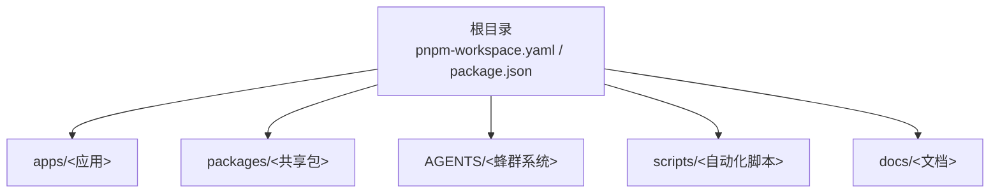
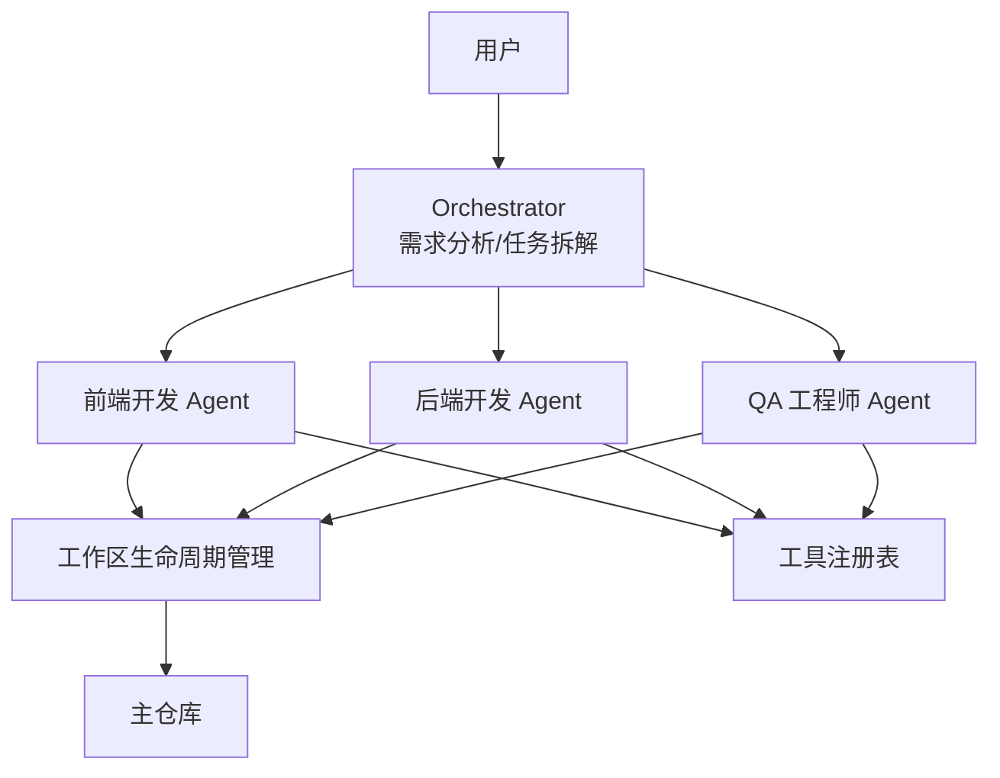
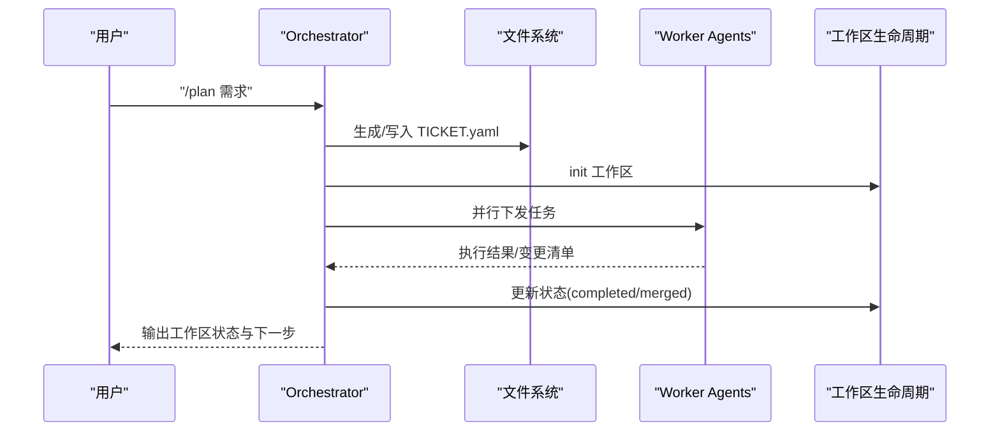
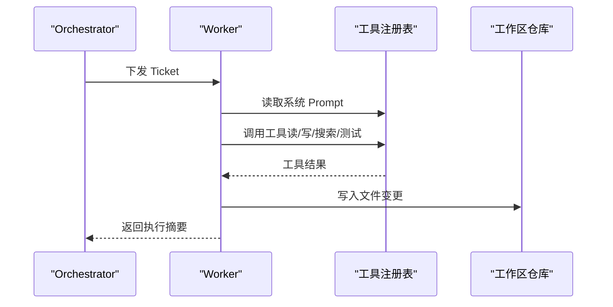
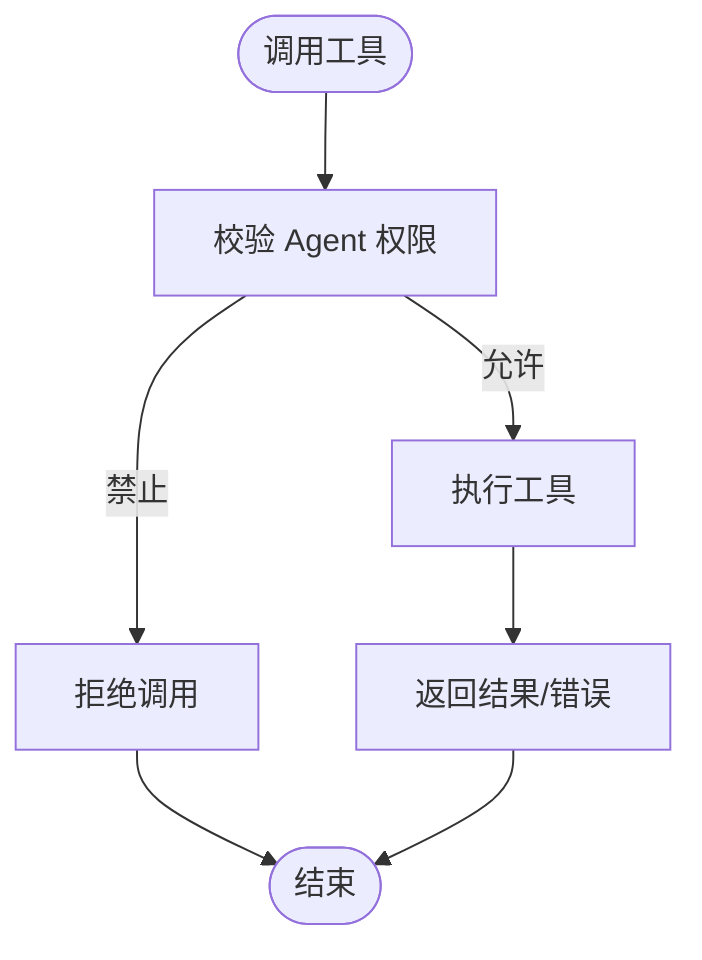
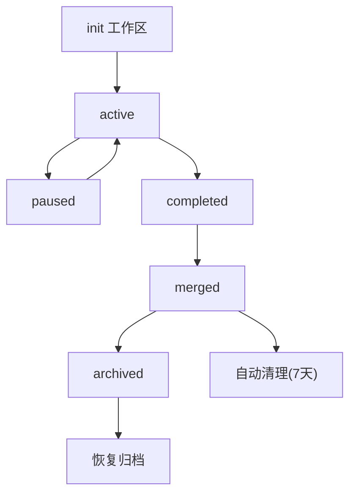
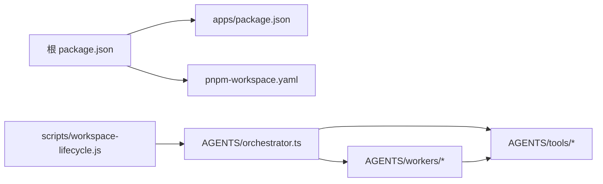

# 开发指南

<cite>
**本文引用的文件**
- [pnpm-workspace.yaml](file://pnpm-workspace.yaml)
- [根 package.json](file://package.json)
- [apps/package.json](file://apps/package.json)
- [README.md](file://README.md)
- [WORKFLOW.md](file://WORKFLOW.md)
- [AGENTS.md](file://AGENTS.md)
- [AGENTS/orchestrator.ts](file://AGENTS/orchestrator.ts)
- [AGENTS/workers/_base.ts](file://AGENTS/workers/_base.ts)
- [AGENTS/workers/backend-dev.ts](file://AGENTS/workers/backend-dev.ts)
- [AGENTS/workers/frontend-dev.ts](file://AGENTS/workers/frontend-dev.ts)
- [AGENTS/workers/qa-engineer.ts](file://AGENTS/workers/qa-engineer.ts)
- [AGENTS/tools/tool-registry.json](file://AGENTS/tools/tool-registry.json)
- [scripts/archive/workspace-lifecycle.js](file://scripts/archive/workspace-lifecycle.js)
- [packages/cli/package.json](file://packages/cli/package.json)
</cite>

## 目录
1. [简介](#简介)
2. [项目结构](#项目结构)
3. [核心组件](#核心组件)
4. [架构总览](#架构总览)
5. [详细组件分析](#详细组件分析)
6. [依赖关系分析](#依赖关系分析)
7. [性能考量](#性能考量)
8. [故障排查指南](#故障排查指南)
9. [结论](#结论)
10. [附录](#附录)

## 简介
本指南面向开发者，提供 AgentHive Cloud 项目的开发环境搭建、代码规范、Monorepo 结构与包管理、工作流与协作规范、CLI 工具使用与扩展、测试策略、CI/CD 与自动化部署、调试与性能分析、问题排查以及新功能开发最佳实践与常见陷阱。

## 项目结构
项目采用 Monorepo 结构，使用 pnpm workspace 管理多包与跨包依赖。根目录提供统一的脚本与工作流，核心应用与共享包分布在 apps 与 packages 目录，Agent 蜂群系统位于 AGENTS 目录，基础设施与部署配置位于 k8s、chart、scripts 等目录。

图表来源
- [pnpm-workspace.yaml:1-4](file://pnpm-workspace.yaml#L1-L4)
- [根 package.json:6-9](file://package.json#L6-L9)

章节来源
- [README.md:70-102](file://README.md#L70-L102)
- [pnpm-workspace.yaml:1-4](file://pnpm-workspace.yaml#L1-L4)
- [根 package.json:6-9](file://package.json#L6-L9)

## 核心组件
- 蜂群调度器（Orchestrator）：负责需求分析、任务拆解、并行调度与状态流转。
- Worker Agents：前端开发、后端开发、QA 工程师三种角色，按任务执行与产出。
- 工具注册表（Tool Registry）：统一声明可用工具及其权限、并发与安全策略。
- 工作区生命周期管理：Ticket 工作区的创建、状态更新、归档与恢复。
- CLI 包：提供命令行入口，便于在 AGENTS 目录内直接运行蜂群任务。

章节来源
- [AGENTS.md:188-236](file://AGENTS.md#L188-L236)
- [AGENTS/orchestrator.ts:1-200](file://AGENTS/orchestrator.ts#L1-L200)
- [AGENTS/workers/backend-dev.ts:1-45](file://AGENTS/workers/backend-dev.ts#L1-L45)
- [AGENTS/workers/frontend-dev.ts:1-46](file://AGENTS/workers/frontend-dev.ts#L1-L46)
- [AGENTS/workers/qa-engineer.ts:1-121](file://AGENTS/workers/qa-engineer.ts#L1-L121)
- [AGENTS/tools/tool-registry.json:1-471](file://AGENTS/tools/tool-registry.json#L1-L471)
- [scripts/archive/workspace-lifecycle.js:1-200](file://scripts/archive/workspace-lifecycle.js#L1-L200)
- [packages/cli/package.json:1-13](file://packages/cli/package.json#L1-L13)

## 架构总览
蜂群系统通过 Orchestrator 拆解需求并生成多个 Ticket，Worker Agents 并行执行各自任务；QA 工程师对相关文件与测试结果进行审查，最终推动代码进入主仓库并自动归档工作区。

图表来源
- [AGENTS/orchestrator.ts:1-200](file://AGENTS/orchestrator.ts#L1-L200)
- [AGENTS/workers/backend-dev.ts:1-45](file://AGENTS/workers/backend-dev.ts#L1-L45)
- [AGENTS/workers/frontend-dev.ts:1-46](file://AGENTS/workers/frontend-dev.ts#L1-L46)
- [AGENTS/workers/qa-engineer.ts:1-121](file://AGENTS/workers/qa-engineer.ts#L1-L121)
- [AGENTS/tools/tool-registry.json:1-471](file://AGENTS/tools/tool-registry.json#L1-L471)
- [scripts/archive/workspace-lifecycle.js:1-200](file://scripts/archive/workspace-lifecycle.js#L1-L200)

## 详细组件分析

### Orchestrator（蜂群调度器）
- 职责：接收需求，生成 Plan，初始化工作区，协调 Worker 并行执行，处理 QA 拒审后的修复循环，持久化 TICKET.yaml 以便 Prompt-Replay 与离线恢复。
- 关键能力：文件锁（避免 relevant_files 冲突）、并行 Worker、自动修复循环、TICKET.yaml 持久化。
- 输入输出：接收用户需求字符串或恢复指令，输出 Plan 与多个 Ticket，并驱动工作区状态流转。

图表来源
- [AGENTS/orchestrator.ts:1-200](file://AGENTS/orchestrator.ts#L1-L200)
- [scripts/archive/workspace-lifecycle.js:62-95](file://scripts/archive/workspace-lifecycle.js#L62-L95)

章节来源
- [AGENTS/orchestrator.ts:1-200](file://AGENTS/orchestrator.ts#L1-L200)
- [AGENTS.md:188-236](file://AGENTS.md#L188-L236)

### Worker Agents（前端/后端/QA）
- 前端开发 Agent：根据任务约束生成前端变更，写回指定文件路径。
- 后端开发 Agent：生成后端接口与逻辑变更，写回指定文件路径。
- QA 工程师 Agent：读取相关文件内容，执行类型检查与单元测试，结合 LLM 审查输出 QA 结论与问题清单。

图表来源
- [AGENTS/workers/frontend-dev.ts:25-40](file://AGENTS/workers/frontend-dev.ts#L25-L40)
- [AGENTS/workers/backend-dev.ts:25-39](file://AGENTS/workers/backend-dev.ts#L25-L39)
- [AGENTS/workers/qa-engineer.ts:38-120](file://AGENTS/workers/qa-engineer.ts#L38-L120)
- [AGENTS/tools/tool-registry.json:1-471](file://AGENTS/tools/tool-registry.json#L1-L471)

章节来源
- [AGENTS/workers/frontend-dev.ts:1-46](file://AGENTS/workers/frontend-dev.ts#L1-L46)
- [AGENTS/workers/backend-dev.ts:1-45](file://AGENTS/workers/backend-dev.ts#L1-L45)
- [AGENTS/workers/qa-engineer.ts:1-121](file://AGENTS/workers/qa-engineer.ts#L1-L121)

### 工具注册表（Tool Registry）
- 统一声明工具名称、类别、输入 Schema、并发与破坏性、允许/禁止 Agent、敏感命令与中断行为等。
- 支持只读操作、写操作、版本控制、搜索、质量检查与文档更新等工具集合。
- 为 Worker 与 Orchestrator 提供安全、可控的工具调用边界。

图表来源
- [AGENTS/tools/tool-registry.json:1-471](file://AGENTS/tools/tool-registry.json#L1-L471)

章节来源
- [AGENTS/tools/tool-registry.json:1-471](file://AGENTS/tools/tool-registry.json#L1-L471)

### 工作区生命周期管理
- 功能：初始化工作区、更新状态（进行中/暂停/完成/合并/归档）、归档压缩、恢复归档、自动清理。
- 配置：最大活跃工作区数、完成保留天数、归档保留月数、自动清理周期。
- 与 Orchestrator 协同：根据状态推进 Ticket 流转，合并后自动归档。

图表来源
- [scripts/archive/workspace-lifecycle.js:18-34](file://scripts/archive/workspace-lifecycle.js#L18-L34)
- [scripts/archive/workspace-lifecycle.js:62-95](file://scripts/archive/workspace-lifecycle.js#L62-L95)
- [scripts/archive/workspace-lifecycle.js:100-127](file://scripts/archive/workspace-lifecycle.js#L100-L127)
- [scripts/archive/workspace-lifecycle.js:132-168](file://scripts/archive/workspace-lifecycle.js#L132-L168)
- [scripts/archive/workspace-lifecycle.js:173-200](file://scripts/archive/workspace-lifecycle.js#L173-L200)

章节来源
- [scripts/archive/workspace-lifecycle.js:1-200](file://scripts/archive/workspace-lifecycle.js#L1-L200)
- [WORKFLOW.md:449-491](file://WORKFLOW.md#L449-L491)

### CLI 工具
- 包结构：@agenthive/cli，二进制入口指向 AGENTS 目录下的 agenthive 命令。
- 使用方式：在 AGENTS 目录下运行 orchestrator.ts 或调用 Worker。
- 扩展方法：新增工具可通过 tool-registry.json 声明；新增 Worker 可复用 _base.ts 的执行框架。

章节来源
- [packages/cli/package.json:1-13](file://packages/cli/package.json#L1-L13)
- [AGENTS.md:199-213](file://AGENTS.md#L199-L213)

## 依赖关系分析
- Monorepo 管理：pnpm workspace 配置 apps 与 packages 两个工作区范围，根 package.json 提供统一脚本与类型检查、构建、测试入口。
- 应用与共享包：apps 下各应用独立维护依赖，通过 workspace 引用 packages 内共享包。
- Agent 系统：AGENTS 内部模块相互依赖（LLM 客户端、文件工具、Git 工具），并通过工具注册表统一约束。

图表来源
- [根 package.json:6-9](file://package.json#L6-L9)
- [apps/package.json:1-13](file://apps/package.json#L1-L13)
- [pnpm-workspace.yaml:1-4](file://pnpm-workspace.yaml#L1-L4)
- [AGENTS/orchestrator.ts:1-200](file://AGENTS/orchestrator.ts#L1-L200)
- [AGENTS/tools/tool-registry.json:1-471](file://AGENTS/tools/tool-registry.json#L1-L471)
- [AGENTS/workers/_base.ts](file://AGENTS/workers/_base.ts)
- [scripts/archive/workspace-lifecycle.js:1-200](file://scripts/archive/workspace-lifecycle.js#L1-L200)

章节来源
- [根 package.json:6-9](file://package.json#L6-L9)
- [apps/package.json:1-13](file://apps/package.json#L1-L13)
- [pnpm-workspace.yaml:1-4](file://pnpm-workspace.yaml#L1-L4)

## 性能考量
- 并行执行：Orchestrator 支持无冲突且依赖满足的任务并行执行，缩短整体交付周期。
- 工具并发安全：工具注册表声明 isConcurrencySafe，避免竞态与破坏性操作。
- 类型检查优先：QA 工程师优先执行类型检查，快速暴露类型问题，降低后续测试成本。
- 自动清理：定期归档与清理工作区，释放磁盘空间，维持开发环境健康。

章节来源
- [AGENTS/orchestrator.ts:5-9](file://AGENTS/orchestrator.ts#L5-L9)
- [AGENTS/tools/tool-registry.json:32-471](file://AGENTS/tools/tool-registry.json#L32-L471)
- [AGENTS/workers/qa-engineer.ts:54-90](file://AGENTS/workers/qa-engineer.ts#L54-L90)
- [scripts/archive/workspace-lifecycle.js:18-23](file://scripts/archive/workspace-lifecycle.js#L18-L23)

## 故障排查指南
- 环境变量与端口：检查 .env.local 与端口占用，必要时清理占用进程。
- 依赖缺失：前端缺少依赖时在对应应用目录安装；VS Code 卡顿可运行工作区清理脚本。
- 端口冲突：使用系统工具查找并终止占用端口的进程。
- 归档恢复：若需查看历史代码，使用恢复命令将归档工作区还原为活动状态。

章节来源
- [AGENTS.md:475-483](file://AGENTS.md#L475-L483)
- [scripts/archive/workspace-lifecycle.js:173-200](file://scripts/archive/workspace-lifecycle.js#L173-L200)

## 结论
本指南提供了从环境搭建、Monorepo 管理、工作流与协作、CLI 使用与扩展、测试与 CI/CD、调试与性能分析到问题排查与最佳实践的完整路径。建议在新功能开发前先熟悉工作流与工具注册表，遵循代码规范与质量门禁，利用并行执行与自动清理提升效率。

## 附录

### 开发环境搭建
- 环境要求：Node.js 20+、Docker 与 Docker Compose、pnpm（推荐）。
- 快速启动：使用 Docker Compose 或本地开发脚本启动 Landing 与 API；也可分别在 apps/landing 与 apps/api 目录下运行开发服务器。
- 环境变量：复制 .env.example 并在 .env.local 中填写本地配置。

章节来源
- [README.md:108-188](file://README.md#L108-L188)

### 代码规范
- TypeScript 目标：ES2022，统一 compilerOptions。
- 前端规范：Vue 3 Composition API、Pinia、Tailwind CSS + Element Plus、组件与组合式函数命名约定。
- SSR 注意：客户端与服务端差异处理，使用 <ClientOnly> 或运行时判断。
- 后端规范：Express + TypeScript、路由模块化、统一错误处理、输入验证。

章节来源
- [AGENTS.md:239-314](file://AGENTS.md#L239-L314)

### 工作流与协作
- 阶段划分：接收需求 → 规划拆解 → 并行开发 → 集成验收 → 归档清理。
- 命令速查：/plan、/ticket、/status、/qa、/done、/workspaces、/restore。
- Ticket 生命周期：init → active/paused → completed → merged → archived。

章节来源
- [WORKFLOW.md:1-594](file://WORKFLOW.md#L1-L594)
- [AGENTS.md:199-236](file://AGENTS.md#L199-L236)

### 测试策略
- 单元测试：Vitest，前端使用 Vue Test Utils，后端使用 Supertest。
- E2E 测试：Playwright，配置位于各应用目录。
- 覆盖率与 UI：提供覆盖率报告与 Vitest UI 模式。

章节来源
- [AGENTS.md:316-343](file://AGENTS.md#L316-L343)

### CLI 使用与扩展
- 使用：在 AGENTS 目录运行 orchestrator.ts 或调用具体 Worker。
- 扩展：新增工具在 tool-registry.json 声明；新增 Worker 复用 _base.ts 框架。

章节来源
- [AGENTS.md:199-213](file://AGENTS.md#L199-L213)
- [packages/cli/package.json:1-13](file://packages/cli/package.json#L1-L13)

### 持续集成与自动化部署
- 部署支持：Docker Compose（本地开发）与 Kubernetes（生产环境）。
- 可观测性：OpenTelemetry + Grafana LGTM（Tempo/Loki/Prometheus/Grafana）+ Beyla。
- 健康检查与维护：提供一键启动可观测栈与定期维护脚本。

章节来源
- [AGENTS.md:388-474](file://AGENTS.md#L388-L474)