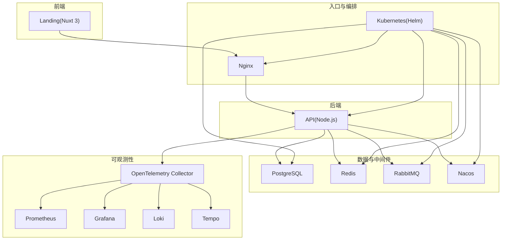
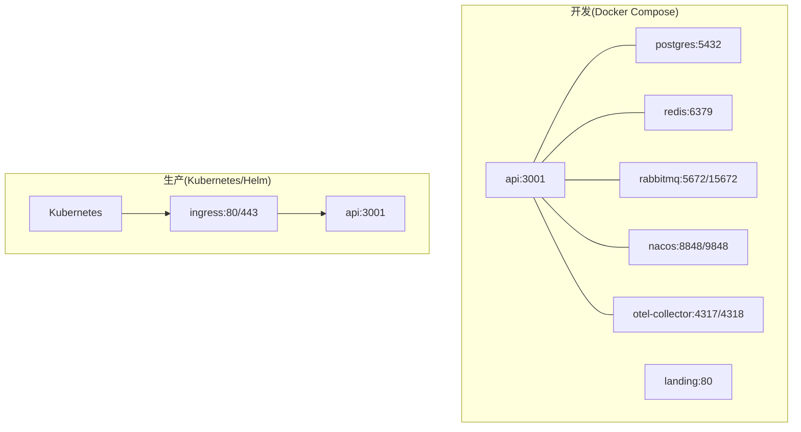
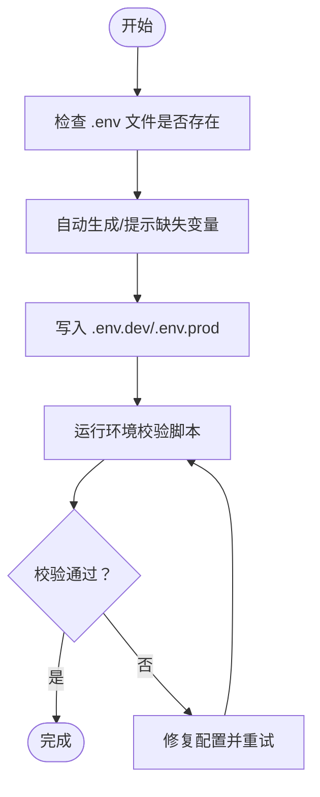
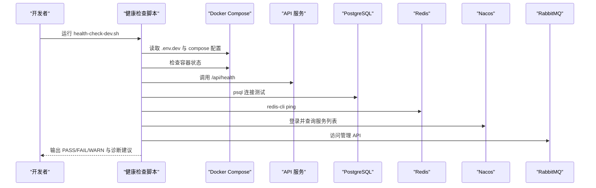
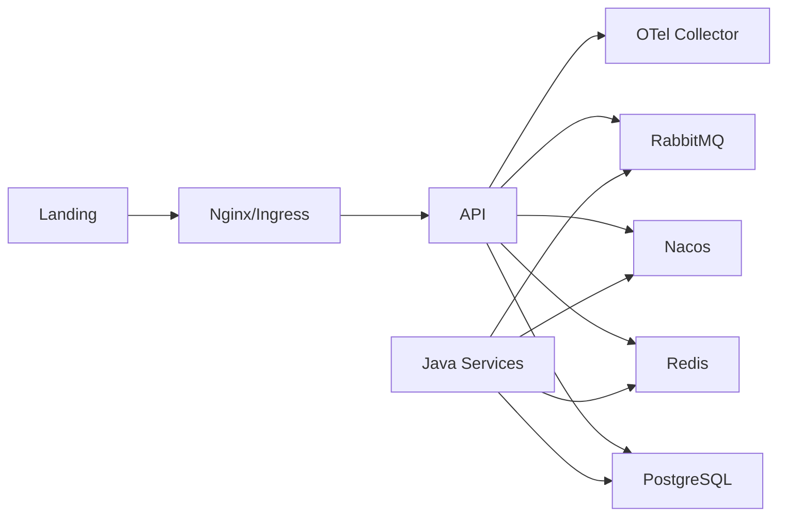

# 环境搭建

<cite>
**本文引用的文件**
- [README.md](file://README.md)
- [package.json](file://package.json)
- [docker-compose.dev.yml](file://docker-compose.dev.yml)
- [docker-compose.prod.yml](file://docker-compose.prod.yml)
- [chart/agenthive/values.yaml](file://chart/agenthive/values.yaml)
- [scripts/dev/setup-dev-env.sh](file://scripts/dev/setup-dev-env.sh)
- [scripts/ops/validate-env.sh](file://scripts/ops/validate-env.sh)
- [scripts/ops/health-check-dev.sh](file://scripts/ops/health-check-dev.sh)
- [apps/landing/nuxt.config.ts](file://apps/landing/nuxt.config.ts)
- [apps/java/auth-service/docker-compose.yml](file://apps/java/auth-service/docker-compose.yml)
</cite>

## 目录
1. [简介](#简介)
2. [项目结构](#项目结构)
3. [核心组件](#核心组件)
4. [架构总览](#架构总览)
5. [详细组件分析](#详细组件分析)
6. [依赖关系分析](#依赖关系分析)
7. [性能考虑](#性能考虑)
8. [故障排查指南](#故障排查指南)
9. [结论](#结论)
10. [附录](#附录)

## 简介
本指南面向开发者，提供 AgentHive Cloud 的完整环境搭建与验证流程，涵盖系统要求、前置依赖、安装步骤、环境变量配置、数据库与 Redis 初始化、多种启动方式（本地开发、Docker Compose、Kubernetes/Helm）以及常见问题排查与健康检查方法。目标是帮助你在本地或生产环境中快速、稳定地启动平台。

## 项目结构
- 平台由前端控制台（Nuxt 3）、后端 API（Node.js）、蜂群引擎（AGENTS）及可选的 Java 微服务组成。
- 基础设施层包括 PostgreSQL、Redis、Nginx、OpenTelemetry、Prometheus/Grafana/Loki/Tempo 等。
- 提供 Docker Compose 开发栈与 Helm Chart 生产栈两种部署形态。

章节来源
- [README.md:70-102](file://README.md#L70-L102)
- [package.json:6-9](file://package.json#L6-L9)

## 核心组件
- 前端控制台：Nuxt 3 + Vue 3，提供可视化配置与工作流编排入口。
- 后端 API：Node.js + Express，提供 REST 与 WebSocket 接口，集成 LLM 适配器与可观测性。
- 数据层：PostgreSQL 16（多数据库）+ Redis 7，用于持久化与缓存。
- 中间件：Nacos（服务注册发现）+ RabbitMQ（消息队列）。
- 可观测性：OpenTelemetry（统一采集）+ Prometheus + Grafana + Loki + Tempo。
- 编排：Docker Compose（开发）+ Kubernetes + Helm（生产）。

章节来源
- [README.md:218-244](file://README.md#L218-L244)
- [docker-compose.dev.yml:22-106](file://docker-compose.dev.yml#L22-L106)
- [docker-compose.dev.yml:194-307](file://docker-compose.dev.yml#L194-L307)
- [docker-compose.dev.yml:312-777](file://docker-compose.dev.yml#L312-L777)
- [docker-compose.prod.yml:52-143](file://docker-compose.prod.yml#L52-L143)
- [chart/agenthive/values.yaml:66-250](file://chart/agenthive/values.yaml#L66-L250)

## 架构总览
下图展示开发与生产的典型拓扑差异：开发以 Docker Compose 本地编排，生产以 Helm 在 Kubernetes 上部署，并通过 Nginx/Ingress 提供统一入口。

图表来源
- [docker-compose.dev.yml:17-307](file://docker-compose.dev.yml#L17-L307)
- [docker-compose.prod.yml:14-143](file://docker-compose.prod.yml#L14-L143)
- [chart/agenthive/values.yaml:649-688](file://chart/agenthive/values.yaml#L649-L688)

## 详细组件分析

### 系统要求与前置依赖
- 操作系统：Linux/macOS/Windows（WSL2 推荐）
- Node.js：20+
- 包管理：pnpm（推荐）
- 容器：Docker + Docker Compose（开发）
- 编排：K3s/K3d 或托管集群 + Helm（生产）
- 可选：WSL2 网络与 DNS 优化（见指南）

章节来源
- [README.md:108-113](file://README.md#L108-L113)
- [README.md:218-244](file://README.md#L218-L244)

### 环境变量配置
- 开发环境：.env.dev
  - 必填项：DB_USER、DB_PASSWORD、DB_NAME、REDIS_PASSWORD、JWT_SECRET、LLM_API_KEY、RABBITMQ_USER、RABBITMQ_PASSWORD、NACOS_AUTH_TOKEN、NACOS_AUTH_IDENTITY_VALUE、NACOS_PASSWORD
  - 可通过脚本自动生成缺失项并写入 .env.dev
- 生产环境：.env.prod
  - 必填项：JWT_SECRET、DB_PASSWORD、REDIS_PASSWORD、GRAFANA_PASSWORD、NACOS_AUTH_TOKEN
  - 校验规则：JWT_SECRET 至少 32 字符；生产禁止 CORS_ORIGIN 包含 localhost；禁止提交真实 LLM API Key

图表来源
- [scripts/dev/setup-dev-env.sh:10-155](file://scripts/dev/setup-dev-env.sh#L10-L155)
- [scripts/ops/validate-env.sh:24-67](file://scripts/ops/validate-env.sh#L24-L67)

章节来源
- [scripts/dev/setup-dev-env.sh:10-155](file://scripts/dev/setup-dev-env.sh#L10-L155)
- [scripts/ops/validate-env.sh:24-67](file://scripts/ops/validate-env.sh#L24-L67)

### 数据库初始化与 Redis 设置
- PostgreSQL
  - 开发：多数据库初始化脚本随容器启动执行，包含 auth_db、payment_db、order_db、cart_db、logistics_db、agenthive
  - 生产：使用远端数据库实例，需在 .env.prod 中配置 DB_HOST/PORT/NAME/USER/PASSWORD
- Redis
  - 开发：设置密码并通过 healthcheck 验证
  - 生产：使用远端 Redis 实例，需在 .env.prod 中配置 REDIS_HOST/PORT/PASSWORD

章节来源
- [docker-compose.dev.yml:37-45](file://docker-compose.dev.yml#L37-L45)
- [docker-compose.dev.yml:79-89](file://docker-compose.dev.yml#L79-L89)
- [docker-compose.prod.yml:61-70](file://docker-compose.prod.yml#L61-L70)
- [docker-compose.prod.yml:67-71](file://docker-compose.prod.yml#L67-L71)

### 启动方式

#### 方式 A：Docker Compose（本地开发，推荐新手）
- 默认启动：PostgreSQL + Redis + API + Landing
- 可选 profile：
  - java：Nacos + RabbitMQ + Java 网关/鉴权/支付/订单/购物车/物流微服务
  - monitoring：Prometheus + Grafana + Tempo + Loki + OTel
  - with-nginx：Nginx 反向代理
- 常用命令
  - 启动开发栈：docker compose -f docker-compose.dev.yml --env-file .env.dev up -d
  - 启动含 Java 微服务：docker compose -f docker-compose.dev.yml --env-file .env.dev --profile java up -d
  - 查看日志：docker compose logs -f

章节来源
- [README.md:140-151](file://README.md#L140-L151)
- [docker-compose.dev.yml:1-16](file://docker-compose.dev.yml#L1-L16)

#### 方式 A'：K3s + Helm（生产环境，推荐）
- 步骤
  - 安装 K3s：bash scripts/bootstrap-k3s-ecs.sh
  - 验证 K3s：bash scripts/verify-k3s.sh
  - 部署 AgentHive：bash scripts/deploy-k3s.sh
  - 验证部署：bash scripts/verify-deployment.sh
  - 回滚（如需要）：bash scripts/rollback-k3s.sh
- Helm Values
  - values.yaml 提供默认副本数、HPA、探针、Ingress、ConfigMap/Secret 注入等
  - 可按环境覆盖：values.dev.yaml / values.prod.yaml

章节来源
- [README.md:153-170](file://README.md#L153-L170)
- [chart/agenthive/values.yaml:649-688](file://chart/agenthive/values.yaml#L649-L688)

#### 方式 B：本地开发（前后端分离）
- 终端 1：前端开发
  - cd apps/landing && npm run dev
- 终端 2：后端开发
  - cd apps/api && npm run dev
- 访问：http://localhost:3000 打开控制台

章节来源
- [README.md:177-187](file://README.md#L177-L187)

### 健康检查与环境验证
- 开发环境健康检查脚本
  - 功能：检查容器状态、HTTP 健康端点、数据库连接、Redis、Nacos 注册、RabbitMQ 管理接口
  - 使用：bash scripts/ops/health-check-dev.sh
- 生产环境环境校验脚本
  - 功能：校验 .env.prod 关键变量、JWT_SECRET 长度、CORS_ORIGIN、弱口令与真实 API Key
  - 使用：bash scripts/ops/validate-env.sh [.env.prod]

图表来源
- [scripts/ops/health-check-dev.sh:114-253](file://scripts/ops/health-check-dev.sh#L114-L253)

章节来源
- [scripts/ops/health-check-dev.sh:1-297](file://scripts/ops/health-check-dev.sh#L1-L297)
- [scripts/ops/validate-env.sh:1-83](file://scripts/ops/validate-env.sh#L1-L83)

## 依赖关系分析
- 组件耦合
  - API 依赖 PostgreSQL、Redis、RabbitMQ、Nacos、OTel
  - Landing 通过 Nginx/Ingress 暴露，反向代理到 API/Gateway
  - Java 微服务通过 Nacos 发现与注册，共享 Redis 与 RabbitMQ
- 外部依赖
  - LLM 适配器（OpenAI/Ollama/通义千问等）通过环境变量配置
  - 生产使用远端数据库与 Redis，需确保网络连通性与安全组放行

图表来源
- [docker-compose.dev.yml:194-307](file://docker-compose.dev.yml#L194-L307)
- [docker-compose.dev.yml:312-777](file://docker-compose.dev.yml#L312-L777)
- [chart/agenthive/values.yaml:397-648](file://chart/agenthive/values.yaml#L397-L648)

章节来源
- [docker-compose.dev.yml:194-307](file://docker-compose.dev.yml#L194-L307)
- [docker-compose.dev.yml:312-777](file://docker-compose.dev.yml#L312-L777)
- [chart/agenthive/values.yaml:397-648](file://chart/agenthive/values.yaml#L397-L648)

## 性能考虑
- 资源限制与预留：各服务设置了 CPU/内存上限与预留，避免资源争抢
- HPA：API/Landing/Java 服务配置了基于 CPU/Memory 的弹性伸缩策略
- 存储：工作区持久化建议使用 ReadWriteMany（NAS）以适配多节点集群
- 日志：容器日志采用 json-file 驱动并限制大小，便于集中收集与清理

章节来源
- [docker-compose.dev.yml:48-61](file://docker-compose.dev.yml#L48-L61)
- [docker-compose.dev.yml:248-261](file://docker-compose.dev.yml#L248-L261)
- [chart/agenthive/values.yaml:99-122](file://chart/agenthive/values.yaml#L99-L122)
- [chart/agenthive/values.yaml:234-242](file://chart/agenthive/values.yaml#L234-L242)

## 故障排查指南

### 端口冲突
- 现象：容器启动失败或端口占用
- 排查：确认 DB_PORT、REDIS_PORT、API_PORT、LANDING_PORT、NGINX_PORT 是否被占用
- 解决：修改 .env.dev/.env.prod 对应端口或释放占用进程

章节来源
- [docker-compose.dev.yml:38-44](file://docker-compose.dev.yml#L38-L44)
- [docker-compose.dev.yml:82-89](file://docker-compose.dev.yml#L82-L89)
- [docker-compose.dev.yml:229-245](file://docker-compose.dev.yml#L229-L245)
- [docker-compose.dev.yml:280-290](file://docker-compose.dev.yml#L280-L290)
- [docker-compose.prod.yml:21-47](file://docker-compose.prod.yml#L21-L47)

### 权限问题
- Docker 权限：非 root 用户需加入 docker 组
- 文件权限：容器内用户为 1000:1000，注意卷挂载目录权限
- Redis 密码：确保 REDIS_PASSWORD 与容器配置一致

章节来源
- [scripts/ops/health-check-dev.sh:98-112](file://scripts/ops/health-check-dev.sh#L98-L112)
- [docker-compose.dev.yml:79-89](file://docker-compose.dev.yml#L79-L89)

### 网络连接
- 主机名解析：Java 服务通过 host.docker.internal 访问宿主机服务，Linux 需额外映射
- Ingress/代理：确认 Nginx/Ingress 规则与后端服务端口匹配
- WSL2 网络：参考项目指南优化 WSL2 网络与 DNS

章节来源
- [apps/java/auth-service/docker-compose.yml:51-54](file://apps/java/auth-service/docker-compose.yml#L51-L54)
- [apps/landing/nuxt.config.ts:126-136](file://apps/landing/nuxt.config.ts#L126-L136)

### 数据库与 Redis 连接失败
- 排查：使用健康检查脚本中的数据库/Redis 检测逻辑
- 解决：核对 .env 中 DB_HOST/PORT/NAME/USER/PASSWORD 与 REDIS_HOST/PORT/PASSWORD；确认容器网络与防火墙

章节来源
- [scripts/ops/health-check-dev.sh:189-222](file://scripts/ops/health-check-dev.sh#L189-L222)

### LLM 配置问题
- 排查：确认 LLM_API_KEY、LLM_BASE_URL、LLM_MODEL、OLLAMA_URL 等变量
- 解决：根据所选 LLM 提供正确的密钥与地址；开发可使用宿主机 Ollama

章节来源
- [docker-compose.dev.yml:216-222](file://docker-compose.dev.yml#L216-L222)
- [chart/agenthive/values.yaml:750-789](file://chart/agenthive/values.yaml#L750-L789)

## 结论
通过本指南，你可以完成从系统准备、依赖安装、环境变量配置、数据库与 Redis 初始化，到多种启动方式与健康检查的全流程部署。建议优先使用 Docker Compose 快速上手，再迁移到 Kubernetes/Helm 以满足生产需求。遇到问题时，结合健康检查与环境校验脚本定位根因，可显著提升排障效率。

## 附录

### 常用命令速查
- 开发：docker compose -f docker-compose.dev.yml --env-file .env.dev up -d [--profile java|monitoring|with-nginx]
- 生产：bash scripts/deploy-k3s.sh；bash scripts/verify-deployment.sh
- 健康检查：bash scripts/ops/health-check-dev.sh
- 环境校验：bash scripts/ops/validate-env.sh [.env.prod]

章节来源
- [README.md:140-170](file://README.md#L140-L170)
- [scripts/ops/health-check-dev.sh:1-297](file://scripts/ops/health-check-dev.sh#L1-L297)
- [scripts/ops/validate-env.sh:1-83](file://scripts/ops/validate-env.sh#L1-L83)