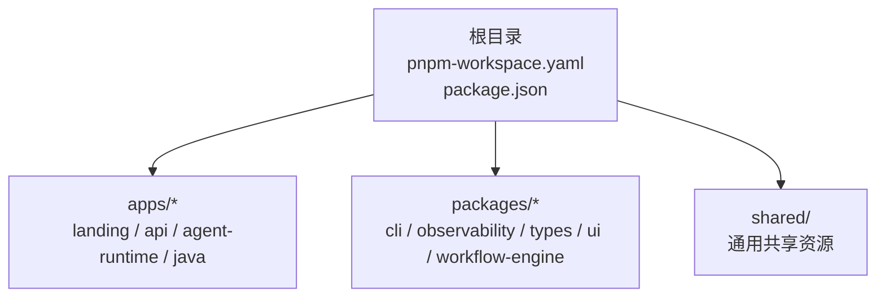
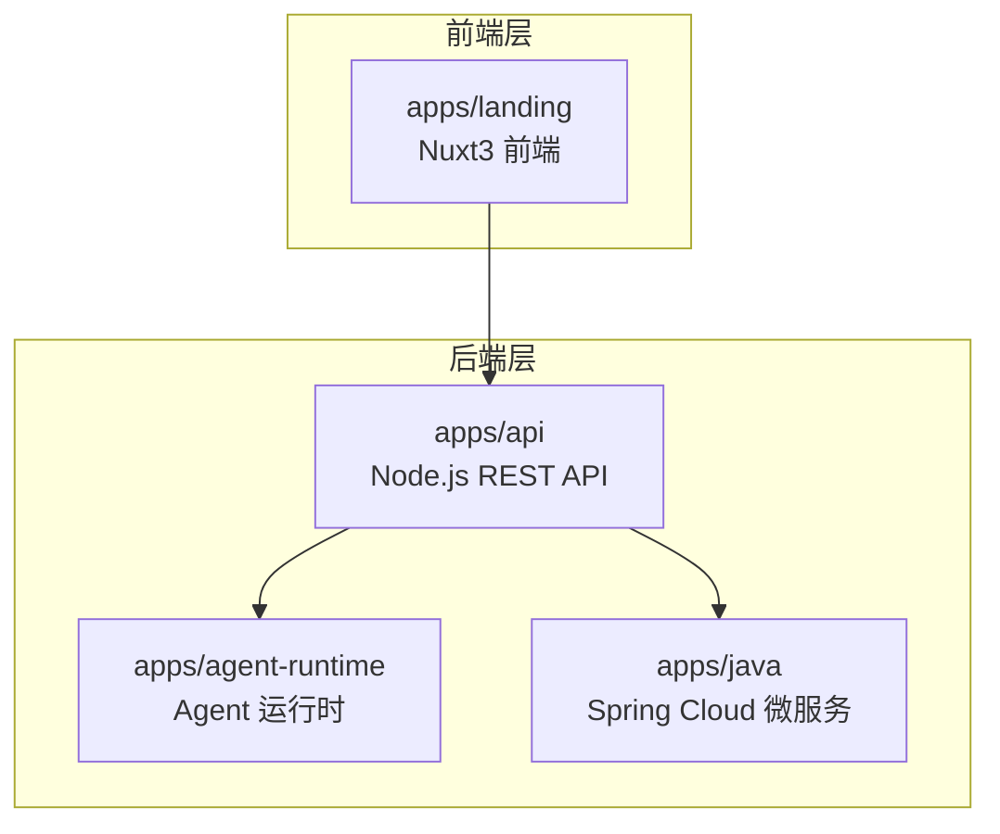
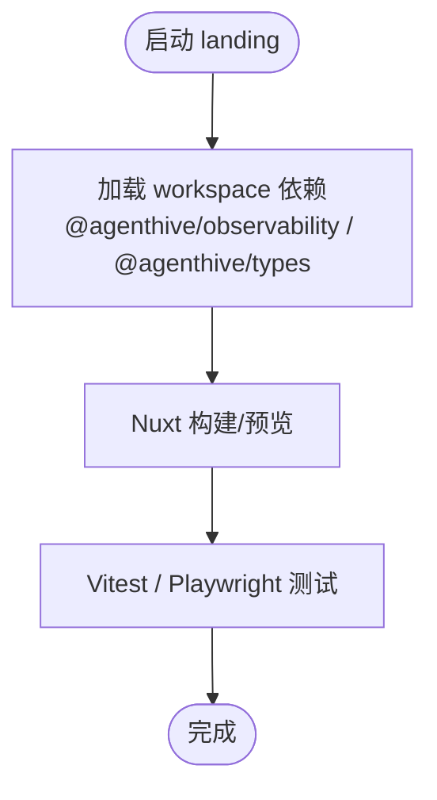
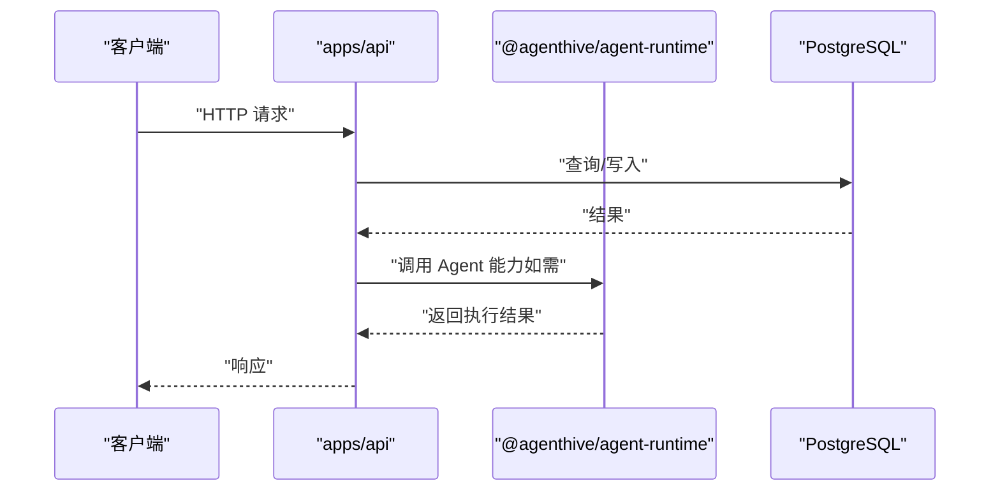
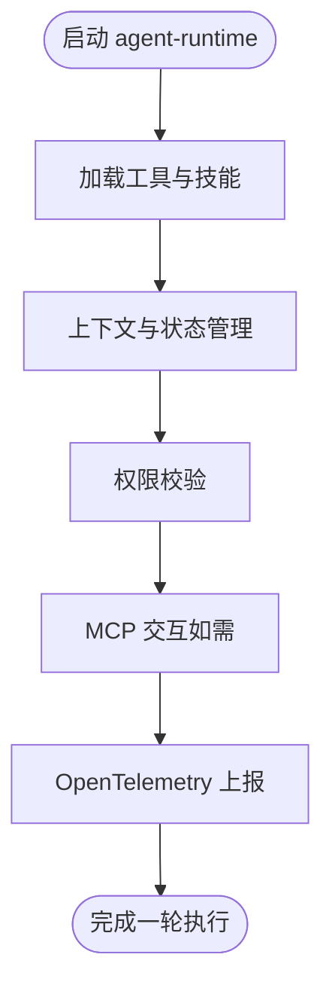
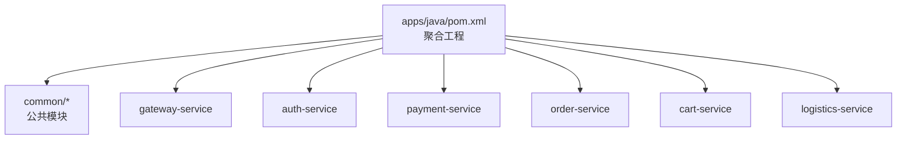
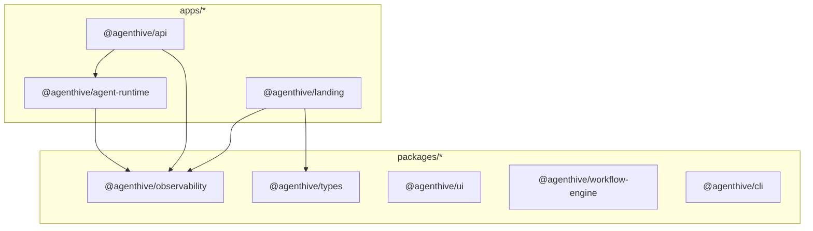
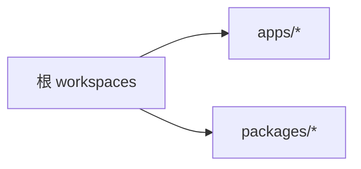

# 项目结构

<cite>
**本文引用的文件**
- [pnpm-workspace.yaml](file://pnpm-workspace.yaml)
- [package.json](file://package.json)
- [apps/README.md](file://apps/README.md)
- [apps/landing/package.json](file://apps/landing/package.json)
- [apps/api/package.json](file://apps/api/package.json)
- [apps/agent-runtime/package.json](file://apps/agent-runtime/package.json)
- [apps/java/pom.xml](file://apps/java/pom.xml)
- [packages/](file://packages/)
</cite>

## 目录
1. [引言](#引言)
2. [项目结构](#项目结构)
3. [核心组件](#核心组件)
4. [架构总览](#架构总览)
5. [详细组件分析](#详细组件分析)
6. [依赖分析](#依赖分析)
7. [性能考虑](#性能考虑)
8. [故障排查指南](#故障排查指南)
9. [结论](#结论)
10. [附录](#附录)

## 引言
本文件面向开发者，系统性说明本项目的 Monorepo 架构设计理念、目录组织方式与协作规范，并重点覆盖以下主题：
- pnpm workspace 的配置与包管理策略
- apps/ 目录下各应用的功能定位与相互关系（landing、web、api、agent-runtime 等）
- packages/ 目录下的共享包结构与复用机制
- shared/ 目录的作用与内容
- 目录导航指南与文件查找技巧
- 项目结构最佳实践与扩展指导

## 项目结构
本项目采用 Monorepo 架构，以 pnpm workspace 作为统一的包管理与工作区编排工具。根目录通过 workspaces 字段声明工作区范围，确保跨应用与跨语言的依赖解析与脚本执行在统一上下文中进行。

- 工作区范围由 pnpm-workspace.yaml 与根 package.json 的 workspaces 字段共同定义，涵盖 apps/* 与 packages/*。
- apps/ 下包含多个应用：landing（Nuxt3）、api（Node.js）、agent-runtime（Node.js + K8s）、java（Maven 多模块 Java 微服务）。
- packages/ 下为共享包，供 apps 内部复用，提升一致性与可维护性。
- shared/ 作为通用共享资源目录，存放跨应用的公共资产或配置。

**图表来源**
- [pnpm-workspace.yaml:1-4](file://pnpm-workspace.yaml#L1-L4)
- [package.json:6-9](file://package.json#L6-L9)

**章节来源**
- [pnpm-workspace.yaml:1-4](file://pnpm-workspace.yaml#L1-L4)
- [package.json:1-23](file://package.json#L1-L23)

## 核心组件
本节概述 apps/ 与 packages/ 的核心组件及其职责边界，帮助快速定位功能域与依赖关系。

- apps/landing：Nuxt3 静态站点/前端入口，负责品牌页与用户引导，使用 Pinia、Socket.IO、OpenTelemetry 等技术栈。
- apps/api：Node.js REST API 服务，提供聊天、路由、中间件、数据库迁移与消费者任务等能力，依赖 agent-runtime 与 observability。
- apps/agent-runtime：Agent 运行时核心，提供工具、技能、权限、上下文、状态与 MCP 等能力，支持容器与 K8s 部署。
- apps/java：基于 Spring Cloud 的多模块微服务（网关、认证、支付、订单、购物车、物流），统一版本与依赖管理。
- packages/*：共享包，包括 CLI、可观测性、类型、UI 组件库、工作流引擎等，被 apps/* 以 workspace:* 方式引用。

**章节来源**
- [apps/README.md:20-43](file://apps/README.md#L20-L43)
- [apps/landing/package.json:1-58](file://apps/landing/package.json#L1-L58)
- [apps/api/package.json:1-61](file://apps/api/package.json#L1-L61)
- [apps/agent-runtime/package.json:1-52](file://apps/agent-runtime/package.json#L1-L52)
- [apps/java/pom.xml:1-207](file://apps/java/pom.xml#L1-L207)
- [packages/](file://packages/)

## 架构总览
下图展示 apps/ 内部主要应用之间的交互关系与数据流向，体现“前端 → API → Agent 运行时”的主链路，以及 Java 微服务在后端生态中的位置。

**图表来源**
- [apps/README.md:7-18](file://apps/README.md#L7-L18)
- [apps/landing/package.json:18-47](file://apps/landing/package.json#L18-L47)
- [apps/api/package.json:26-42](file://apps/api/package.json#L26-L42)
- [apps/agent-runtime/package.json:24-39](file://apps/agent-runtime/package.json#L24-L39)
- [apps/java/pom.xml:64-79](file://apps/java/pom.xml#L64-L79)

## 详细组件分析

### apps/landing（Nuxt3 前端）
- 技术栈：Nuxt 3、Vue 3、Pinia、Element Plus、Monaco Editor、Socket.IO、OpenTelemetry。
- 作用：品牌页与用户引导，承载聊天面板、特性展示、定价与工作流可视化等页面。
- 依赖：通过 workspace:* 引入 @agenthive/observability 与 @agenthive/types，实现可观测性与类型复用。
- 测试与构建：Vitest、Playwright、TypeScript；提供 dev/build/generate/preview 等脚本。

**图表来源**
- [apps/landing/package.json:18-57](file://apps/landing/package.json#L18-L57)

**章节来源**
- [apps/landing/package.json:1-58](file://apps/landing/package.json#L1-L58)

### apps/api（Node.js REST API）
- 技术栈：Express、Socket.IO、Redis、PostgreSQL、Zod、Node-pg-migrate。
- 作用：提供聊天、路由、中间件、WebSocket、数据库迁移与任务消费者等能力。
- 依赖：依赖 @agenthive/agent-runtime 与 @agenthive/observability，统一可观测性与 Agent 能力。
- 数据与流程：迁移脚本驱动数据库初始化；聊天控制器处理消息；WebSocket 提供实时通信。

**图表来源**
- [apps/api/package.json:26-42](file://apps/api/package.json#L26-L42)

**章节来源**
- [apps/api/package.json:1-61](file://apps/api/package.json#L1-L61)

### apps/agent-runtime（Agent 运行时）
- 技术栈：Node.js、WS、Fast-Glob、Simple Git、Zod、OpenTelemetry。
- 作用：提供 Agent 执行环境、工具注册、技能封装、权限控制、上下文管理、状态与 MCP 支持。
- 依赖：依赖 @agenthive/observability，统一追踪与指标采集。
- 部署：支持 Docker 与 Helm/K8s 部署，提供 k8s:deploy/helm:install 等脚本。

**图表来源**
- [apps/agent-runtime/package.json:24-39](file://apps/agent-runtime/package.json#L24-L39)

**章节来源**
- [apps/agent-runtime/package.json:1-52](file://apps/agent-runtime/package.json#L1-L52)

### apps/java（Spring Cloud 微服务）
- 技术栈：Spring Boot 3、Spring Cloud、Spring Cloud Alibaba、MyBatis-Plus、Redisson、MapStruct、JWT、Flyway、SpringDoc OpenAPI。
- 作用：提供认证、支付、订单、购物车、物流等业务服务，统一版本与依赖管理。
- 结构：多模块聚合工程，包含公共模块与具体业务模块，集中管理插件与依赖版本。

**图表来源**
- [apps/java/pom.xml:64-79](file://apps/java/pom.xml#L64-L79)

**章节来源**
- [apps/java/pom.xml:1-207](file://apps/java/pom.xml#L1-L207)

### packages/ 共享包
- 结构：cli、observability、types、ui、workflow-engine 等。
- 复用机制：apps/* 通过 workspace:* 引用共享包，实现类型、UI 组件、可观测性 SDK、CLI 工具与工作流引擎的统一复用。
- 版本策略：共享包版本由各自 package.json 管理，工作区内保持一致升级节奏。

**图表来源**
- [apps/landing/package.json:18-21](file://apps/landing/package.json#L18-L21)
- [apps/api/package.json:26-28](file://apps/api/package.json#L26-L28)
- [apps/agent-runtime/package.json:24-26](file://apps/agent-runtime/package.json#L24-L26)
- [packages/](file://packages/)

**章节来源**
- [apps/landing/package.json:18-21](file://apps/landing/package.json#L18-L21)
- [apps/api/package.json:26-28](file://apps/api/package.json#L26-L28)
- [apps/agent-runtime/package.json:24-26](file://apps/agent-runtime/package.json#L24-L26)
- [packages/](file://packages/)

## 依赖分析
- 工作区声明：根级 workspaces 与 pnpm-workspace.yaml 明确 apps/* 与 packages/* 的工作区范围。
- 应用间依赖：
  - apps/api 依赖 @agenthive/agent-runtime 与 @agenthive/observability。
  - apps/landing 依赖 @agenthive/observability 与 @agenthive/types。
  - apps/agent-runtime 依赖 @agenthive/observability。
- 语言间依赖：Java 微服务独立于 Node.js 工作区，通过各自构建工具管理依赖。

**图表来源**
- [pnpm-workspace.yaml:1-4](file://pnpm-workspace.yaml#L1-L4)
- [package.json:6-9](file://package.json#L6-L9)

**章节来源**
- [pnpm-workspace.yaml:1-4](file://pnpm-workspace.yaml#L1-L4)
- [package.json:6-9](file://package.json#L6-L9)

## 性能考虑
- 构建与打包：apps/api 使用 esbuild 对打包产物进行最小化与平台适配，提升启动性能。
- 容器与 K8s：agent-runtime 提供 Dockerfile 与 Helm/K8s 部署脚本，便于弹性伸缩与资源隔离。
- 可观测性：统一接入 OpenTelemetry，覆盖追踪、指标与日志，辅助性能监控与问题定位。
- 数据层：PostgreSQL 与 Redis 的合理分层与连接池配置，结合迁移工具保证数据一致性与可演进性。

## 故障排查指南
- 本地开发顺序建议：
  - 启动数据库与缓存（PostgreSQL/Redis）。
  - 启动 apps/api，确保迁移脚本执行成功。
  - 启动 apps/landing 或其他前端应用进行联调。
- 常见问题定位：
  - 端口冲突：检查 apps/api 与 apps/landing 的默认端口占用情况。
  - 数据库迁移：使用 apps/api 的迁移脚本命令核对迁移状态与错误日志。
  - 可观测性：确认 OpenTelemetry 导出器配置与目标端点可达。
- 日志与监控：结合 apps/landing 与 apps/api 的日志输出，配合 K8s 事件与指标面板进行问题定位。

## 结论
本项目通过 pnpm workspace 将多语言、多框架的应用与共享包整合在同一工作区内，形成清晰的职责边界与复用机制。apps/ 与 packages/ 的协同，既保证了前端体验与后端能力的统一，也提升了可观测性与工程效率。遵循本文的目录导航与最佳实践，可高效开展开发、测试与部署。

## 附录

### 目录导航指南与文件查找技巧
- 快速定位应用：apps/landing、apps/api、apps/agent-runtime、apps/java。
- 快速定位共享包：packages/cli、packages/observability、packages/types、packages/ui、packages/workflow-engine。
- 快速定位工作区配置：根目录 pnpm-workspace.yaml、package.json 的 workspaces 字段。
- 快速定位构建与测试：各应用 package.json 中的 scripts 字段，如 dev/build/test 等。

### 项目结构最佳实践与扩展指导
- 新增应用：在 apps/ 下创建新目录，按需添加 package.json、tsconfig.json、vitest.config.ts 等基础文件，并在根 workspaces 中声明。
- 新增共享包：在 packages/ 下创建新目录，完善 package.json 与导出入口，各应用通过 workspace:* 引用。
- 依赖管理：优先使用 workspace:* 引用共享包，避免重复安装；严格控制版本升级节奏，统一发布。
- 可观测性：统一接入 OpenTelemetry，规范日志与指标命名，确保跨应用一致性。
- 部署与运维：利用 Dockerfile 与 Helm/K8s 清单，标准化交付流程；结合迁移脚本与健康检查，保障上线质量。