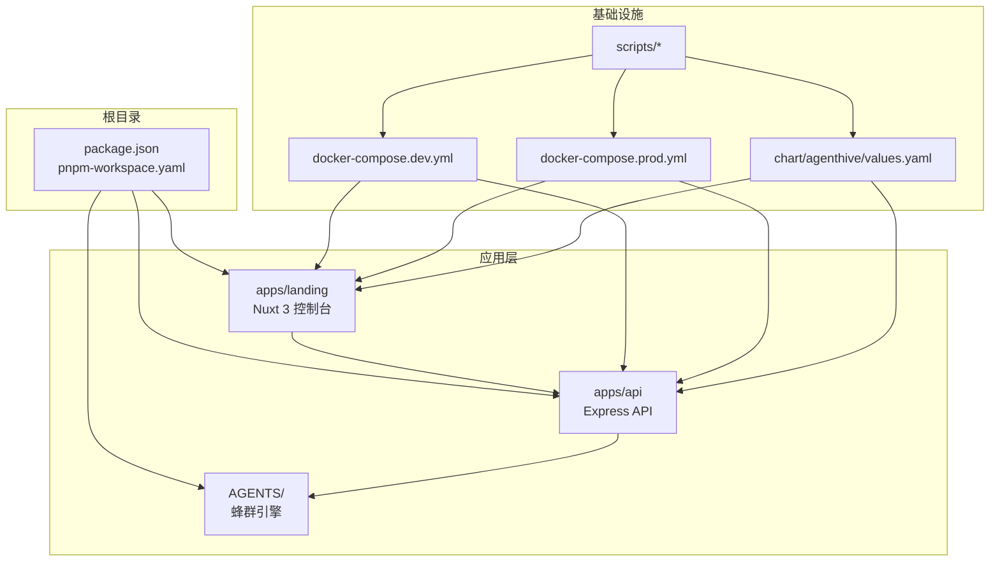
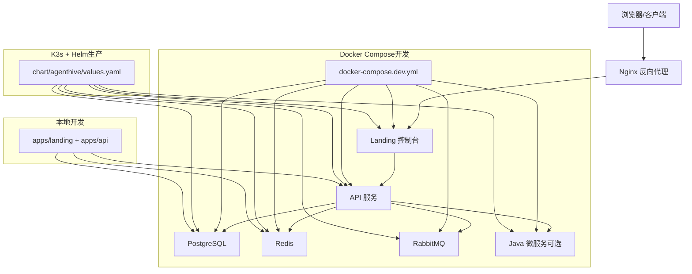
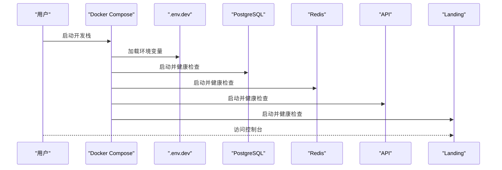
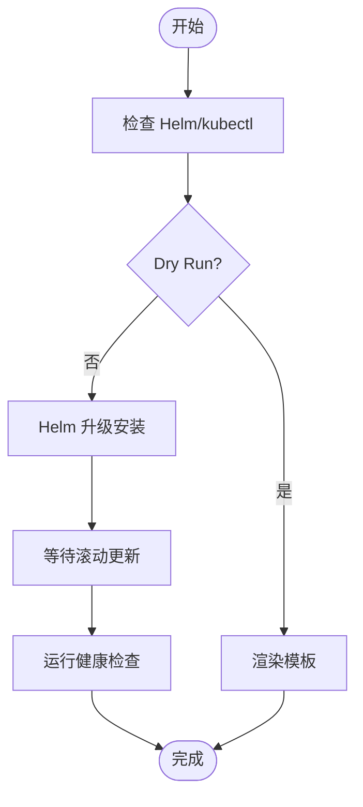
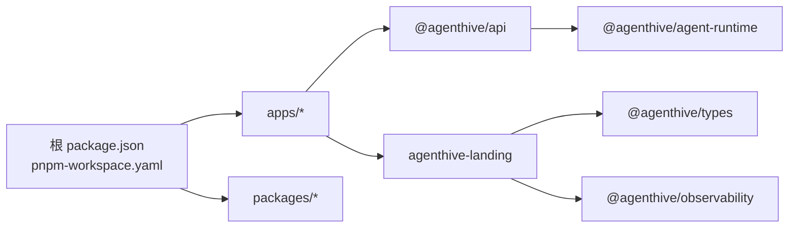

# 快速开始

<cite>
**本文引用的文件**
- [README.md](file://README.md)
- [package.json](file://package.json)
- [pnpm-workspace.yaml](file://pnpm-workspace.yaml)
- [docker-compose.dev.yml](file://docker-compose.dev.yml)
- [docker-compose.prod.yml](file://docker-compose.prod.yml)
- [scripts/dev/setup-dev-env.sh](file://scripts/dev/setup-dev-env.sh)
- [scripts/deploy/deploy-k3s.sh](file://scripts/deploy/deploy-k3s.sh)
- [scripts/ops/health-check-dev.sh](file://scripts/ops/health-check-dev.sh)
- [chart/agenthive/values.yaml](file://chart/agenthive/values.yaml)
- [apps/api/package.json](file://apps/api/package.json)
- [apps/landing/package.json](file://apps/landing/package.json)
</cite>

## 目录
1. [简介](#简介)
2. [项目结构](#项目结构)
3. [核心组件](#核心组件)
4. [架构总览](#架构总览)
5. [详细组件分析](#详细组件分析)
6. [依赖关系分析](#依赖关系分析)
7. [性能注意事项](#性能注意事项)
8. [故障排查指南](#故障排查指南)
9. [结论](#结论)
10. [附录](#附录)

## 简介
本指南面向首次接触 AgentHive Cloud 的用户，帮助你在最短时间内完成环境准备、安装与启动，并掌握三种部署方式：Docker Compose 本地开发模式、K3s + Helm 生产环境部署以及本地开发模式。同时提供常见问题排查与验证方法，确保你能顺利体验平台的蜂群协作能力与可视化控制台。

## 项目结构
AgentHive Cloud 采用多应用分层组织，核心由前端控制台、后端 API、蜂群引擎与基础设施组成。根目录提供统一的包管理与脚本，便于快速安装与开发。

图表来源
- [package.json:1-23](file://package.json#L1-L23)
- [pnpm-workspace.yaml:1-4](file://pnpm-workspace.yaml#L1-L4)
- [docker-compose.dev.yml:1-16](file://docker-compose.dev.yml#L1-L16)
- [docker-compose.prod.yml:1-12](file://docker-compose.prod.yml#L1-L12)
- [chart/agenthive/values.yaml:1-800](file://chart/agenthive/values.yaml#L1-L800)

章节来源
- [README.md:70-102](file://README.md#L70-L102)
- [package.json:6-18](file://package.json#L6-L18)
- [pnpm-workspace.yaml:1-4](file://pnpm-workspace.yaml#L1-L4)

## 核心组件
- 前端控制台（Landing）
  - 基于 Nuxt 3 + Vue 3，提供可视化配置、工作流编排与实时监控面板。
  - 通过 API 层暴露的接口与后端交互。
- 后端 API（API）
  - 基于 Express + TypeScript，提供认证、聊天、任务调度等接口。
  - 内置数据库迁移与消费者任务处理脚本。
- 蜂群引擎（Agents）
  - 任务调度器（Orchestrator）与多种 Worker Agent（后端开发、前端开发、QA 工程师等）。
  - 支持工具注册与 LLM 适配器。
- 基础设施
  - Docker Compose（开发）、K3s + Helm（生产）、Nginx（反向代理）、监控栈（Prometheus/Grafana/Tempo/Loki/OTel）。

章节来源
- [README.md:40-66](file://README.md#L40-L66)
- [apps/landing/package.json:1-58](file://apps/landing/package.json#L1-L58)
- [apps/api/package.json:1-61](file://apps/api/package.json#L1-L61)

## 架构总览
下图展示从浏览器到后端服务、数据库与消息队列的整体链路，以及三种部署方式的差异。

图表来源
- [docker-compose.dev.yml:17-307](file://docker-compose.dev.yml#L17-L307)
- [docker-compose.prod.yml:14-790](file://docker-compose.prod.yml#L14-L790)
- [chart/agenthive/values.yaml:66-395](file://chart/agenthive/values.yaml#L66-L395)

## 详细组件分析

### 环境要求与安装步骤
- 环境要求
  - Node.js 20+
  - Docker 与 Docker Compose
  - pnpm（推荐）
- 安装步骤
  1) 克隆项目
     - 使用 Git 克隆仓库并进入目录。
  2) 安装依赖
     - 在根目录执行 pnpm 安装，一次性安装所有应用与包的依赖。
  3) 配置环境变量
     - 复制示例配置文件并按需填写 LLM、数据库、消息队列等密钥与地址。
- 验证方法
  - 使用健康检查脚本或访问各服务健康端点确认可用性。

章节来源
- [README.md:108-136](file://README.md#L108-L136)
- [package.json:10-18](file://package.json#L10-L18)
- [scripts/dev/setup-dev-env.sh:28-155](file://scripts/dev/setup-dev-env.sh#L28-L155)

### 方式 A：Docker Compose 本地开发模式（推荐新手）
- 启动命令
  - 开发模式：docker compose -f docker-compose.dev.yml --env-file .env.dev up -d
  - 含 Java 微服务：添加 --profile java
  - 含监控：添加 --profile monitoring
- 日志查看
  - docker compose logs -f
- 健康检查
  - 运行 scripts/ops/health-check-dev.sh 获取综合诊断结果。
- 关键服务
  - PostgreSQL、Redis、Nacos、RabbitMQ、API、Landing、Java 微服务（可选）。

图表来源
- [docker-compose.dev.yml:17-307](file://docker-compose.dev.yml#L17-L307)
- [scripts/ops/health-check-dev.sh:114-188](file://scripts/ops/health-check-dev.sh#L114-L188)

章节来源
- [README.md:140-151](file://README.md#L140-L151)
- [docker-compose.dev.yml:17-307](file://docker-compose.dev.yml#L17-L307)
- [scripts/ops/health-check-dev.sh:114-297](file://scripts/ops/health-check-dev.sh#L114-L297)

### 方式 A'：K3s + Helm 生产环境部署（推荐）
- 步骤
  1) 安装 K3s（首次）
  2) 验证 K3s
  3) 部署 AgentHive（Helm）
  4) 验证部署
  5) 回滚（如需要）
- 命令示例
  - 部署：bash scripts/deploy/deploy-k3s.sh
  - 验证：bash scripts/deploy/verify-deployment.sh
- Helm 值文件
  - chart/agenthive/values.yaml 提供默认副本数、探针、Ingress、资源限制等配置。

图表来源
- [scripts/deploy/deploy-k3s.sh:72-136](file://scripts/deploy/deploy-k3s.sh#L72-L136)
- [chart/agenthive/values.yaml:66-395](file://chart/agenthive/values.yaml#L66-L395)

章节来源
- [README.md:153-170](file://README.md#L153-L170)
- [scripts/deploy/deploy-k3s.sh:1-136](file://scripts/deploy/deploy-k3s.sh#L1-L136)
- [chart/agenthive/values.yaml:1-800](file://chart/agenthive/values.yaml#L1-L800)

### 方式 B：本地开发模式
- 启动命令
  - 终端 1：cd apps/landing && npm run dev
  - 终端 2：cd apps/api && npm run dev
- 访问
  - 打开 http://localhost:3000 打开控制台
- 适用场景
  - 需要热更新调试前端与后端逻辑时使用。

章节来源
- [README.md:177-187](file://README.md#L177-L187)

### 验证方法与健康检查
- Docker Compose 开发环境
  - 使用 health-check-dev.sh 对容器状态、HTTP 健康端点、数据库连接、Redis、Nacos、RabbitMQ 进行检查。
- K3s + Helm
  - 部署完成后运行 verify-deployment.sh 或使用 kubectl 检查 Pod 状态与 Ingress。

章节来源
- [scripts/ops/health-check-dev.sh:157-297](file://scripts/ops/health-check-dev.sh#L157-L297)
- [scripts/deploy/deploy-k3s.sh:124-136](file://scripts/deploy/deploy-k3s.sh#L124-L136)

## 依赖关系分析
- 包管理与工作区
  - 根 package.json 声明工作区为 apps/* 与 packages/*，统一执行构建、类型检查与测试。
- 应用间依赖
  - apps/api 依赖 @agenthive/agent-runtime 与可观测性包；apps/landing 依赖 @agenthive/observability、@agenthive/types 等。
- 基础设施依赖
  - Docker Compose 依赖 .env.dev 中的密钥与地址；Helm 依赖 chart/agenthive/values.yaml 中的配置。

图表来源
- [package.json:6-18](file://package.json#L6-L18)
- [pnpm-workspace.yaml:1-4](file://pnpm-workspace.yaml#L1-L4)
- [apps/api/package.json:26-43](file://apps/api/package.json#L26-L43)
- [apps/landing/package.json:18-47](file://apps/landing/package.json#L18-L47)

章节来源
- [package.json:1-23](file://package.json#L1-L23)
- [pnpm-workspace.yaml:1-4](file://pnpm-workspace.yaml#L1-L4)
- [apps/api/package.json:1-61](file://apps/api/package.json#L1-L61)
- [apps/landing/package.json:1-58](file://apps/landing/package.json#L1-L58)

## 性能注意事项
- 资源限制
  - Docker Compose 开发栈为各服务设置了 CPU/内存限制与保留值，避免资源争用。
- HPA 与 PDB
  - Helm 值文件提供水平 Pod 自动伸缩（HPA）与 PodDisruptionBudget（PDB）配置，保障生产稳定性。
- 日志与存储
  - 统一使用 json-file 驱动的日志轮转策略；工作区持久化建议在多节点集群使用 ReadWriteMany 存储类。

章节来源
- [docker-compose.dev.yml:48-56, 93-99, 248-255, 294-300:48-56](file://docker-compose.dev.yml#L48-L56)
- [chart/agenthive/values.yaml:99-121, 251-263, 234-241:99-121](file://chart/agenthive/values.yaml#L99-L121)

## 故障排查指南
- Docker 未安装或守护进程未运行
  - 现象：无法执行 docker compose
  - 处理：安装 Docker 并启动守护进程（Linux/macOS/Windows 操作系统对应命令不同）
- 环境变量缺失
  - 现象：Compose 报错提示变量未设置
  - 处理：运行 scripts/dev/setup-dev-env.sh 自动生成或手动填写 .env.dev
- 服务不可达
  - 现象：HTTP 返回非 200 或 503
  - 处理：使用 health-check-dev.sh 定位具体服务；查看对应容器日志
- 数据库连接失败
  - 现象：psql 连接失败
  - 处理：检查 DB_HOST/DB_PORT/DB_USER/DB_PASSWORD；确认容器健康
- Redis 无 PONG
  - 现象：redis-cli ping 失败
  - 处理：确认 REDIS_PASSWORD；查看 Redis 容器日志
- Nacos 服务未注册
  - 现象：Nacos API 返回非 200 或服务未注册
  - 处理：检查 NACOS_* 凭据与服务启动顺序
- RabbitMQ 管理 API 不可用
  - 现象：15672 端口返回非 200
  - 处理：核对 RABBITMQ_USER/PASSWORD；查看 RabbitMQ 容器日志

章节来源
- [scripts/ops/health-check-dev.sh:97-112](file://scripts/ops/health-check-dev.sh#L97-L112)
- [scripts/dev/setup-dev-env.sh:36-49](file://scripts/dev/setup-dev-env.sh#L36-L49)
- [scripts/ops/health-check-dev.sh:190-221](file://scripts/ops/health-check-dev.sh#L190-L221)
- [scripts/ops/health-check-dev.sh:223-252](file://scripts/ops/health-check-dev.sh#L223-L252)
- [scripts/ops/health-check-dev.sh:254-264](file://scripts/ops/health-check-dev.sh#L254-L264)

## 结论
通过本指南，你可以基于 Docker Compose 快速完成本地开发验证，或使用 K3s + Helm 在生产环境中稳定部署。配合健康检查脚本与环境变量初始化脚本，能够有效降低环境问题带来的试错成本。建议先以 Docker Compose 验证功能，再过渡到 Helm 以获得更接近生产的部署体验。

## 附录
- 常用命令速查
  - 安装依赖：pnpm -r install
  - 开发启动（Compose）：docker compose -f docker-compose.dev.yml --env-file .env.dev up -d
  - 开发启动（本地）：cd apps/landing && npm run dev；cd apps/api && npm run dev
  - K3s 部署：bash scripts/deploy/deploy-k3s.sh
  - 健康检查（Compose）：bash scripts/ops/health-check-dev.sh
- 参考文档
  - README.md 中的“技术栈”“部署文档导航”等章节提供了进一步阅读路径。