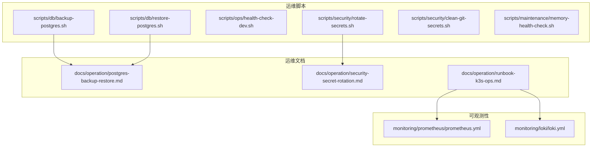
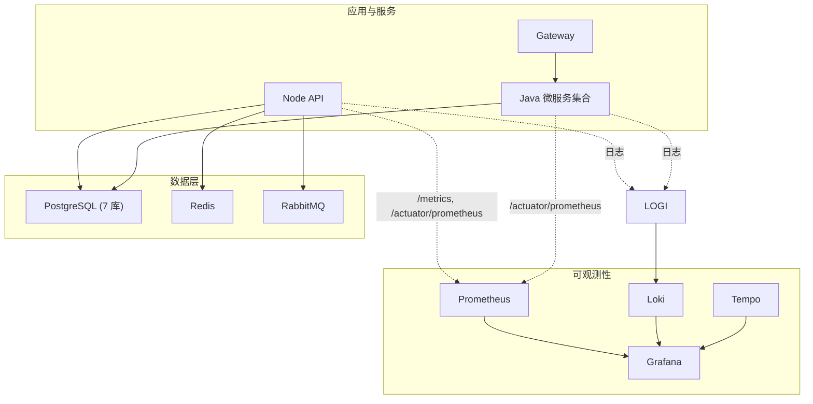
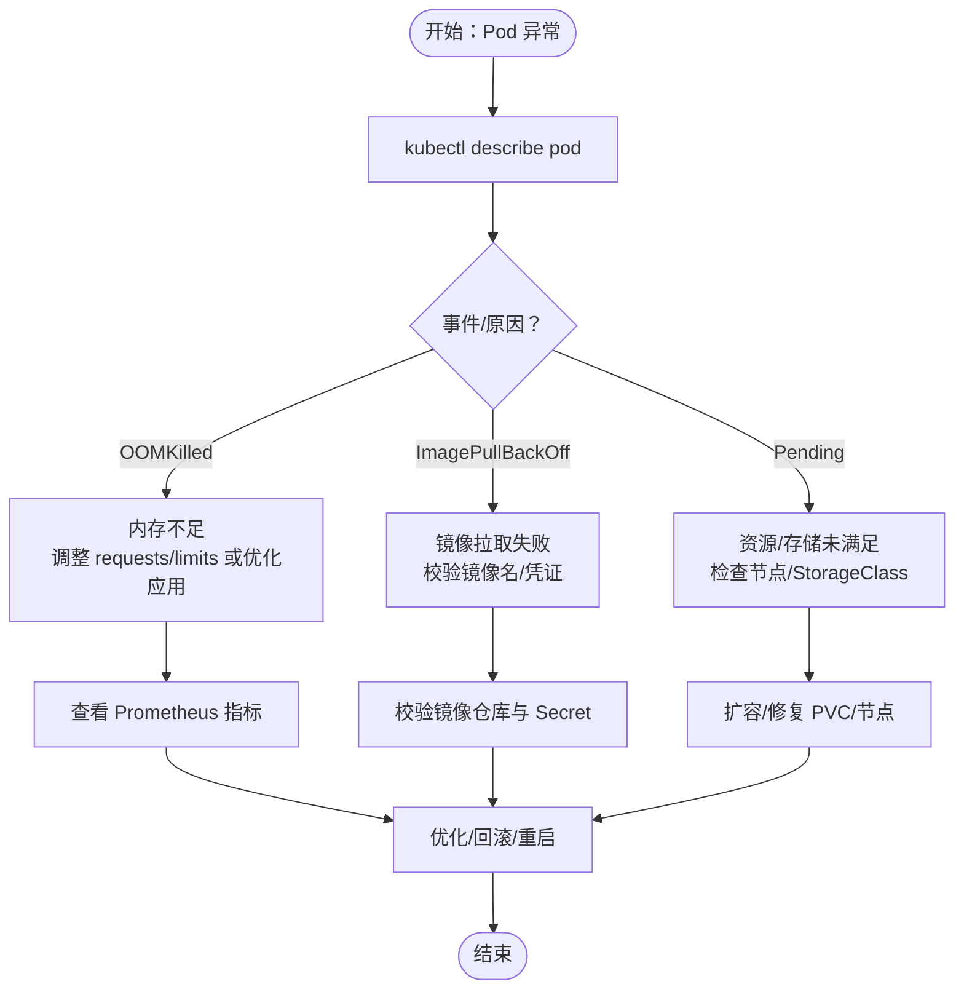
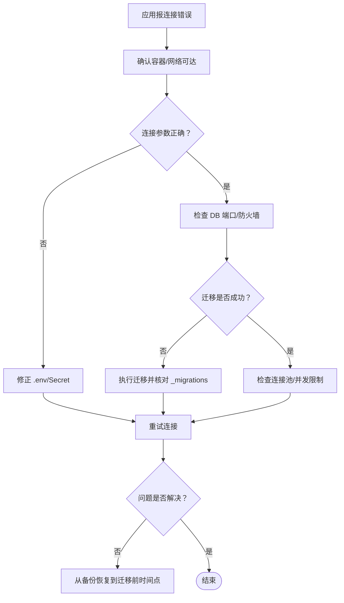
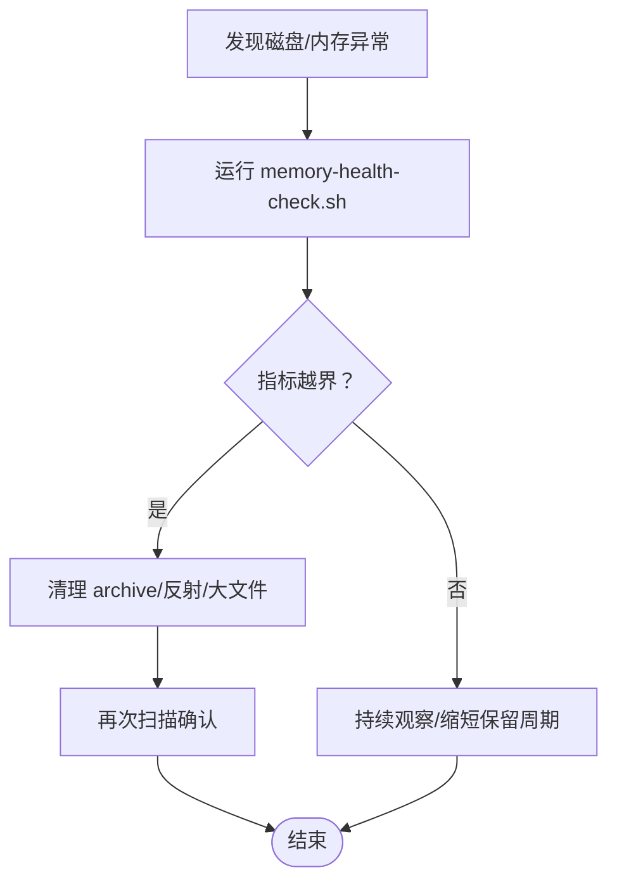
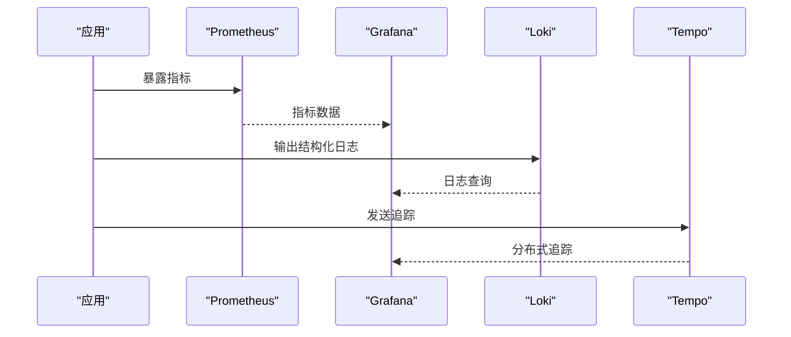
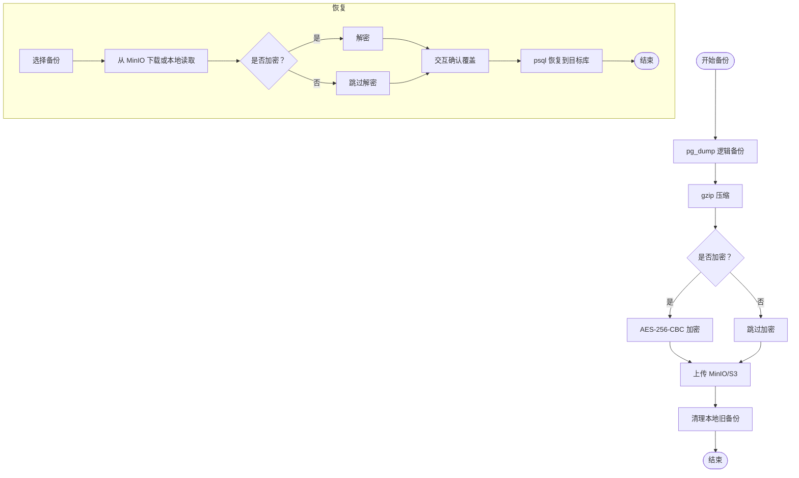
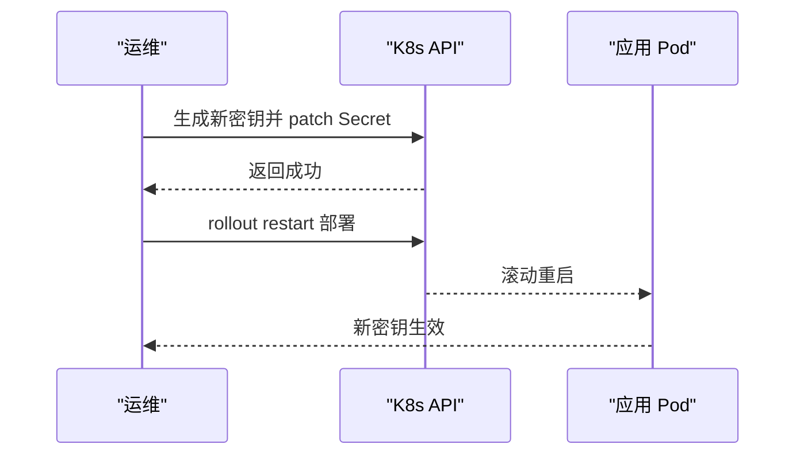
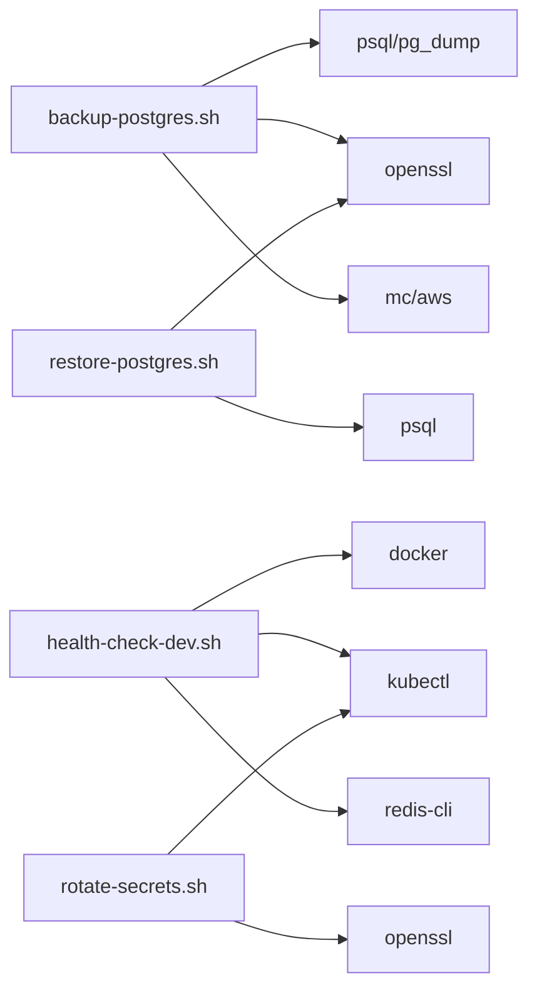

# 故障排除与维护

<cite>
**本文引用的文件**
- [postgres 备份与恢复操作手册](file://docs/operation/postgres-backup-restore.md)
- [Secret 安全管理与轮换 SOP](file://docs/operation/security-secret-rotation.md)
- [K3s 运维手册（Runbook）](file://docs/operation/runbook-k3s-ops.md)
- [内存健康检查脚本（Bash）](file://scripts/maintenance/memory-health-check.sh)
- [PostgreSQL 自动备份脚本](file://scripts/db/backup-postgres.sh)
- [PostgreSQL 单库恢复脚本](file://scripts/db/restore-postgres.sh)
- [开发环境健康检查脚本](file://scripts/ops/health-check-dev.sh)
- [Secret 轮换脚本](file://scripts/security/rotate-secrets.sh)
- [Git Secret 清理脚本](file://scripts/security/clean-git-secrets.sh)
- [Prometheus 配置](file://monitoring/prometheus/prometheus.yml)
- [Loki 配置](file://monitoring/loki/loki.yml)
- [AgentHive Cloud 协作规范（可观测与运维要点）](file://AGENT_COLLABORATION_SPEC.md)
- [CI 已知问题 TODO](file://apps/TODO_CI_FIXES.md)
- [安全公告（预防清单）](file://SECURITY_NOTICE.md)
- [发布说明（安全加固）](file://RELEASE.md)
</cite>

## 目录
1. [简介](#简介)
2. [项目结构与运维入口](#项目结构与运维入口)
3. [核心组件与职责](#核心组件与职责)
4. [架构总览与可观测栈](#架构总览与可观测栈)
5. [详细组件分析与排障流程](#详细组件分析与排障流程)
6. [依赖关系与集成点](#依赖关系与集成点)
7. [性能与容量规划](#性能与容量规划)
8. [故障排除指南](#故障排除指南)
9. [结论](#结论)
10. [附录：操作清单与最佳实践](#附录操作清单与最佳实践)

## 简介
本指南面向平台运维与开发团队，聚焦 AgentHive Cloud 的故障排除与日常维护。内容涵盖服务启动失败、数据库连接问题、内存与磁盘膨胀、性能瓶颈定位；提供自动化健康检查与监控指标解读；阐述数据备份恢复流程、密钥轮换与 Git 历史清理；给出日志分析技巧、根因分析流程与性能调优建议，并汇总运维手册、操作指南与最佳实践。

## 项目结构与运维入口
- 运维脚本集中于 scripts/ 目录，按领域划分：db、maintenance、ops、security。
- 运维文档集中在 docs/operation/，包含备份恢复、密钥轮换、K3s 运维手册等。
- 可观测性配置位于 monitoring/，包含 Prometheus、Loki、Grafana/Tempos 等。
- 协作规范与快速参考位于 AGENT_COLLABORATION_SPEC.md，提供一键诊断、紧急操作与 Helm 差距清单。

**图表来源**
- [PostgreSQL 自动备份脚本:1-123](file://scripts/db/backup-postgres.sh#L1-L123)
- [PostgreSQL 单库恢复脚本:1-116](file://scripts/db/restore-postgres.sh#L1-L116)
- [开发环境健康检查脚本:1-297](file://scripts/ops/health-check-dev.sh#L1-L297)
- [Secret 轮换脚本:1-108](file://scripts/security/rotate-secrets.sh#L1-L108)
- [Git Secret 清理脚本:1-130](file://scripts/security/clean-git-secrets.sh#L1-L130)
- [内存健康检查脚本（Bash）:1-69](file://scripts/maintenance/memory-health-check.sh#L1-L69)
- [PostgreSQL 备份与恢复操作手册:1-148](file://docs/operation/postgres-backup-restore.md#L1-L148)
- [Secret 安全管理与轮换 SOP:1-130](file://docs/operation/security-secret-rotation.md#L1-L130)
- [K3s 运维手册（Runbook）:1-222](file://docs/operation/runbook-k3s-ops.md#L1-L222)
- [Prometheus 配置:1-85](file://monitoring/prometheus/prometheus.yml#L1-L85)
- [Loki 配置:1-113](file://monitoring/loki/loki.yml#L1-L113)

**章节来源**
- [AgentHive Cloud 协作规范（可观测与运维要点）:446-659](file://AGENT_COLLABORATION_SPEC.md#L446-L659)

## 核心组件与职责
- 数据库层：PostgreSQL 多实例（Node API 主库与 Java 微服务库），支持自动逻辑备份、压缩、加密与 MinIO 对象存储归档。
- 配置与密钥：K8s Secret 与 External Secrets Operator（可选阿里云 KMS），支持密钥轮换与 Git 历史清理。
- 可观测性：Prometheus 抓取 Java Actuator 指标，Loki 收集日志，Grafana/Tempo 提供可视化与分布式追踪。
- 开发与生产环境：Docker Compose 与 K3s/Kubernetes，配套健康检查、回滚与紧急操作流程。

**章节来源**
- [PostgreSQL 备份与恢复操作手册:1-148](file://docs/operation/postgres-backup-restore.md#L1-L148)
- [Secret 安全管理与轮换 SOP:1-130](file://docs/operation/security-secret-rotation.md#L1-L130)
- [K3s 运维手册（Runbook）:1-222](file://docs/operation/runbook-k3s-ops.md#L1-L222)
- [Prometheus 配置:1-85](file://monitoring/prometheus/prometheus.yml#L1-L85)
- [Loki 配置:1-113](file://monitoring/loki/loki.yml#L1-L113)

## 架构总览与可观测栈

**图表来源**
- [Prometheus 配置:45-80](file://monitoring/prometheus/prometheus.yml#L45-L80)
- [Loki 配置:1-113](file://monitoring/loki/loki.yml#L1-L113)
- [K3s 运维手册（Runbook）:204-212](file://docs/operation/runbook-k3s-ops.md#L204-L212)

## 详细组件分析与排障流程

### 服务启动失败（Kubernetes）
- 常见症状：Pod 处于 CrashLoopBackOff、Pending、ImagePullBackOff。
- 诊断步骤：
  - 查看 Pod 事件与描述，定位资源限制、Secret 缺失、镜像拉取失败、PVC 绑定等问题。
  - 使用 stern 或 kubectl logs 获取最近日志，结合 Grafana/Prometheus 指标判断是内存、CPU、还是 I/O 瓶颈。
  - 若为回滚窗口，优先执行 helm rollback 或脚本回滚。
- 紧急操作：必要时强制删除卡住的 Pod，或执行滚动重启以加载新 Secret。

**图表来源**
- [K3s 运维手册（Runbook）:64-122](file://docs/operation/runbook-k3s-ops.md#L64-L122)

**章节来源**
- [K3s 运维手册（Runbook）:64-122](file://docs/operation/runbook-k3s-ops.md#L64-L122)

### 数据库连接问题（PostgreSQL）
- 现象：应用侧报连接超时、认证失败、迁移未生效。
- 诊断与修复：
  - 使用内置健康检查脚本验证容器连通性与数据库存在性。
  - 核对 .env 中 DB_HOST/PORT/USER/PASSWORD，确保与 docker-compose 或 K8s Secret 一致。
  - 若为迁移导致的约束冲突，遵循规范中的 PG 16 兼容写法与迁移清单。
- 恢复与回滚：通过备份脚本选择合适时间点恢复，或回退 Helm 版本。

**图表来源**
- [开发环境健康检查脚本:189-211](file://scripts/ops/health-check-dev.sh#L189-L211)
- [PostgreSQL 备份与恢复操作手册:81-110](file://docs/operation/postgres-backup-restore.md#L81-L110)
- [AgentHive Cloud 协作规范（可观测与运维要点）:298-332](file://AGENT_COLLABORATION_SPEC.md#L298-L332)

**章节来源**
- [开发环境健康检查脚本:189-211](file://scripts/ops/health-check-dev.sh#L189-L211)
- [PostgreSQL 备份与恢复操作手册:81-110](file://docs/operation/postgres-backup-restore.md#L81-L110)
- [AgentHive Cloud 协作规范（可观测与运维要点）:298-332](file://AGENT_COLLABORATION_SPEC.md#L298-L332)

### 内存泄漏与磁盘膨胀（工作区与记忆）
- 现象：工作区文件过多、反射/技能/episode 数量异常增长，磁盘占用上升。
- 诊断与修复：
  - 使用内存健康检查脚本评估 active 反射、技能草稿/官方数量、archive 大小与 episodes 数量。
  - 定期清理过期反射与归档，压缩大文件，避免 lessons-learned.md 无限膨胀。
  - 对于 CI/构建产物，定期清理 node_modules 与缓存目录。

**图表来源**
- [内存健康检查脚本（Bash）:1-69](file://scripts/maintenance/memory-health-check.sh#L1-L69)

**章节来源**
- [内存健康检查脚本（Bash）:1-69](file://scripts/maintenance/memory-health-check.sh#L1-L69)

### 性能瓶颈定位（指标与工具）
- 指标关注：
  - CPU/内存使用率、Pod OOM 次数、请求延迟分位数、错误率。
  - Java Actuator 指标（/actuator/prometheus）、Node API /metrics。
- 工具链：
  - Prometheus 查询、Grafana 仪表盘、Loki 日志检索、Tempo 分布式追踪。
- 建议：
  - 合理设置 HPA、PDB、资源 requests/limits。
  - 对热点接口增加缓存、异步化消息队列处理。

**图表来源**
- [Prometheus 配置:1-85](file://monitoring/prometheus/prometheus.yml#L1-L85)
- [Loki 配置:1-113](file://monitoring/loki/loki.yml#L1-L113)
- [K3s 运维手册（Runbook）:204-212](file://docs/operation/runbook-k3s-ops.md#L204-L212)

**章节来源**
- [Prometheus 配置:1-85](file://monitoring/prometheus/prometheus.yml#L1-L85)
- [Loki 配置:1-113](file://monitoring/loki/loki.yml#L1-L113)
- [K3s 运维手册（Runbook）:204-212](file://docs/operation/runbook-k3s-ops.md#L204-L212)

### 数据备份与恢复流程
- 自动备份：每日 UTC 02:00 全量逻辑备份，压缩+加密，上传 MinIO；本地与 MinIO 各保留 7 天。
- 手动备份：单库备份到本地，便于快速验证。
- 恢复流程：从本地或 MinIO 下载备份，解密（如加密），确认覆盖风险后执行 psql 恢复。
- 紧急全量恢复：批量恢复多个数据库。

**图表来源**
- [PostgreSQL 自动备份脚本:1-123](file://scripts/db/backup-postgres.sh#L1-L123)
- [PostgreSQL 单库恢复脚本:1-116](file://scripts/db/restore-postgres.sh#L1-L116)
- [PostgreSQL 备份与恢复操作手册:1-148](file://docs/operation/postgres-backup-restore.md#L1-L148)

**章节来源**
- [PostgreSQL 备份与恢复操作手册:1-148](file://docs/operation/postgres-backup-restore.md#L1-L148)
- [PostgreSQL 自动备份脚本:1-123](file://scripts/db/backup-postgres.sh#L1-L123)
- [PostgreSQL 单库恢复脚本:1-116](file://scripts/db/restore-postgres.sh#L1-L116)

### 密钥轮换与安全基线
- 轮换流程：脚本生成新值并 patch Secret，随后滚动重启应用以加载新密钥。
- Git 历史清理：使用 BFG 清理历史中的敏感信息，强制推送后要求所有协作者重新克隆。
- 安全基线：密钥通过 Secret 注入、最小权限、定期轮换、禁止硬编码。

**图表来源**
- [Secret 轮换脚本:1-108](file://scripts/security/rotate-secrets.sh#L1-L108)
- [Secret 安全管理与轮换 SOP:1-130](file://docs/operation/security-secret-rotation.md#L1-L130)
- [Git Secret 清理脚本:1-130](file://scripts/security/clean-git-secrets.sh#L1-L130)

**章节来源**
- [Secret 轮换脚本:1-108](file://scripts/security/rotate-secrets.sh#L1-L108)
- [Secret 安全管理与轮换 SOP:1-130](file://docs/operation/security-secret-rotation.md#L1-L130)
- [Git Secret 清理脚本:1-130](file://scripts/security/clean-git-secrets.sh#L1-L130)

### 日志分析与根因分析
- 日志采集：应用输出结构化日志，Loki 采集并持久化；Grafana Loki DataSource 可查询。
- 分析技巧：
  - 使用时间窗口与标签过滤（level、trace_id、service、instance）。
  - 结合 Prometheus 指标与 Tempo 追踪，定位慢请求与异常堆栈。
- 根因分析流程：
  - 快速收敛：抓取最近 N 条错误日志与对应时间窗指标。
  - 关联分析：对比上游依赖（DB、MQ、Redis）状态。
  - 验证修复：灰度发布或回滚后观察日志与指标变化。

**章节来源**
- [Loki 配置:1-113](file://monitoring/loki/loki.yml#L1-L113)
- [K3s 运维手册（Runbook）:204-212](file://docs/operation/runbook-k3s-ops.md#L204-L212)

## 依赖关系与集成点
- 脚本依赖：
  - 备份/恢复脚本依赖 openssl、mc 或 aws cli、psql。
  - 健康检查脚本依赖 curl、docker、kubectl、redis-cli。
  - 轮换脚本依赖 kubectl、openssl。
- 集成点：
  - Prometheus 通过 /actuator/prometheus 抓取 Java 指标。
  - Loki 与 OpenTelemetry LogRecordExporter 配合，统一日志格式。
  - 外部密钥管理（可选）：External Secrets Operator + 阿里云 KMS。

**图表来源**
- [PostgreSQL 自动备份脚本:1-123](file://scripts/db/backup-postgres.sh#L1-L123)
- [PostgreSQL 单库恢复脚本:1-116](file://scripts/db/restore-postgres.sh#L1-L116)
- [开发环境健康检查脚本:1-297](file://scripts/ops/health-check-dev.sh#L1-L297)
- [Secret 轮换脚本:1-108](file://scripts/security/rotate-secrets.sh#L1-L108)

**章节来源**
- [PostgreSQL 自动备份脚本:1-123](file://scripts/db/backup-postgres.sh#L1-L123)
- [PostgreSQL 单库恢复脚本:1-116](file://scripts/db/restore-postgres.sh#L1-L116)
- [开发环境健康检查脚本:1-297](file://scripts/ops/health-check-dev.sh#L1-L297)
- [Secret 轮换脚本:1-108](file://scripts/security/rotate-secrets.sh#L1-L108)

## 性能与容量规划
- 指标阈值与健康检查：
  - 参考协作规范中的健康阈值与定期维护建议，结合 Prometheus/Grafana 持续监控。
- 扩容策略：
  - HPA 动态扩缩容，PDB 保障可用性；必要时手动扩容临时副本。
  - 对 IO 密集型场景（DB、日志存储）优先考虑独立 PVC 与更高 IOPS。
- 调优建议：
  - 合理设置容器资源 requests/limits，避免 OOM。
  - 对热点数据引入缓存，对长尾任务使用消息队列异步化。
  - 定期清理日志与备份，避免磁盘打满。

**章节来源**
- [AgentHive Cloud 协作规范（可观测与运维要点）:446-659](file://AGENT_COLLABORATION_SPEC.md#L446-L659)
- [K3s 运维手册（Runbook）:171-181](file://docs/operation/runbook-k3s-ops.md#L171-L181)

## 故障排除指南
- 一键诊断与紧急操作：
  - 集群状态快照、API 错误定位、DB 迁移状态检查、本地连通性验证。
  - Helm 卡住回滚、Pod 强制删除、deployment 回滚。
- 常见问题与处置：
  - 服务不可用：先回滚，再验证；检查 Secret、网络策略、资源配额。
  - 数据库异常：确认连接参数、迁移状态、备份可用性。
  - 日志/指标异常：检查 Loki/Prometheus 配置、采集目标与标签。

**章节来源**
- [AgentHive Cloud 协作规范（可观测与运维要点）:607-640](file://AGENT_COLLABORATION_SPEC.md#L607-L640)
- [K3s 运维手册（Runbook）:126-167](file://docs/operation/runbook-k3s-ops.md#L126-L167)

## 结论
通过标准化的运维脚本、完善的可观测性体系与严格的密钥/备份治理，AgentHive Cloud 能够在开发与生产环境中实现快速定位问题、降低停机时间并提升稳定性。建议将健康检查纳入 CI/CD，定期演练备份恢复与密钥轮换，持续优化容量与性能。

## 附录：操作清单与最佳实践
- 运维清单
  - 每日：运行健康检查脚本，查看 Prometheus/Grafana 指标与 Loki 日志。
  - 每周：清理工作区与归档，检查内存健康脚本输出。
  - 每月：执行一次全库备份验证与密钥轮换演练。
- 最佳实践
  - 严格区分开发/生产环境，使用不同 values 与 Secret 管理策略。
  - 所有敏感信息通过 Secret 注入，禁止硬编码。
  - 迁移与配置变更走变更流程，配合 Helm 与 GitOps。
  - 对关键路径进行压力测试与容量规划，预留安全余量。

**章节来源**
- [AgentHive Cloud 协作规范（可观测与运维要点）:446-659](file://AGENT_COLLABORATION_SPEC.md#L446-L659)
- [CI 已知问题 TODO:1-23](file://apps/TODO_CI_FIXES.md#L1-L23)
- [安全公告（预防清单）:52-66](file://SECURITY_NOTICE.md#L52-L66)
- [发布说明（安全加固）:25-39](file://RELEASE.md#L25-L39)