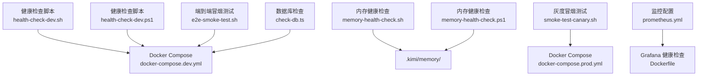
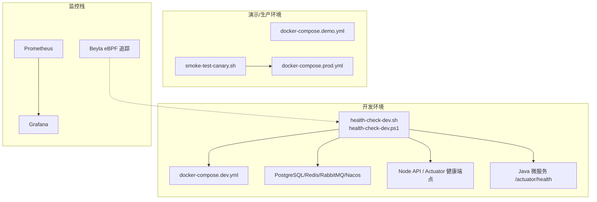
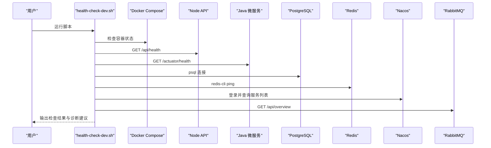
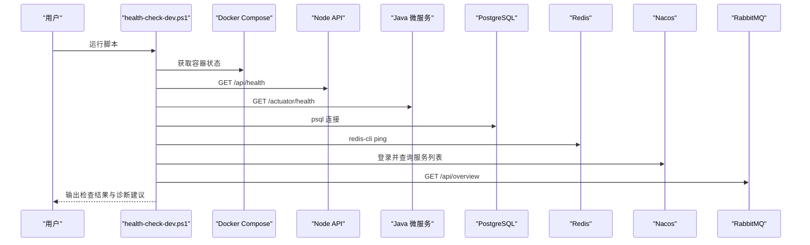
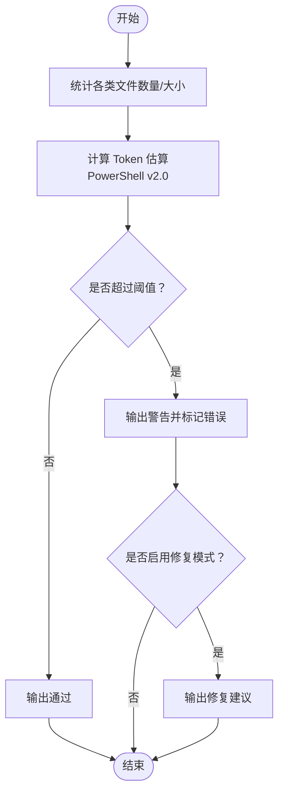
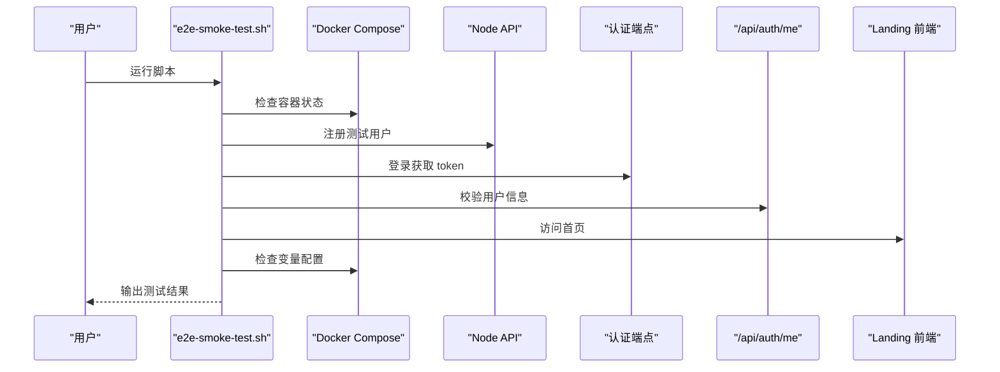
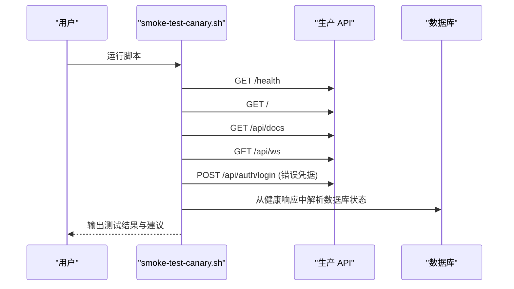
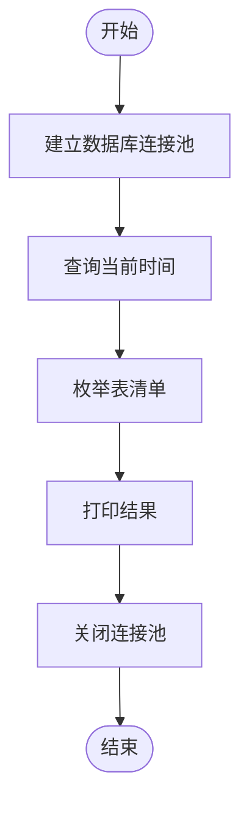
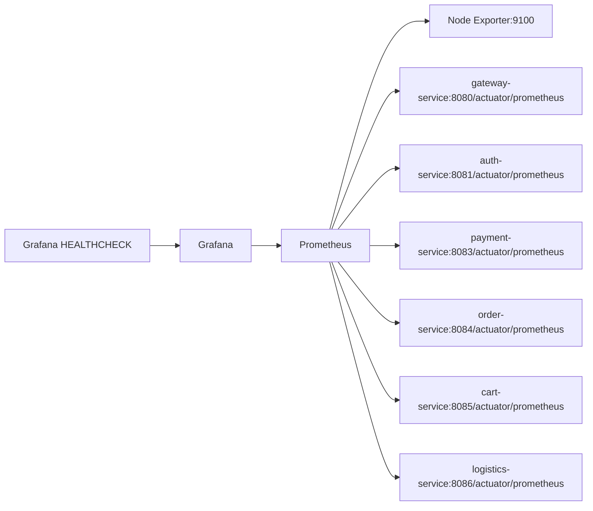
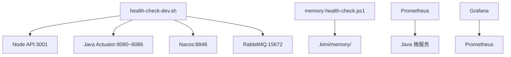

# 系统健康检查

<cite>
**本文引用的文件**
- [scripts/ops/health-check-dev.sh](file://scripts/ops/health-check-dev.sh)
- [scripts/ops/health-check-dev.ps1](file://scripts/ops/health-check-dev.ps1)
- [scripts/maintenance/memory-health-check.sh](file://scripts/maintenance/memory-health-check.sh)
- [scripts/maintenance/memory-health-check.ps1](file://scripts/maintenance/memory-health-check.ps1)
- [scripts/test/e2e-smoke-test.sh](file://scripts/test/e2e-smoke-test.sh)
- [scripts/deploy/smoke-test-canary.sh](file://scripts/deploy/smoke-test-canary.sh)
- [apps/api/scripts/check-db.ts](file://apps/api/scripts/check-db.ts)
- [docker-compose.dev.yml](file://docker-compose.dev.yml)
- [docker-compose.demo.yml](file://docker-compose.demo.yml)
- [docker-compose.prod.yml](file://docker-compose.prod.yml)
- [monitoring/prometheus/prometheus.yml](file://monitoring/prometheus/prometheus.yml)
- [monitoring/grafana/Dockerfile](file://monitoring/grafana/Dockerfile)
- [AGENTS.md](file://AGENTS.md)
- [README.md](file://README.md)
</cite>

## 目录
1. [简介](#简介)
2. [项目结构](#项目结构)
3. [核心组件](#核心组件)
4. [架构总览](#架构总览)
5. [详细组件分析](#详细组件分析)
6. [依赖关系分析](#依赖关系分析)
7. [性能考虑](#性能考虑)
8. [故障排查指南](#故障排查指南)
9. [结论](#结论)
10. [附录](#附录)

## 简介
本指南面向运维与开发人员，系统性说明如何使用仓库中的自动化脚本对 AgentHive Cloud 的开发与生产环境进行健康检查。内容覆盖：
- API 服务可用性检查
- 数据库连接检查
- 消息队列与服务注册中心检查
- 各微服务健康状态检测
- 健康检查脚本的工作原理、检查指标与阈值设置
- 手动检查方法与故障诊断流程
- 常见失败原因与解决方案
- 如何设置定期健康检查任务

## 项目结构
围绕健康检查的关键文件与目录如下：
- 开发环境健康检查脚本：bash 与 PowerShell 双版本
- 内存健康检查脚本：基于文件数与 Token 估算
- 端到端冒烟测试与灰度冒烟测试
- 数据库连接检查脚本
- Docker Compose 配置（开发/演示/生产）
- 监控栈配置（Prometheus/Grafana）

**图表来源**
- [scripts/ops/health-check-dev.sh:1-297](file://scripts/ops/health-check-dev.sh#L1-L297)
- [scripts/ops/health-check-dev.ps1:1-328](file://scripts/ops/health-check-dev.ps1#L1-L328)
- [scripts/maintenance/memory-health-check.sh:1-69](file://scripts/maintenance/memory-health-check.sh#L1-L69)
- [scripts/maintenance/memory-health-check.ps1:1-151](file://scripts/maintenance/memory-health-check.ps1#L1-L151)
- [scripts/test/e2e-smoke-test.sh:1-218](file://scripts/test/e2e-smoke-test.sh#L1-L218)
- [scripts/deploy/smoke-test-canary.sh:1-100](file://scripts/deploy/smoke-test-canary.sh#L1-L100)
- [apps/api/scripts/check-db.ts:1-13](file://apps/api/scripts/check-db.ts#L1-L13)
- [docker-compose.dev.yml:1-900](file://docker-compose.dev.yml#L1-L900)
- [docker-compose.prod.yml:600-750](file://docker-compose.prod.yml#L600-L750)
- [monitoring/prometheus/prometheus.yml:1-85](file://monitoring/prometheus/prometheus.yml#L1-L85)
- [monitoring/grafana/Dockerfile:1-58](file://monitoring/grafana/Dockerfile#L1-L58)

**章节来源**
- [scripts/ops/health-check-dev.sh:1-297](file://scripts/ops/health-check-dev.sh#L1-L297)
- [scripts/ops/health-check-dev.ps1:1-328](file://scripts/ops/health-check-dev.ps1#L1-L328)
- [scripts/maintenance/memory-health-check.sh:1-69](file://scripts/maintenance/memory-health-check.sh#L1-L69)
- [scripts/maintenance/memory-health-check.ps1:1-151](file://scripts/maintenance/memory-health-check.ps1#L1-L151)
- [scripts/test/e2e-smoke-test.sh:1-218](file://scripts/test/e2e-smoke-test.sh#L1-L218)
- [scripts/deploy/smoke-test-canary.sh:1-100](file://scripts/deploy/smoke-test-canary.sh#L1-L100)
- [apps/api/scripts/check-db.ts:1-13](file://apps/api/scripts/check-db.ts#L1-L13)
- [docker-compose.dev.yml:1-900](file://docker-compose.dev.yml#L1-L900)
- [docker-compose.prod.yml:600-750](file://docker-compose.prod.yml#L600-L750)
- [monitoring/prometheus/prometheus.yml:1-85](file://monitoring/prometheus/prometheus.yml#L1-L85)
- [monitoring/grafana/Dockerfile:1-58](file://monitoring/grafana/Dockerfile#L1-L58)

## 核心组件
- 开发环境健康检查脚本（bash 与 PowerShell）：检查容器状态、服务健康端点、数据库、缓存、服务注册中心与消息队列。
- 内存健康检查脚本：评估知识库目录的健康状况，基于阈值给出警告或通过。
- 端到端冒烟测试：验证登录、令牌解析、用户信息等关键路径。
- 灰度冒烟测试：在 canary 环境验证核心链路。
- 数据库检查脚本：验证数据库连接与表清单。
- 监控栈：Prometheus 抓取指标，Grafana 提供可视化与健康检查。

**章节来源**
- [scripts/ops/health-check-dev.sh:1-297](file://scripts/ops/health-check-dev.sh#L1-L297)
- [scripts/ops/health-check-dev.ps1:1-328](file://scripts/ops/health-check-dev.ps1#L1-L328)
- [scripts/maintenance/memory-health-check.sh:1-69](file://scripts/maintenance/memory-health-check.sh#L1-L69)
- [scripts/maintenance/memory-health-check.ps1:1-151](file://scripts/maintenance/memory-health-check.ps1#L1-L151)
- [scripts/test/e2e-smoke-test.sh:1-218](file://scripts/test/e2e-smoke-test.sh#L1-L218)
- [scripts/deploy/smoke-test-canary.sh:1-100](file://scripts/deploy/smoke-test-canary.sh#L1-L100)
- [apps/api/scripts/check-db.ts:1-13](file://apps/api/scripts/check-db.ts#L1-L13)
- [monitoring/prometheus/prometheus.yml:1-85](file://monitoring/prometheus/prometheus.yml#L1-L85)
- [monitoring/grafana/Dockerfile:1-58](file://monitoring/grafana/Dockerfile#L1-L58)

## 架构总览
健康检查体系由“本地脚本 + 容器编排 + 监控栈”构成，覆盖开发、演示与生产环境。

**图表来源**
- [scripts/ops/health-check-dev.sh:1-297](file://scripts/ops/health-check-dev.sh#L1-L297)
- [scripts/ops/health-check-dev.ps1:1-328](file://scripts/ops/health-check-dev.ps1#L1-L328)
- [scripts/deploy/smoke-test-canary.sh:1-100](file://scripts/deploy/smoke-test-canary.sh#L1-L100)
- [docker-compose.dev.yml:1-900](file://docker-compose.dev.yml#L1-L900)
- [docker-compose.demo.yml:230-334](file://docker-compose.demo.yml#L230-L334)
- [docker-compose.prod.yml:639-743](file://docker-compose.prod.yml#L639-L743)
- [monitoring/prometheus/prometheus.yml:1-85](file://monitoring/prometheus/prometheus.yml#L1-L85)
- [monitoring/grafana/Dockerfile:1-58](file://monitoring/grafana/Dockerfile#L1-L58)

## 详细组件分析

### 开发环境健康检查脚本（bash）
该脚本用于开发环境，执行以下检查：
- 环境与 Compose 配置校验（变量未设置警告）
- 容器运行状态检查（postgres、redis、nacos、rabbitmq、api、landing、各 Java 微服务、nginx）
- HTTP 健康端点检查（Node API 与各 Java 服务的 /actuator/health）
- 数据库连接检查（psql 连接多个业务库）
- 缓存连接检查（redis-cli ping）
- 服务注册中心检查（Nacos 登录与服务列表）
- 消息队列管理端检查（RabbitMQ Management API）

**图表来源**
- [scripts/ops/health-check-dev.sh:1-297](file://scripts/ops/health-check-dev.sh#L1-L297)

**章节来源**
- [scripts/ops/health-check-dev.sh:1-297](file://scripts/ops/health-check-dev.sh#L1-L297)

### 开发环境健康检查脚本（PowerShell）
与 Bash 版本功能一致，但使用 PowerShell 实现，便于 Windows 环境使用。

**图表来源**
- [scripts/ops/health-check-dev.ps1:1-328](file://scripts/ops/health-check-dev.ps1#L1-L328)

**章节来源**
- [scripts/ops/health-check-dev.ps1:1-328](file://scripts/ops/health-check-dev.ps1#L1-L328)

### 内存健康检查脚本
- Bash 版本：按文件数与大小计算阈值，输出警告或通过。
- PowerShell 版本：基于 Token 估算，提供更细粒度的单文件限制与修复建议。

**图表来源**
- [scripts/maintenance/memory-health-check.sh:1-69](file://scripts/maintenance/memory-health-check.sh#L1-L69)
- [scripts/maintenance/memory-health-check.ps1:1-151](file://scripts/maintenance/memory-health-check.ps1#L1-L151)

**章节来源**
- [scripts/maintenance/memory-health-check.sh:1-69](file://scripts/maintenance/memory-health-check.sh#L1-L69)
- [scripts/maintenance/memory-health-check.ps1:1-151](file://scripts/maintenance/memory-health-check.ps1#L1-L151)

### 端到端冒烟测试
覆盖容器健康、用户注册/登录、JWT 载荷校验、用户信息获取与前端 Landing 页面访问，并检查 Compose 变量配置。

**图表来源**
- [scripts/test/e2e-smoke-test.sh:1-218](file://scripts/test/e2e-smoke-test.sh#L1-L218)

**章节来源**
- [scripts/test/e2e-smoke-test.sh:1-218](file://scripts/test/e2e-smoke-test.sh#L1-L218)

### 灰度冒烟测试
在 canary 环境验证健康检查、静态资源、API 文档、WebSocket、认证链路与数据库连通性。

**图表来源**
- [scripts/deploy/smoke-test-canary.sh:1-100](file://scripts/deploy/smoke-test-canary.sh#L1-L100)

**章节来源**
- [scripts/deploy/smoke-test-canary.sh:1-100](file://scripts/deploy/smoke-test-canary.sh#L1-L100)

### 数据库连接检查脚本
通过 Node.js 连接池查询数据库时间与表清单，验证连接可用性。

**图表来源**
- [apps/api/scripts/check-db.ts:1-13](file://apps/api/scripts/check-db.ts#L1-L13)

**章节来源**
- [apps/api/scripts/check-db.ts:1-13](file://apps/api/scripts/check-db.ts#L1-L13)

### 监控栈与健康检查
- Prometheus 配置：抓取 Node Exporter 与 Java 微服务的 /actuator/prometheus 端点。
- Grafana 健康检查：容器内置健康检查端点，确保面板可用。

**图表来源**
- [monitoring/prometheus/prometheus.yml:1-85](file://monitoring/prometheus/prometheus.yml#L1-L85)
- [monitoring/grafana/Dockerfile:1-58](file://monitoring/grafana/Dockerfile#L1-L58)

**章节来源**
- [monitoring/prometheus/prometheus.yml:1-85](file://monitoring/prometheus/prometheus.yml#L1-L85)
- [monitoring/grafana/Dockerfile:1-58](file://monitoring/grafana/Dockerfile#L1-L58)

## 依赖关系分析
- 健康检查脚本依赖 Docker Compose 与各服务端口（Node API、Java Actuator、Nacos、RabbitMQ Management）。
- 内存健康检查依赖知识库目录结构与 Token 估算逻辑。
- 监控栈依赖容器网络与服务名解析。

**图表来源**
- [scripts/ops/health-check-dev.sh:1-297](file://scripts/ops/health-check-dev.sh#L1-L297)
- [scripts/maintenance/memory-health-check.ps1:1-151](file://scripts/maintenance/memory-health-check.ps1#L1-L151)
- [monitoring/prometheus/prometheus.yml:1-85](file://monitoring/prometheus/prometheus.yml#L1-L85)
- [monitoring/grafana/Dockerfile:1-58](file://monitoring/grafana/Dockerfile#L1-L58)

**章节来源**
- [scripts/ops/health-check-dev.sh:1-297](file://scripts/ops/health-check-dev.sh#L1-L297)
- [scripts/maintenance/memory-health-check.ps1:1-151](file://scripts/maintenance/memory-health-check.ps1#L1-L151)
- [monitoring/prometheus/prometheus.yml:1-85](file://monitoring/prometheus/prometheus.yml#L1-L85)
- [monitoring/grafana/Dockerfile:1-58](file://monitoring/grafana/Dockerfile#L1-L58)

## 性能考虑
- 健康检查脚本设置了最大超时时间，避免长时间阻塞。
- 监控栈配置了合理的抓取间隔与资源限制，避免过度占用。
- 建议在 CI/CD 中异步执行冒烟测试，减少对主业务的影响。

[本节为通用指导，无需特定文件来源]

## 故障排查指南
- Docker 未安装或守护进程未运行：根据脚本提示安装/启动 Docker。
- 容器未运行或状态异常：使用脚本建议的命令重建对应服务。
- 健康端点返回非 200/503：查看对应容器日志定位问题。
- 数据库连接失败：确认 psql 命令与凭据正确，检查数据库容器状态。
- 缓存连接失败：确认 redis-cli 可用与密码正确。
- 服务注册中心异常：确认 Nacos 登录与服务列表接口可用。
- 消息队列管理端异常：确认用户名/密码与管理端口可达。
- 内存健康检查触发阈值：根据建议进行压缩/合并/拆分操作。

**章节来源**
- [scripts/ops/health-check-dev.sh:98-112](file://scripts/ops/health-check-dev.sh#L98-L112)
- [scripts/ops/health-check-dev.sh:143-154](file://scripts/ops/health-check-dev.sh#L143-L154)
- [scripts/ops/health-check-dev.sh:168-176](file://scripts/ops/health-check-dev.sh#L168-L176)
- [scripts/ops/health-check-dev.sh:196-201](file://scripts/ops/health-check-dev.sh#L196-L201)
- [scripts/ops/health-check-dev.sh:215-221](file://scripts/ops/health-check-dev.sh#L215-L221)
- [scripts/ops/health-check-dev.sh:226-238](file://scripts/ops/health-check-dev.sh#L226-L238)
- [scripts/ops/health-check-dev.sh:257-264](file://scripts/ops/health-check-dev.sh#L257-L264)
- [scripts/maintenance/memory-health-check.ps1:128-141](file://scripts/maintenance/memory-health-check.ps1#L128-L141)

## 结论
通过本指南，您可以：
- 快速在开发环境中验证服务可用性与基础设施健康
- 在演示/生产环境执行端到端与灰度冒烟测试
- 基于监控栈持续观测系统指标
- 建立自动化的定期健康检查任务，保障系统稳定运行

[本节为总结，无需特定文件来源]

## 附录

### 健康检查脚本使用说明
- 开发环境健康检查（Bash）：在仓库根目录执行脚本，按提示修复问题后重试。
- 开发环境健康检查（PowerShell）：在 Windows 环境中执行脚本，功能与 Bash 版本一致。
- 端到端冒烟测试：在开发环境重建后执行，验证关键路径。
- 灰度冒烟测试：在 canary 环境执行，决定是否推进到全量。
- 数据库连接检查：在 Node.js 环境中执行，验证连接与表清单。
- 内存健康检查：在知识库目录执行，按阈值进行维护。

**章节来源**
- [scripts/ops/health-check-dev.sh:1-297](file://scripts/ops/health-check-dev.sh#L1-L297)
- [scripts/ops/health-check-dev.ps1:1-328](file://scripts/ops/health-check-dev.ps1#L1-L328)
- [scripts/test/e2e-smoke-test.sh:1-218](file://scripts/test/e2e-smoke-test.sh#L1-L218)
- [scripts/deploy/smoke-test-canary.sh:1-100](file://scripts/deploy/smoke-test-canary.sh#L1-L100)
- [apps/api/scripts/check-db.ts:1-13](file://apps/api/scripts/check-db.ts#L1-L13)
- [scripts/maintenance/memory-health-check.sh:1-69](file://scripts/maintenance/memory-health-check.sh#L1-L69)
- [scripts/maintenance/memory-health-check.ps1:1-151](file://scripts/maintenance/memory-health-check.ps1#L1-L151)

### 健康检查指标与阈值
- 开发环境健康检查：容器状态、HTTP 响应码、数据库连接、缓存连接、服务注册中心与消息队列管理端可用性。
- 内存健康检查（PowerShell v2.0）：
  - reflections/ 总 tokens > 15K → 压缩
  - episodes/ 总 tokens > 30K → 合并
  - skills/*/official/ 总 tokens > 20K → 审查
  - lessons-learned.md > 3K → 归档
  - 单个 skill/reflection > 1.5K → 拆分/压缩
  - 单个 episode > 2K → 拆分/压缩
- 监控栈：Prometheus 抓取间隔与资源限制已在配置中设定。

**章节来源**
- [scripts/maintenance/memory-health-check.ps1:10-17](file://scripts/maintenance/memory-health-check.ps1#L10-L17)
- [monitoring/prometheus/prometheus.yml:8-12](file://monitoring/prometheus/prometheus.yml#L8-L12)

### 定期健康检查任务设置
- 在 CI/CD 中添加作业，调用冒烟测试与健康检查脚本。
- 在本地开发机中设置定时任务（如 cron），周期性执行健康检查脚本。
- 结合监控告警，对失败项自动通知与回滚。

**章节来源**
- [AGENTS.md:461-473](file://AGENTS.md#L461-L473)
- [README.md:218-244](file://README.md#L218-L244)