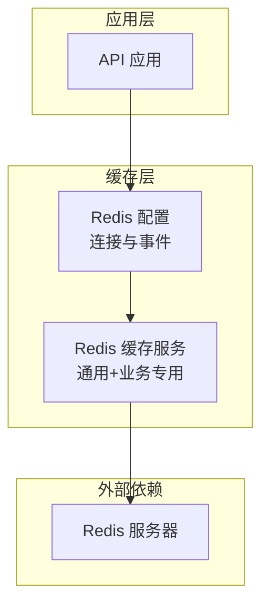
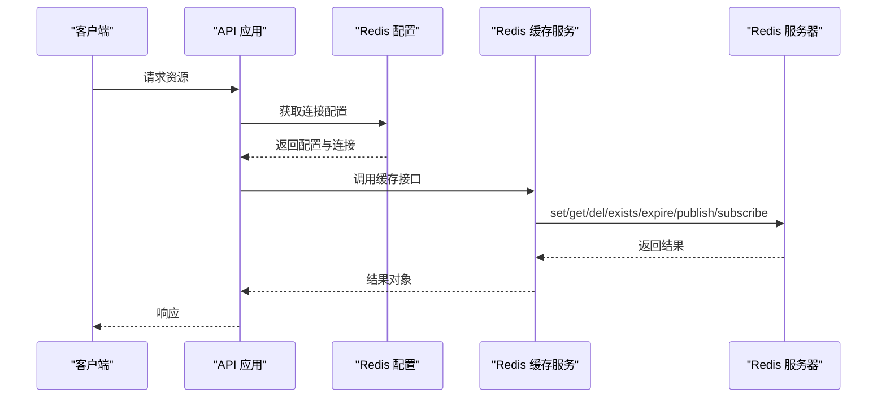
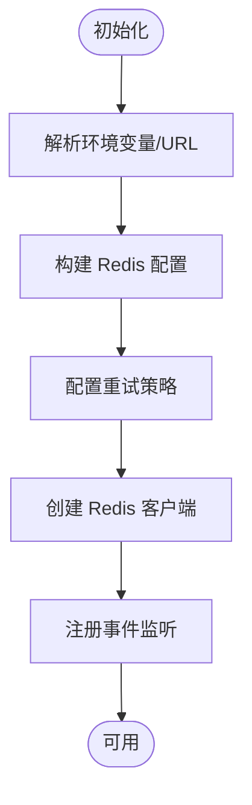
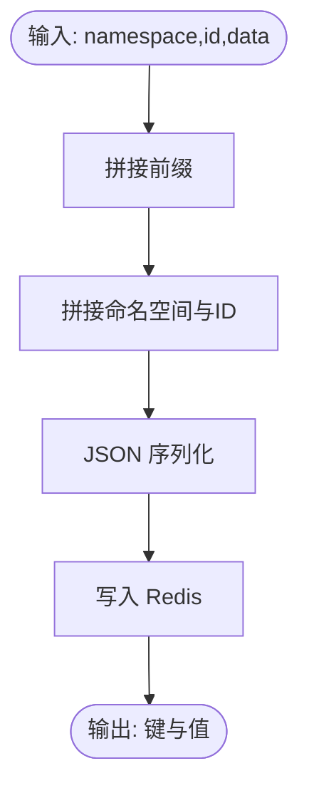
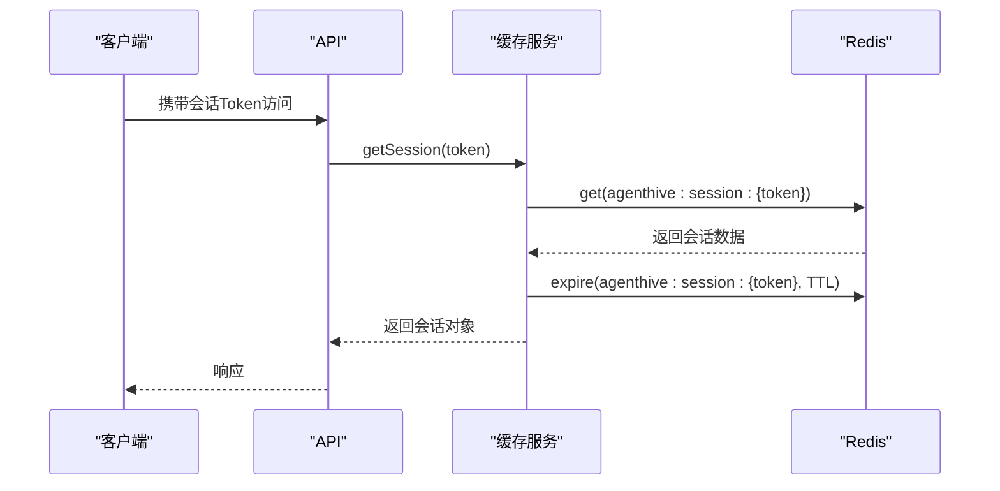
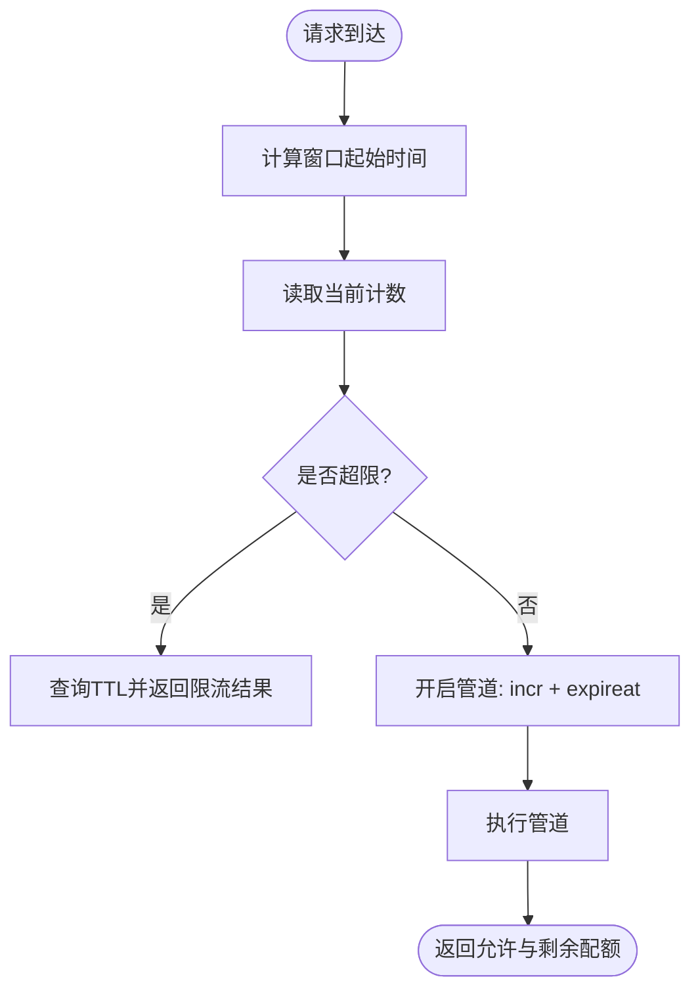
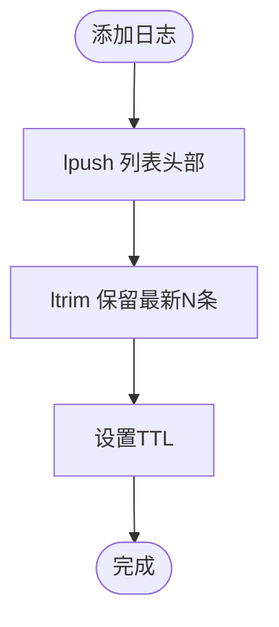
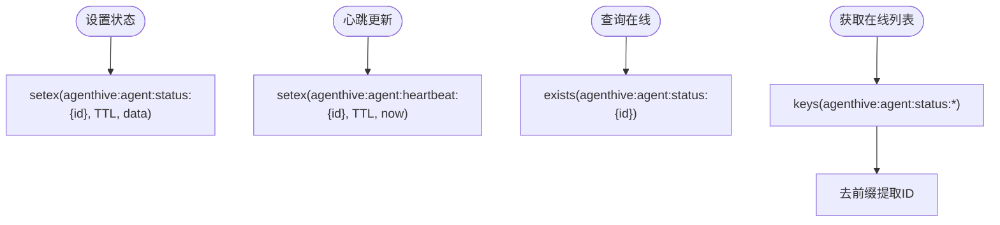
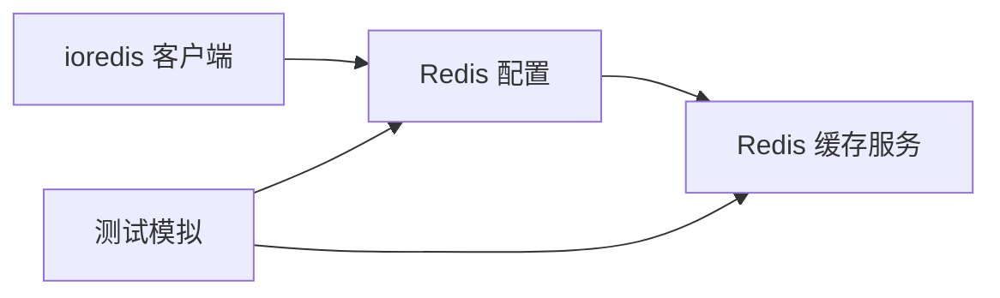

# Redis 缓存策略

<cite>
**本文档引用的文件**
- [apps/api/src/config/redis.ts](file://apps/api/src/config/redis.ts)
- [apps/api/src/services/redis-cache.ts](file://apps/api/src/services/redis-cache.ts)
- [apps/api/tests/unit/redis-cache.test.ts](file://apps/api/tests/unit/redis-cache.test.ts)
- [apps/api/tests/unit/redis.config.test.ts](file://apps/api/tests/unit/redis.config.test.ts)
- [apps/api/tests/utils/test-redis.ts](file://apps/api/tests/utils/test-redis.ts)
- [docker-compose.dev.yml](file://docker-compose.dev.yml)
</cite>

## 目录
1. [简介](#简介)
2. [项目结构](#项目结构)
3. [核心组件](#核心组件)
4. [架构总览](#架构总览)
5. [详细组件分析](#详细组件分析)
6. [依赖关系分析](#依赖关系分析)
7. [性能考量](#性能考量)
8. [故障排查指南](#故障排查指南)
9. [结论](#结论)
10. [附录](#附录)

## 简介
本文件系统化梳理基于 Redis 7 的缓存架构与策略，涵盖连接配置、连接池管理、缓存键命名规范、不同数据类型的缓存策略（会话、配置、速率限制、实时数据）、过期与内存管理、命中率优化、穿透与雪崩防护、集群/哨兵与持久化配置要点，以及序列化与反序列化处理方式。目标是帮助开发者在不直接阅读源码的情况下，也能快速理解并正确实施该缓存体系。

## 项目结构
本项目的 Redis 缓存相关代码集中在 API 应用中，采用“配置层 + 服务层 + 测试层”的分层组织：
- 配置层：负责 Redis 客户端实例化、连接参数解析、事件监听与连接生命周期管理
- 服务层：封装通用缓存操作与业务专用缓存（会话、Agent 状态、任务进度、日志、速率限制、发布/订阅等）
- 测试层：单元测试覆盖配置与缓存服务的关键行为，并提供模拟 Redis 存储以验证过期与列表等复杂逻辑

图表来源
- [apps/api/src/config/redis.ts:1-71](file://apps/api/src/config/redis.ts#L1-L71)
- [apps/api/src/services/redis-cache.ts:1-233](file://apps/api/src/services/redis-cache.ts#L1-L233)

章节来源
- [apps/api/src/config/redis.ts:1-71](file://apps/api/src/config/redis.ts#L1-L71)
- [apps/api/src/services/redis-cache.ts:1-233](file://apps/api/src/services/redis-cache.ts#L1-L233)

## 核心组件
- Redis 配置模块
  - 支持从环境变量或 Redis URL 解析连接参数
  - 提供重试策略与最大重试次数
  - 统一的连接事件监听与关闭流程
  - 提供键前缀与键生成函数
- Redis 缓存服务模块
  - 通用缓存：set/get/del/exists/expire
  - 会话缓存：带 TTL 的会话存储与访问刷新
  - Agent 状态与心跳：状态缓存、在线查询、心跳维护
  - 任务进度：带更新时间戳的进度缓存
  - 实时日志：固定长度列表 + 过期控制
  - 速率限制：滑动时间窗计数 + 窗口边界过期
  - 发布/订阅：消息发布与订阅回调
  - 清理：整库清空与按模式删除

章节来源
- [apps/api/src/config/redis.ts:5-30](file://apps/api/src/config/redis.ts#L5-L30)
- [apps/api/src/config/redis.ts:39-62](file://apps/api/src/config/redis.ts#L39-L62)
- [apps/api/src/services/redis-cache.ts:9-230](file://apps/api/src/services/redis-cache.ts#L9-L230)

## 架构总览
下图展示了应用与 Redis 的交互路径，以及缓存服务的职责边界：

图表来源
- [apps/api/src/config/redis.ts:23-37](file://apps/api/src/config/redis.ts#L23-L37)
- [apps/api/src/services/redis-cache.ts:15-52](file://apps/api/src/services/redis-cache.ts#L15-L52)

## 详细组件分析

### 连接配置与连接池管理
- 连接参数来源
  - 优先解析 REDIS_URL；若未提供，则使用 REDIS_HOST/REDIS_PORT/REDIS_PASSWORD/REDIS_DB 等环境变量
  - 使用统一的重试策略与最大重试次数，避免瞬时抖动导致请求失败
- 连接生命周期
  - 提供连接测试与关闭方法，确保优雅退出
  - 事件监听：connect/ready/error/close，便于可观测性与问题定位
- 连接池与并发
  - 使用单实例连接进行演示与开发；生产建议结合连接池库或在多线程场景下谨慎复用同一实例
  - 发布/订阅使用独立连接，避免阻塞主连接

图表来源
- [apps/api/src/config/redis.ts:5-30](file://apps/api/src/config/redis.ts#L5-L30)
- [apps/api/src/config/redis.ts:46-68](file://apps/api/src/config/redis.ts#L46-L68)

章节来源
- [apps/api/src/config/redis.ts:5-30](file://apps/api/src/config/redis.ts#L5-L30)
- [apps/api/src/config/redis.ts:46-68](file://apps/api/src/config/redis.ts#L46-L68)

### 缓存键命名规范与序列化
- 键前缀与命名
  - 统一前缀：agenthive:
  - 命名规则：key(namespace, id) → agenthive:{namespace}:{id}
  - 示例：会话键 → agenthive:session:{token}
- 序列化与反序列化
  - 写入：JSON.stringify(data)
  - 读取：JSON.parse(value)
  - 列表类键：字符串元素写入，读取后按需解析

图表来源
- [apps/api/src/config/redis.ts:39-44](file://apps/api/src/config/redis.ts#L39-L44)
- [apps/api/src/services/redis-cache.ts:15-27](file://apps/api/src/services/redis-cache.ts#L15-L27)

章节来源
- [apps/api/src/config/redis.ts:39-44](file://apps/api/src/config/redis.ts#L39-L44)
- [apps/api/src/services/redis-cache.ts:15-27](file://apps/api/src/services/redis-cache.ts#L15-L27)

### 会话缓存策略
- 设计要点
  - TTL：24 小时，适合用户登录态
  - 访问刷新：每次 getSession 会延长 TTL，降低频繁登录带来的压力
  - 数据结构：包含 userId、userData、createdAt
- 使用场景
  - 登录态校验、用户信息快速获取、跨请求状态维持

图表来源
- [apps/api/src/services/redis-cache.ts:59-75](file://apps/api/src/services/redis-cache.ts#L59-L75)

章节来源
- [apps/api/src/services/redis-cache.ts:59-82](file://apps/api/src/services/redis-cache.ts#L59-L82)

### 速率限制缓存策略
- 设计要点
  - 时间窗：以窗口大小为单位对时间取整，形成滑动窗口
  - 计数：使用原子自增，配合管道保证一致性
  - 过期：窗口边界设置过期，避免键无限增长
- 返回信息
  - allowed：是否允许
  - remaining：剩余配额
  - resetTime：窗口重置时间

图表来源
- [apps/api/src/services/redis-cache.ts:169-189](file://apps/api/src/services/redis-cache.ts#L169-L189)

章节来源
- [apps/api/src/services/redis-cache.ts:169-189](file://apps/api/src/services/redis-cache.ts#L169-L189)

### 实时数据缓存策略（日志列表）
- 设计要点
  - 使用列表结构存储日志，保持顺序与高效插入
  - 固定最大长度：ltrim 截断，避免无限增长
  - 过期控制：为列表键设置 TTL，防止冷数据占用内存

图表来源
- [apps/api/src/services/redis-cache.ts:149-154](file://apps/api/src/services/redis-cache.ts#L149-L154)

章节来源
- [apps/api/src/services/redis-cache.ts:149-162](file://apps/api/src/services/redis-cache.ts#L149-L162)

### Agent 状态与心跳缓存策略
- 设计要点
  - 状态键：agenthive:agent:status:{agentId}，短 TTL，反映实时状态
  - 心跳键：agenthive:agent:heartbeat:{agentId}，短 TTL，用于快速判断在线
  - 在线查询：通过 exists 判断状态键是否存在
  - 在线列表：通过 keys 模式匹配聚合在线 Agent

图表来源
- [apps/api/src/services/redis-cache.ts:89-124](file://apps/api/src/services/redis-cache.ts#L89-L124)
- [apps/api/src/services/redis-cache.ts:105-109](file://apps/api/src/services/redis-cache.ts#L105-L109)

章节来源
- [apps/api/src/services/redis-cache.ts:89-124](file://apps/api/src/services/redis-cache.ts#L89-L124)
- [apps/api/src/services/redis-cache.ts:105-109](file://apps/api/src/services/redis-cache.ts#L105-L109)

### 任务进度缓存策略
- 设计要点
  - 进度键：agenthive:task:progress:{taskId}
  - 数据包含 progress 与 updatedAt，便于前端展示与排序
  - TTL：通用默认值，适配短期任务进度

章节来源
- [apps/api/src/services/redis-cache.ts:131-142](file://apps/api/src/services/redis-cache.ts#L131-L142)

### 发布/订阅与清理
- 发布/订阅
  - publish：将消息 JSON 序列化后发送
  - subscribe：内部订阅并转发给回调，回调中进行 JSON 反序列化
- 清理
  - flushAll：清空当前数据库
  - deletePattern：按模式批量删除键

章节来源
- [apps/api/src/services/redis-cache.ts:196-210](file://apps/api/src/services/redis-cache.ts#L196-L210)
- [apps/api/src/services/redis-cache.ts:217-229](file://apps/api/src/services/redis-cache.ts#L217-L229)

### 缓存键设计原则
- 前缀统一：agenthive:
- 命名清晰：namespace:id
- 业务隔离：不同业务域使用不同命名空间
- 可观测性：键名可读，便于日志与监控定位

章节来源
- [apps/api/src/config/redis.ts:39-44](file://apps/api/src/config/redis.ts#L39-L44)

### 过期策略与内存管理
- TTL 策略
  - 通用：默认 5 分钟
  - 会话：24 小时
  - Agent 状态/心跳：1 分钟
  - 实时日志：默认 TTL，结合列表长度限制
- 内存淘汰
  - 开发环境使用 LRU 淘汰策略，避免 OOM
- 持久化
  - AOF：开启 appendonly，每秒 fsync
  - RDB：多频次快照，兼顾恢复速度与数据安全

章节来源
- [apps/api/src/services/redis-cache.ts:5-7](file://apps/api/src/services/redis-cache.ts#L5-L7)
- [docker-compose.dev.yml:70-79](file://docker-compose.dev.yml#L70-L79)

### 缓存命中率优化技巧
- 读多写少热点键：适当提高 TTL 或在访问时刷新
- 批量读取：利用 exists/keys 批量查询，减少往返
- 列表截断：ltrim 控制长度，避免过长列表影响性能
- 管道化：对强一致需求（如计数+过期）使用 pipeline

章节来源
- [apps/api/src/services/redis-cache.ts:183-186](file://apps/api/src/services/redis-cache.ts#L183-L186)
- [apps/api/src/services/redis-cache.ts:107-108](file://apps/api/src/services/redis-cache.ts#L107-L108)

### 缓存穿透防护
- 对于不存在的键，可在缓存中写入空对象或短 TTL 的占位符，避免高频重复查询后端
- 对输入参数进行合法性校验与白名单过滤

### 缓存雪崩预防
- TTL 随机化：为相同业务键增加小幅度随机偏移，避免同时过期
- 降级策略：在高并发场景下，优先返回部分数据或降级提示

## 依赖关系分析
- 配置层依赖 ioredis 客户端库，提供连接与事件能力
- 缓存服务层依赖配置层提供的连接与键生成工具
- 测试层通过 mock 与自定义模拟客户端，覆盖关键路径与边界条件

图表来源
- [apps/api/src/config/redis.ts:2-3](file://apps/api/src/config/redis.ts#L2-L3)
- [apps/api/src/services/redis-cache.ts:2-2](file://apps/api/src/services/redis-cache.ts#L2-L2)

章节来源
- [apps/api/src/config/redis.ts:2-3](file://apps/api/src/config/redis.ts#L2-L3)
- [apps/api/src/services/redis-cache.ts:2-2](file://apps/api/src/services/redis-cache.ts#L2-L2)

## 性能考量
- 连接与重试
  - 合理设置重试间隔与最大重试次数，避免放大网络抖动
- 键设计
  - 避免过长键名与过深嵌套，减少序列化开销
- 列表与集合
  - 控制列表长度，定期截断；对集合使用合适的数据结构
- TTL 策略
  - 针对不同业务设置差异化 TTL，平衡时效性与内存占用

## 故障排查指南
- 连接问题
  - 使用连接测试方法验证连通性
  - 检查环境变量与 URL 解析是否正确
- 键不存在
  - 使用 exists 检查键是否存在
  - 核对命名空间与 ID 是否匹配
- 速率限制异常
  - 检查窗口边界与过期时间是否正确
  - 确认管道执行是否成功
- 发布/订阅
  - 确认订阅通道名称与发布消息一致
  - 检查回调是否正确解析 JSON

章节来源
- [apps/api/src/config/redis.ts:46-68](file://apps/api/src/config/redis.ts#L46-L68)
- [apps/api/src/config/redis.ts:58-62](file://apps/api/src/config/redis.ts#L58-L62)
- [apps/api/src/services/redis-cache.ts:169-189](file://apps/api/src/services/redis-cache.ts#L169-L189)
- [apps/api/tests/unit/redis.config.test.ts:62-81](file://apps/api/tests/unit/redis.config.test.ts#L62-L81)
- [apps/api/tests/unit/redis-cache.test.ts:246-254](file://apps/api/tests/unit/redis-cache.test.ts#L246-L254)

## 结论
本缓存体系以简洁的键命名与统一的序列化策略为基础，围绕会话、状态、进度、日志与速率限制等核心业务场景提供了完备的缓存能力。通过 TTL 差异化、列表截断与管道化等手段，在保证性能的同时提升了稳定性。建议在生产环境中进一步引入连接池、哨兵/集群与更细粒度的监控告警，以满足更高可用与扩展性的需求。

## 附录

### Redis 集群、哨兵与持久化配置要点
- 集群模式
  - 适用于水平扩展与高可用，需关注键分布与槽位迁移
- 哨兵模式
  - 提供主从切换与故障转移，需配置主从节点与健康检查
- 持久化策略
  - AOF：开启 appendonly，每秒 fsync，兼顾数据安全
  - RDB：多频次快照，缩短恢复时间

章节来源
- [docker-compose.dev.yml:70-79](file://docker-compose.dev.yml#L70-L79)

### 缓存数据序列化与反序列化处理
- 写入：JSON.stringify(data)
- 读取：JSON.parse(value)
- 列表元素：字符串形式存储，读取后按需解析

章节来源
- [apps/api/src/services/redis-cache.ts:15-27](file://apps/api/src/services/redis-cache.ts#L15-L27)
- [apps/api/src/services/redis-cache.ts:149-162](file://apps/api/src/services/redis-cache.ts#L149-L162)