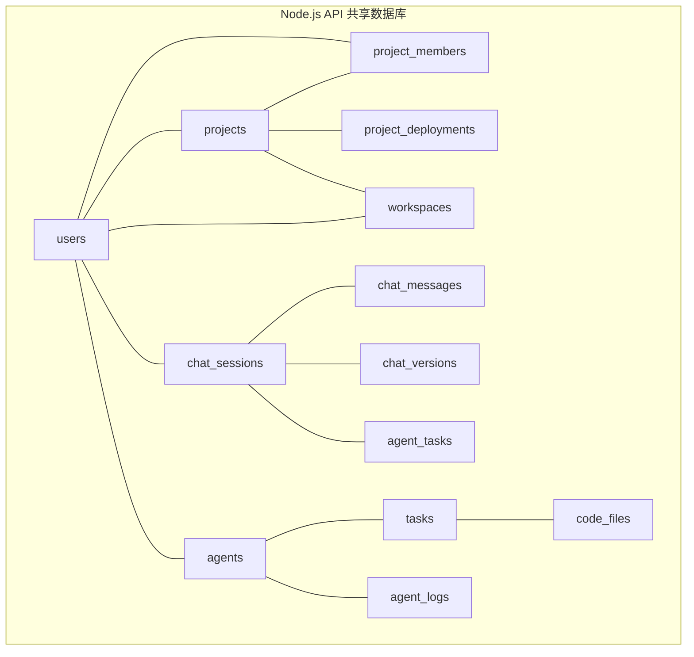
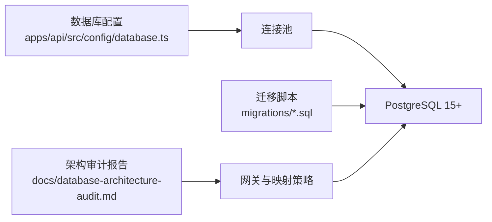

# 数据库架构设计

<cite>
**本文引用的文件**
- [apps/api/src/db/schema.sql](file://apps/api/src/db/schema.sql)
- [apps/api/src/db/migrations/20260423000000_init.sql](file://apps/api/src/db/migrations/20260423000000_init.sql)
- [apps/api/src/db/migrations/20260502100000_ensure-migrations-table.sql](file://apps/api/src/db/migrations/20260502100000_ensure-migrations-table.sql)
- [apps/api/src/db/migrations/20260503180000_add-external-user-id.sql](file://apps/api/src/db/migrations/20260503180000_add-external-user-id.sql)
- [apps/api/src/db/migrations/20260504010000_align-chat-messages.sql](file://apps/api/src/db/migrations/20260504010000_align-chat-messages.sql)
- [apps/api/src/db/migrations/20260504010100_add-workspaces.sql](file://apps/api/src/db/migrations/20260504010100_add-workspaces.sql)
- [apps/api/src/db/migrations/20260504010200_enforce-project-session-unique.sql](file://apps/api/src/db/migrations/20260504010200_enforce-project-session-unique.sql)
- [apps/api/src/db/migrations/20260504010300_add-message-types.sql](file://apps/api/src/db/migrations/20260504010300_add-message-types.sql)
- [apps/api/src/db/migrations/20260504010400_add-chat-versions.sql](file://apps/api/src/db/migrations/20260504010400_add-chat-versions.sql)
- [apps/api/src/db/migrations/20260505000000_schema-alignment.sql](file://apps/api/src/db/migrations/20260505000000_schema-alignment.sql)
- [apps/api/src/db/migrations/20260505000200_add-status-to-chat-sessions.sql](file://apps/api/src/db/migrations/20260505000200_add-status-to-chat-sessions.sql)
- [apps/api/src/db/migrations/20260505000300_fix-project-deployments-schema.sql](file://apps/api/src/db/migrations/20260505000300_fix-project-deployments-schema.sql)
- [apps/api/docs/database/README.md](file://apps/api/docs/database/README.md)
- [docs/database-architecture-audit.md](file://docs/database-architecture-audit.md)
- [apps/api/src/config/database.ts](file://apps/api/src/config/database.ts)
- [AGENT_COLLABORATION_SPEC.md](file://AGENT_COLLABORATION_SPEC.md)
</cite>

## 目录
1. [简介](#简介)
2. [项目结构](#项目结构)
3. [核心组件](#核心组件)
4. [架构总览](#架构总览)
5. [详细组件分析](#详细组件分析)
6. [依赖分析](#依赖分析)
7. [性能考虑](#性能考虑)
8. [故障排查指南](#故障排查指南)
9. [结论](#结论)
10. [附录](#附录)

## 简介
本文件面向 PostgreSQL 15+ 的核心数据模型设计，聚焦于用户、项目、Agent、任务、聊天会话等关键实体的表结构、字段定义、约束与索引策略，并阐述外键关系、级联删除策略与数据完整性保障机制。同时，结合仓库中的迁移脚本与规范文档，给出 JSONB 字段的使用场景与优势、数据库迁移策略、版本管理与回滚机制、性能优化建议与最佳实践。

## 项目结构
- 数据库架构由“迁移脚本”驱动，schema.sql 为静态快照，仅用于文档与 IDE 补全；实际以 migrations 目录为准。
- Node.js API 使用共享数据库模式，Java 微服务采用“每服务一库”的数据库模式，二者存在主键类型与表命名等不兼容问题，需通过网关与映射策略桥接。



图表来源
- [apps/api/src/db/schema.sql:18-288](file://apps/api/src/db/schema.sql#L18-L288)

章节来源
- [apps/api/src/db/schema.sql:1-288](file://apps/api/src/db/schema.sql#L1-L288)
- [docs/database-architecture-audit.md:1-227](file://docs/database-architecture-audit.md#L1-L227)

## 核心组件
- 用户 users：主键 UUID，支持用户名、邮箱、手机号、角色、状态、头像、外部用户标识等，具备更新时间自动维护触发器。
- 项目 projects：主键 UUID，关联 owner_id(users)，支持模板、Git 仓库、工作区等属性，具备状态与索引。
- 项目成员 project_members：多对多关联 users 与 projects，唯一约束确保去重。
- 工作区 workspaces：用户级工作区，支持设置 JSONB。
- 聊天会话 chat_sessions：用户级会话，可选关联项目与工作区，支持状态、类型、当前版本。
- 聊天版本 chat_versions：会话版本管理，支持唯一版本号与激活标记。
- 聊天消息 chat_messages：支持消息类型、可见性、父消息、版本等，具备丰富索引。
- Agent 任务 agent_tasks：承载任务执行上下文，新增项目级、工单号、工作者角色、结果与时间戳。
- Agent agents：Agent 基本信息与配置，支持心跳与任务绑定。
- 任务 tasks：任务树形结构、输入输出 JSONB、进度与优先级。
- 代码文件 code_files：项目内文件索引。
- Agent 日志 agent_logs：日志级别与时间索引。
- 项目部署 project_deployments：访问地址、配置 JSONB、唯一约束与更新时间。

章节来源
- [apps/api/src/db/schema.sql:18-288](file://apps/api/src/db/schema.sql#L18-L288)
- [apps/api/src/db/migrations/20260505000000_schema-alignment.sql:1-65](file://apps/api/src/db/migrations/20260505000000_schema-alignment.sql#L1-L65)
- [apps/api/src/db/migrations/20260505000300_fix-project-deployments-schema.sql:1-31](file://apps/api/src/db/migrations/20260505000300_fix-project-deployments-schema.sql#L1-L31)

## 架构总览
- 主键策略：统一使用 UUID（gen_random_uuid），便于跨服务与未来扩展。
- 时间类型：统一使用带时区的时间戳（TIMESTAMP WITH TIME ZONE）。
- JSONB 使用：配置、元数据、部署配置、日志元数据等，支持灵活扩展与高效查询。
- 外键与级联：遵循业务语义，用户删除级联清理其会话与消息；会话删除级联清理任务与消息；版本删除级联清理消息；项目删除级联清理部署与成员；Agent 删除级联清理日志。
- 索引策略：围绕高频查询字段建立复合与单列索引，兼顾写入与读取性能。
- 触发器：统一更新时间触发器，避免遗漏更新时间字段。

```mermaid
erDiagram
USERS {
uuid id PK
varchar username UK
varchar email UK
varchar phone UK
varchar password_hash
varchar role
varchar status
text avatar
varchar external_user_id
timestamptz created_at
timestamptz updated_at
}
PROJECTS {
uuid id PK
varchar name
text description
varchar repo_url
uuid owner_id FK
varchar status
varchar type
varchar tech_stack
varchar git_url
varchar git_branch
varchar workspace_path
timestamptz last_accessed_at
boolean is_template
uuid workspace_id FK
timestamptz created_at
timestamptz updated_at
}
PROJECT_MEMBERS {
uuid id PK
uuid project_id FK
uuid user_id FK
varchar role
timestamptz joined_at
}
WORKSPACES {
uuid id PK
uuid user_id FK
varchar name
jsonb settings
timestamptz created_at
timestamptz updated_at
}
CHAT_SESSIONS {
uuid id PK
uuid user_id FK
uuid project_id FK
uuid workspace_id FK
varchar title
varchar status
varchar session_type
uuid current_version_id FK
timestamptz created_at
timestamptz updated_at
}
CHAT_VERSIONS {
uuid id PK
uuid session_id FK
varchar name
text description
boolean is_active
timestamptz created_at
timestamptz updated_at
}
CHAT_MESSAGES {
uuid id PK
uuid session_id FK
varchar role
text content
varchar message_type
boolean is_visible_in_history
uuid version_id FK
uuid parent_message_id FK
jsonb metadata
timestamptz created_at
}
AGENT_TASKS {
uuid id PK
uuid session_id FK
uuid project_id FK
varchar ticket_id
varchar worker_role
varchar status
varchar workspace_path
jsonb result
timestamptz started_at
timestamptz completed_at
timestamptz created_at
}
AGENTS {
uuid id PK
varchar name
varchar role
varchar status
text description
text avatar
varchar pod_ip
uuid current_task_id
jsonb config
timestamptz last_heartbeat_at
timestamptz created_at
timestamptz updated_at
}
TASKS {
uuid id PK
varchar title
text description
varchar type
varchar status
varchar priority
integer progress
uuid assigned_to FK
uuid parent_id FK
jsonb input
jsonb output
timestamptz created_at
timestamptz started_at
timestamptz completed_at
}
CODE_FILES {
uuid id PK
varchar path UK
varchar name
text content
varchar language
boolean is_directory
timestamptz last_modified
}
AGENT_LOGS {
uuid id PK
uuid agent_id FK
text message
varchar level
timestamptz created_at
}
PROJECT_DEPLOYMENTS {
uuid id PK
uuid project_id FK UK
varchar status
varchar access_url
jsonb config_json
timestamptz created_at
timestamptz updated_at
}
USERS ||--o{ PROJECTS : "owns"
USERS ||--o{ PROJECT_MEMBERS : "memberships"
USERS ||--o{ CHAT_SESSIONS : "creates"
USERS ||--o{ WORKSPACES : "owns"
PROJECTS ||--o{ PROJECT_MEMBERS : "has"
PROJECTS ||--o{ CHAT_SESSIONS : "contains"
PROJECTS ||--o{ PROJECT_DEPLOYMENTS : "deployed"
PROJECTS ||--o{ CODE_FILES : "contains"
WORKSPACES ||--o{ PROJECTS : "contains"
CHAT_SESSIONS ||--o{ CHAT_MESSAGES : "contains"
CHAT_SESSIONS ||--o{ CHAT_VERSIONS : "versioned"
CHAT_SESSIONS ||--o{ AGENT_TASKS : "generates"
AGENTS ||--o{ AGENT_LOGS : "logs"
AGENTS ||--o{ TASKS : "assigns"
TASKS ||--o{ CODE_FILES : "produces"
```

图表来源
- [apps/api/src/db/schema.sql:18-288](file://apps/api/src/db/schema.sql#L18-L288)

## 详细组件分析

### 用户表 users
- 字段与类型：UUID 主键、用户名/邮箱/手机唯一、角色/状态、头像、外部用户标识、带时区时间戳。
- 约束：UNIQUE 约束保证唯一性；默认值与时间戳自动维护。
- 索引：手机号、邮箱、外部用户标识索引，满足登录与映射查询。
- 触发器：更新时自动设置 updated_at。
- 外部用户映射：为桥接 Java 用户体系引入 external_user_id，便于后续统一主键策略。

章节来源
- [apps/api/src/db/schema.sql:18-31](file://apps/api/src/db/schema.sql#L18-L31)
- [apps/api/src/db/migrations/20260503180000_add-external-user-id.sql:1-200](file://apps/api/src/db/migrations/20260503180000_add-external-user-id.sql#L1-L200)
- [docs/database-architecture-audit.md:139-174](file://docs/database-architecture-audit.md#L139-L174)

### 项目表 projects
- 字段与类型：名称、描述、仓库链接、所有者、状态、类型、技术栈 JSONB、Git 信息、工作区路径、最后访问时间、是否模板、工作区外键。
- 约束：状态枚举、技术栈 JSONB 默认空数组、外键约束。
- 索引：所有者、状态、工作区外键。
- 与工作区：新增 workspace_id 外键，支持项目与工作区关联。

章节来源
- [apps/api/src/db/schema.sql:36-53](file://apps/api/src/db/schema.sql#L36-L53)
- [apps/api/src/db/migrations/20260504010100_add-workspaces.sql:1-41](file://apps/api/src/db/migrations/20260504010100_add-workspaces.sql#L1-L41)

### 项目成员表 project_members
- 字段与类型：项目与用户多对多、角色、加入时间。
- 约束：唯一约束 (project_id, user_id) 防止重复。
- 索引：分别针对项目与用户的索引，支撑成员查询与权限判断。

章节来源
- [apps/api/src/db/schema.sql:55-63](file://apps/api/src/db/schema.sql#L55-L63)
- [apps/api/src/db/migrations/20260423000000_init.sql:57-69](file://apps/api/src/db/migrations/20260423000000_init.sql#L57-L69)

### 工作区表 workspaces
- 字段与类型：用户级工作区、名称、设置 JSONB。
- 约束：设置 JSONB 默认空对象。
- 索引：用户外键索引。
- 触发器：更新时间自动维护。

章节来源
- [apps/api/src/db/schema.sql:65-74](file://apps/api/src/db/schema.sql#L65-L74)
- [apps/api/src/db/migrations/20260504010100_add-workspaces.sql:10-17](file://apps/api/src/db/migrations/20260504010100_add-workspaces.sql#L10-L17)

### 聊天会话 chat_sessions
- 字段与类型：用户、项目、工作区外键，标题、状态、类型、当前版本外键。
- 约束：项目与工作区外键级联设空；版本外键级联设空。
- 索引：用户、项目、工作区、类型、当前版本。
- 状态与类型：新增状态与类型字段，增强会话生命周期管理。

章节来源
- [apps/api/src/db/schema.sql:87-99](file://apps/api/src/db/schema.sql#L87-L99)
- [apps/api/src/db/migrations/20260505000200_add-status-to-chat-sessions.sql:1-200](file://apps/api/src/db/migrations/20260505000200_add-status-to-chat-sessions.sql#L1-L200)
- [apps/api/src/db/migrations/20260504010400_add-chat-versions.sql:10-22](file://apps/api/src/db/migrations/20260504010400_add-chat-versions.sql#L10-L22)

### 聊天版本 chat_versions
- 字段与类型：会话、版本号、标题、描述、基础消息、创建人、激活标记。
- 约束：会话+版本号唯一；激活版本唯一索引。
- 索引：会话索引与激活唯一索引。
- 触发器：更新时间自动维护。

章节来源
- [apps/api/src/db/migrations/20260504010400_add-chat-versions.sql:10-27](file://apps/api/src/db/migrations/20260504010400_add-chat-versions.sql#L10-L27)

### 聊天消息 chat_messages
- 字段与类型：角色、内容、消息类型、可见性、版本、父消息、元数据 JSONB。
- 约束：消息类型枚举；可见性布尔；版本与父消息外键。
- 索引：消息类型、版本、可见性+时间复合索引。
- 迁移：新增消息类型、可见性、版本与父子关系，提升会话版本化与检索能力。

章节来源
- [apps/api/src/db/schema.sql:101-113](file://apps/api/src/db/schema.sql#L101-L113)
- [apps/api/src/db/migrations/20260504010300_add-message-types.sql:10-31](file://apps/api/src/db/migrations/20260504010300_add-message-types.sql#L10-L31)

### Agent 任务 agent_tasks
- 字段与类型：会话、项目、工单号、工作者角色、状态、工作区路径、结果 JSONB、起止时间。
- 约束：项目外键级联设空；结果 JSONB 默认空对象。
- 索引：项目外键索引。
- 迁移：去除旧的 agent_id/task_id 列，新增项目、工单号、角色、结果与时间戳，与业务层对齐。

章节来源
- [apps/api/src/db/schema.sql:115-128](file://apps/api/src/db/schema.sql#L115-L128)
- [apps/api/src/db/migrations/20260505000000_schema-alignment.sql:15-31](file://apps/api/src/db/migrations/20260505000000_schema-alignment.sql#L15-L31)

### Agent 表 agents
- 字段与类型：名称、角色、状态、描述、头像、Pod IP、当前任务、配置 JSONB、心跳时间。
- 约束：配置 JSONB 默认空对象；状态枚举。
- 索引：状态、角色。
- 触发器：更新时间自动维护。

章节来源
- [apps/api/src/db/schema.sql:130-144](file://apps/api/src/db/schema.sql#L130-L144)

### 任务表 tasks
- 字段与类型：标题、描述、类型、状态、优先级、进度、分配给 Agent、父任务、输入输出 JSONB、起止时间。
- 约束：进度范围检查；类型/状态/优先级枚举；父任务自引用级联删除。
- 索引：状态、分配给、父任务。
- JSONB：输入输出支持动态结构。

章节来源
- [apps/api/src/db/schema.sql:146-162](file://apps/api/src/db/schema.sql#L146-L162)

### 代码文件表 code_files
- 字段与类型：路径唯一、名称、内容、语言、目录标志、最后修改时间。
- 约束：路径唯一；默认空字符串内容。
- 索引：路径唯一索引。

章节来源
- [apps/api/src/db/schema.sql:164-173](file://apps/api/src/db/schema.sql#L164-L173)

### Agent 日志表 agent_logs
- 字段与类型：Agent、消息、级别、创建时间。
- 约束：级别枚举；默认 info。
- 索引：Agent、创建时间。

章节来源
- [apps/api/src/db/schema.sql:175-182](file://apps/api/src/db/schema.sql#L175-L182)

### 项目部署表 project_deployments
- 字段与类型：项目唯一、状态、访问地址、配置 JSONB、创建/更新时间。
- 约束：项目唯一；配置 JSONB 默认空对象；唯一约束用于 ON CONFLICT。
- 索引：项目、状态。

章节来源
- [apps/api/src/db/schema.sql:257-266](file://apps/api/src/db/schema.sql#L257-L266)
- [apps/api/src/db/migrations/20260505000300_fix-project-deployments-schema.sql:8-23](file://apps/api/src/db/migrations/20260505000300_fix-project-deployments-schema.sql#L8-L23)

### 外键关系与级联策略
- 用户删除：级联删除其会话、消息、日志、工作区。
- 会话删除：级联删除其任务与消息；版本删除：级联删除消息。
- 项目删除：级联删除部署、成员与工作区；工作区删除：级联删除项目。
- Agent 删除：级联删除日志。
- 自引用：任务父任务自引用级联删除。

章节来源
- [apps/api/src/db/schema.sql:42-43](file://apps/api/src/db/schema.sql#L42-L43)
- [apps/api/src/db/schema.sql:58-62](file://apps/api/src/db/schema.sql#L58-L62)
- [apps/api/src/db/schema.sql:89-98](file://apps/api/src/db/schema.sql#L89-L98)
- [apps/api/src/db/schema.sql:104-113](file://apps/api/src/db/schema.sql#L104-L113)
- [apps/api/src/db/schema.sql:118-128](file://apps/api/src/db/schema.sql#L118-L128)
- [apps/api/src/db/schema.sql:132-144](file://apps/api/src/db/schema.sql#L132-L144)
- [apps/api/src/db/schema.sql:155-156](file://apps/api/src/db/schema.sql#L155-L156)
- [apps/api/src/db/schema.sql:259-266](file://apps/api/src/db/schema.sql#L259-L266)

### JSONB 字段使用场景与优势
- 配置存储：Agent 配置、工作区设置、项目技术栈、部署配置。
- 动态数据结构：消息元数据、任务输入输出、日志元数据。
- 优势：无需预定义结构、灵活扩展、支持部分查询与索引优化（如 GIN）。

章节来源
- [apps/api/src/db/schema.sql:39-40](file://apps/api/src/db/schema.sql#L39-L40)
- [apps/api/src/db/schema.sql:140-141](file://apps/api/src/db/schema.sql#L140-L141)
- [apps/api/src/db/schema.sql:263-263](file://apps/api/src/db/schema.sql#L263-L263)

## 依赖分析
- 连接池与配置：Node.js API 使用 pg.Pool，最大连接数、空闲超时、连接超时可控。
- 迁移表：确保迁移历史与版本控制一致，避免重复执行。
- Java 与 Node.js 的数据库模式差异：主键类型、表命名、数据库模式不一致，需通过网关与映射桥接。



图表来源
- [apps/api/src/config/database.ts:1-41](file://apps/api/src/config/database.ts#L1-L41)
- [apps/api/src/db/migrations/20260502100000_ensure-migrations-table.sql:1-200](file://apps/api/src/db/migrations/20260502100000_ensure-migrations-table.sql#L1-L200)
- [docs/database-architecture-audit.md:139-191](file://docs/database-architecture-audit.md#L139-L191)

章节来源
- [apps/api/src/config/database.ts:1-41](file://apps/api/src/config/database.ts#L1-L41)
- [docs/database-architecture-audit.md:1-227](file://docs/database-architecture-audit.md#L1-L227)

## 性能考虑
- 索引策略
  - 用户：邮箱、手机号、外部用户标识索引，支撑登录与映射。
  - 会话：用户、项目、工作区、类型、当前版本索引，支撑会话列表与版本检索。
  - 消息：消息类型、版本、可见性+时间复合索引，支撑历史检索与版本对比。
  - 任务：状态、分配给、父任务索引，支撑看板与树形查询。
  - 项目部署：项目唯一、状态索引，支撑部署状态查询与 ON CONFLICT。
- 触发器：统一更新时间触发器减少遗漏，但注意更新成本。
- JSONB：合理使用 GIN 索引（如需复杂查询），或保持默认文本/数值字段以降低索引开销。
- 分页与过滤：对高频查询增加 LIMIT 与覆盖索引，避免全表扫描。
- 连接池：根据并发与 QPS 调整最大连接数与超时参数。

章节来源
- [apps/api/src/db/schema.sql:194-222](file://apps/api/src/db/schema.sql#L194-L222)
- [apps/api/src/config/database.ts:15-21](file://apps/api/src/config/database.ts#L15-L21)

## 故障排查指南
- 连接失败
  - 检查 PostgreSQL 服务状态与监听端口。
  - 校验数据库、用户与权限。
  - 使用环境变量配置确认连接参数。
- 表不存在
  - 执行初始化脚本创建表结构。
  - 确认迁移历史与当前 schema 对齐。
- 迁移异常
  - 确保迁移在干净数据库上全量测试。
  - 使用 DO $$ ... $$ 块替代 IF NOT EXISTS 语法（PG 16 兼容）。
  - 手动 ALTER TABLE 后同步迁移历史记录。
- Java 与 Node.js 用户数据割裂
  - 通过 external_user_id 映射 Java BIGINT 用户 ID。
  - 使用网关 API 获取用户信息，避免直接跨库关联。

章节来源
- [apps/api/docs/database/README.md:165-198](file://apps/api/docs/database/README.md#L165-L198)
- [AGENT_COLLABORATION_SPEC.md:298-346](file://AGENT_COLLABORATION_SPEC.md#L298-L346)
- [docs/database-architecture-audit.md:58-90](file://docs/database-architecture-audit.md#L58-L90)

## 结论
本数据库架构以 UUID 为主键、TIMESTAMP WITH TIME ZONE 为统一时间类型、JSONB 支持灵活配置与动态结构，配合完善的索引与触发器机制，满足聊天、项目、Agent、任务等核心业务的数据完整性与可扩展性需求。针对 Java 与 Node.js 的架构差异，建议通过网关与映射策略进行短期桥接，并规划统一主键与数据库拆分的长期方案。

## 附录

### 迁移策略与版本管理
- 命名规范：YYYYMMDDhhmmss_description.sql。
- 必须包含 up 与 down 迁移。
- PG 16 兼容：使用 DO $$ ... $$ 替代 IF NOT EXISTS。
- 每次新迁移需在干净数据库上全量测试。
- 手动 ALTER TABLE 后同步迁移历史记录。
- 历史迁移不可修改。

章节来源
- [AGENT_COLLABORATION_SPEC.md:298-346](file://AGENT_COLLABORATION_SPEC.md#L298-L346)

### 回滚机制
- down 迁移按依赖逆序删除触发器、函数、索引与表。
- 对于唯一约束与列变更，先删除索引与约束，再回退列定义。
- 保持幂等性：多次执行 up/down 不产生副作用。

章节来源
- [apps/api/src/db/migrations/20260423000000_init.sql:309-336](file://apps/api/src/db/migrations/20260423000000_init.sql#L309-L336)
- [apps/api/src/db/migrations/20260504010300_add-message-types.sql:32-40](file://apps/api/src/db/migrations/20260504010300_add-message-types.sql#L32-L40)
- [apps/api/src/db/migrations/20260504010400_add-chat-versions.sql:35-40](file://apps/api/src/db/migrations/20260504010400_add-chat-versions.sql#L35-L40)
- [apps/api/src/db/migrations/20260505000000_schema-alignment.sql:42-65](file://apps/api/src/db/migrations/20260505000000_schema-alignment.sql#L42-L65)
- [apps/api/src/db/migrations/20260505000300_fix-project-deployments-schema.sql:25-31](file://apps/api/src/db/migrations/20260505000300_fix-project-deployments-schema.sql#L25-L31)