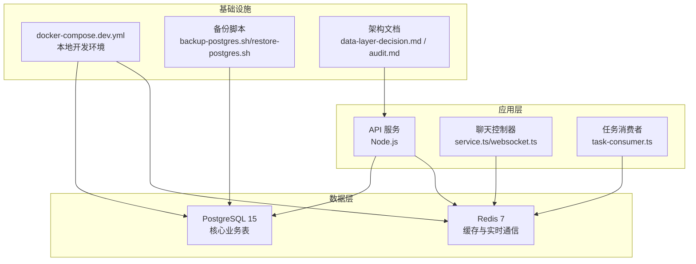
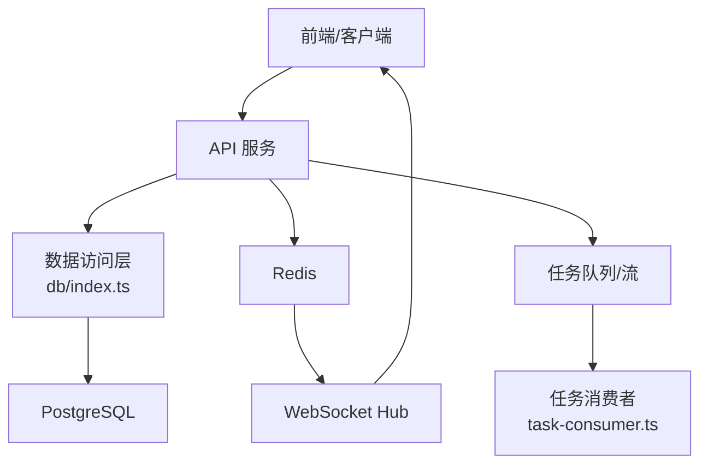
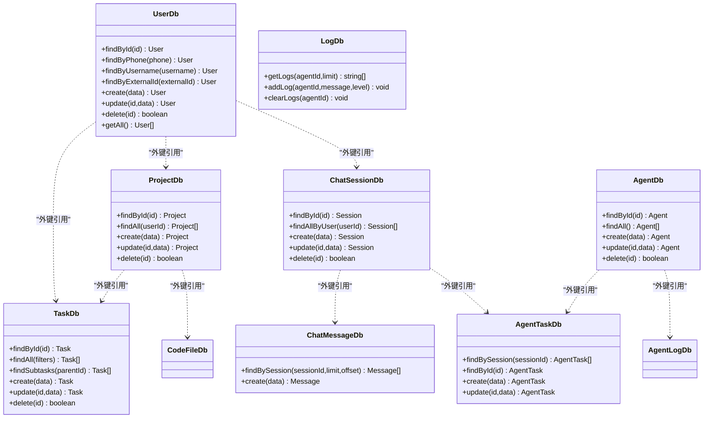
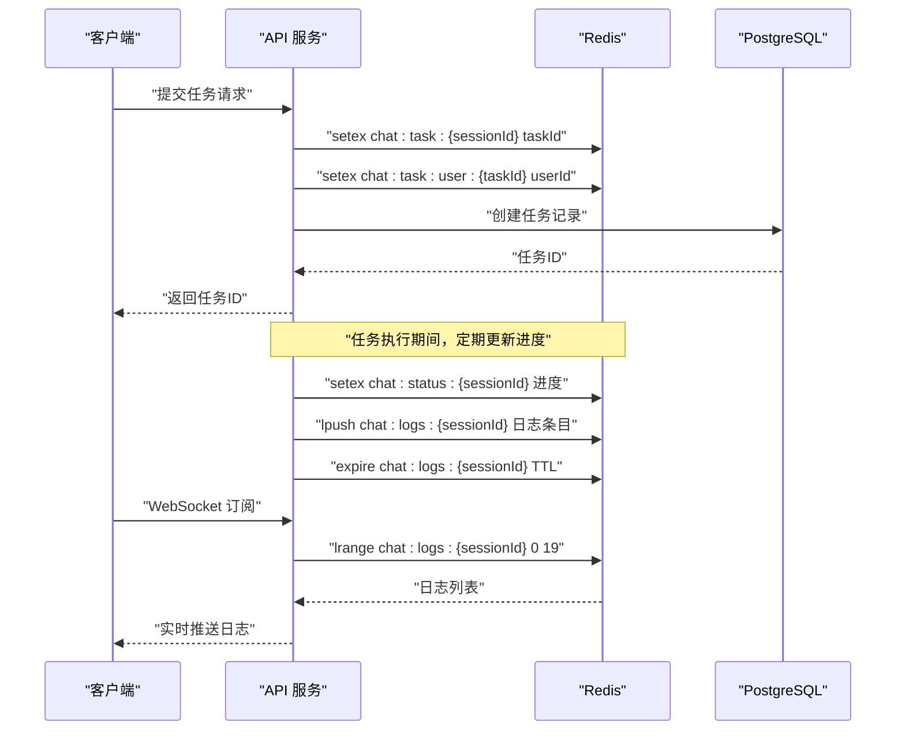
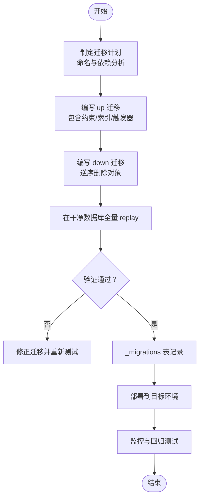
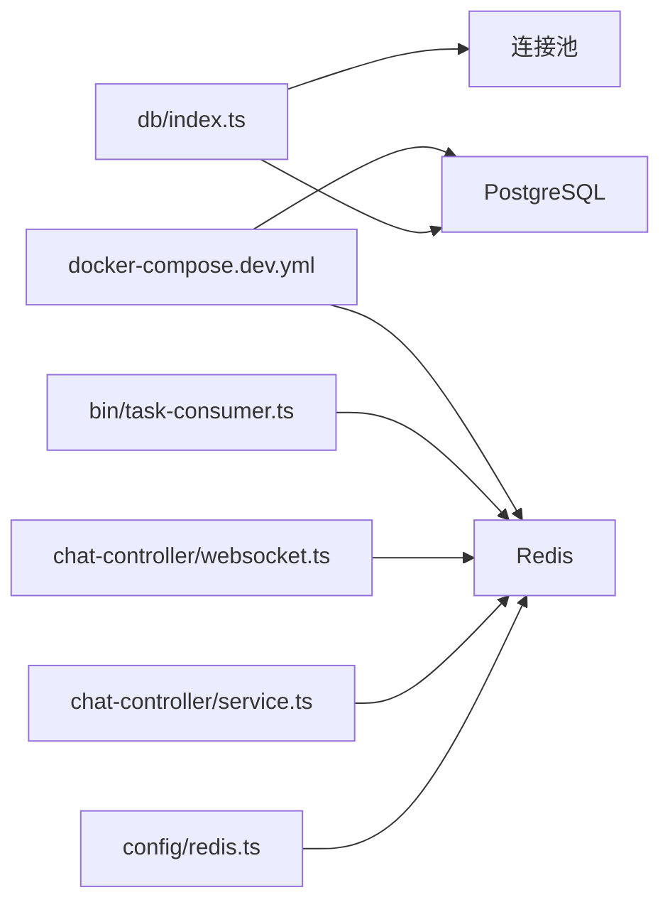

# 数据模型与架构

<cite>
**本文引用的文件**
- [apps/api/docs/database/README.md](file://apps/api/docs/database/README.md)
- [apps/api/docs/database/POSTGRESQL_SETUP.md](file://apps/api/docs/database/POSTGRESQL_SETUP.md)
- [apps/api/docs/database/REDIS_WEBSOCKET.md](file://apps/api/docs/database/REDIS_WEBSOCKET.md)
- [apps/api/src/db/migrations/20260423000000_init.sql](file://apps/api/src/db/migrations/20260423000000_init.sql)
- [apps/api/src/db/migrations/20260505000200_add-status-to-chat-sessions.sql](file://apps/api/src/db/migrations/20260505000200_add-status-to-chat-sessions.sql)
- [apps/api/src/db/index.ts](file://apps/api/src/db/index.ts)
- [apps/api/src/config/redis.ts](file://apps/api/src/config/redis.ts)
- [apps/api/src/chat-controller/service.ts](file://apps/api/src/chat-controller/service.ts)
- [apps/api/src/chat-controller/websocket.ts](file://apps/api/src/chat-controller/websocket.ts)
- [apps/api/src/bin/task-consumer.ts](file://apps/api/src/bin/task-consumer.ts)
- [docs/database-architecture-audit.md](file://docs/database-architecture-audit.md)
- [docs/architecture/data-layer-decision.md](file://docs/architecture/data-layer-decision.md)
- [docker-compose.dev.yml](file://docker-compose.dev.yml)
- [scripts/db/backup-postgres.sh](file://scripts/db/backup-postgres.sh)
- [scripts/db/restore-postgres.sh](file://scripts/db/restore-postgres.sh)
</cite>

## 目录
1. [简介](#简介)
2. [项目结构](#项目结构)
3. [核心组件](#核心组件)
4. [架构概览](#架构概览)
5. [详细组件分析](#详细组件分析)
6. [依赖分析](#依赖分析)
7. [性能考虑](#性能考虑)
8. [故障排除指南](#故障排除指南)
9. [结论](#结论)
10. [附录](#附录)

## 简介
本文件系统性梳理 AgentHive Cloud 的数据模型与架构设计，围绕 PostgreSQL 15 与 Redis 7 的数据层展开，涵盖核心实体关系、数据库迁移策略、版本管理、数据一致性保障、Redis 缓存策略、键值设计与过期策略、数据访问层设计模式与 ORM 配置、查询优化技巧，以及数据安全、备份恢复与性能监控实施方案，并提供数据模型扩展与演进的最佳实践。

## 项目结构
数据层相关代码主要分布在以下位置：
- PostgreSQL 迁移与初始化：apps/api/src/db/migrations 与 apps/api/docs/database
- 数据访问层：apps/api/src/db/index.ts
- Redis 配置与集成：apps/api/src/config/redis.ts、apps/api/src/chat-controller/*、apps/api/src/bin/task-consumer.ts
- 架构决策与审计：docs/architecture 与 docs/database-architecture-audit.md
- 开发环境与备份脚本：docker-compose.dev.yml、scripts/db/*



**图表来源**
- [apps/api/src/db/index.ts:1-502](file://apps/api/src/db/index.ts#L1-L502)
- [apps/api/src/config/redis.ts:1-71](file://apps/api/src/config/redis.ts#L1-L71)
- [apps/api/src/chat-controller/service.ts:1-480](file://apps/api/src/chat-controller/service.ts#L1-L480)
- [apps/api/src/chat-controller/websocket.ts:1-120](file://apps/api/src/chat-controller/websocket.ts#L1-L120)
- [apps/api/src/bin/task-consumer.ts:1-40](file://apps/api/src/bin/task-consumer.ts#L1-L40)
- [docker-compose.dev.yml:28-76](file://docker-compose.dev.yml#L28-L76)
- [docs/architecture/data-layer-decision.md:1-145](file://docs/architecture/data-layer-decision.md#L1-L145)
- [docs/database-architecture-audit.md:1-227](file://docs/database-architecture-audit.md#L1-L227)

**章节来源**
- [apps/api/docs/database/README.md:1-198](file://apps/api/docs/database/README.md#L1-L198)
- [apps/api/docs/database/POSTGRESQL_SETUP.md:1-171](file://apps/api/docs/database/POSTGRESQL_SETUP.md#L1-L171)
- [apps/api/docs/database/REDIS_WEBSOCKET.md:1-278](file://apps/api/docs/database/REDIS_WEBSOCKET.md#L1-L278)
- [docker-compose.dev.yml:28-76](file://docker-compose.dev.yml#L28-L76)

## 核心组件
- PostgreSQL 数据库：承载用户、项目、聊天会话、任务、代理、日志、代码文件、项目部署等核心业务实体，提供 ACID 事务、外键约束与索引支持。
- Redis 缓存与实时通信：提供短信验证码、会话、代理状态、任务进度、日志缓存、速率限制等高频读写场景的高性能缓存；通过发布/订阅实现跨进程广播与 WebSocket 实时推送。
- 数据访问层（DAL）：封装 SQL 查询、参数绑定、JSONB 序列化/反序列化、字段映射（camelCase/snake_case）、触发器自动更新时间戳等。
- 迁移与版本管理：采用时间戳前缀的迁移文件，强制 up/down 双向迁移，PG 16 兼容约束添加策略，维护 _migrations 表记录。

**章节来源**
- [apps/api/src/db/index.ts:1-502](file://apps/api/src/db/index.ts#L1-L502)
- [apps/api/src/db/migrations/20260423000000_init.sql:1-336](file://apps/api/src/db/migrations/20260423000000_init.sql#L1-L336)
- [apps/api/src/db/migrations/2026050500200_add-status-to-chat-sessions.sql:1-18](file://apps/api/src/db/migrations/20260505000200_add-status-to-chat-sessions.sql#L1-L18)

## 架构概览
整体采用“共享数据库 + Redis 缓存”的混合架构：
- PostgreSQL 作为权威数据源，提供强一致性和复杂关联查询能力。
- Redis 作为缓存与实时通信枢纽，显著降低数据库压力并提升用户体验。
- 应用层通过 DAL 访问数据库，通过 Redis 客户端进行缓存与消息传递。
- 架构决策文档明确了当前外部 ECS 部署策略与未来迁入 K8s 的触发条件。



**图表来源**
- [apps/api/src/db/index.ts:1-502](file://apps/api/src/db/index.ts#L1-L502)
- [apps/api/src/config/redis.ts:1-71](file://apps/api/src/config/redis.ts#L1-L71)
- [apps/api/src/chat-controller/websocket.ts:1-120](file://apps/api/src/chat-controller/websocket.ts#L1-L120)
- [apps/api/src/bin/task-consumer.ts:1-40](file://apps/api/src/bin/task-consumer.ts#L1-L40)

**章节来源**
- [docs/architecture/data-layer-decision.md:1-145](file://docs/architecture/data-layer-decision.md#L1-L145)

## 详细组件分析

### 数据模型与实体关系
核心实体包括：用户、项目、项目成员、代理、代理成员、任务、聊天会话、聊天消息、代理任务、代理日志、代码文件、项目部署、审计日志。

```mermaid
erDiagram
USERS {
uuid id PK
varchar username UK
varchar email UK
varchar phone
varchar password_hash
varchar role
varchar status
timestamptz created_at
timestamptz updated_at
}
PROJECTS {
uuid id PK
varchar name
text description
uuid owner_id FK
varchar status
varchar type
jsonb tech_stack
varchar git_url
varchar repo_url
varchar git_branch
varchar workspace_path
timestamptz last_accessed_at
boolean is_template
timestamptz created_at
timestamptz updated_at
}
PROJECT_MEMBERS {
uuid id PK
uuid project_id FK
uuid user_id FK
varchar role
timestamptz joined_at
unique(project_id,user_id)
}
AGENTS {
uuid id PK
varchar name
varchar role
varchar status
text description
jsonb config
uuid owner_id FK
uuid project_id FK
timestamptz created_at
timestamptz updated_at
}
AGENT_MEMBERS {
uuid id PK
uuid agent_id FK
uuid user_id FK
varchar role
timestamptz created_at
timestamptz updated_at
unique(agent_id,user_id)
}
TASKS {
uuid id PK
varchar title
text description
varchar type
varchar status
varchar priority
integer progress
uuid assigned_to FK
uuid user_id FK
uuid project_id FK
jsonb input
jsonb output
timestamptz created_at
timestamptz updated_at
timestamptz completed_at
}
CHAT_SESSIONS {
uuid id PK
uuid user_id FK
uuid project_id FK
varchar title
timestamptz created_at
timestamptz updated_at
}
CHAT_MESSAGES {
uuid id PK
uuid session_id FK
varchar role
text content
uuid agent_id FK
timestamptz created_at
}
AGENT_TASKS {
uuid id PK
uuid session_id FK
uuid agent_id FK
uuid task_id FK
varchar status
timestamptz created_at
timestamptz updated_at
}
AGENT_LOGS {
uuid id PK
uuid agent_id FK
text message
varchar level
jsonb metadata
timestamptz created_at
}
CODE_FILES {
uuid id PK
uuid project_id FK
varchar path
varchar name
text content
varchar language
timestamptz created_at
timestamptz updated_at
unique(project_id,path)
}
PROJECT_DEPLOYMENTS {
uuid id PK
uuid project_id FK
varchar version
varchar environment
varchar status
uuid deployed_by FK
timestamptz deployed_at
}
AUDIT_LOGS {
bigint id PK
varchar table_name
varchar operation
varchar record_id
jsonb old_values
jsonb new_values
uuid changed_by FK
timestamptz changed_at
inet ip_address
text user_agent
uuid session_id
}
USERS ||--o{ PROJECTS : "owner"
USERS ||--o{ PROJECT_MEMBERS : "member_of"
USERS ||--o{ AGENTS : "owner"
USERS ||--o{ TASKS : "user"
USERS ||--o{ CHAT_SESSIONS : "creator"
USERS ||--o{ AGENT_LOGS : "author"
PROJECTS ||--o{ PROJECT_MEMBERS : "has"
PROJECTS ||--o{ TASKS : "contains"
PROJECTS ||--o{ CODE_FILES : "stores"
PROJECTS ||--o{ PROJECT_DEPLOYMENTS : "deployed"
AGENTS ||--o{ AGENT_MEMBERS : "has"
AGENTS ||--o{ TASKS : "assigned_to"
AGENTS ||--o{ CHAT_MESSAGES : "author"
CHAT_SESSIONS ||--o{ CHAT_MESSAGES : "contains"
CHAT_SESSIONS ||--o{ AGENT_TASKS : "generates"
TASKS ||--o{ AGENT_TASKS : "mapped_to"
```

**图表来源**
- [apps/api/src/db/migrations/20260423000000_init.sql:14-247](file://apps/api/src/db/migrations/20260423000000_init.sql#L14-L247)

**章节来源**
- [apps/api/docs/database/README.md:77-148](file://apps/api/docs/database/README.md#L77-L148)
- [apps/api/src/db/migrations/20260423000000_init.sql:14-247](file://apps/api/src/db/migrations/20260423000000_init.sql#L14-L247)

### 数据访问层设计模式与 ORM 配置
- 设计模式：Repository/DAO 模式，按实体划分模块化接口（如 userDb、agentDb、taskDb 等），统一查询入口与错误处理。
- 参数绑定与 SQL 注入防护：使用参数化查询，避免字符串拼接。
- JSONB 处理：对 JSONB 字段进行序列化/反序列化，确保前后端数据一致性。
- 字段映射：提供 camelCase/snake_case 映射与字段别名（如 assignedTo、userId、projectId、createdAt 等）。
- 触发器：自动更新 updated_at 字段，减少重复代码。
- 错误处理：针对无效 UUID 的特殊错误码进行捕获与返回空值，避免异常传播。



**图表来源**
- [apps/api/src/db/index.ts:13-502](file://apps/api/src/db/index.ts#L13-L502)

**章节来源**
- [apps/api/src/db/index.ts:1-502](file://apps/api/src/db/index.ts#L1-L502)

### Redis 缓存策略、键值设计与过期策略
- 连接配置：支持 REDIS_URL 或 REDIS_HOST/PORT/PASSWORD/DB，内置重试策略与事件监听。
- 键空间设计：统一前缀 agenthive:，按 namespace:id 命名，便于清理与管理。
- 缓存用途：
  - 短信验证码：快速读写与自动过期
  - 会话管理：用户认证态与会话数据
  - 代理状态：实时状态与元数据
  - 任务进度：进度百分比与阶段信息
  - 日志缓存：近期日志列表
  - 速率限制：防刷与节流
- 过期策略：根据业务时效设置 TTL（如 86400 秒），避免内存泄漏。
- 实时通信：通过发布/订阅实现跨进程广播，WebSocket Hub 推送增量更新。



**图表来源**
- [apps/api/src/chat-controller/service.ts:160-350](file://apps/api/src/chat-controller/service.ts#L160-L350)
- [apps/api/src/chat-controller/websocket.ts:1-120](file://apps/api/src/chat-controller/websocket.ts#L1-L120)
- [apps/api/src/config/redis.ts:1-71](file://apps/api/src/config/redis.ts#L1-L71)

**章节来源**
- [apps/api/src/config/redis.ts:1-71](file://apps/api/src/config/redis.ts#L1-L71)
- [apps/api/src/chat-controller/service.ts:1-480](file://apps/api/src/chat-controller/service.ts#L1-L480)
- [apps/api/src/chat-controller/websocket.ts:1-120](file://apps/api/src/chat-controller/websocket.ts#L1-L120)
- [apps/api/docs/database/REDIS_WEBSOCKET.md:1-278](file://apps/api/docs/database/REDIS_WEBSOCKET.md#L1-L278)

### 数据库迁移策略与版本管理
- 命名规范：YYYYMMDDHHMMSS_description.sql，确保可排序与可追溯。
- 双向迁移：每个迁移必须包含 up 与 down，确保回滚与重放能力。
- PG 16 兼容：使用 DO $$ $$ 块替代 IF NOT EXISTS 语法，避免约束重复创建。
- 迁移验证：每次新迁移需在“干净数据库”上全量 replay，确保幂等性。
- 迁移记录：手动 ALTER 后必须同步 _migrations 表记录，避免工具报错。



**图表来源**
- [apps/api/src/db/migrations/20260423000000_init.sql:1-336](file://apps/api/src/db/migrations/20260423000000_init.sql#L1-L336)
- [apps/api/src/db/migrations/20260505000200_add-status-to-chat-sessions.sql:1-18](file://apps/api/src/db/migrations/20260505000200_add-status-to-chat-sessions.sql#L1-L18)

**章节来源**
- [apps/api/src/db/migrations/20260423000000_init.sql:1-336](file://apps/api/src/db/migrations/20260423000000_init.sql#L1-L336)
- [apps/api/src/db/migrations/20260505000200_add-status-to-chat-sessions.sql:1-18](file://apps/api/src/db/migrations/20260505000200_add-status-to-chat-sessions.sql#L1-L18)

### 数据一致性保证机制
- 外键约束：通过 REFERENCES 与 ON DELETE 策略（CASCADE/SET NULL）保证引用完整性。
- 触发器：统一的 update_updated_at_column 触发器，自动维护 updated_at 字段。
- 权限函数：user_can_operate_agent、user_can_operate_task、user_is_project_member 等 PL/pgSQL 函数，集中权限校验逻辑。
- 审计日志：audit_logs 表记录表名、操作类型、变更前后值、变更人、IP、UA 等，支持审计追踪。

**章节来源**
- [apps/api/src/db/migrations/20260423000000_init.sql:250-286](file://apps/api/src/db/migrations/20260423000000_init.sql#L250-L286)

### 查询优化技巧
- 索引策略：为常用过滤字段（如 users(email/username)、projects(owner_id/status)、agents(owner_id/project_id/status)、tasks(user_id/assigned_to/project_id/status)、chat_messages(session_id/created_at)、agent_logs(agent_id/created_at) 等）建立复合/单列索引。
- JSONB 查询：对 JSONB 字段使用 ->、->>、@>、? 等操作符，必要时考虑 GIN 索引（视查询模式而定）。
- 分页与排序：使用 LIMIT/OFFSET 或基于游标的分页，避免 deep pagination。
- 字段映射：在 DAL 层统一处理 camelCase/snake_case 映射，减少 SQL 中别名数量。
- 批量操作：对高频写入场景（如日志、消息）使用批量插入或流式处理。

**章节来源**
- [apps/api/src/db/migrations/20260423000000_init.sql:27-247](file://apps/api/src/db/migrations/20260423000000_init.sql#L27-L247)
- [apps/api/src/db/index.ts:177-268](file://apps/api/src/db/index.ts#L177-L268)

### 数据安全、备份恢复与性能监控
- 安全：
  - 环境变量管理：敏感信息通过环境变量注入，避免硬编码。
  - 连接安全：Redis 可配置密码，生产环境建议启用。
  - 认证与授权：JWT 认证，权限函数集中校验。
- 备份恢复：
  - 备份脚本：提供 PostgreSQL 备份与恢复脚本，支持定时任务与对象存储归档。
  - 恢复演练：定期进行恢复演练，验证备份有效性。
- 性能监控：
  - 指标采集：通过 postgres_exporter 与 redis_exporter 对接 Prometheus/Grafana。
  - 关键指标：QPS、连接数、慢查询、缓存命中率、内存使用、磁盘 IO。

**章节来源**
- [scripts/db/backup-postgres.sh](file://scripts/db/backup-postgres.sh)
- [scripts/db/restore-postgres.sh](file://scripts/db/restore-postgres.sh)
- [docs/architecture/data-layer-decision.md:123-137](file://docs/architecture/data-layer-decision.md#L123-L137)

### 数据模型扩展与演进最佳实践
- 保持向后兼容：新增字段使用 DEFAULT 值，避免破坏现有查询。
- 渐进式迁移：通过映射表（如 external_user_id）桥接不同系统，逐步统一主键与模型。
- 分库分表：按用户/会话/时间维度进行水平分片，结合读写分离与一致性哈希。
- 文档驱动：每次变更同步更新架构文档与数据库字典，确保知识沉淀。

**章节来源**
- [docs/database-architecture-audit.md:137-202](file://docs/database-architecture-audit.md#L137-L202)

## 依赖分析
- 应用层依赖：
  - PostgreSQL 驱动与连接池：负责数据库连接与事务管理。
  - Redis 客户端：负责缓存与消息传递。
  - WebSocket：实现实时通信与状态广播。
- 基础设施依赖：
  - docker-compose.dev.yml 提供本地开发环境的 PostgreSQL 与 Redis。
  - 架构决策文档定义了外部 ECS 部署策略与未来迁入 K8s 的触发条件。



**图表来源**
- [apps/api/src/db/index.ts:1-5](file://apps/api/src/db/index.ts#L1-L5)
- [apps/api/src/config/redis.ts:1-71](file://apps/api/src/config/redis.ts#L1-L71)
- [apps/api/src/chat-controller/service.ts:1-40](file://apps/api/src/chat-controller/service.ts#L1-L40)
- [apps/api/src/chat-controller/websocket.ts:1-12](file://apps/api/src/chat-controller/websocket.ts#L1-L12)
- [apps/api/src/bin/task-consumer.ts:1-16](file://apps/api/src/bin/task-consumer.ts#L1-L16)
- [docker-compose.dev.yml:28-76](file://docker-compose.dev.yml#L28-L76)

**章节来源**
- [apps/api/src/db/index.ts:1-5](file://apps/api/src/db/index.ts#L1-L5)
- [apps/api/src/config/redis.ts:1-71](file://apps/api/src/config/redis.ts#L1-L71)
- [docker-compose.dev.yml:28-76](file://docker-compose.dev.yml#L28-L76)

## 性能考虑
- Redis 优势：缓存验证码、会话、代理状态等高频读取，延迟从约 10ms 降至约 1ms；自动过期无需手动清理。
- WebSocket 优势：实时推送，避免轮询，降低服务器负载。
- PostgreSQL 优化：合理索引、JSONB 查询、批量写入、连接池大小与超时配置。
- 架构权衡：当前采用外部 ECS 部署，网络延迟低但高可用有限；未来在多节点 K8s 集群上可获得更好的弹性与自动化运维能力。

**章节来源**
- [apps/api/docs/database/REDIS_WEBSOCKET.md:237-249](file://apps/api/docs/database/REDIS_WEBSOCKET.md#L237-L249)
- [docs/architecture/data-layer-decision.md:25-87](file://docs/architecture/data-layer-decision.md#L25-L87)

## 故障排除指南
- PostgreSQL 连接失败：
  - 检查服务状态、数据库与用户权限、环境变量配置。
  - 使用初始化脚本重建表结构与默认数据。
- Redis 连接失败：
  - 检查 REDIS_URL/REDIS_HOST/REDIS_PORT/REDIS_PASSWORD/REDIS_DB 配置。
  - 通过 testRedisConnection 验证连通性。
- WebSocket 无法接收实时更新：
  - 确认 JWT 认证与频道订阅。
  - 检查 Redis Pub/Sub 是否正常工作。
- 迁移失败：
  - 在干净数据库上全量 replay 迁移。
  - 确保 _migrations 表记录与实际变更一致。

**章节来源**
- [apps/api/docs/database/POSTGRESQL_SETUP.md:135-171](file://apps/api/docs/database/POSTGRESQL_SETUP.md#L135-L171)
- [apps/api/docs/database/REDIS_WEBSOCKET.md:257-267](file://apps/api/docs/database/REDIS_WEBSOCKET.md#L257-L267)
- [apps/api/src/config/redis.ts:46-55](file://apps/api/src/config/redis.ts#L46-L55)

## 结论
本数据层架构以 PostgreSQL 为核心，配合 Redis 实现高性能缓存与实时通信，形成“持久化 + 缓存 + 实时”的完整数据通路。通过严格的迁移策略、版本管理与一致性保障机制，确保系统在演进过程中保持稳定与可维护性。未来可在满足触发条件时迁入 K8s，进一步提升高可用与自动化运维能力。

## 附录
- 开发环境一键启动：docker-compose.dev.yml 提供 PostgreSQL 与 Redis 的本地开发环境配置。
- 架构决策：明确当前外部 ECS 部署策略与未来迁入 K8s 的触发条件。
- 审计报告：系统性对比 Java 微服务与 Node.js API 的数据库架构差异，提出统一用户模型与主键类型的长期演进方案。

**章节来源**
- [docker-compose.dev.yml:28-76](file://docker-compose.dev.yml#L28-L76)
- [docs/architecture/data-layer-decision.md:1-145](file://docs/architecture/data-layer-decision.md#L1-L145)
- [docs/database-architecture-audit.md:1-227](file://docs/database-architecture-audit.md#L1-L227)