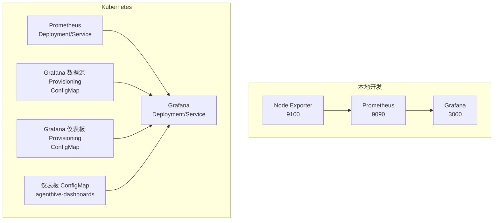
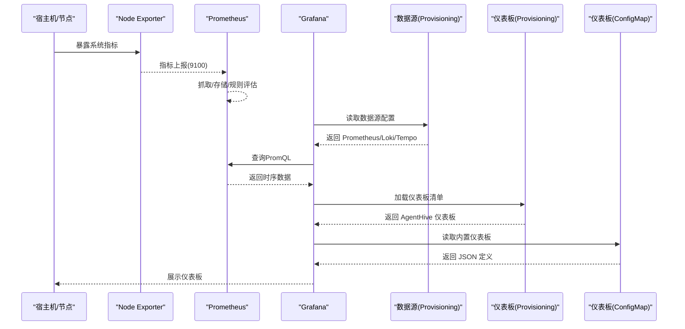
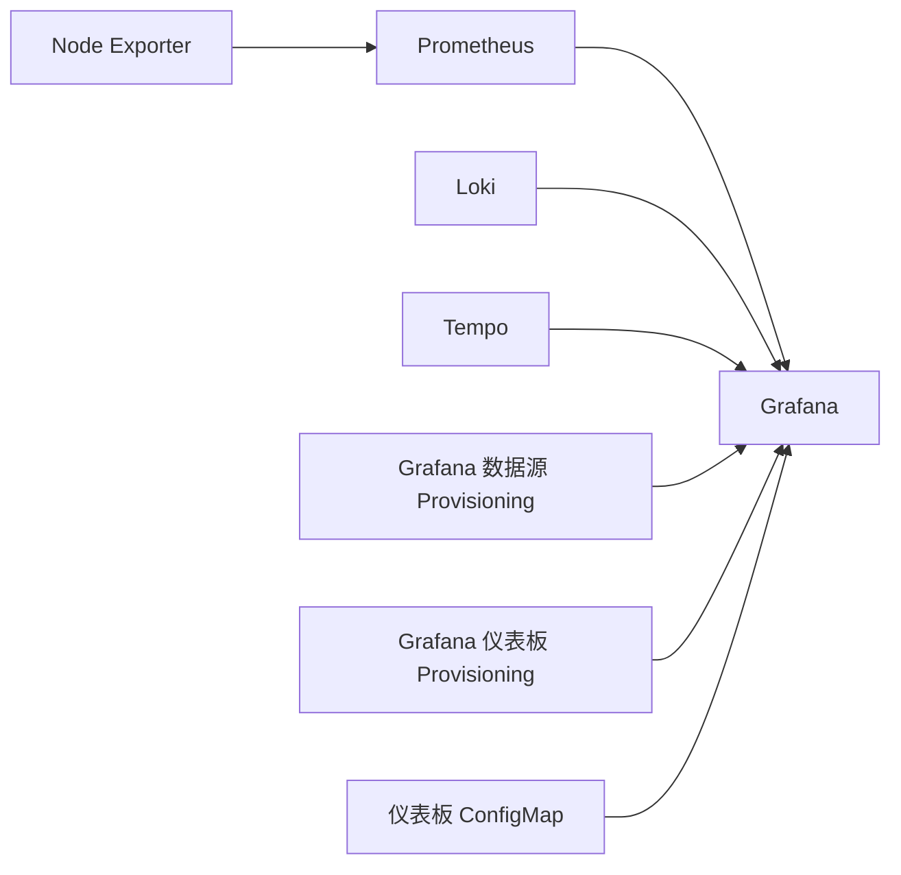

# Grafana 仪表板

<cite>
**本文引用的文件**
- [grafana-dashboard-configmap.yaml](file://k8s/components/monitoring/grafana-dashboard-configmap.yaml)
- [grafana-provisioning.yaml](file://k8s/components/monitoring/grafana-provisioning.yaml)
- [grafana-dashboard.json](file://docs/archive/deployment-plan/monitoring/grafana-dashboard.json)
- [prometheus.yml](file://monitoring/grafana/provisioning/datasources/prometheus.yml)
- [main.yaml](file://monitoring/grafana/provisioning/dashboards/main.yaml)
- [agenthive-overview.json](file://monitoring/grafana/provisioning/dashboards/agenthive-overview.json)
- [system-monitor.json](file://monitoring/grafana/provisioning/dashboards/dashboards/system-monitor.json)
- [10-prometheus.yaml](file://k8s/monitoring/10-prometheus.yaml)
- [20-grafana.yaml](file://k8s/monitoring/20-grafana.yaml)
- [01-搭建与部署-setup.md](file://monitoring/docs/01-搭建与部署-setup.md)
- [02-运维与排障-operations.md](file://monitoring/docs/02-运维与排障-operations.md)
</cite>

## 目录
1. [简介](#简介)
2. [项目结构](#项目结构)
3. [核心组件](#核心组件)
4. [架构总览](#架构总览)
5. [组件详解](#组件详解)
6. [依赖关系分析](#依赖关系分析)
7. [性能与可用性](#性能与可用性)
8. [故障排查指南](#故障排查指南)
9. [结论](#结论)
10. [附录](#附录)

## 简介
本文件面向 AgentHive Cloud 的可观测性与仪表板使用，围绕 Grafana 的安装部署、初始配置、数据源连接（尤其是 Prometheus）、仪表板设计与变量使用、平台专属仪表板解读（系统概览、性能与业务指标）、以及仪表板导入导出与共享的最佳实践进行系统化说明。同时提供常用图表类型的配置思路与自定义面板创建方法，帮助读者快速上手并稳定运维。

## 项目结构
本项目在本地与 Kubernetes 两种环境中均提供了 Grafana 与 Prometheus 的部署与仪表板配置：
- 本地开发：通过 monitoring 目录下的 docker-compose 一键启动 Grafana、Prometheus 与 Node Exporter，并提供 Makefile 封装构建、推送与部署流程。
- Kubernetes：通过 k8s/monitoring 下的 YAML 定义 Prometheus 与 Grafana 的 Deployment、Service、ConfigMap 与 PVC；同时提供 Grafana 的数据源与仪表板 Provisioning 配置。



**图表来源**
- [01-搭建与部署-setup.md:1-508](file://monitoring/docs/01-搭建与部署-setup.md#L1-L508)
- [10-prometheus.yaml:1-132](file://k8s/monitoring/10-prometheus.yaml#L1-L132)
- [20-grafana.yaml:1-222](file://k8s/monitoring/20-grafana.yaml#L1-L222)

**章节来源**
- [01-搭建与部署-setup.md:1-508](file://monitoring/docs/01-搭建与部署-setup.md#L1-L508)
- [10-prometheus.yaml:1-132](file://k8s/monitoring/10-prometheus.yaml#L1-L132)
- [20-grafana.yaml:1-222](file://k8s/monitoring/20-grafana.yaml#L1-L222)

## 核心组件
- 数据采集层
  - Node Exporter：采集宿主机系统指标，供 Prometheus 拉取。
  - Prometheus：定时抓取指标，提供查询接口与规则评估能力。
- 可视化层
  - Grafana：通过数据源连接 Prometheus，渲染仪表板与图表。
- 配置与交付
  - 本地：通过 docker-compose 与 Makefile 管理镜像构建与部署。
  - Kubernetes：通过 ConfigMap/Deployment/PVC 提供数据源与仪表板的自动化配置与持久化。

**章节来源**
- [01-搭建与部署-setup.md:1-508](file://monitoring/docs/01-搭建与部署-setup.md#L1-L508)
- [10-prometheus.yaml:1-132](file://k8s/monitoring/10-prometheus.yaml#L1-L132)
- [20-grafana.yaml:1-222](file://k8s/monitoring/20-grafana.yaml#L1-L222)

## 架构总览
下图展示了从指标采集到可视化呈现的整体链路，以及 AgentHive 平台专用仪表板的组织方式。



**图表来源**
- [01-搭建与部署-setup.md:1-508](file://monitoring/docs/01-搭建与部署-setup.md#L1-L508)
- [grafana-provisioning.yaml:1-53](file://k8s/components/monitoring/grafana-provisioning.yaml#L1-L53)
- [grafana-dashboard-configmap.yaml:1-96](file://k8s/components/monitoring/grafana-dashboard-configmap.yaml#L1-L96)

## 组件详解

### 安装与初始配置（本地与 Kubernetes）
- 本地开发
  - 使用 docker-compose 一键启动三组件，访问 Grafana 默认地址与凭据。
  - Makefile 封装构建、推送、部署与清理流程，支持环境变量覆盖仓库与命名空间。
  - 若需修复“预置仪表板未生效”的问题，可通过宿主机挂载方式临时解决，或修正 Dockerfile 后重新构建镜像。
- Kubernetes
  - Prometheus 与 Grafana 通过 Deployment/Service/PVC 部署，Prometheus 配置通过 ConfigMap 注入。
  - Grafana 通过 ConfigMap 提供数据源与仪表板 Provisioning，仪表板亦可通过 ConfigMap 注入。

**章节来源**
- [01-搭建与部署-setup.md:21-508](file://monitoring/docs/01-搭建与部署-setup.md#L21-L508)
- [20-grafana.yaml:1-222](file://k8s/monitoring/20-grafana.yaml#L1-L222)
- [10-prometheus.yaml:1-132](file://k8s/monitoring/10-prometheus.yaml#L1-L132)

### 数据源配置（重点：Prometheus）
- 本地 Grafana 数据源配置
  - Prometheus 数据源通过 Provisioning YAML 定义，访问模式为 proxy，默认数据源，包含超时与请求方法等参数。
- Kubernetes Grafana 数据源配置
  - 通过 ConfigMap 提供 datasources.yaml，包含 Prometheus、Loki、Tempo 三类数据源，其中 Prometheus URL 指向集群内服务。
- 关键注意事项
  - 数据源 UID 一致性：若仪表板 JSON 中硬编码了特定 UID，而数据源未显式声明 UID，会导致“面板显示 No Data”。
  - 网络连通性：默认 bridge 网络不支持容器名互访，需使用自定义网络或使用宿主机 IP。

**章节来源**
- [prometheus.yml:1-17](file://monitoring/grafana/provisioning/datasources/prometheus.yml#L1-L17)
- [grafana-provisioning.yaml:7-16](file://k8s/components/monitoring/grafana-provisioning.yaml#L7-L16)
- [02-运维与排障-operations.md:148-243](file://monitoring/docs/02-运维与排障-operations.md#L148-L243)

### 仪表板设计与变量使用
- 仪表板清单与文件路径
  - Grafana 仪表板通过 Provisioning 的 dashboardproviders.yaml 指定文件夹路径，实现从文件系统自动加载。
  - 本地与 Kubernetes 均提供 main.yaml 作为仪表板 Provider 配置。
- 变量与模板变量
  - 生产级仪表板示例包含常量变量（如 namespace、cluster），用于限定查询范围与提升复用性。
  - 日志型仪表板示例包含基于 Loki 的查询变量（namespace/app/pod），支持多级联动筛选。
- 图表类型与字段配置
  - 常用图表：stat、timeseries、logs、traces、piechart 等。
  - 字段单位与阈值：如百分比、秒、货币等，阈值分段用于颜色映射。

**章节来源**
- [main.yaml:1-16](file://monitoring/grafana/provisioning/dashboards/main.yaml#L1-L16)
- [grafana-dashboard.json:15-34](file://docs/archive/deployment-plan/monitoring/grafana-dashboard.json#L15-L34)
- [grafana-dashboard-configmap.yaml:11-96](file://k8s/components/monitoring/grafana-dashboard-configmap.yaml#L11-L96)
- [agenthive-overview.json:219-234](file://monitoring/grafana/provisioning/dashboards/agenthive-overview.json#L219-L234)

### AgentHive 平台专用仪表板解读
- 系统概览（Overview）
  - 包含 API 请求速率、错误率、延迟（P95）、Pod CPU/内存、HPA 当前副本数等关键指标。
  - 适合快速掌握集群与服务整体健康状况。
- 生产级概览（Production Overview）
  - 包含服务健康状态、请求速率、错误率、延迟分位（P50/P95/P99）、任务队列与活动任务、Pod 规模、CPU/内存、数据库连接数、LLM API 指标、Agent 任务成功率、成本概览等。
  - 支持模板变量限定命名空间与集群，便于多环境复用。
- 系统监控（System Monitor）
  - 面向基础设施的系统指标面板，包含 CPU/内存/磁盘使用率、网络流入、服务状态（up/down）等。
- 日志与追踪（Logs & Traces）
  - 基于 Loki 的日志面板，支持按命名空间、应用、Pod 过滤。
  - 基于 Tempo 的追踪面板，支持 TraceQL 查询与详情查看。
- 面板布局与交互
  - 使用 gridPos 控制面板位置与大小，支持注解、时间范围、模板变量与字段映射。

**章节来源**
- [grafana-dashboard-configmap.yaml:11-96](file://k8s/components/monitoring/grafana-dashboard-configmap.yaml#L11-L96)
- [grafana-dashboard.json:47-301](file://docs/archive/deployment-plan/monitoring/grafana-dashboard.json#L47-L301)
- [system-monitor.json:11-633](file://monitoring/grafana/provisioning/dashboards/dashboards/system-monitor.json#L11-L633)
- [agenthive-overview.json:11-234](file://monitoring/grafana/provisioning/dashboards/agenthive-overview.json#L11-L234)

### 仪表板导入、导出、共享与版本管理最佳实践
- 导入
  - 本地：通过挂载宿主机目录到 Grafana 容器的 Provisioning 路径，实现无重启加载。
  - Kubernetes：通过 ConfigMap 注入仪表板 JSON，或在 Pod 中挂载 ConfigMap 到 /var/lib/grafana/dashboards/agenthive。
- 导出
  - 在 Grafana 中打开目标仪表板，点击右上角菜单导出，保存为 JSON 文件。
- 共享
  - 将导出的 JSON 上传至版本控制，配合团队评审与发布流程。
- 版本管理
  - 为仪表板添加 uid 与版本号，便于跨环境迁移与回滚。
  - 使用模板变量统一命名空间与集群维度，减少硬编码差异。

**章节来源**
- [main.yaml:1-16](file://monitoring/grafana/provisioning/dashboards/main.yaml#L1-L16)
- [20-grafana.yaml:48-209](file://k8s/monitoring/20-grafana.yaml#L48-L209)

### 常用图表类型与自定义面板创建方法
- 常用图表类型
  - Stat：用于展示单一数值与阈值映射（如健康状态、错误率）。
  - Timeseries：用于趋势与分位数展示（如延迟、CPU/内存占比）。
  - Logs：用于日志流查看与过滤（基于 Loki）。
  - Traces：用于分布式追踪（基于 Tempo）。
  - Piechart：用于资源消耗或成本构成的占比展示。
- 自定义面板步骤
  - 选择数据源与查询语言（PromQL/LogQL/TraceQL）。
  - 设置时间范围与模板变量，保证可复用性。
  - 配置字段映射与单位，设置阈值分段与颜色。
  - 使用 gridPos 调整布局，添加注解与标签以便识别。

**章节来源**
- [agenthive-overview.json:11-234](file://monitoring/grafana/provisioning/dashboards/agenthive-overview.json#L11-L234)
- [system-monitor.json:11-633](file://monitoring/grafana/provisioning/dashboards/dashboards/system-monitor.json#L11-L633)

## 依赖关系分析
- 组件耦合
  - Grafana 依赖 Prometheus 提供指标查询；依赖 Loki/Tempo 提供日志与追踪。
  - 仪表板依赖数据源 UID 保持一致，避免“No Data”问题。
- 外部依赖
  - Prometheus 依赖 Node Exporter 暴露系统指标。
  - Kubernetes 环境依赖集群内服务发现与网络策略。



**图表来源**
- [10-prometheus.yaml:1-132](file://k8s/monitoring/10-prometheus.yaml#L1-L132)
- [20-grafana.yaml:1-222](file://k8s/monitoring/20-grafana.yaml#L1-L222)
- [grafana-provisioning.yaml:1-53](file://k8s/components/monitoring/grafana-provisioning.yaml#L1-L53)

**章节来源**
- [10-prometheus.yaml:1-132](file://k8s/monitoring/10-prometheus.yaml#L1-L132)
- [20-grafana.yaml:1-222](file://k8s/monitoring/20-grafana.yaml#L1-L222)
- [grafana-provisioning.yaml:1-53](file://k8s/components/monitoring/grafana-provisioning.yaml#L1-L53)

## 性能与可用性
- 采样与查询优化
  - 合理设置 scrape_interval 与 query timeout，避免过度抓取与查询超时。
  - 使用 PromQL 的聚合与分位函数（如 histogram_quantile、rate）降低数据体积。
- 可用性保障
  - Prometheus 与 Grafana 使用持久化卷，容器重建后数据不丢失。
  - Grafana 默认管理员凭据需在生产环境立即修改。

**章节来源**
- [prometheus.yml:13-17](file://monitoring/grafana/provisioning/datasources/prometheus.yml#L13-L17)
- [01-搭建与部署-setup.md:293-299](file://monitoring/docs/01-搭建与部署-setup.md#L293-L299)

## 故障排查指南
- Dashboard 显示 No Data
  - 检查数据源连通性与 UID 是否一致。
  - 在 Prometheus 中直接执行面板 PromQL，确认指标是否存在。
  - 若编辑面板后个别面板恢复，说明是数据源 UID 不匹配，应统一 UID。
- 数据源连通性问题
  - 使用 curl 访问各组件健康接口，确认端口监听与网络可达。
  - 如使用默认 bridge 网络，改为自定义网络或使用宿主机 IP。
- 预置仪表板未生效
  - 本地可通过宿主机挂载 Provisioning 目录临时解决，或修正 Dockerfile 后重新构建镜像。

**章节来源**
- [02-运维与排障-operations.md:148-243](file://monitoring/docs/02-运维与排障-operations.md#L148-L243)
- [01-搭建与部署-setup.md:302-378](file://monitoring/docs/01-搭建与部署-setup.md#L302-L378)

## 结论
通过本地与 Kubernetes 两套部署方案，结合完善的 Provisioning 配置与平台专属仪表板，AgentHive Cloud 能够快速搭建稳定可靠的可观测性体系。建议在生产环境统一数据源 UID、使用模板变量提升复用性、采用版本化管理仪表板，并建立定期健康检查与故障排查流程，以确保监控系统的长期可用与高效运维。

### LLM 成本追踪仪表板设计

为监控 AI Agent 的运行成本，建议在 Grafana 中配置以下专用面板：

```yaml
面板配置建议：
- LLM 成本趋势（Timeseries）
  - 数据源：Prometheus
  - 查询：rate(llm_cost_usd_total[1h])
  - 单位：USD ($)
  - 描述：按小时聚合的 LLM 调用成本
  
- Token 用量对比（Barchart）
  - 查询：sum by (model) (rate(llm_tokens_total[1h]))
  - 分组：按模型分组
  - 描述：不同模型的 Token 消耗对比
  
- 各提供商成本占比（Piechart）
  - 查询：sum by (provider) (llm_cost_usd_total)
  - 描述：按 LLM 提供商的成本分布
  
- Agent 任务执行统计（Stat）
  - 查询：agenthive_runtime_task_total
  - 阈值颜色：green(>90% 成功率) / yellow(70-90%) / red(<70%)
```

### 日常运维监控面板推荐

| 面板名称 | 类型 | 关键指标 | 更新频率 |
|---------|------|---------|---------|
| 服务健康总览 | Stat | API/Landing/DB/Redis 健康状态 | 30s |
| 请求QPS | Timeseries | HTTP 请求速率、WebSocket 连接数 | 30s |
| 错误率 | Timeseries | 4xx/5xx 错误率、LLM 调用失败率 | 30s |
| 延迟分位数 | Timeseries | P50/P95/P99 延迟 | 30s |
| 资源使用 | Timeseries | CPU/内存/磁盘使用率 | 30s |
| Agent 任务队列 | Stat + Timeseries | 待处理/运行中/完成/失败任务数 | 15s |
| 数据库连接池 | Timeseries | 活跃/空闲/等待连接数 | 30s |
| LLM 成本 | Stat + Timeseries | 累计/小时/每日成本 | 60s |

章节来源
- [agenthive-overview.json:1-234](file://monitoring/grafana/provisioning/dashboards/agenthive-overview.json#L1-L234)
- [system-monitor.json:1-633](file://monitoring/grafana/provisioning/dashboards/dashboards/system-monitor.json#L1-L633)

## 附录
- 快速入口
  - 本地启动与访问：参见本地部署文档中的启动与访问说明。
  - Kubernetes 部署：参考 k8s/monitoring 下的 YAML 定义与 ConfigMap。
- 参考文件清单
  - 本地部署与运维文档
  - Prometheus 与 Grafana 的 Provisioning 配置
  - AgentHive 专属仪表板 JSON

**章节来源**
- [01-搭建与部署-setup.md:1-508](file://monitoring/docs/01-搭建与部署-setup.md#L1-L508)
- [02-运维与排障-operations.md:1-243](file://monitoring/docs/02-运维与排障-operations.md#L1-L243)
- [prometheus.yml:1-17](file://monitoring/grafana/provisioning/datasources/prometheus.yml#L1-L17)
- [main.yaml:1-16](file://monitoring/grafana/provisioning/dashboards/main.yaml#L1-L16)
- [grafana-dashboard.json:1-302](file://docs/archive/deployment-plan/monitoring/grafana-dashboard.json#L1-L302)
- [agenthive-overview.json:1-234](file://monitoring/grafana/provisioning/dashboards/agenthive-overview.json#L1-L234)
- [system-monitor.json:1-633](file://monitoring/grafana/provisioning/dashboards/dashboards/system-monitor.json#L1-L633)
- [grafana-dashboard-configmap.yaml:1-96](file://k8s/components/monitoring/grafana-dashboard-configmap.yaml#L1-L96)
- [grafana-provisioning.yaml:1-53](file://k8s/components/monitoring/grafana-provisioning.yaml#L1-L53)
- [10-prometheus.yaml:1-132](file://k8s/monitoring/10-prometheus.yaml#L1-L132)
- [20-grafana.yaml:1-222](file://k8s/monitoring/20-grafana.yaml#L1-L222)