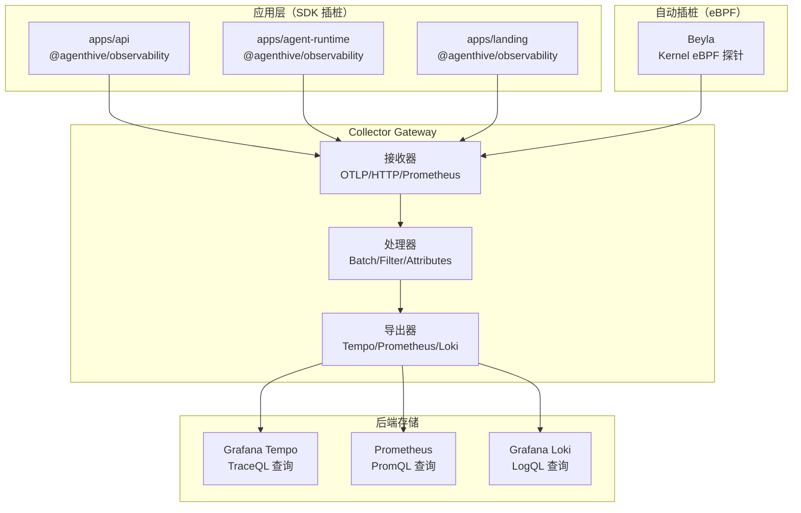
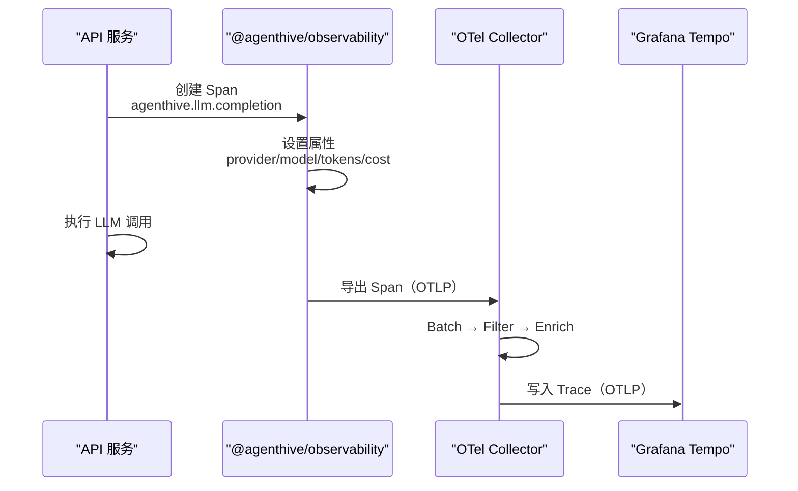
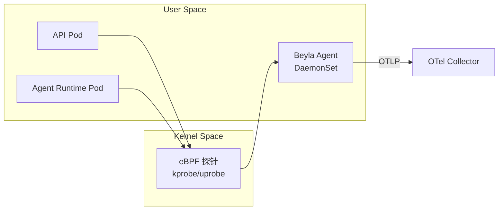
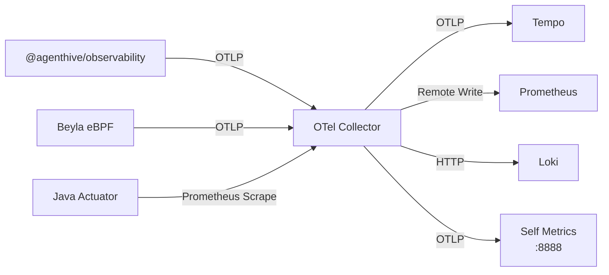

# OpenTelemetry Collector 详解

<cite>
**本文引用的文件**
- [monitoring/opentelemetry/otel-collector/otel-collector.yml](file://monitoring/opentelemetry/otel-collector/otel-collector.yml)
- [monitoring/opentelemetry/otel-collector/prometheus-otel.yml](file://monitoring/opentelemetry/otel-collector/prometheus-otel.yml)
- [monitoring/docker-compose.yml](file://monitoring/docker-compose.yml)
- [monitoring/beyla/load-generator.yml](file://monitoring/beyla/load-generator.yml)
- [monitoring/beyla/load-test-client.js](file://monitoring/beyla/load-test-client.js)
- [packages/observability/src/ai-attributes.ts](file://packages/observability/src/ai-attributes.ts)
- [packages/observability/src/telemetry-utils.ts](file://packages/observability/src/telemetry-utils.ts)
- [docker/otel-collector/otel-config.yaml](file://docker/otel-collector/otel-config.yaml)
- [apps/api/src/app.ts](file://apps/api/src/app.ts)
- [apps/agent-runtime/src/index.ts](file://apps/agent-runtime/src/index.ts)
</cite>

## 目录
1. [简介](#简介)
2. [项目结构](#项目结构)
3. [核心组件](#核心组件)
4. [架构总览](#架构总览)
5. [管道详解](#管道详解)
6. [依赖关系分析](#依赖关系分析)
7. [性能与调优](#性能与调优)
8. [故障排查指南](#故障排查指南)
9. [结论](#结论)
10. [附录](#附录)

## 简介
OpenTelemetry Collector 是 AgentHive Cloud 可观测性体系的中枢组件，负责统一接收、处理和导出三大信号（Traces、Metrics、Logs）。本系统采用 Collector Gateway 架构，结合 Beyla eBPF 实现零侵入的自动插桩，并通过 `@agenthive/observability` 共享包为应用层提供 AI 专属的语义约定。

**核心能力**：
- 多协议接收：OTLP gRPC/HTTP、Prometheus Remote Write、Jaeger
- 多管道处理：内存限制、批量聚合、属性注入、敏感信息过滤
- 多后端导出：Tempo（Traces）、Prometheus（Metrics）、Loki（Logs）
- AI 专属指标：LLM Token 用量、成本追踪、Agent 任务执行统计
- eBPF 自动插桩：Beyla 实现零代码修改的服务级别可观测

## 项目结构
OTel Collector 配置分布在以下位置：
- `monitoring/opentelemetry/otel-collector/`：Docker Compose 环境的 Collector 配置
- `docker/otel-collector/`：生产环境 Docker 部署配置
- `monitoring/beyla/`：Beyla eBPF 自动插桩配置
- `packages/observability/`：应用层 SDK 和 AI 语义约定
- `apps/api/`、`apps/agent-runtime/`：应用层集成点



**图表来源**
- [monitoring/opentelemetry/otel-collector/otel-collector.yml:1-199](file://monitoring/opentelemetry/otel-collector/otel-collector.yml#L1-L199)
- [monitoring/docker-compose.yml:190-215](file://monitoring/docker-compose.yml#L190-L215)

## 核心组件

### 接收器（Receivers）
| 接收器 | 协议 | 端口 | 用途 |
|--------|------|------|------|
| otlp | gRPC | 4317 | 接收应用层的 Trace/Metric/Log |
| otlp/http | HTTP | 4318 | HTTP 协议的 OTLP 数据 |
| prometheus | Scrape | 8888 | Collector 自身指标暴露 |

### 处理器（Processors）
| 处理器 | 功能 | 配置要点 |
|--------|------|---------|
| memory_limiter | 内存限制保护 | soft_limit=512MiB, hard_limit=1GiB |
| batch | 批量聚合 | send_batch_size=512, timeout=5s |
| resource | 资源属性注入 | service.name, deployment.environment |
| attributes | 属性过滤 | 删除敏感字段（password/token/key） |
| filter | 数据过滤 | 按 service/span 名称过滤 |

### 导出器（Exporters）
| 导出器 | 目标 | 信号类型 | 端点 |
|--------|------|---------|------|
| otlp/tempo | Grafana Tempo | Traces | tempo:4317 |
| prometheusremotewrite | Prometheus | Metrics | prometheus:9090 |
| loki | Grafana Loki | Logs | loki:3100 |
| logging | stdout | Debug | - |

## 架构总览
Collector 采用三层管道架构，每种信号类型有独立的处理链路：

```mermaid
graph TB
subgraph "Traces 管道"
TraceIn["OTLP Traces"] --> TraceProc["Batch → Attributes → Filter"]
TraceProc --> TraceOut["Tempo OTLP"]
end
subgraph "Metrics 管道"
MetricIn["OTLP Metrics + Prometheus Scrape"] --> MetricProc["Batch → Resource → Filter"]
MetricProc --> MetricOut["Prometheus Remote Write"]
end
subgraph "Logs 管道"
LogIn["OTLP Logs + Filelog"] --> LogProc["Batch → Parse → Attributes"]
LogProc --> LogOut["Loki HTTP"]
end
subgraph "自监控"
SelfIn["Collector Metrics"] --> SelfOut["Prometheus Exporter<br/>:8888/metrics"]
end
```



## 管道详解

### Traces 管道：分布式追踪
```yaml
# 追踪管道配置示例
traces:
  receivers: [otlp]
  processors:
    - memory_limiter:
        check_interval: 1s
        limit_mib: 512
        spike_limit_mib: 128
    - batch:
        send_batch_size: 512
        timeout: 5s
    - resource:
        attributes:
          - key: service.namespace
            value: "agenthive"
            action: upsert
    - attributes:
        actions:
          - key: http.request.header.authorization
            action: delete
  exporters: [otlp/tempo, logging]
```

**AI Agent 追踪约定**
AgentHive 应用层通过 `@agenthive/observability` SDK 创建语义化的 Span：

- `agenthive.llm.completion`：LLM 调用（含 provider/model/tokens/cost）
- `agenthive.runtime.task`：Agent 任务执行
- `agenthive.query_loop.execute`：QueryLoop 迭代
- `agenthive.tool.execute`：工具调用
- `agenthive.websocket.message`：WebSocket 消息



**章节来源**
- [packages/observability/src/ai-attributes.ts:1-136](file://packages/observability/src/ai-attributes.ts#L1-L136)
- [packages/observability/src/telemetry-utils.ts:1-154](file://packages/observability/src/telemetry-utils.ts#L1-L154)

### Metrics 管道：指标采集与远程写入

支持双模式指标采集：
1. **Pull 模式**：Prometheus 主动抓取 Collector 暴露的 `/metrics` 端点
2. **Push 模式**：Collector 通过 Remote Write 将指标推送到 Prometheus

```yaml
metrics:
  receivers: [otlp]
  processors:
    - batch:
        timeout: 10s
    - resource:
        attributes:
          - key: deployment.environment
            value: "${ENVIRONMENT}"
            action: upsert
  exporters:
    - prometheusremotewrite:
        endpoint: "http://prometheus:9090/api/v1/write"
        resource_to_telemetry_conversion:
          enabled: true
    - prometheus:
        endpoint: "0.0.0.0:8888"
```

### Logs 管道：日志聚合

```yaml
logs:
  receivers: [otlp]
  processors:
    - batch:
        timeout: 2s
    - attributes:
        actions:
          - key: log.level
            action: extract
            pattern: '^(?P<level>\w+)'
    - resource:
        attributes:
          - key: service.name
            action: upsert
  exporters:
    - loki:
        endpoint: "http://loki:3100/loki/api/v1/push"
        labels:
          attributes:
            service.name: ""
            log.level: ""
```

**章节来源**
- [monitoring/opentelemetry/otel-collector/otel-collector.yml:1-199](file://monitoring/opentelemetry/otel-collector/otel-collector.yml#L1-L199)

### Beyla eBPF 自动插桩

Beyla 通过 eBPF 探针在 Linux 内核层面自动捕获服务间的 HTTP/gRPC 流量，提供零侵入的 RED 指标（Rate/Error/Duration）：

- **自动发现**：自动检测 Kubernetes Pod 的 HTTP/gRPC 流量
- **自动插桩**：无需修改应用代码，内核级注入 Trace Context
- **OTel 集成**：通过 OTLP 协议将 Trace 和 Metric 发送到 Collector
- **低开销**：eBPF 运行在内核态，CPU 开销 < 1%



**章节来源**
- [monitoring/beyla/load-generator.yml:1-50](file://monitoring/beyla/load-generator.yml#L1-L50)
- [monitoring/beyla/load-test-client.js:1-80](file://monitoring/beyla/load-test-client.js#L1-L80)

## 依赖关系分析



## 性能与调优

### 资源限制
| 参数 | 开发环境 | 生产环境 |
|------|---------|---------|
| CPU Limit | 0.5 | 1.0 |
| Memory Limit | 256Mi | 512Mi |
| Batch Size | 256 | 512 |
| Batch Timeout | 2s | 5s |

### 采样策略
- **Head Sampling**：基于 TraceID 的确定性采样，推荐概率 10%（生产）到 100%（开发）
- **Tail Sampling**：基于错误率和延迟的后置采样，用于高流量场景

### 调优建议
- 提高 `send_batch_size` 和 `timeout` 可减少导出请求频率，降低后端压力
- 启用 `memory_limiter` 防止 OOM，设置合理的 soft/hard limit
- 对高基数标签（用户 ID、Session ID）启用过滤，避免指标爆炸

## 故障排查指南

### Collector OOM
- **现象**：Collector Pod 频繁重启，日志显示 OOMKilled
- **排查**：检查 `memory_limiter` 配置；查看有无高基数标签导致指标膨胀
- **解决**：增大 memory limit；启用 Tail Sampling；过滤高基数标签

### 信号丢失
- **现象**：Grafana/Tempo 中看不到预期的 Trace 或 Metric
- **排查**：检查 Collector 的 `logging` exporter 输出；确认网络连通性
- **解决**：验证 SDK 配置中的 exporter endpoint；检查命名空间网络策略

### Beyla 不生效
- **现象**：Beyla 未捕获到流量
- **排查**：确认内核版本 ≥ 5.8；检查 eBPF 权限（CAP_BPF）；查看 Beyla DaemonSet 日志
- **解决**：启用 `privileged: true`；使用 `hostPID: true` 模式

**章节来源**
- [monitoring/opentelemetry/otel-collector/otel-collector.yml:30-43](file://monitoring/opentelemetry/otel-collector/otel-collector.yml#L30-L43)
- [monitoring/docs/02-运维与排障-operations.md:1-243](file://monitoring/docs/02-运维与排障-operations.md#L1-L243)

## 结论
OTel Collector 作为 AgentHive Cloud 可观测性体系的核心枢纽，通过统一的三信号管道和 AI 专属语义约定，实现了从应用层到基础设施层的端到端可观测。结合 Beyla eBPF 的零侵入自动插桩和 `@agenthive/observability` SDK 的应用层增强，平台能够在保持低开销的前提下，提供 LLM 成本追踪、Agent 任务监控和分布式链路追踪等企业级可观测能力。

## 附录

### 关键端口速查
| 端口 | 协议 | 用途 |
|------|------|------|
| 4317 | gRPC | OTLP 接收 |
| 4318 | HTTP | OTLP HTTP 接收 |
| 8888 | HTTP | Collector 自身指标 |
| 8889 | HTTP | pprof 性能分析 |
| 55679 | HTTP | zPages 调试页面 |

### 相关文档
- [Prometheus 指标监控](file://监控与可观测性/Prometheus 指标监控.md)
- [Grafana 仪表板](file://监控与可观测性/Grafana 仪表板.md)
- [共享包架构 - @agenthive/observability](file://开发指南/共享包架构.md)
