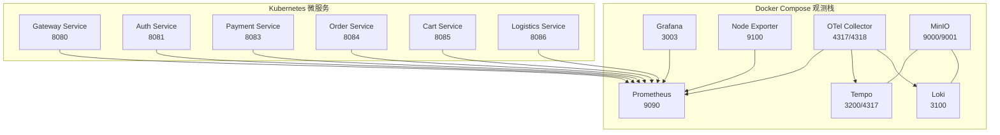
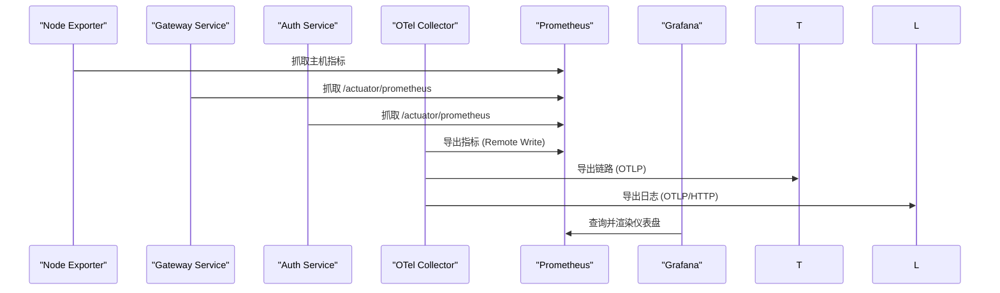
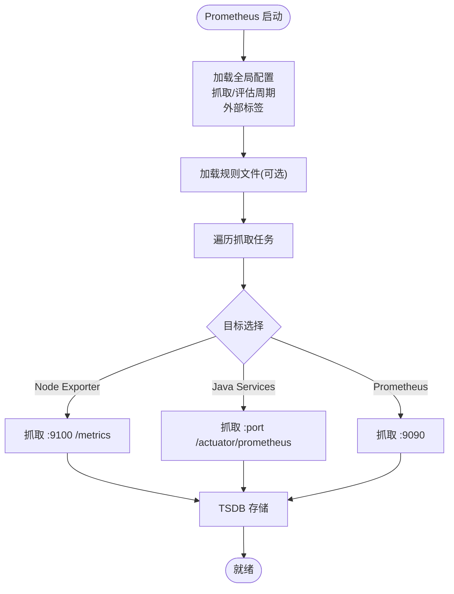
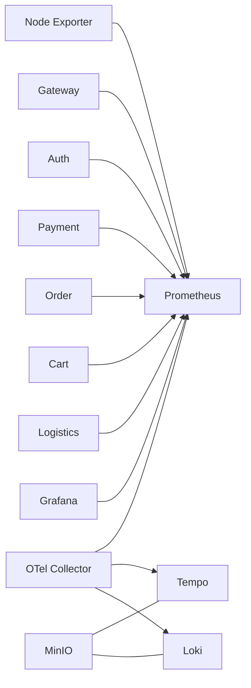

# Prometheus 指标监控

<cite>
**本文引用的文件**
- [monitoring/prometheus/prometheus.yml](file://monitoring/prometheus/prometheus.yml)
- [monitoring/docker-compose.yml](file://monitoring/docker-compose.yml)
- [monitoring/grafana/provisioning/datasources/prometheus.yml](file://monitoring/grafana/provisioning/datasources/prometheus.yml)
- [monitoring/grafana/provisioning/dashboards/main.yaml](file://monitoring/grafana/provisioning/dashboards/main.yaml)
- [monitoring/node-exporter/Dockerfile](file://monitoring/node-exporter/Dockerfile)
- [monitoring/opentelemetry/otel-collector/otel-collector.yml](file://monitoring/opentelemetry/otel-collector/otel-collector.yml)
- [monitoring/opentelemetry/otel-collector/prometheus-otel.yml](file://monitoring/opentelemetry/otel-collector/prometheus-otel.yml)
- [k8s/base/10-java-services.yaml](file://k8s/base/10-java-services.yaml)
</cite>

## 目录
1. [简介](#简介)
2. [项目结构](#项目结构)
3. [核心组件](#核心组件)
4. [架构总览](#架构总览)
5. [组件详解](#组件详解)
6. [依赖关系分析](#依赖关系分析)
7. [性能与容量规划](#性能与容量规划)
8. [告警与通知](#告警与通知)
9. [故障排查](#故障排查)
10. [结论](#结论)
11. [附录](#附录)

## 简介
本文件面向 Prometheus 指标监控体系，结合仓库中的 Docker Compose 与 Kubernetes 部署样例，系统化梳理 Prometheus 架构、数据模型与时间序列存储机制；详解配置文件结构（全局、抓取目标、规则文件、远程写入）；给出 Node Exporter、API 服务、Java 微服务等监控目标的配置方法；提供 PromQL 使用指南与最佳实践；覆盖告警规则、通知渠道、远程存储与数据保留策略，并附带故障排查建议。

## 项目结构
该仓库提供了两套可观测性栈的落地方式：
- Docker Compose 快速体验版：包含 Prometheus、Grafana、Tempo、Loki、MinIO、OpenTelemetry Collector、Node Exporter 等组件，便于本地或小规模测试。
- Kubernetes 生产基线：以 K8s 清单形式提供 Java 微服务的部署与探针配置，配合 Prometheus 抓取 Actuator 暴露的指标端点。



图表来源
- [monitoring/docker-compose.yml:112-136](file://monitoring/docker-compose.yml#L112-L136)
- [monitoring/prometheus/prometheus.yml:26-81](file://monitoring/prometheus/prometheus.yml#L26-L81)
- [k8s/base/10-java-services.yaml:66-121](file://k8s/base/10-java-services.yaml#L66-L121)

章节来源
- [monitoring/docker-compose.yml:1-256](file://monitoring/docker-compose.yml#L1-L256)
- [monitoring/prometheus/prometheus.yml:1-85](file://monitoring/prometheus/prometheus.yml#L1-L85)

## 核心组件
- Prometheus 服务：负责抓取、存储与查询指标，支持规则评估与远程写入。
- Grafana：作为可视化与仪表盘中心，连接 Prometheus 数据源并加载预置面板。
- Node Exporter：采集主机系统层指标（CPU、内存、磁盘、网络等）。
- OpenTelemetry Collector：接收 OTLP/HTTP 请求，处理并导出到 Prometheus、Tempo、Loki。
- MinIO：为 Tempo/Loki 提供对象存储后端。
- Java 微服务：通过 Actuator 暴露 /actuator/prometheus 指标端点，供 Prometheus 抓取。

章节来源
- [monitoring/prometheus/prometheus.yml:8-85](file://monitoring/prometheus/prometheus.yml#L8-L85)
- [monitoring/grafana/provisioning/datasources/prometheus.yml:1-17](file://monitoring/grafana/provisioning/datasources/prometheus.yml#L1-L17)
- [monitoring/node-exporter/Dockerfile:1-26](file://monitoring/node-exporter/Dockerfile#L1-L26)
- [monitoring/opentelemetry/otel-collector/otel-collector.yml:1-199](file://monitoring/opentelemetry/otel-collector/otel-collector.yml#L1-L199)
- [k8s/base/10-java-services.yaml:66-121](file://k8s/base/10-java-services.yaml#L66-L121)

## 架构总览
Prometheus 在本项目中既可作为独立时序数据库，也可与 OpenTelemetry Collector 协同工作：OTel Collector 将指标、日志、链路数据汇聚并导出至 Prometheus/Tempo/Loki，Prometheus 负责指标的长期存储与查询，Grafana 提供统一可视化。



图表来源
- [monitoring/prometheus/prometheus.yml:26-81](file://monitoring/prometheus/prometheus.yml#L26-L81)
- [monitoring/opentelemetry/otel-collector/otel-collector.yml:118-128](file://monitoring/opentelemetry/otel-collector/otel-collector.yml#L118-L128)
- [monitoring/grafana/provisioning/datasources/prometheus.yml:9-11](file://monitoring/grafana/provisioning/datasources/prometheus.yml#L9-L11)

## 组件详解

### Prometheus 配置与数据模型
- 全局配置
  - 抓取与评估周期：默认抓取间隔与规则评估间隔均为 15 秒。
  - 外部标签：统一注入 monitor 标签，便于多集群/多环境区分。
- 规则文件：预留规则文件入口，可用于定义记录规则与告警规则。
- 抓取目标
  - Prometheus 自身：抓取本地 9090 端口。
  - Node Exporter：抓取 node-exporter:9100。
  - Java 微服务：统一通过 /actuator/prometheus 暴露指标，抓取各服务端口。
  - API/Nginx：示例注释展示了如何扩展抓取目标。
- 远程写入：预留远程写入配置块，可对接远端时序数据库。



图表来源
- [monitoring/prometheus/prometheus.yml:8-85](file://monitoring/prometheus/prometheus.yml#L8-L85)

章节来源
- [monitoring/prometheus/prometheus.yml:8-85](file://monitoring/prometheus/prometheus.yml#L8-L85)

### Grafana 数据源与仪表盘
- 数据源：Grafana 通过代理访问 Prometheus（http://prometheus:9090），默认数据源，支持 POST 查询与超时配置。
- 仪表盘：从文件系统加载预置面板，组织在 AgentHive 文件夹下，自动更新。

章节来源
- [monitoring/grafana/provisioning/datasources/prometheus.yml:1-17](file://monitoring/grafana/provisioning/datasources/prometheus.yml#L1-L17)
- [monitoring/grafana/provisioning/dashboards/main.yaml:1-16](file://monitoring/grafana/provisioning/dashboards/main.yaml#L1-L16)

### Node Exporter 配置与优化
- 端口与健康检查：暴露 9100 端口并内置健康检查。
- 启动参数：挂载 /proc、/sys、/，排除特定文件系统类型与路径，开启 CPU/NUMA 内存信息采集，限制最大并发请求数。

章节来源
- [monitoring/node-exporter/Dockerfile:1-26](file://monitoring/node-exporter/Dockerfile#L1-L26)

### OpenTelemetry Collector 管道
- 接收：OTLP gRPC/HTTP。
- 处理：内存限制、批量聚合、资源属性注入、敏感信息过滤、日志解析。
- 导出：
  - 指标：Prometheus Exporter（供 Prometheus 抓取）、Prometheus Remote Write（写入本地 Prometheus）。
  - 链路：OTLP 到 Tempo。
  - 日志：OTLP/HTTP 到 Loki。
- 自监控：Collector 自身指标暴露于 8888 端口。

章节来源
- [monitoring/opentelemetry/otel-collector/otel-collector.yml:1-199](file://monitoring/opentelemetry/otel-collector/otel-collector.yml#L1-L199)

### Java 微服务指标暴露与抓取
- 暴露端点：各微服务通过 Actuator 暴露 /actuator/prometheus。
- 探针：liveness/readiness 健康检查路径为 /actuator/health。
- 抓取配置：Prometheus 以服务名与端口组合进行 DNS 解析抓取。

章节来源
- [k8s/base/10-java-services.yaml:66-121](file://k8s/base/10-java-services.yaml#L66-L121)
- [monitoring/prometheus/prometheus.yml:48-80](file://monitoring/prometheus/prometheus.yml#L48-L80)

### Docker Compose 部署要点
- Prometheus：挂载配置与数据卷，持久化存储于 /prometheus，保留期 30 天。
- Grafana：依赖 Prometheus/Tempo/Loki，映射 3003 端口。
- Node Exporter：映射 9100 端口，挂载 /proc、/sys、/。
- OTel Collector：映射 OTLP/HTTP、Collector 指标、pprof、zpages 端口。
- MinIO：为 Tempo/Loki 提供对象存储，初始化 bucket 并开放匿名下载。

章节来源
- [monitoring/docker-compose.yml:112-136](file://monitoring/docker-compose.yml#L112-L136)
- [monitoring/docker-compose.yml:140-166](file://monitoring/docker-compose.yml#L140-L166)
- [monitoring/docker-compose.yml:170-186](file://monitoring/docker-compose.yml#L170-L186)
- [monitoring/docker-compose.yml:190-215](file://monitoring/docker-compose.yml#L190-L215)
- [monitoring/docker-compose.yml:14-49](file://monitoring/docker-compose.yml#L14-L49)

## 依赖关系分析
- 组件耦合
  - Prometheus 依赖 Node Exporter 与 Java 微服务的 /actuator/prometheus 端点。
  - OTel Collector 作为统一入口，向 Prometheus/Tempo/Loki 导出数据。
  - Grafana 依赖 Prometheus 数据源。
- 外部依赖
  - MinIO 为 Tempo/Loki 提供对象存储后端。
  - Docker 网络（agenthive-monitoring）确保容器间 DNS 解析与连通性。



图表来源
- [monitoring/prometheus/prometheus.yml:26-81](file://monitoring/prometheus/prometheus.yml#L26-L81)
- [monitoring/opentelemetry/otel-collector/otel-collector.yml:118-149](file://monitoring/opentelemetry/otel-collector/otel-collector.yml#L118-L149)
- [monitoring/docker-compose.yml:112-166](file://monitoring/docker-compose.yml#L112-L166)

## 性能与容量规划
- 抓取频率与评估频率：默认 15s，可根据指标基数与资源占用调整。
- 存储保留期：Prometheus 默认保留 30 天，建议结合磁盘容量与成本评估进行调整。
- 并发与资源限制：Prometheus/OTel Collector/Grafana 均有限制 CPU/内存的部署配置，按负载扩容。
- 指标基数控制：避免高基数标签（如用户 ID、会话 ID），采用白名单/黑名单策略减少指标数量。
- 远程写入：OTel Collector 支持 Prometheus Remote Write，可将指标分流至远端 TSDB 以降低本地压力。

章节来源
- [monitoring/docker-compose.yml:123-127](file://monitoring/docker-compose.yml#L123-L127)
- [monitoring/opentelemetry/otel-collector/otel-collector.yml:39-48](file://monitoring/opentelemetry/otel-collector/otel-collector.yml#L39-L48)

## 告警与通知
- 规则文件入口：Prometheus 配置预留 rule_files，可挂载告警规则文件
- 告警表达式建议：基于 PromQL 编写，结合业务 SLI/SLO 设定阈值与持续时间
- 通知渠道：可通过 Alertmanager（未在当前仓库中直接出现）与 Grafana 集成，或在 OTel Collector 中配置告警出口（需扩展配置）

### 关键业务指标与 PromQL 查询

**LLM 调用指标**
```promql
# LLM 调用速率（每分钟）
rate(agenthive_llm_completion_total[5m]) * 60

# LLM Token 消耗率
rate(agenthive_llm_tokens_total[5m])

# LLM 调用延迟 P95
histogram_quantile(0.95, rate(agenthive_llm_completion_duration_seconds_bucket[5m]))

# LLM 调用错误率
rate(agenthive_llm_completion_errors_total[5m]) / rate(agenthive_llm_completion_total[5m])
```

**Agent 任务指标**
```promql
# Agent 任务执行速率
rate(agenthive_runtime_task_total[5m])

# Agent 任务成功率
rate(agenthive_runtime_task_completed_total[5m]) / rate(agenthive_runtime_task_total[5m])

# QueryLoop 平均迭代次数
avg(agenthive_query_loop_iterations)

# 活跃 Agent 数量
count(agenthive_agent_status{status="running"})
```

**API 服务指标**
```promql
# HTTP 请求速率
rate(http_requests_total[5m])

# HTTP 错误率（5xx）
rate(http_requests_total{status=~"5.."}[5m]) / rate(http_requests_total[5m])

# API 延迟 P95
histogram_quantile(0.95, rate(http_request_duration_seconds_bucket[5m]))

# WebSocket 连接数
agenthive_websocket_connections_active
```

**基础设施指标**
```promql
# Pod CPU 使用率
rate(container_cpu_usage_seconds_total{namespace="agenthive"}[5m]) * 100

# Pod 内存使用率
container_memory_usage_bytes{namespace="agenthive"} / container_spec_memory_limit_bytes

# PostgreSQL 活跃连接数
pg_stat_database_numbackends{datname="agenthive"}

# Redis 命中率
rate(redis_keyspace_hits_total[5m]) / (rate(redis_keyspace_hits_total[5m]) + rate(redis_keyspace_misses_total[5m]))
```

章节来源
- [monitoring/prometheus/prometheus.yml:14-16](file://monitoring/prometheus/prometheus.yml#L14-L16)

### 告警规则建议

以下为推荐的 Prometheus 告警规则，可放置在 `monitoring/prometheus/rules/` 目录下挂载：

```yaml
groups:
  - name: agenthive-critical
    rules:
      - alert: HighLLMErrorRate
        expr: rate(agenthive_llm_completion_errors_total[5m]) / rate(agenthive_llm_completion_total[5m]) > 0.1
        for: 5m
        labels:
          severity: critical
        annotations:
          summary: "LLM 调用错误率超过 10%"

      - alert: AgentTaskStuck
        expr: agenthive_runtime_task_status{status="running"} > 0 and time() - agenthive_runtime_task_start_time_seconds > 3600
        for: 5m
        labels:
          severity: warning
        annotations:
          summary: "Agent 任务执行超过 1 小时"

      - alert: HighAPILatency
        expr: histogram_quantile(0.95, rate(http_request_duration_seconds_bucket[5m])) > 2
        for: 5m
        labels:
          severity: warning
        annotations:
          summary: "API P95 延迟超过 2 秒"

      - alert: PodMemoryNearLimit
        expr: container_memory_usage_bytes{namespace="agenthive"} / container_spec_memory_limit_bytes > 0.85
        for: 10m
        labels:
          severity: warning
        annotations:
          summary: "Pod 内存使用超过 85%"
```

章节来源
- [monitoring/prometheus/prometheus.yml:14-16](file://monitoring/prometheus/prometheus.yml#L14-L16)

## 故障排查
- 抓取失败
  - 检查容器网络与 DNS：确认 Prometheus 能通过服务名解析到目标容器。
  - 检查端口可达性：确认目标端口已映射且未被防火墙阻断。
  - 检查指标端点：确认 /actuator/prometheus 或 /metrics 可访问。
- 存储与保留
  - 查看 Prometheus 容器数据卷与保留期配置，确认磁盘空间与清理策略。
- Grafana 连接
  - 确认数据源 URL 指向 http://prometheus:9090，且 Prometheus 已就绪。
- OTel Collector
  - 关注健康检查端点与 pprof/zpages，定位性能瓶颈与异常。

章节来源
- [monitoring/prometheus/prometheus.yml:4-6](file://monitoring/prometheus/prometheus.yml#L4-L6)
- [monitoring/docker-compose.yml:112-136](file://monitoring/docker-compose.yml#L112-L136)
- [monitoring/grafana/provisioning/datasources/prometheus.yml:9-11](file://monitoring/grafana/provisioning/datasources/prometheus.yml#L9-L11)

## 结论
本项目提供了从本地 Docker Compose 到 Kubernetes 的 Prometheus 监控落地方案，结合 Node Exporter、Java 微服务 Actuator 指标与 OTel Collector 的统一采集能力，形成“指标 + 链路 + 日志”的统一可观测性栈。建议在生产环境中完善告警规则、通知渠道与远程存储策略，并根据业务负载持续优化抓取频率、保留期与资源配额。

## 附录

### 配置文件清单与用途
- Prometheus 全局与抓取配置：用于定义抓取周期、外部标签、抓取目标与远程写入。
- Grafana 数据源与仪表盘：用于连接 Prometheus 并加载预置面板。
- Node Exporter 镜像与启动参数：用于采集主机系统指标。
- OTel Collector：用于接收、处理与导出指标/链路/日志。
- Java 微服务清单：用于暴露 Actuator 指标端点与健康检查。

章节来源
- [monitoring/prometheus/prometheus.yml:1-85](file://monitoring/prometheus/prometheus.yml#L1-L85)
- [monitoring/grafana/provisioning/datasources/prometheus.yml:1-17](file://monitoring/grafana/provisioning/datasources/prometheus.yml#L1-L17)
- [monitoring/grafana/provisioning/dashboards/main.yaml:1-16](file://monitoring/grafana/provisioning/dashboards/main.yaml#L1-L16)
- [monitoring/node-exporter/Dockerfile:1-26](file://monitoring/node-exporter/Dockerfile#L1-L26)
- [monitoring/opentelemetry/otel-collector/otel-collector.yml:1-199](file://monitoring/opentelemetry/otel-collector/otel-collector.yml#L1-L199)
- [k8s/base/10-java-services.yaml:66-121](file://k8s/base/10-java-services.yaml#L66-L121)