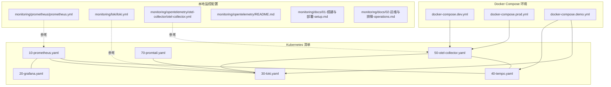
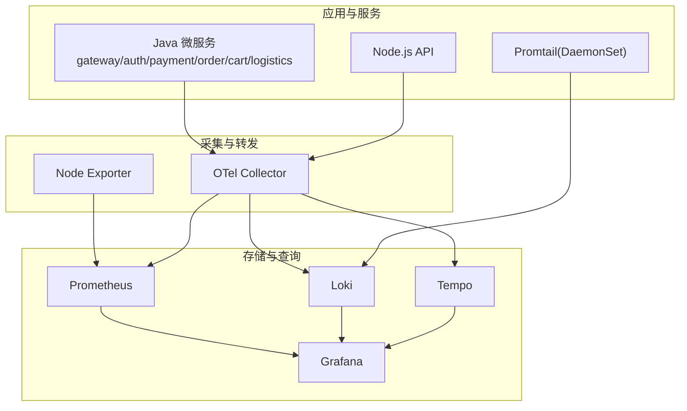
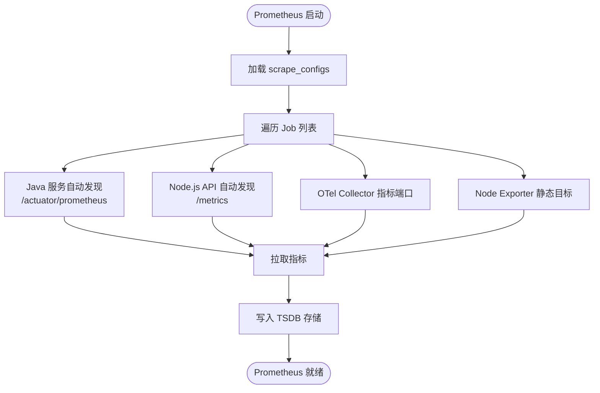
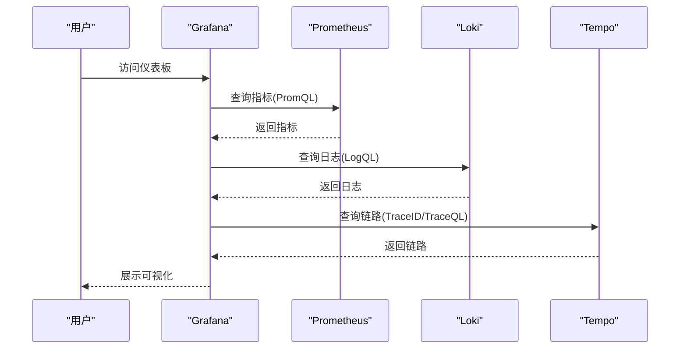
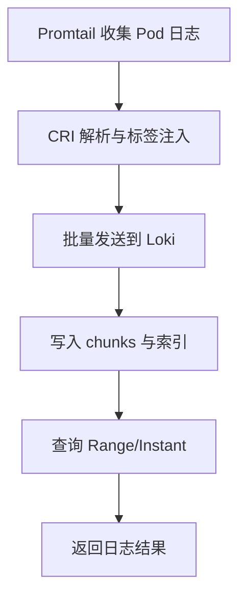
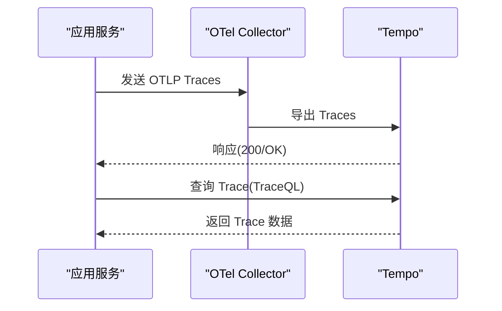
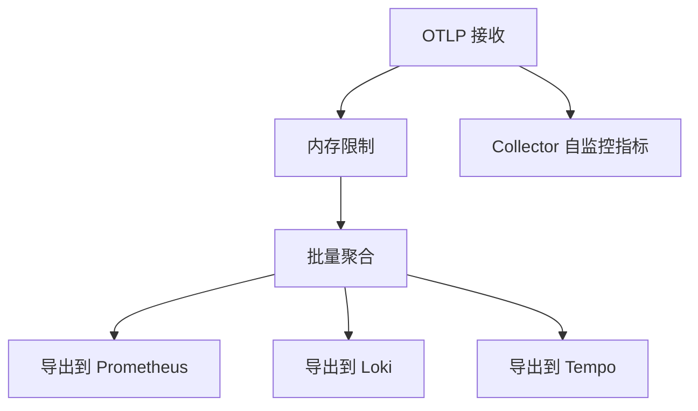
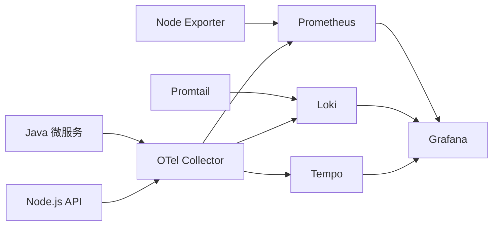

# 监控与可观测性

<cite>
**本文引用的文件**
- [docker-compose.dev.yml](file://docker-compose.dev.yml)
- [docker-compose.prod.yml](file://docker-compose.prod.yml)
- [docker-compose.demo.yml](file://docker-compose.demo.yml)
- [k8s/monitoring/10-prometheus.yaml](file://k8s/monitoring/10-prometheus.yaml)
- [k8s/monitoring/20-grafana.yaml](file://k8s/monitoring/20-grafana.yaml)
- [k8s/monitoring/30-loki.yaml](file://k8s/monitoring/30-loki.yaml)
- [k8s/monitoring/40-tempo.yaml](file://k8s/monitoring/40-tempo.yaml)
- [k8s/monitoring/50-otel-collector.yaml](file://k8s/monitoring/50-otel-collector.yaml)
- [k8s/monitoring/70-promtail.yaml](file://k8s/monitoring/70-promtail.yaml)
- [monitoring/prometheus/prometheus.yml](file://monitoring/prometheus/prometheus.yml)
- [monitoring/loki/loki.yml](file://monitoring/loki/loki.yml)
- [monitoring/opentelemetry/otel-collector/otel-collector.yml](file://monitoring/opentelemetry/otel-collector/otel-collector.yml)
- [monitoring/opentelemetry/README.md](file://monitoring/opentelemetry/README.md)
- [monitoring/docs/01-搭建与部署-setup.md](file://monitoring/docs/01-搭建与部署-setup.md)
- [monitoring/docs/02-运维与排障-operations.md](file://monitoring/docs/02-运维与排障-operations.md)
</cite>

## 目录
1. [简介](#简介)
2. [项目结构](#项目结构)
3. [核心组件](#核心组件)
4. [架构总览](#架构总览)
5. [详细组件分析](#详细组件分析)
6. [依赖关系分析](#依赖关系分析)
7. [性能考量](#性能考量)
8. [故障排查指南](#故障排查指南)
9. [结论](#结论)
10. [附录](#附录)

## 简介
本文件面向监控与可观测性系统，围绕 Prometheus + Grafana + Loki + Tempo 的完整监控栈进行技术文档化，涵盖指标采集配置、告警规则设置、仪表板设计、分布式追踪（OpenTelemetry 集成与链路分析）、日志聚合（结构化日志、查询语法与可视化）、性能与业务指标配置、扩展性与数据保留策略、备份恢复方案以及故障诊断与性能优化实践。文档同时给出基于 Docker Compose 与 Kubernetes 的落地实现与最佳实践。子文档详见：Prometheus 指标监控、Grafana 仪表板、OpenTelemetry Collector 详解。

> **子文档索引**：[Prometheus 指标监控](file://监控与可观测性/Prometheus 指标监控.md) · [Grafana 仪表板](file://监控与可观测性/Grafana 仪表板.md) · [OpenTelemetry Collector 详解](file://监控与可观测性/OpenTelemetry Collector 详解.md)

## 项目结构
监控与可观测性相关配置主要分布在以下区域：
- Docker Compose 环境：dev、prod、demo 三套环境，分别覆盖开发、生产与演示场景，包含 Prometheus、Grafana、Loki、Tempo、OTel Collector 等组件。
- Kubernetes 清单：monitoring 命名空间下的 Prometheus、Grafana、Loki、Tempo、OTel Collector、Promtail 等资源定义。
- 本地监控工具与配置：monitoring 目录下的 Prometheus、Loki、OTel Collector、Grafana、Node Exporter 等配置文件与文档。
- 服务侧 OpenTelemetry 集成：Java 微服务通过环境变量开启 OTel，将 Traces/Metrics/Logs 导出至 OTel Collector。

图表来源
- [docker-compose.dev.yml:723-957](file://docker-compose.dev.yml#L723-L957)
- [docker-compose.prod.yml:639-743](file://docker-compose.prod.yml#L639-L743)
- [docker-compose.demo.yml:274-334](file://docker-compose.demo.yml#L274-L334)
- [k8s/monitoring/10-prometheus.yaml:1-132](file://k8s/monitoring/10-prometheus.yaml#L1-L132)
- [k8s/monitoring/20-grafana.yaml:1-222](file://k8s/monitoring/20-grafana.yaml#L1-L222)
- [k8s/monitoring/30-loki.yaml:1-129](file://k8s/monitoring/30-loki.yaml#L1-L129)
- [k8s/monitoring/40-tempo.yaml:1-123](file://k8s/monitoring/40-tempo.yaml#L1-L123)
- [k8s/monitoring/50-otel-collector.yaml:1-120](file://k8s/monitoring/50-otel-collector.yaml#L1-L120)
- [k8s/monitoring/70-promtail.yaml:1-162](file://k8s/monitoring/70-promtail.yaml#L1-L162)
- [monitoring/prometheus/prometheus.yml:1-85](file://monitoring/prometheus/prometheus.yml#L1-L85)
- [monitoring/loki/loki.yml:1-113](file://monitoring/loki/loki.yml#L1-L113)
- [monitoring/opentelemetry/otel-collector/otel-collector.yml:1-199](file://monitoring/opentelemetry/otel-collector/otel-collector.yml#L1-L199)
- [monitoring/opentelemetry/README.md:1-128](file://monitoring/opentelemetry/README.md#L1-L128)
- [monitoring/docs/01-搭建与部署-setup.md:1-508](file://monitoring/docs/01-搭建与部署-setup.md#L1-L508)
- [monitoring/docs/02-运维与排障-operations.md:1-243](file://monitoring/docs/02-运维与排障-operations.md#L1-L243)

章节来源
- [docker-compose.dev.yml:723-957](file://docker-compose.dev.yml#L723-L957)
- [docker-compose.prod.yml:639-743](file://docker-compose.prod.yml#L639-L743)
- [docker-compose.demo.yml:274-334](file://docker-compose.demo.yml#L274-L334)
- [k8s/monitoring/10-prometheus.yaml:1-132](file://k8s/monitoring/10-prometheus.yaml#L1-L132)
- [k8s/monitoring/20-grafana.yaml:1-222](file://k8s/monitoring/20-grafana.yaml#L1-L222)
- [k8s/monitoring/30-loki.yaml:1-129](file://k8s/monitoring/30-loki.yaml#L1-L129)
- [k8s/monitoring/40-tempo.yaml:1-123](file://k8s/monitoring/40-tempo.yaml#L1-L123)
- [k8s/monitoring/50-otel-collector.yaml:1-120](file://k8s/monitoring/50-otel-collector.yaml#L1-L120)
- [k8s/monitoring/70-promtail.yaml:1-162](file://k8s/monitoring/70-promtail.yaml#L1-L162)
- [monitoring/prometheus/prometheus.yml:1-85](file://monitoring/prometheus/prometheus.yml#L1-L85)
- [monitoring/loki/loki.yml:1-113](file://monitoring/loki/loki.yml#L1-L113)
- [monitoring/opentelemetry/otel-collector/otel-collector.yml:1-199](file://monitoring/opentelemetry/otel-collector/otel-collector.yml#L1-L199)
- [monitoring/opentelemetry/README.md:1-128](file://monitoring/opentelemetry/README.md#L1-L128)
- [monitoring/docs/01-搭建与部署-setup.md:1-508](file://monitoring/docs/01-搭建与部署-setup.md#L1-L508)
- [monitoring/docs/02-运维与排障-operations.md:1-243](file://monitoring/docs/02-运维与排障-operations.md#L1-L243)

## 核心组件
- 指标采集与存储：Prometheus（Kubernetes 清单中配置了 Java 服务与 Node.js API 的自动发现与静态目标；Docker Compose 中配置了 Java 微服务与 Node Exporter 的采集目标）。
- 可视化与仪表板：Grafana（Kubernetes 清单中配置了 Prometheus/Loki/Tempo 数据源与文件型仪表板提供器，并内置“AgentHive Service Logs”仪表板）。
- 日志聚合：Loki（Kubernetes 清单中配置了 TSDB 索引与文件系统存储；Docker Compose 中配置了 Loki 与 MinIO 的 S3 兼容存储）。
- 分布式追踪：Tempo（Kubernetes 清单中配置了 OTLP 接收与本地存储；Docker Compose 中配置了 Tempo 与 Loki 的端口映射）。
- 统一采集与转发：OTel Collector（Kubernetes 清单中配置了 OTLP 接收、批处理、内存限制、导出到 Prometheus、Loki、Tempo 的管道；Docker Compose 中 Java 微服务通过环境变量将 OTel 指标/链路/日志导出到 Collector）。
- 日志采集：Promtail（Kubernetes 清单中以 DaemonSet 方式采集 Pod 日志并推送到 Loki）。

章节来源
- [k8s/monitoring/10-prometheus.yaml:1-132](file://k8s/monitoring/10-prometheus.yaml#L1-L132)
- [k8s/monitoring/20-grafana.yaml:1-222](file://k8s/monitoring/20-grafana.yaml#L1-L222)
- [k8s/monitoring/30-loki.yaml:1-129](file://k8s/monitoring/30-loki.yaml#L1-L129)
- [k8s/monitoring/40-tempo.yaml:1-123](file://k8s/monitoring/40-tempo.yaml#L1-L123)
- [k8s/monitoring/50-otel-collector.yaml:1-120](file://k8s/monitoring/50-otel-collector.yaml#L1-L120)
- [k8s/monitoring/70-promtail.yaml:1-162](file://k8s/monitoring/70-promtail.yaml#L1-L162)
- [monitoring/prometheus/prometheus.yml:1-85](file://monitoring/prometheus/prometheus.yml#L1-L85)
- [monitoring/loki/loki.yml:1-113](file://monitoring/loki/loki.yml#L1-L113)
- [monitoring/opentelemetry/otel-collector/otel-collector.yml:1-199](file://monitoring/opentelemetry/otel-collector/otel-collector.yml#L1-L199)
- [docker-compose.dev.yml:723-957](file://docker-compose.dev.yml#L723-L957)
- [docker-compose.prod.yml:639-743](file://docker-compose.prod.yml#L639-L743)
- [docker-compose.demo.yml:274-334](file://docker-compose.demo.yml#L274-L334)

## 架构总览
整体监控栈采用“统一采集、多后端导出”的设计：OTel Collector 作为统一入口，接收 Traces/Metrics/Logs，通过批处理与内存限制保障稳定性，再分别导出到 Prometheus、Loki、Tempo。Prometheus 负责指标存储与查询，Grafana 提供图表与仪表板；Loki 负责日志聚合与检索；Tempo 负责链路追踪与检索。Promtail 负责采集 Pod 日志并推送到 Loki。

图表来源
- [k8s/monitoring/10-prometheus.yaml:1-132](file://k8s/monitoring/10-prometheus.yaml#L1-L132)
- [k8s/monitoring/20-grafana.yaml:1-222](file://k8s/monitoring/20-grafana.yaml#L1-L222)
- [k8s/monitoring/30-loki.yaml:1-129](file://k8s/monitoring/30-loki.yaml#L1-L129)
- [k8s/monitoring/40-tempo.yaml:1-123](file://k8s/monitoring/40-tempo.yaml#L1-L123)
- [k8s/monitoring/50-otel-collector.yaml:1-120](file://k8s/monitoring/50-otel-collector.yaml#L1-L120)
- [k8s/monitoring/70-promtail.yaml:1-162](file://k8s/monitoring/70-promtail.yaml#L1-L162)
- [monitoring/prometheus/prometheus.yml:1-85](file://monitoring/prometheus/prometheus.yml#L1-L85)
- [monitoring/loki/loki.yml:1-113](file://monitoring/loki/loki.yml#L1-L113)
- [monitoring/opentelemetry/otel-collector/otel-collector.yml:1-199](file://monitoring/opentelemetry/otel-collector/otel-collector.yml#L1-L199)

## 详细组件分析

### Prometheus 指标采集与配置
- Kubernetes 清单要点
  - 通过 Kubernetes SD 自动发现 Java 微服务 Endpoints，并按服务名与端口名筛选；Node.js API 通过服务名自动发现。
  - OTel Collector 指标端点静态配置，便于 Prometheus 直接抓取。
  - 配置持久化卷与保留周期（7 天）。
- Docker Compose 与本地配置要点
  - 通过静态目标配置 Java 微服务与 Node Exporter 的采集路径与端点。
  - 支持在宿主机挂载外部配置文件以避免容器内 localhost 指向容器自身的问题。

图表来源
- [k8s/monitoring/10-prometheus.yaml:1-132](file://k8s/monitoring/10-prometheus.yaml#L1-L132)
- [monitoring/prometheus/prometheus.yml:1-85](file://monitoring/prometheus/prometheus.yml#L1-L85)

章节来源
- [k8s/monitoring/10-prometheus.yaml:1-132](file://k8s/monitoring/10-prometheus.yaml#L1-L132)
- [monitoring/prometheus/prometheus.yml:1-85](file://monitoring/prometheus/prometheus.yml#L1-L85)

### Grafana 可视化与仪表板
- Kubernetes 清单要点
  - 配置 Prometheus/Loki/Tempo 三大数据源。
  - 通过文件型提供器从 ConfigMap 加载仪表板。
  - 内置“AgentHive Service Logs”仪表板，支持按命名空间、应用、Pod 过滤的日志面板。
- Docker Compose 与本地配置要点
  - 通过挂载目录方式提供仪表板与数据源，避免镜像构建失败导致面板缺失。

图表来源
- [k8s/monitoring/20-grafana.yaml:1-222](file://k8s/monitoring/20-grafana.yaml#L1-L222)

章节来源
- [k8s/monitoring/20-grafana.yaml:1-222](file://k8s/monitoring/20-grafana.yaml#L1-L222)
- [monitoring/docs/02-运维与排障-operations.md:1-243](file://monitoring/docs/02-运维与排障-operations.md#L1-L243)

### Loki 日志聚合与查询
- Kubernetes 清单要点
  - 配置 TSDB 索引与文件系统存储，限制最大查询并行度与条目数。
  - 通过 PVC 提供持久化存储。
- Docker Compose 与本地配置要点
  - 配置 Loki 与 MinIO 的 S3 兼容存储，支持日志分片与索引缓存。

图表来源
- [k8s/monitoring/70-promtail.yaml:1-162](file://k8s/monitoring/70-promtail.yaml#L1-L162)
- [k8s/monitoring/30-loki.yaml:1-129](file://k8s/monitoring/30-loki.yaml#L1-L129)
- [monitoring/loki/loki.yml:1-113](file://monitoring/loki/loki.yml#L1-L113)

章节来源
- [k8s/monitoring/70-promtail.yaml:1-162](file://k8s/monitoring/70-promtail.yaml#L1-L162)
- [k8s/monitoring/30-loki.yaml:1-129](file://k8s/monitoring/30-loki.yaml#L1-L129)
- [monitoring/loki/loki.yml:1-113](file://monitoring/loki/loki.yml#L1-L113)

### Tempo 分布式追踪
- Kubernetes 清单要点
  - 配置 OTLP 接收端口，Ingester 块管理与 Compactor 保留策略。
  - 通过 PVC 提供本地存储。
- Docker Compose 与本地配置要点
  - 配置 Tempo 服务端口与 WAL/Blocks 存储路径。

图表来源
- [k8s/monitoring/40-tempo.yaml:1-123](file://k8s/monitoring/40-tempo.yaml#L1-L123)
- [k8s/monitoring/50-otel-collector.yaml:1-120](file://k8s/monitoring/50-otel-collector.yaml#L1-L120)

章节来源
- [k8s/monitoring/40-tempo.yaml:1-123](file://k8s/monitoring/40-tempo.yaml#L1-L123)
- [k8s/monitoring/50-otel-collector.yaml:1-120](file://k8s/monitoring/50-otel-collector.yaml#L1-L120)

### OTel Collector 统一采集与处理
- Kubernetes 清单要点
  - OTLP 接收 gRPC/HTTP，批处理与内存限制处理器，导出到 Prometheus、Loki、Tempo。
  - 提供 Prometheus Exporter 端口供 Prometheus 抓取。
- Docker Compose 与本地配置要点
  - 支持资源属性注入、敏感信息过滤、日志解析（从 body 提取 trace_id/span_id）、健康检查与性能分析端点。

图表来源
- [k8s/monitoring/50-otel-collector.yaml:1-120](file://k8s/monitoring/50-otel-collector.yaml#L1-L120)
- [monitoring/opentelemetry/otel-collector/otel-collector.yml:1-199](file://monitoring/opentelemetry/otel-collector/otel-collector.yml#L1-L199)

章节来源
- [k8s/monitoring/50-otel-collector.yaml:1-120](file://k8s/monitoring/50-otel-collector.yaml#L1-L120)
- [monitoring/opentelemetry/otel-collector/otel-collector.yml:1-199](file://monitoring/opentelemetry/otel-collector/otel-collector.yml#L1-L199)
- [monitoring/opentelemetry/README.md:1-128](file://monitoring/opentelemetry/README.md#L1-L128)

### 服务侧 OpenTelemetry 集成（Java 微服务）
- Docker Compose 中 Java 微服务通过环境变量启用 OTel，将 Traces/Metrics/Logs 导出至 OTel Collector。
- 通过资源属性注入与日志格式化，保证链路与日志上下文关联。

章节来源
- [docker-compose.dev.yml:723-957](file://docker-compose.dev.yml#L723-L957)

## 依赖关系分析
- 组件耦合
  - Prometheus 依赖 Node Exporter 与各服务的指标端点（Actuator/Prometheus）。
  - Grafana 依赖 Prometheus/Loki/Tempo 的可用性与数据源配置。
  - Loki 依赖 Promtail 的日志采集与索引存储。
  - Tempo 依赖 OTel Collector 的 Traces 导入。
  - OTel Collector 依赖各服务的 OTLP 导出与下游存储端点。
- 外部依赖
  - Docker Compose 环境依赖自定义网络以实现容器名 DNS 解析。
  - Kubernetes 环境依赖 RBAC 与 ServiceAccount 以允许 Promtail 访问节点与 Pod 资源。

图表来源
- [k8s/monitoring/10-prometheus.yaml:1-132](file://k8s/monitoring/10-prometheus.yaml#L1-L132)
- [k8s/monitoring/20-grafana.yaml:1-222](file://k8s/monitoring/20-grafana.yaml#L1-L222)
- [k8s/monitoring/30-loki.yaml:1-129](file://k8s/monitoring/30-loki.yaml#L1-L129)
- [k8s/monitoring/40-tempo.yaml:1-123](file://k8s/monitoring/40-tempo.yaml#L1-L123)
- [k8s/monitoring/50-otel-collector.yaml:1-120](file://k8s/monitoring/50-otel-collector.yaml#L1-L120)
- [k8s/monitoring/70-promtail.yaml:1-162](file://k8s/monitoring/70-promtail.yaml#L1-L162)

章节来源
- [k8s/monitoring/10-prometheus.yaml:1-132](file://k8s/monitoring/10-prometheus.yaml#L1-L132)
- [k8s/monitoring/20-grafana.yaml:1-222](file://k8s/monitoring/20-grafana.yaml#L1-L222)
- [k8s/monitoring/30-loki.yaml:1-129](file://k8s/monitoring/30-loki.yaml#L1-L129)
- [k8s/monitoring/40-tempo.yaml:1-123](file://k8s/monitoring/40-tempo.yaml#L1-L123)
- [k8s/monitoring/50-otel-collector.yaml:1-120](file://k8s/monitoring/50-otel-collector.yaml#L1-L120)
- [k8s/monitoring/70-promtail.yaml:1-162](file://k8s/monitoring/70-promtail.yaml#L1-L162)

## 性能考量
- 采集与处理
  - OTel Collector 使用内存限制与批量处理器，避免高并发场景下的内存峰值与抖动。
  - Prometheus 通过 PVC 与保留周期控制存储规模，建议结合远程写入与压缩策略进一步优化。
- 查询与展示
  - Loki 限制最大查询并行度与条目数，避免大查询拖垮集群。
  - Grafana 仪表板模板变量与查询优化，减少不必要的全量扫描。
- 网络与端口
  - Docker Compose 环境使用自定义网络，避免默认 bridge 网络不支持容器名 DNS 解析导致的连通性问题。
- 资源配额
  - 各组件均配置 requests/limits，建议根据实际负载调整以提升稳定性。

[本节为通用性能指导，不直接分析特定文件]

## 故障排查指南
- 常见问题与修复
  - Grafana 预配置仪表板未生效：检查镜像构建 context 与 COPY 路径，或通过宿主机挂载替代。
  - 默认 bridge 网络不支持容器名互访：创建自定义网络或将数据源 URL 改为宿主机 IP。
  - Prometheus 配置中的 localhost 指向容器自身：通过宿主机挂载外部配置文件覆盖。
- 运维操作
  - 查看容器状态、健康检查、资源占用与重启次数。
  - 通过 curl 健康接口验证组件可用性。
  - 安全重启与清理：保留数据卷以避免历史数据丢失；彻底清理需删除数据卷。
- Dashboard 显示 No Data
  - 检查数据源连通性与 UID；核对 Prometheus Targets 状态；在 Prometheus 中直接执行面板 PromQL 验证数据存在性。

章节来源
- [monitoring/docs/01-搭建与部署-setup.md:1-508](file://monitoring/docs/01-搭建与部署-setup.md#L1-L508)
- [monitoring/docs/02-运维与排障-operations.md:1-243](file://monitoring/docs/02-运维与排障-operations.md#L1-L243)

## 结论
本监控与可观测性体系以 OTel Collector 为核心，统一采集 Traces/Metrics/Logs，分别导出到 Prometheus、Loki、Tempo，配合 Grafana 实现统一可视化。Kubernetes 与 Docker Compose 场景均提供可落地的配置与最佳实践，涵盖采集、处理、存储、查询与运维。通过合理的资源配额、查询限制与数据保留策略，可在保证性能的同时满足生产级可观测性需求。

[本节为总结性内容，不直接分析特定文件]

## 附录

### 指标采集配置要点
- Prometheus
  - Kubernetes：利用 Endpoints 自动发现与标签重写，精准选择目标服务与端口。
  - Docker Compose：静态目标配置 Java 微服务与 Node Exporter，避免 localhost 指向容器自身。
- OTel Collector
  - 批处理与内存限制保障稳定性；资源属性注入与敏感信息过滤提升数据质量。

章节来源
- [k8s/monitoring/10-prometheus.yaml:1-132](file://k8s/monitoring/10-prometheus.yaml#L1-L132)
- [monitoring/prometheus/prometheus.yml:1-85](file://monitoring/prometheus/prometheus.yml#L1-L85)
- [k8s/monitoring/50-otel-collector.yaml:1-120](file://k8s/monitoring/50-otel-collector.yaml#L1-L120)
- [monitoring/opentelemetry/otel-collector/otel-collector.yml:1-199](file://monitoring/opentelemetry/otel-collector/otel-collector.yml#L1-L199)

### 告警规则设置
- Prometheus 支持 rule_files 配置，建议按服务级别与 SLI/SLO 定义告警规则，并与 Grafana 告警中心联动。
- Loki 与 Tempo 可结合查询阈值与异常检测策略，形成端到端告警闭环。

[本节为通用配置建议，不直接分析特定文件]

### 仪表板设计
- Grafana 通过文件型提供器加载仪表板，建议按“基础设施/应用/业务”三层组织面板。
- Loki 仪表板支持命名空间、应用、Pod 等维度过滤，便于快速定位问题。

章节来源
- [k8s/monitoring/20-grafana.yaml:1-222](file://k8s/monitoring/20-grafana.yaml#L1-L222)

### 分布式追踪与链路分析
- OTel Collector 接收 OTLP，导出到 Tempo；Java 微服务通过环境变量启用 OTel，实现无侵入链路追踪。
- 建议在日志中注入 trace_id/span_id，结合 Loki 与 Tempo 实现端到端关联分析。

章节来源
- [k8s/monitoring/50-otel-collector.yaml:1-120](file://k8s/monitoring/50-otel-collector.yaml#L1-L120)
- [k8s/monitoring/40-tempo.yaml:1-123](file://k8s/monitoring/40-tempo.yaml#L1-L123)
- [docker-compose.dev.yml:723-957](file://docker-compose.dev.yml#L723-L957)

### 日志聚合与查询
- Loki 通过 Promtail 采集 Pod 日志，支持 CRI 解析与标签注入；查询语法以 LogQL 为主。
- 建议在应用日志中标准化结构化字段（如 level、trace_id、span_id），提升检索与关联效率。

章节来源
- [k8s/monitoring/70-promtail.yaml:1-162](file://k8s/monitoring/70-promtail.yaml#L1-L162)
- [k8s/monitoring/30-loki.yaml:1-129](file://k8s/monitoring/30-loki.yaml#L1-L129)
- [monitoring/loki/loki.yml:1-113](file://monitoring/loki/loki.yml#L1-L113)

### 性能监控指标、业务指标与基础设施监控
- 基础设施：CPU、内存、磁盘、网络等由 Node Exporter 提供，Prometheus 抓取并存储。
- 应用与业务：Java 微服务通过 Actuator 暴露指标，Node.js API 通过 /metrics 暴露指标；OTel Collector 统一采集 Traces/Metrics/Logs。

章节来源
- [k8s/monitoring/10-prometheus.yaml:1-132](file://k8s/monitoring/10-prometheus.yaml#L1-L132)
- [monitoring/prometheus/prometheus.yml:1-85](file://monitoring/prometheus/prometheus.yml#L1-L85)

### 扩展性设计、数据保留策略与备份恢复
- 扩展性
  - Prometheus：水平扩展可通过联邦或远程存储；查询扩展可通过分片与只读副本。
  - Loki：支持多租户与分片；TSDB Shipper 与 S3 兼容存储适配云原生存储。
  - Tempo：Ingester 块管理与 Compactor 保留策略，支持本地与对象存储混合。
- 数据保留
  - Prometheus：Kubernetes 清单中设置 7 天保留；可根据磁盘容量调整。
  - Loki：reject_old_samples_max_age 与 compactor 保留策略共同控制。
  - Tempo：block_retention 与 WAL 配置决定保留窗口。
- 备份恢复
  - 通过 PVC/卷快照与对象存储备份实现；恢复时优先恢复数据卷，再重启组件。

章节来源
- [k8s/monitoring/10-prometheus.yaml:1-132](file://k8s/monitoring/10-prometheus.yaml#L1-L132)
- [k8s/monitoring/30-loki.yaml:1-129](file://k8s/monitoring/30-loki.yaml#L1-L129)
- [k8s/monitoring/40-tempo.yaml:1-123](file://k8s/monitoring/40-tempo.yaml#L1-L123)
- [monitoring/loki/loki.yml:1-113](file://monitoring/loki/loki.yml#L1-L113)

### 实用技巧
- 生产环境启用 TLS 与鉴权，敏感字段脱敏，合理配置采样率。
- 通过健康检查与 pprof/zpages 端点进行性能分析与问题定位。
- 使用模板变量与查询优化减少无效数据传输与渲染压力。

章节来源
- [monitoring/opentelemetry/README.md:1-128](file://monitoring/opentelemetry/README.md#L1-L128)
- [monitoring/opentelemetry/otel-collector/otel-collector.yml:1-199](file://monitoring/opentelemetry/otel-collector/otel-collector.yml#L1-L199)