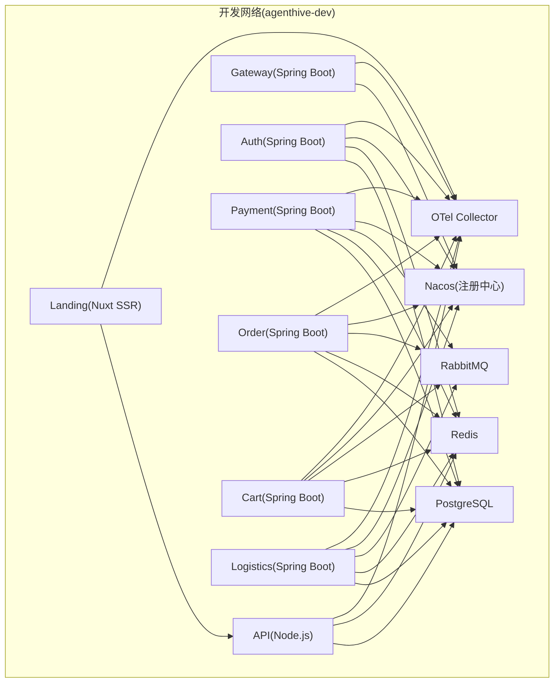
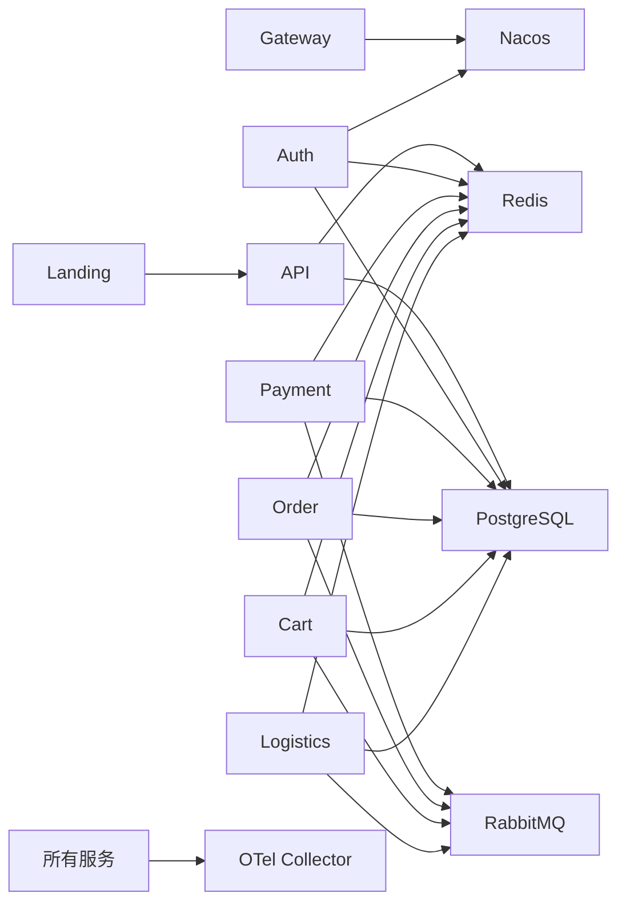

# Docker 部署

<cite>
**本文引用的文件**
- [docker-compose.dev.yml](file://docker-compose.dev.yml)
- [docker-compose.prod.yml](file://docker-compose.prod.yml)
- [docker-compose.demo.yml](file://docker-compose.demo.yml)
- [apps/api/Dockerfile](file://apps/api/Dockerfile)
- [apps/landing/Dockerfile](file://apps/landing/Dockerfile)
- [apps/java/gateway-service/Dockerfile](file://apps/java/gateway-service/Dockerfile)
- [apps/java/auth-service/Dockerfile](file://apps/java/auth-service/Dockerfile)
- [apps/agent-runtime/Dockerfile](file://apps/agent-runtime/Dockerfile)
- [scripts/ops/health-check-dev.sh](file://scripts/ops/health-check-dev.sh)
- [scripts/dev/start-full-docker.ps1](file://scripts/dev/start-full-docker.ps1)
- [scripts/deploy/deploy-local-k8s.sh](file://scripts/deploy/deploy-local-k8s.sh)
- [nginx/nginx.conf](file://nginx/nginx.conf)
- [nginx/nginx.dev.conf](file://nginx/nginx.dev.conf)
- [monitoring/prometheus.yml](file://monitoring/prometheus.yml)
- [monitoring/grafana/provisioning](file://monitoring/grafana/provisioning)
- [monitoring/opentelemetry/otel-collector/otel-collector.yml](file://monitoring/opentelemetry/otel-collector/otel-collector.yml)
- [monitoring/tempo/tempo.yml](file://monitoring/tempo/tempo.yml)
- [monitoring/loki/loki.yml](file://monitoring/loki/loki.yml)
</cite>

## 目录
1. [简介](#简介)
2. [项目结构](#项目结构)
3. [核心组件](#核心组件)
4. [架构总览](#架构总览)
5. [详细组件分析](#详细组件分析)
6. [依赖关系分析](#依赖关系分析)
7. [性能考虑](#性能考虑)
8. [故障排查指南](#故障排查指南)
9. [结论](#结论)
10. [附录](#附录)

## 简介
本指南面向使用 Docker 进行本地与演示环境部署的工程师与运维人员，覆盖开发环境、演示环境与生产环境三类部署形态。内容围绕以下目标展开：
- 解析 Docker Compose 在不同环境下的配置差异与扩展机制（profiles）
- 文档化 PostgreSQL、Redis、API 服务、Landing 页面、Java 微服务、Nginx、OpenTelemetry 收集器与监控栈的容器化部署要点
- 说明容器间网络通信、数据卷挂载与环境变量配置
- 提供启动、停止与重启命令，以及健康检查与日志管理最佳实践
- 总结镜像构建策略（多阶段构建、最小化运行时、缓存复用）与优化建议

## 项目结构
仓库采用多模块与多语言混合架构，Docker 相关配置集中在顶层 Compose 文件与各应用的 Dockerfile 中，并辅以监控与 Nginx 配置。

```mermaid
graph TB
subgraph "开发环境"
DCDev["docker-compose.dev.yml"]
end
subgraph "演示环境"
DCDemo["docker-compose.demo.yml"]
end
subgraph "生产环境"
DCProd["docker-compose.prod.yml"]
end
subgraph "应用镜像"
APIDocker["apps/api/Dockerfile"]
LandingDocker["apps/landing/Dockerfile"]
GatewayDocker["apps/java/gateway-service/Dockerfile"]
AuthDocker["apps/java/auth-service/Dockerfile"]
AgentRuntimeDocker["apps/agent-runtime/Dockerfile"]
end
subgraph "基础设施"
Postgres["PostgreSQL 容器"]
Redis["Redis 容器"]
Nginx["Nginx 容器"]
Otel["OpenTelemetry Collector"]
end
subgraph "监控栈"
Prometheus["Prometheus"]
Grafana["Grafana"]
Tempo["Tempo"]
Loki["Loki"]
end
DCDev --> Postgres
DCDev --> Redis
DCDev --> APIDocker
DCDev --> LandingDocker
DCDev --> GatewayDocker
DCDev --> AuthDocker
DCDev --> Otel
DCDev --> Prometheus
DCDev --> Grafana
DCDev --> Tempo
DCDev --> Loki
DCDemo --> Postgres
DCDemo --> Redis
DCDemo --> APIDocker
DCDemo --> LandingDocker
DCDemo --> Nginx
DCDemo --> Otel
DCProd --> Postgres
DCProd --> Redis
DCProd --> APIDocker
DCProd --> LandingDocker
DCProd --> Nginx
DCProd --> Otel
DCProd --> Prometheus
DCProd --> Grafana
DCProd --> Tempo
DCProd --> Loki
```

图表来源
- [docker-compose.dev.yml:1-1055](file://docker-compose.dev.yml#L1-L1055)
- [docker-compose.demo.yml:1-400](file://docker-compose.demo.yml#L1-L400)
- [docker-compose.prod.yml:1-800](file://docker-compose.prod.yml#L1-L800)
- [apps/api/Dockerfile:1-84](file://apps/api/Dockerfile#L1-L84)
- [apps/landing/Dockerfile:1-94](file://apps/landing/Dockerfile#L1-L94)
- [apps/java/gateway-service/Dockerfile:1-46](file://apps/java/gateway-service/Dockerfile#L1-L46)
- [apps/java/auth-service/Dockerfile:1-50](file://apps/java/auth-service/Dockerfile#L1-L50)
- [apps/agent-runtime/Dockerfile:1-56](file://apps/agent-runtime/Dockerfile#L1-L56)

章节来源
- [docker-compose.dev.yml:1-1055](file://docker-compose.dev.yml#L1-L1055)
- [docker-compose.demo.yml:1-400](file://docker-compose.demo.yml#L1-L400)
- [docker-compose.prod.yml:1-800](file://docker-compose.prod.yml#L1-L800)

## 核心组件
- 数据层：PostgreSQL（含多数据库初始化）、Redis（带密码与持久化）
- 应用层：Node.js API、Landing（Nuxt 3 SSR）、Java 微服务（Spring Boot，含网关与鉴权、支付、订单、购物车、物流）
- 网关与入口：Nginx（统一入口与 HTTPS/SSL）
- 观测性：OpenTelemetry Collector、Prometheus、Grafana、Tempo、Loki
- 健康检查与日志：Compose 健康检查、JSON 日志驱动与轮转

章节来源
- [docker-compose.dev.yml:22-105](file://docker-compose.dev.yml#L22-L105)
- [docker-compose.dev.yml:194-306](file://docker-compose.dev.yml#L194-L306)
- [docker-compose.dev.yml:312-776](file://docker-compose.dev.yml#L312-L776)
- [docker-compose.demo.yml:23-121](file://docker-compose.demo.yml#L23-L121)
- [docker-compose.demo.yml:127-227](file://docker-compose.demo.yml#L127-L227)
- [docker-compose.prod.yml:18-142](file://docker-compose.prod.yml#L18-L142)
- [docker-compose.prod.yml:147-563](file://docker-compose.prod.yml#L147-L563)

## 架构总览
下图展示开发环境中的容器交互与网络隔离，突出 Node.js 与 Java 微服务通过 Nacos 与 RabbitMQ 协同工作，同时统一由 OpenTelemetry 收集器进行可观测性数据采集。

图表来源
- [docker-compose.dev.yml:17-1055](file://docker-compose.dev.yml#L17-L1055)

## 详细组件分析

### 开发环境（docker-compose.dev.yml）
- 网络与资源限制：为每个服务设置 CPU/内存上限与预留，避免资源争抢；定义专用网络用于隔离。
- 健康检查：PostgreSQL、Redis、API、Landing、Java 服务均配置健康检查，便于自动恢复与编排。
- 数据卷：PostgreSQL、Redis、Prometheus、Grafana、Tempo、Loki 等持久化存储独立卷。
- 环境变量：集中于 .env.dev，支持按需覆盖端口、密码、LLM 参数、CORS 等。
- 可观测性：OTel Collector 作为统一出口，Java 服务通过 OpenTelemetry Java Agent 注入。

章节来源
- [docker-compose.dev.yml:17-1055](file://docker-compose.dev.yml#L17-L1055)

### 演示环境（docker-compose.demo.yml）
- 配置要点：Nginx 作为统一入口，API/Landing 以镜像方式运行，Java 微服务与监控栈默认关闭，通过 profile 启用。
- 数据层：演示环境将 PostgreSQL/Redis 连接至内网固定 IP（2C2G ECS），降低本地资源占用。
- 可选功能：Cloudflare Tunnel profile 用于公网暴露。

章节来源
- [docker-compose.demo.yml:1-400](file://docker-compose.demo.yml#L1-L400)

### 生产环境（docker-compose.prod.yml）
- 镜像拉取：所有服务以镜像方式运行，pull_policy: always，结合 Watchtower 实现自动更新。
- 外部数据层：PostgreSQL/Redis 连接至远端 ECS（2+2 部署），减少单机压力。
- 监控栈：Prometheus、Grafana、Tempo、Loki、OTel Collector 均启用，便于生产级可观测性。
- Watchtower：基于容器标签自动检测并更新镜像，提升运维效率。

章节来源
- [docker-compose.prod.yml:1-800](file://docker-compose.prod.yml#L1-L800)

### PostgreSQL（开发/演示/生产）
- 特性：多数据库初始化脚本挂载；PGDATA 指定；健康检查基于 pg_isready。
- 数据卷：独立卷持久化数据。
- 端口映射：开发默认 5433，演示/生产指向内网固定地址。

章节来源
- [docker-compose.dev.yml:22-61](file://docker-compose.dev.yml#L22-L61)
- [docker-compose.demo.yml:62-69](file://docker-compose.demo.yml#L62-L69)
- [docker-compose.prod.yml:62-69](file://docker-compose.prod.yml#L62-L69)

### Redis（开发/演示/生产）
- 特性：设置最大内存与淘汰策略；启用 AOF；要求密码。
- 数据卷：持久化挂载。
- 健康检查：redis-cli ping。

章节来源
- [docker-compose.dev.yml:63-105](file://docker-compose.dev.yml#L63-L105)
- [docker-compose.demo.yml:67-70](file://docker-compose.demo.yml#L67-L70)
- [docker-compose.prod.yml:67-70](file://docker-compose.prod.yml#L67-L70)

### API 服务（Node.js）
- 多阶段构建：Builder 阶段安装依赖并打包，Production 阶段仅复制运行时产物，显著减小镜像体积。
- 运行时：非 root 用户、健康检查、dumb-init 作为 PID 1。
- 数据卷：工作区挂载，便于调试与持久化。

章节来源
- [apps/api/Dockerfile:1-84](file://apps/api/Dockerfile#L1-L84)
- [docker-compose.dev.yml:194-261](file://docker-compose.dev.yml#L194-L261)
- [docker-compose.demo.yml:52-94](file://docker-compose.demo.yml#L52-L94)
- [docker-compose.prod.yml:52-104](file://docker-compose.prod.yml#L52-L104)

### Landing（Nuxt 3 SSR）
- 多阶段构建：利用 BuildKit 缓存与 pnpm store，提升增量构建速度。
- 运行时：Nuxt 输出目录复制到运行时镜像，安装 server-side 依赖，健康检查基于 wget。
- 端口：容器内 80，映射由 Compose 控制。

章节来源
- [apps/landing/Dockerfile:1-94](file://apps/landing/Dockerfile#L1-L94)
- [docker-compose.dev.yml:263-306](file://docker-compose.dev.yml#L263-L306)
- [docker-compose.demo.yml:99-121](file://docker-compose.demo.yml#L99-L121)
- [docker-compose.prod.yml:111-142](file://docker-compose.prod.yml#L111-L142)

### Java 微服务（Spring Boot）
- 多阶段构建：Maven 构建产物提取为分层，运行时仅拷贝必要层，配合 OpenTelemetry Java Agent。
- 健康检查：Actuator /actuator/health。
- 网络：通过 Nacos 发现服务，RabbitMQ 用于消息传递。

章节来源
- [apps/java/gateway-service/Dockerfile:1-46](file://apps/java/gateway-service/Dockerfile#L1-L46)
- [apps/java/auth-service/Dockerfile:1-50](file://apps/java/auth-service/Dockerfile#L1-L50)
- [docker-compose.dev.yml:312-776](file://docker-compose.dev.yml#L312-L776)
- [docker-compose.demo.yml:127-227](file://docker-compose.demo.yml#L127-L227)
- [docker-compose.prod.yml:147-563](file://docker-compose.prod.yml#L147-L563)

### Nginx（统一入口）
- 配置：加载自定义 nginx.conf 与 conf.d；支持 HTTPS/SSL。
- 依赖：依赖 API/Landing/Gateway 健康状态。

章节来源
- [docker-compose.dev.yml:18-47](file://docker-compose.dev.yml#L18-L47)
- [docker-compose.demo.yml:23-47](file://docker-compose.demo.yml#L23-L47)
- [docker-compose.prod.yml:18-47](file://docker-compose.prod.yml#L18-L47)
- [nginx/nginx.conf](file://nginx/nginx.conf)
- [nginx/nginx.dev.conf](file://nginx/nginx.dev.conf)

### OpenTelemetry Collector（统一可观测性）
- 配置：从本地配置文件加载；容器暴露 4317/4318 端口。
- Java 服务：通过 Java Agent 注入，统一导出 traces/metrics/logs。

章节来源
- [docker-compose.dev.yml:222-224](file://docker-compose.dev.yml#L222-L224)
- [docker-compose.prod.yml:740-763](file://docker-compose.prod.yml#L740-L763)
- [monitoring/opentelemetry/otel-collector/otel-collector.yml](file://monitoring/opentelemetry/otel-collector/otel-collector.yml)

### 监控栈（Prometheus/Grafana/Tempo/Loki）
- Prometheus：配置文件挂载，TSDB 存储卷。
- Grafana：管理员密码可配置，Provisioning 挂载。
- Tempo/Loki：配置文件挂载，数据卷持久化。

章节来源
- [docker-compose.dev.yml:781-800](file://docker-compose.dev.yml#L781-L800)
- [docker-compose.prod.yml:634-763](file://docker-compose.prod.yml#L634-L763)
- [monitoring/prometheus.yml](file://monitoring/prometheus.yml)
- [monitoring/grafana/provisioning](file://monitoring/grafana/provisioning)
- [monitoring/tempo/tempo.yml](file://monitoring/tempo/tempo.yml)
- [monitoring/loki/loki.yml](file://monitoring/loki/loki.yml)

## 依赖关系分析
- 服务依赖：API/Landing 依赖 PostgreSQL/Redis；Java 微服务依赖 Nacos/RabbitMQ；Nginx 依赖上游服务健康。
- 网络隔离：开发/演示/生产分别使用独立网络，避免冲突。
- 数据持久化：PostgreSQL/Redis/Prometheus/Grafana/Tempo/Loki 等均使用命名卷。

图表来源
- [docker-compose.dev.yml:194-776](file://docker-compose.dev.yml#L194-L776)

章节来源
- [docker-compose.dev.yml:194-776](file://docker-compose.dev.yml#L194-L776)

## 性能考虑
- 镜像体积与启动时间
  - Node.js API：多阶段 + esbuild 打包，运行时仅包含必要依赖，镜像体积显著降低。
  - Landing：利用 BuildKit 与 pnpm store 缓存，增量构建更快。
  - Java：Layered JAR + OpenTelemetry Java Agent，运行时最小化。
- 资源配额：为各服务设置 CPU/内存上限与预留，避免资源争用。
- 日志轮转：json-file 驱动 + 最大大小与文件数限制，避免磁盘膨胀。
- 观测性：统一 OTel 收集器，减少重复导出开销。

章节来源
- [apps/api/Dockerfile:1-84](file://apps/api/Dockerfile#L1-L84)
- [apps/landing/Dockerfile:1-94](file://apps/landing/Dockerfile#L1-L94)
- [apps/java/gateway-service/Dockerfile:1-46](file://apps/java/gateway-service/Dockerfile#L1-L46)
- [apps/java/auth-service/Dockerfile:1-50](file://apps/java/auth-service/Dockerfile#L1-L50)
- [docker-compose.dev.yml:48-61](file://docker-compose.dev.yml#L48-L61)

## 故障排查指南
- 健康检查脚本
  - 提供一键健康检查，覆盖容器状态、HTTP 健康端点、数据库连接、Redis、Nacos 与 RabbitMQ 管理接口。
  - 输出诊断建议，便于快速定位问题。
- 常见问题
  - 环境变量缺失：使用 compose config 检查未设置变量。
  - 服务未就绪：查看对应容器日志；确认依赖服务已健康。
  - 数据库/Redis 连接失败：核对凭据与网络连通性。
  - Java 服务未注册到 Nacos：检查 Nacos 凭据与服务名配置。

章节来源
- [scripts/ops/health-check-dev.sh:1-297](file://scripts/ops/health-check-dev.sh#L1-L297)

## 结论
本指南系统梳理了 AgentHive 在 Docker 环境下的部署策略，涵盖开发、演示与生产三类场景，明确了容器间网络、数据持久化与环境变量的关键配置，并总结了镜像构建与优化方法。结合健康检查与日志管理最佳实践，可有效提升部署稳定性与可维护性。

## 附录

### 启动/停止/重启命令
- 开发环境
  - 启动：docker compose -f docker-compose.dev.yml --env-file .env.dev up -d
  - 停止：docker compose -f docker-compose.dev.yml --env-file .env.dev down
  - 重启：docker compose -f docker-compose.dev.yml --env-file .env.dev restart <服务名>
- 演示环境
  - 基础：docker compose -f docker-compose.demo.yml --env-file .env.demo up -d
  - 含 Java：--profile java
  - 含监控：--profile monitoring
  - 含公网隧道：--profile with-tunnel
- 生产环境
  - 启动：docker compose -f docker-compose.prod.yml --env-file .env.prod up -d
  - 停止：docker compose -f docker-compose.prod.yml --env-file .env.prod down
  - 更新：依赖 Watchtower 标签自动更新或手动拉取最新镜像

章节来源
- [docker-compose.dev.yml:14-15](file://docker-compose.dev.yml#L14-L15)
- [docker-compose.demo.yml:4-15](file://docker-compose.demo.yml#L4-L15)
- [docker-compose.prod.yml:10-11](file://docker-compose.prod.yml#L10-L11)

### 健康检查与日志管理
- 健康检查
  - Node.js：HTTP 健康端点或 wget 检查
  - Java：/actuator/health
  - 数据库/缓存：pg_isready、redis-cli ping
- 日志
  - json-file 驱动 + 轮转参数
  - 建议：按服务级别查看日志，结合健康检查脚本定位异常

章节来源
- [docker-compose.dev.yml:40-44](file://docker-compose.dev.yml#L40-L44)
- [docker-compose.dev.yml:84-89](file://docker-compose.dev.yml#L84-L89)
- [docker-compose.dev.yml:240-245](file://docker-compose.dev.yml#L240-L245)
- [docker-compose.dev.yml:358-363](file://docker-compose.dev.yml#L358-L363)
- [scripts/ops/health-check-dev.sh:158-187](file://scripts/ops/health-check-dev.sh#L158-L187)

### 镜像构建与优化策略
- Node.js API
  - 多阶段构建 + esbuild 打包 + 运行时仅安装必要依赖
- Landing
  - BuildKit 缓存 + pnpm store + 仅复制预构建输出
- Java
  - Layered JAR + OpenTelemetry Java Agent 注入
- Agent Runtime
  - 预构建产物部署 + 非 root 用户 + 健康检查

章节来源
- [apps/api/Dockerfile:7-84](file://apps/api/Dockerfile#L7-L84)
- [apps/landing/Dockerfile:12-94](file://apps/landing/Dockerfile#L12-L94)
- [apps/java/gateway-service/Dockerfile:4-46](file://apps/java/gateway-service/Dockerfile#L4-L46)
- [apps/java/auth-service/Dockerfile:4-50](file://apps/java/auth-service/Dockerfile#L4-L50)
- [apps/agent-runtime/Dockerfile:9-56](file://apps/agent-runtime/Dockerfile#L9-L56)

### 本地 Kubernetes 部署（可选）
- 通过脚本检查集群、构建镜像并应用 Kustomize 配置，等待 Pod 就绪后进行健康检查与端口转发。

章节来源
- [scripts/deploy/deploy-local-k8s.sh:1-134](file://scripts/deploy/deploy-local-k8s.sh#L1-L134)