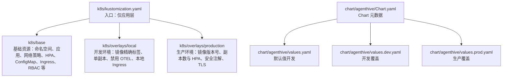
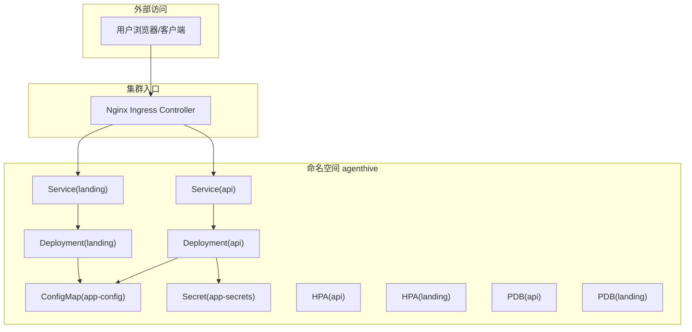
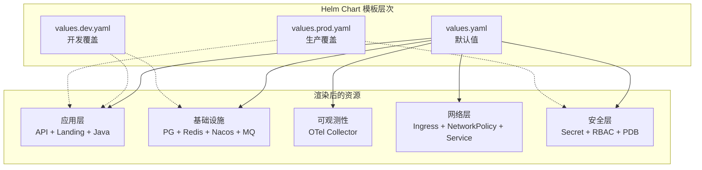
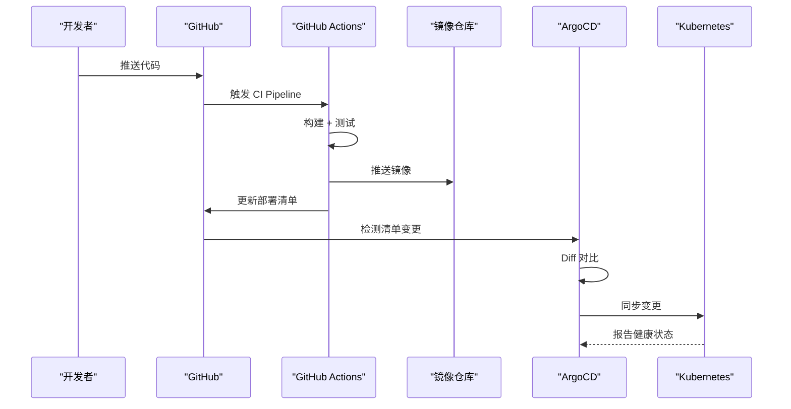
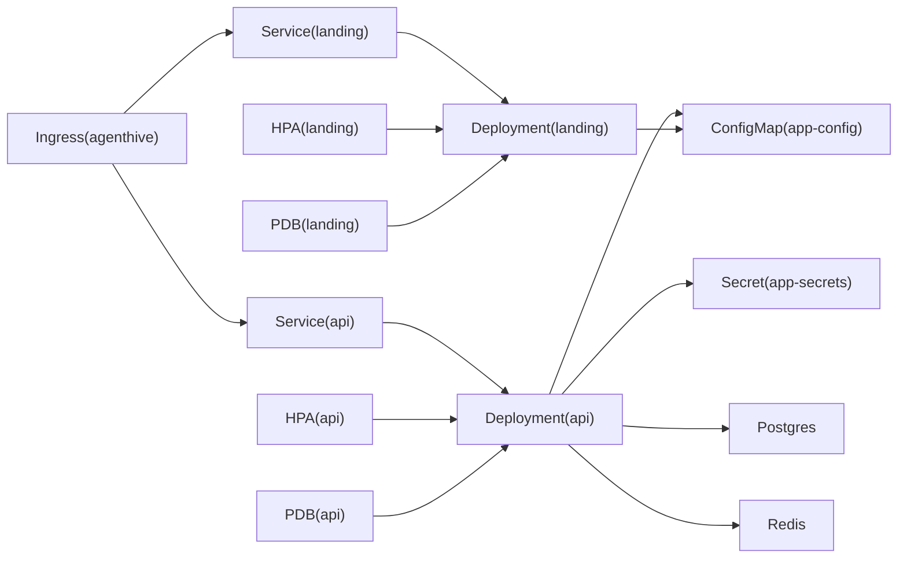

# Kubernetes 部署

<cite>
**本文引用的文件**
- [k8s/kustomization.yaml](file://k8s/kustomization.yaml)
- [k8s/base/kustomization.yaml](file://k8s/base/kustomization.yaml)
- [k8s/base/04-api.yaml](file://k8s/base/04-api.yaml)
- [k8s/base/05-landing.yaml](file://k8s/base/05-landing.yaml)
- [k8s/base/09-ingress.yaml](file://k8s/base/09-ingress.yaml)
- [k8s/overlays/local/kustomization.yaml](file://k8s/overlays/local/kustomization.yaml)
- [k8s/overlays/production/kustomization.yaml](file://k8s/overlays/production/kustomization.yaml)
- [chart/agenthive/Chart.yaml](file://chart/agenthive/Chart.yaml)
- [chart/agenthive/values.yaml](file://chart/agenthive/values.yaml)
- [chart/agenthive/values.dev.yaml](file://chart/agenthive/values.dev.yaml)
- [chart/agenthive/values.prod.yaml](file://chart/agenthive/values.prod.yaml)
- [scripts/deploy/deploy-k8s.sh](file://scripts/deploy/deploy-k8s.sh)
- [scripts/deploy/verify-deployment.sh](file://scripts/deploy/verify-deployment.sh)
- [docs/deployment/k8s-deployment.md](file://docs/deployment/k8s-deployment.md)
</cite>

## 目录
1. [简介](#简介)
2. [项目结构](#项目结构)
3. [核心组件](#核心组件)
4. [架构总览](#架构总览)
5. [详细组件分析](#详细组件分析)
6. [依赖关系分析](#依赖关系分析)
7. [性能考虑](#性能考虑)
8. [故障排查指南](#故障排查指南)
9. [结论](#结论)
10. [附录](#附录)

## 简介
本指南面向在 Kubernetes 上部署 AgentHive 平台的工程团队，涵盖以下主题：
- Kustomization 的配置结构与多环境部署策略（基础层、开发 overlay、生产 overlay）
- Helm Charts 的安装与值文件管理、依赖关系
- Kubernetes 资源清单的创建与管理（Deployment、Service、ConfigMap、Secret、Ingress、HPA、PDB、RBAC 等）
- 集群部署、Ingress 配置与负载均衡
- 滚动更新、回滚机制与蓝绿部署策略的最佳实践

## 项目结构
本项目同时提供了两种主流部署方式：
- 基于 Kustomize 的原生清单（k8s/base 与 overlays）
- 基于 Helm 的 Chart（chart/agenthive）

下图展示了两种路径的组织关系与差异：

图表来源
- [k8s/kustomization.yaml:1-20](file://k8s/kustomization.yaml#L1-L20)
- [k8s/base/kustomization.yaml:1-32](file://k8s/base/kustomization.yaml#L1-L32)
- [k8s/overlays/local/kustomization.yaml:1-197](file://k8s/overlays/local/kustomization.yaml#L1-L197)
- [k8s/overlays/production/kustomization.yaml:1-219](file://k8s/overlays/production/kustomization.yaml#L1-L219)
- [chart/agenthive/Chart.yaml:1-18](file://chart/agenthive/Chart.yaml#L1-L18)
- [chart/agenthive/values.yaml:1-800](file://chart/agenthive/values.yaml#L1-L800)
- [chart/agenthive/values.dev.yaml:1-269](file://chart/agenthive/values.dev.yaml#L1-L269)
- [chart/agenthive/values.prod.yaml:1-475](file://chart/agenthive/values.prod.yaml#L1-L475)

章节来源
- [k8s/kustomization.yaml:1-20](file://k8s/kustomization.yaml#L1-L20)
- [k8s/base/kustomization.yaml:1-32](file://k8s/base/kustomization.yaml#L1-L32)
- [chart/agenthive/Chart.yaml:1-18](file://chart/agenthive/Chart.yaml#L1-L18)

## 核心组件
- 命名空间与基础资源
  - 命名空间：agenthive（或 overlays 中的 agenthive-cloud/agenthive-production）
  - 基础资源：应用层（API、Landing）、网络策略、HPA、ConfigMap、Ingress、RBAC、备份 CronJob、Nacos、RabbitMQ 等
- 多环境差异化
  - 开发 overlay：镜像精确标签、单副本、禁用 OTEL、本地 Ingress、宽松 CORS
  - 生产 overlay：镜像版本号、副本数与 HPA、安全注解、TLS、严格的 PDB
- Helm Charts
  - Chart.yaml 描述元数据；values.yaml 提供默认值；values.dev.yaml 与 values.prod.yaml 分别覆盖开发与生产环境

章节来源
- [k8s/base/kustomization.yaml:6-20](file://k8s/base/kustomization.yaml#L6-L20)
- [k8s/overlays/local/kustomization.yaml:93-116](file://k8s/overlays/local/kustomization.yaml#L93-L116)
- [k8s/overlays/production/kustomization.yaml:20-25](file://k8s/overlays/production/kustomization.yaml#L20-L25)
- [chart/agenthive/Chart.yaml:1-18](file://chart/agenthive/Chart.yaml#L1-L18)
- [chart/agenthive/values.yaml:1-800](file://chart/agenthive/values.yaml#L1-L800)

## 架构总览
下图展示平台在 Kubernetes 中的整体拓扑与流量走向：

图表来源
- [k8s/base/09-ingress.yaml:34-82](file://k8s/base/09-ingress.yaml#L34-L82)
- [k8s/base/04-api.yaml:11-260](file://k8s/base/04-api.yaml#L11-L260)
- [k8s/base/05-landing.yaml:11-144](file://k8s/base/05-landing.yaml#L11-L144)

## 详细组件分析

### Kustomization 结构与多环境策略
- 基础层（base）
  - 资源清单按模块拆分：命名空间、SecretStore/ExternalSecrets、API/Landing、网络策略、HPA、ConfigMap、Ingress、Java 微服务、备份任务、Nacos、RabbitMQ、RBAC 等
  - 通用标签与注释统一注入，便于追踪与审计
- 开发 overlay（overlays/local）
  - 镜像策略：使用精确提交 SHA 的新标签，便于回滚与 promote
  - 副本数：统一为 1，适配本地资源限制
  - 补丁：禁用 OTEL、修正 Landing Service targetPort、将 Java Gateway Service 设为 ClusterIP
  - 标签：environment=local
- 生产 overlay（overlays/production）
  - 镜像策略：使用稳定版本号
  - 副本数与 HPA：生产副本数与最小可用 PDB
  - 补丁：增强 Ingress 安全注解与 TLS、调整 HPA 行为、资源请求/限制
  - 标签：environment=production

章节来源
- [k8s/base/kustomization.yaml:1-32](file://k8s/base/kustomization.yaml#L1-L32)
- [k8s/overlays/local/kustomization.yaml:13-116](file://k8s/overlays/local/kustomization.yaml#L13-L116)
- [k8s/overlays/production/kustomization.yaml:10-176](file://k8s/overlays/production/kustomization.yaml#L10-L176)

### Helm Charts：安装与值文件管理
- Chart 元数据
  - Chart.yaml 定义名称、版本、应用版本、关键字与源码地址
- 值文件层次
  - values.yaml：开发默认值（镜像标签 dev、HPA 默认开启、CORS/OTEL 默认开发配置）
  - values.dev.yaml：本地开发覆盖（启用内置 Postgres/Redis、镜像仓库与标签、本地 Ingress 主机、开发 CORS、禁用部分 HPA/PDB）
  - values.prod.yaml：生产覆盖（镜像仓库与版本号、HPA/PDB、安全注解、TLS、生产 CORS 与 JVM 参数）
- 依赖关系
  - 通过 values.*.yaml 的 enable/disable 字段控制组件（如 Postgres/Redis/Nacos/RabbitMQ/Agent Runtime/Otel Collector）
  - Ingress 与 ConfigMap/Secret 作为应用运行时依赖

章节来源
- [chart/agenthive/Chart.yaml:1-18](file://chart/agenthive/Chart.yaml#L1-L18)
- [chart/agenthive/values.yaml:1-800](file://chart/agenthive/values.yaml#L1-L800)
- [chart/agenthive/values.dev.yaml:1-269](file://chart/agenthive/values.dev.yaml#L1-L269)
- [chart/agenthive/values.prod.yaml:1-475](file://chart/agenthive/values.prod.yaml#L1-L475)

### Kubernetes 资源清单：核心对象
- Deployment（示例：API/Landing）
  - 安全上下文：非 root、seccomp、capabilities drop ALL
  - 资源请求/限制：CPU/内存配额
  - 健康探针：liveness/readiness/startup
  - Pod 反亲和：跨主机分散
  - 初始化容器：等待数据库就绪
- Service
  - API：ClusterIP:3001
  - Landing：ClusterIP:3000（容器端口 80，Service targetPort 80）
- ConfigMap/Secret
  - ConfigMap：运行时配置（数据库、Redis、LLM、CORS、OTEL 等）
  - Secret：敏感配置（数据库密码、JWT、LLM API Key、RabbitMQ/Nacos 密码等）
- Ingress
  - Nginx Ingress：代理超时、WebSocket 支持、HSTS、SSL Redirect
  - 开发/生产差异化：主机、TLS、安全注解、CORS 配置
- HPA/PDB
  - API/Landing：可配置最小副本、目标 CPU/Memory 利用率、缩放策略
  - PDB：最小可用副本保障
- RBAC/NetworkPolicy/Backup/CronJob/Nacos/RabbitMQ
  - 基础设施组件按需启用与覆盖

章节来源
- [k8s/base/04-api.yaml:11-260](file://k8s/base/04-api.yaml#L11-L260)
- [k8s/base/05-landing.yaml:11-144](file://k8s/base/05-landing.yaml#L11-L144)
- [k8s/base/09-ingress.yaml:34-82](file://k8s/base/09-ingress.yaml#L34-L82)
- [k8s/overlays/local/kustomization.yaml:128-191](file://k8s/overlays/local/kustomization.yaml#L128-L191)
- [k8s/overlays/production/kustomization.yaml:27-176](file://k8s/overlays/production/kustomization.yaml#L27-L176)

### 部署流程与自动化
- Kustomize 原生部署脚本
  - 自动创建命名空间、应用 ConfigMap/ExternalSecrets、部署 Postgres/Redis、应用层、等待就绪、部署 Ingress、输出访问信息
- 部署验证脚本
  - 检查所有 Pod 运行、Deployment 就绪、Service 有 endpoints、Ingress 地址、API 健康检查、HPA 状态
- Helm 部署建议
  - 使用 values.dev.yaml 或 values.prod.yaml 覆盖默认值，结合 --set 或 -f 多文件合并
  - 对生产环境确保 Secret/ExternalSecret 正确注入，TLS 证书与集群 Issuer 配置正确

### Helm Chart 模板结构详解
Chart 模板按功能拆分为 45+ 个文件，覆盖完整的平台组件栈：

**核心应用模板**
- `api-deployment.yaml` / `api-service.yaml` / `api-hpa.yaml` / `api-pdb.yaml`：API 服务的 Deployment、Service、HPA、PDB
- `landing-deployment.yaml` / `landing-service.yaml` / `landing-hpa.yaml`：Landing 前端部署
- `java-gateway-deployment.yaml` / `java-auth-deployment.yaml`：Java 微服务部署

**基础设施模板**
- `postgres-deployment.yaml` / `postgres-service.yaml` / `postgres-pvc.yaml`：PostgreSQL 数据库（可选内置）
- `redis-deployment.yaml` / `redis-service.yaml`：Redis 缓存（可选内置）
- `nacos-deployment.yaml` / `rabbitmq-deployment.yaml`：服务注册与消息队列
- `otel-collector-deployment.yaml`：OpenTelemetry Collector

**配置与安全**
- `configmap.yaml`：运行时配置注入
- `secret.yaml` / `external-secret.yaml`：敏感配置管理
- `ingress.yaml`：Ingress 路由规则
- `networkpolicy.yaml`：网络隔离策略
- `rbac.yaml`：RBAC 权限控制

章节来源
- [chart/agenthive/templates/](file://chart/agenthive/templates/)
- [chart/agenthive/values.yaml:1-800](file://chart/agenthive/values.yaml#L1-L800)
- [chart/agenthive/values.prod.yaml:1-475](file://chart/agenthive/values.prod.yaml#L1-L475)

### 生产环境最佳实践

**安全加固**
- Security Context：所有容器以非 root 用户（UID 1000）运行，丢弃所有 Linux Capabilities，启用 seccomp 配置
- 只读文件系统：除必要的临时目录和日志目录外，容器文件系统设为只读
- 密钥管理：生产环境使用 External Secrets Operator 对接阿里云 KMS，禁止 Secret 硬编码
- 网络策略：默认拒绝所有入站流量，按需开放 Service 间通信
- TLS 终止：Ingress 层强制 HTTPS，使用 cert-manager 自动签发 Let's Encrypt 证书

**高可用配置**
- Pod 反亲和：`preferredDuringSchedulingIgnoredDuringExecution` 策略分散 Pod 到不同节点
- PDB 保障：API 最小可用 1 个，Landing 最小可用 1 个，防止 voluntary disruptions 导致不可用
- HPA 策略：
  - API：minReplicas=2, maxReplicas=10, targetCPU=70%, targetMemory=80%
  - Landing：minReplicas=2, maxReplicas=8, targetCPU=70%
  - 缩容稳定窗口 300s，扩容稳定窗口 60s
- Readiness Probe：initialDelaySeconds=10, periodSeconds=5, failureThreshold=3
- Liveness Probe：initialDelaySeconds=30, periodSeconds=10, failureThreshold=3

**资源规划建议**
| 服务 | 开发环境 | 生产环境（最小） | 生产环境（推荐） |
|------|---------|-----------------|------------------|
| API | 256Mi/0.25CPU | 512Mi/0.5CPU | 1Gi/1CPU |
| Landing | 128Mi/0.1CPU | 256Mi/0.25CPU | 512Mi/0.5CPU |
| PostgreSQL（内置） | 512Mi/0.5CPU | 1Gi/1CPU | 2Gi/2CPU |
| Redis（内置） | 128Mi/0.1CPU | 256Mi/0.25CPU | 512Mi/0.5CPU |
| OTel Collector | 128Mi/0.1CPU | 256Mi/0.25CPU | 512Mi/0.5CPU |

章节来源
- [k8s/overlays/production/kustomization.yaml:27-176](file://k8s/overlays/production/kustomization.yaml#L27-L176)
- [chart/agenthive/values.prod.yaml:1-475](file://chart/agenthive/values.prod.yaml#L1-L475)
- [k8s/base/04-api.yaml:76-103](file://k8s/base/04-api.yaml#L76-L103)

### GitOps 部署流程（ArgoCD）
AgentHive Cloud 采用 ArgoCD 实现 GitOps 持续部署，配置位于 `deploy/argocd/` 目录：

- Application 定义：`deploy/argocd/applications.yaml` 描述 ArgoCD Application CR
- 自动同步：ArgoCD 每 3 分钟检测 Git 仓库变更，自动同步到集群
- 健康检查：同步后等待 Pod Ready，失败自动告警

章节来源
- [deploy/argocd/applications.yaml](file://deploy/argocd/applications.yaml)
- [.github/workflows/](file://.github/workflows/)

章节来源
- [scripts/deploy/deploy-k8s.sh:1-121](file://scripts/deploy/deploy-k8s.sh#L1-L121)
- [scripts/deploy/verify-deployment.sh:1-180](file://scripts/deploy/verify-deployment.sh#L1-L180)
- [docs/deployment/k8s-deployment.md:464-507](file://docs/deployment/k8s-deployment.md#L464-L507)

## 依赖关系分析
- 组件耦合
  - API 依赖 Postgres/Redis/Secrets/ConfigMap；Landing 依赖 API 与 ConfigMap
  - Ingress 依赖 Nginx Controller 与 TLS Secret
  - HPA/PDB 依赖对应 Deployment
- 外部依赖
  - 镜像仓库（开发/生产不同 registry）
  - 外部密钥管理（External Secrets Operator 或 Helm-managed Secret）
  - Ingress Controller 与证书颁发机构（cert-manager）

图表来源
- [k8s/base/04-api.yaml:11-260](file://k8s/base/04-api.yaml#L11-L260)
- [k8s/base/05-landing.yaml:11-144](file://k8s/base/05-landing.yaml#L11-L144)
- [k8s/base/09-ingress.yaml:34-82](file://k8s/base/09-ingress.yaml#L34-L82)

## 性能考虑
- 资源规划
  - 开发环境单副本、较小资源；生产环境根据 HPA 目标与 PDB 最小可用进行容量设计
- 缩放策略
  - HPA：CPU/Memory 利用率阈值、稳定窗口、缩放策略（百分比/绝对值）
  - PDB：保障关键服务在维护期间的可用性
- 网络与缓存
  - Landing 使用空目录卷缓存，减少持久化开销
  - API 使用临时卷与工作区挂载，注意存储类选择（单节点推荐 local-path，多节点推荐 RWX）

## 故障排查指南
- 常见问题定位
  - 镜像拉取失败：检查镜像仓库凭据与 registry secret
  - PVC 绑定失败：确认 StorageClass 与权限
  - Pod 调度失败：查看节点资源与污点/容忍
- 健康检查
  - 使用 verify-deployment.sh 自动检查 Pod/Deployment/Service/Ingress/API/HPA 状态
  - 手动端口转发与 curl 检查 API 健康接口
- 回滚与恢复
  - K8s：kubectl rollout undo
  - Helm：helm rollback

章节来源
- [scripts/deploy/verify-deployment.sh:131-163](file://scripts/deploy/verify-deployment.sh#L131-L163)
- [docs/deployment/k8s-deployment.md:523-547](file://docs/deployment/k8s-deployment.md#L523-L547)

## 结论
本指南提供了从基础层到多环境 overlay 的完整部署路径，以及 Helm Charts 的值文件管理策略。通过 Kustomize 与 Helm 的组合，既能满足本地快速迭代，也能支撑生产环境的稳定性与安全性。建议在生产环境中严格遵循镜像版本化、HPA/PDB、Ingress 安全注解与 TLS 配置，并建立自动化验证与回滚流程。

## 附录

### 滚动更新与回滚最佳实践
- K8s 滚动更新
  - 设置合理的 maxSurge/maxUnavailable，避免单节点缩容导致不可用
  - 使用启动/存活/就绪探针，缩短冷启动与恢复时间
- Helm 升级与回滚
  - 升级前备份 release 与关键 ConfigMap/Secret
  - 出现 pending-upgrade 时先执行 rollback 再重试
  - 避免硬编码 registry secret，优先使用节点级认证

章节来源
- [k8s/overlays/local/kustomization.yaml:128-191](file://k8s/overlays/local/kustomization.yaml#L128-L191)
- [k8s/overlays/production/kustomization.yaml:130-176](file://k8s/overlays/production/kustomization.yaml#L130-L176)
- [AGENT_COLLABORATION_SPEC.md:466-476](file://AGENT_COLLABORATION_SPEC.md#L466-L476)

### 蓝绿部署策略
- 策略要点
  - 使用两套 Deployment（蓝/绿），通过 Service 标签切换
  - 预热与健康检查：先对新版本进行端到端验证
  - 回退：快速切回旧版本，必要时保留旧版本一段时间以备回滚
- 与 Kustomize/Helm 的结合
  - Kustomize：通过 images/patches 切换镜像与标签
  - Helm：通过 values.*.yaml 切换镜像仓库与标签，配合 rollback

[本节为概念性内容，不直接分析具体文件]