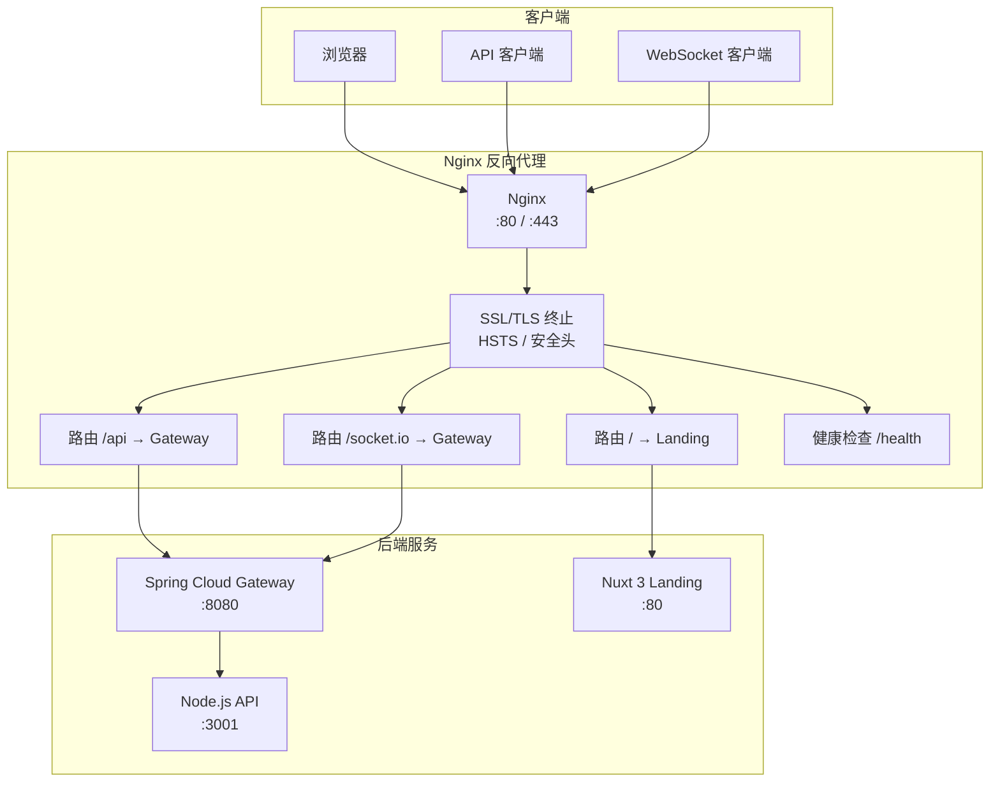
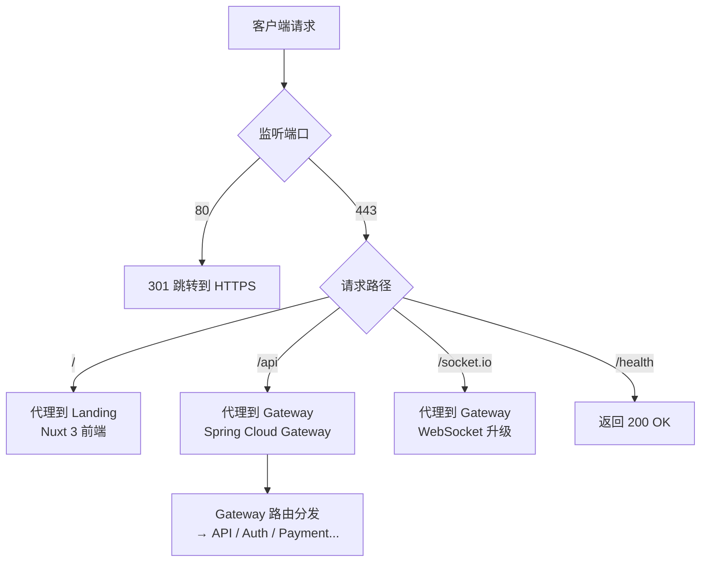

# Nginx 反向代理配置

<cite>
**本文引用的文件**
- [nginx/nginx.conf](file://nginx/nginx.conf)
- [nginx/nginx.dev.conf](file://nginx/nginx.dev.conf)
- [nginx/conf.d/default.conf](file://nginx/conf.d/default.conf)
- [k8s/base/09-ingress.yaml](file://k8s/base/09-ingress.yaml)
- [chart/agenthive/templates/ingress.yaml](file://chart/agenthive/templates/ingress.yaml)
- [docker-compose.dev.yml](file://docker-compose.dev.yml)
- [docker-compose.prod.yml](file://docker-compose.prod.yml)
</cite>

## 目录
1. [简介](#简介)
2. [项目结构](#项目结构)
3. [核心架构](#核心架构)
4. [配置详解](#配置详解)
5. [路由规则](#路由规则)
6. [安全配置](#安全配置)
7. [性能优化](#性能优化)
8. [故障排查指南](#故障排查指南)
9. [结论](#结论)

## 简介
Nginx 在 AgentHive Cloud 中作为统一的流量入口和反向代理，承担 SSL 终止、路由分发、WebSocket 代理、安全加固和 OpenTelemetry Trace Context 传播等关键职责。本平台提供开发环境（HTTP）和生产环境（HTTPS）两套 Nginx 配置，并通过 Docker Compose 和 Kubernetes Ingress 两种部署模式运行。

**核心功能**：
- 统一入口：前端（Landing）、API（Node.js + Java Gateway）通过 Nginx 统一暴露
- SSL/TLS 终止：生产环境 HTTPS + HSTS + 安全响应头
- WebSocket 代理：Socket.IO 长连接支持（24h 超时）
- Trace Context 传播：W3C Trace Context 标准（traceparent/tracestate）
- 健康检查：独立的 `/health` 端点供负载均衡器探测

## 项目结构
Nginx 配置文件按环境拆分：
- `nginx/nginx.conf`：生产环境配置（HTTP → HTTPS 301 + SSL）
- `nginx/nginx.dev.conf`：开发环境配置（HTTP only）
- `nginx/conf.d/default.conf`：通用 server 块配置
- `k8s/base/09-ingress.yaml`：Kubernetes Nginx Ingress 配置
- `chart/agenthive/templates/ingress.yaml`：Helm Chart Ingress 模板

## 核心架构



**图表来源**
- [nginx/nginx.conf:35-94](file://nginx/nginx.conf#L35-L94)
- [nginx/nginx.dev.conf:37-92](file://nginx/nginx.dev.conf#L37-L92)

## 配置详解

### 上游服务定义（Upstream）
```nginx
upstream api {
    server api:3001;
    keepalive 16;       # 保持 16 个长连接到后端
}

upstream landing {
    server landing:80;
    keepalive 16;
}

upstream gateway {
    server gateway-service:8080;
    keepalive 16;
}
```

**设计要点**：
- 使用 Docker Compose 服务名作为主机名（DNS 解析）
- `keepalive` 复用连接，减少 TCP 握手开销
- Gateway 作为 API 统一入口，Nginx 不再直接代理到 API

### 前端路由（/ → Landing）
```nginx
location / {
    proxy_pass http://landing;
    proxy_http_version 1.1;
    proxy_set_header Upgrade $http_upgrade;
    proxy_set_header Connection 'upgrade';
    proxy_set_header Host $host;
    proxy_set_header X-Real-IP $remote_addr;
    proxy_set_header X-Forwarded-For $proxy_add_x_forwarded_for;
    proxy_set_header X-Forwarded-Proto $scheme;
    proxy_cache_bypass $http_upgrade;
}
```

**关键配置**：
- `proxy_http_version 1.1`：支持 HTTP/1.1 长连接
- `Upgrade/Connection` 头：支持 Nuxt 3 HMR WebSocket
- `X-Forwarded-*` 头：保留原始客户端信息，便于日志和审计
- `proxy_cache_bypass`：WebSocket 升级请求绕过缓存

### API 路由（/api → Gateway）
```nginx
location /api {
    proxy_pass http://gateway;
    proxy_http_version 1.1;
    proxy_set_header Host $host;
    proxy_set_header X-Real-IP $remote_addr;
    proxy_set_header X-Forwarded-For $proxy_add_x_forwarded_for;
    proxy_set_header X-Forwarded-Proto $scheme;
    # W3C Trace Context 传播
    proxy_set_header traceparent $http_traceparent;
    proxy_set_header tracestate $http_tracestate;
    proxy_connect_timeout 30s;
    proxy_send_timeout 60s;
    proxy_read_timeout 60s;
}
```

**超时策略**：
| 参数 | 值 | 说明 |
|------|-----|------|
| proxy_connect_timeout | 30s | 与后端建立连接的超时 |
| proxy_send_timeout | 60s | 向后端发送请求的超时 |
| proxy_read_timeout | 60s | 等待后端响应的超时 |

### WebSocket 路由（/socket.io → Gateway）
```nginx
location /socket.io {
    proxy_pass http://gateway;
    proxy_http_version 1.1;
    proxy_set_header Upgrade $http_upgrade;
    proxy_set_header Connection "upgrade";
    proxy_set_header Host $host;
    proxy_set_header X-Real-IP $remote_addr;
    proxy_set_header X-Forwarded-For $proxy_add_x_forwarded_for;
    proxy_set_header X-Forwarded-Proto $scheme;
    # W3C Trace Context 传播
    proxy_set_header traceparent $http_traceparent;
    proxy_set_header tracestate $http_tracestate;
    proxy_read_timeout 86400;  # 24h 超时
}
```

**设计要点**：
- `proxy_read_timeout 86400`（24h）：支持长时间 WebSocket 连接
- `Upgrade/Connection` 头：完成 HTTP → WebSocket 协议升级
- 同样经过 Gateway 认证，确保 WebSocket 连接的安全性

## 路由规则



**章节来源**
- [nginx/nginx.conf:35-94](file://nginx/nginx.conf#L35-L94)

## 安全配置

### SSL/TLS 配置（生产环境）
```nginx
ssl_protocols TLSv1.2 TLSv1.3;
ssl_ciphers ECDHE-ECDSA-AES128-GCM-SHA256:ECDHE-RSA-AES128-GCM-SHA256:...
ssl_prefer_server_ciphers on;
ssl_session_timeout 1d;
ssl_session_cache shared:SSL:50m;
ssl_session_tickets off;
```

**安全等级**：配置符合 Mozilla Intermediate 兼容性级别，支持 TLS 1.2+。

### 安全响应头
```nginx
# HSTS — 强制浏览器使用 HTTPS
add_header Strict-Transport-Security "max-age=31536000; includeSubDomains" always;

# 防点击劫持
add_header X-Frame-Options "SAMEORIGIN" always;

# 防 MIME 类型嗅探
add_header X-Content-Type-Options "nosniff" always;

# 控制 Referrer 信息泄露
add_header Referrer-Policy "strict-origin-when-cross-origin" always;

# XSS 保护
add_header X-XSS-Protection "1; mode=block" always;
```

### W3C Trace Context 传播
Nginx 作为流量入口，负责将客户端或上游的 Trace Context 透传到后端：

```nginx
proxy_set_header traceparent $http_traceparent;
proxy_set_header tracestate $http_tracestate;
```

这使得 OpenTelemetry 的分布式追踪能够跨越 Nginx 边界，形成完整的 Trace。

## 性能优化

### 连接池化
- `worker_processes auto`：自动匹配 CPU 核心数
- `worker_connections 1024`：每 worker 最大并发连接
- `worker_rlimit_nofile 8192`：提高文件描述符限制
- `keepalive 16`：到后端的 keep-alive 连接池

### 缓存策略
```nginx
proxy_cache_path /var/cache/nginx levels=1:2 keys_zone=app_cache:10m max_size=100m;
```
- 10MB 共享内存缓存区
- 最大 100MB 磁盘缓存
- 两级目录结构（`levels=1:2`）加速查找

### 推荐优化参数
| 参数 | 推荐值 | 说明 |
|------|--------|------|
| gzip | on | 启用 Gzip 压缩 |
| gzip_min_length | 1000 | 压缩最小阈值 |
| gzip_types | text/css js json svg | 可压缩的 MIME 类型 |
| sendfile | on | 零拷贝文件传输 |
| tcp_nopush | on | 优化数据包发送 |

## 故障排查指南

### 502 Bad Gateway
- **现象**：Nginx 返回 502
- **原因**：后端服务不可达
- **排查**：`docker compose ps` 检查 Gateway/Landing/API 状态；确认 upstream 的主机名解析正确

### WebSocket 连接断开
- **现象**：Socket.IO 频繁重连
- **原因**：proxy_read_timeout 过短
- **解决**：WebSocket 路由的 `proxy_read_timeout` 设置为 86400（24h）

### SSL 证书错误
- **现象**：浏览器提示证书不安全
- **排查**：检查证书路径 `/etc/nginx/ssl/agenthive.crt` 和私钥路径；确认证书未过期
- **生产建议**：使用 cert-manager + Let's Encrypt 自动管理证书

### Trace Context 丢失
- **现象**：分布式追踪中断在 Nginx 层
- **排查**：确认 `proxy_set_header traceparent` 和 `tracestate` 已配置
- **解决**：检查上游服务是否正确处理 W3C Trace Context 头

## 结论
Nginx 作为 AgentHive Cloud 的统一流量入口，不仅提供了 SSL 终止、路由分发和 WebSocket 代理等基础能力，还通过 W3C Trace Context 传播实现了与 OpenTelemetry 可观测体系的深度集成。建议在生产环境中启用完整的安全响应头、使用 cert-manager 自动化证书管理，并定期审查和更新 SSL/TLS 配置。

### 相关文档
- [Kubernetes 部署](file://部署与运维/Kubernetes 部署/Kubernetes 部署.md) — K8s Ingress 配置
- [Docker 部署](file://部署与运维/Docker 部署.md) — Docker Compose 环境
- [OpenTelemetry Collector 详解](file://监控与可观测性/OpenTelemetry Collector 详解.md)
