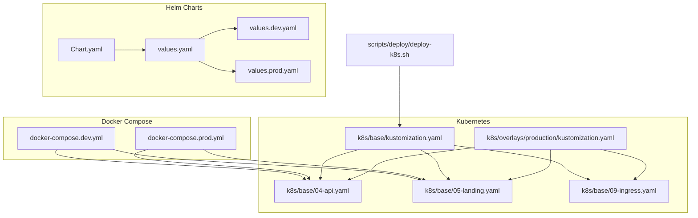
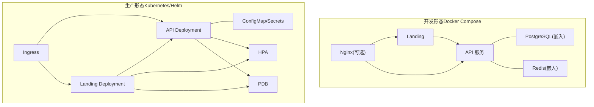
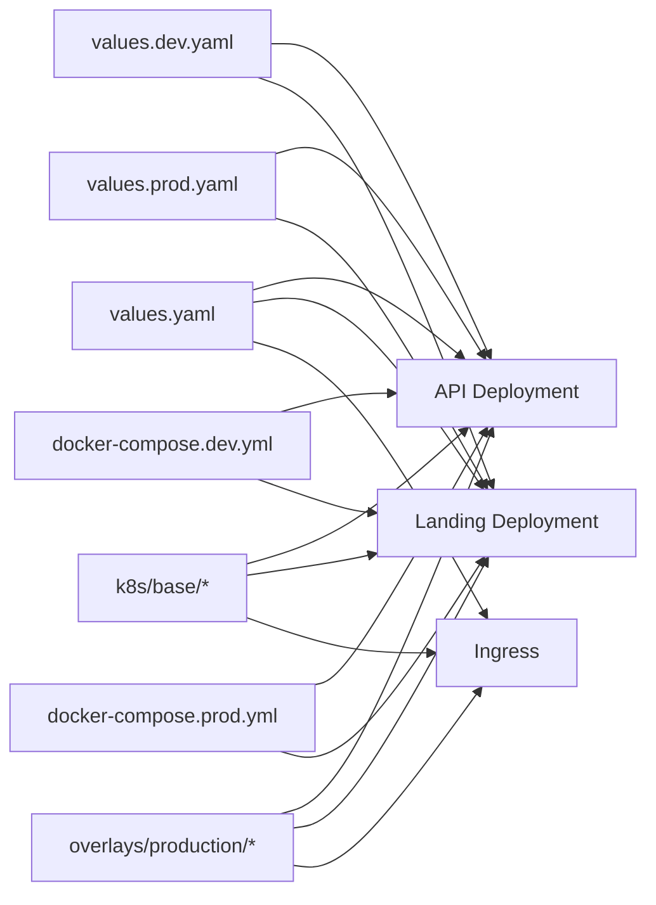

# 部署与运维

<cite>
**本文引用的文件**
- [Chart.yaml](file://chart/agenthive/Chart.yaml)
- [values.yaml](file://chart/agenthive/values.yaml)
- [values.prod.yaml](file://chart/agenthive/values.prod.yaml)
- [values.dev.yaml](file://chart/agenthive/values.dev.yaml)
- [docker-compose.dev.yml](file://docker-compose.dev.yml)
- [docker-compose.prod.yml](file://docker-compose.prod.yml)
- [kustomization.yaml（基础）](file://k8s/base/kustomization.yaml)
- [kustomization.yaml（生产覆盖）](file://k8s/overlays/production/kustomization.yaml)
- [04-api.yaml](file://k8s/base/04-api.yaml)
- [05-landing.yaml](file://k8s/base/05-landing.yaml)
- [09-ingress.yaml](file://k8s/base/09-ingress.yaml)
- [deploy-k8s.sh](file://scripts/deploy/deploy-k8s.sh)
</cite>

## 目录
1. [简介](#简介)
2. [项目结构](#项目结构)
3. [核心组件](#核心组件)
4. [架构总览](#架构总览)
5. [详细组件分析](#详细组件分析)
6. [依赖关系分析](#依赖关系分析)
7. [性能考虑](#性能考虑)
8. [故障排查指南](#故障排查指南)
9. [结论](#结论)
10. [附录](#附录)

## 简介
本指南面向平台运维与开发团队，提供 AgentHive Cloud 在 Docker Compose 与 Kubernetes 两种环境下的完整部署与运维实践。子文档详见：Docker 部署、Kubernetes 部署、Nginx 反向代理配置。内容涵盖：
- Helm Charts 结构与参数配置（环境变量、资源限制、存储）
- Kubernetes 集群部署流程（命名空间、服务发现、负载均衡、Ingress）
- 生产环境高可用部署、滚动更新与回滚策略
- 监控、日志与告警的实施建议
- 故障排查、性能调优与容量规划最佳实践

## 项目结构
围绕部署与运维的关键文件分布如下：
- Helm Charts：chart/agenthive（Chart.yaml、values.yaml 及多环境 values）
- Docker Compose：docker-compose.dev.yml、docker-compose.prod.yml
- Kubernetes：k8s/base（基础清单）、k8s/overlays/production（生产覆盖）
- 部署脚本：scripts/deploy/deploy-k8s.sh

图示来源
- [Chart.yaml:1-18](file://chart/agenthive/Chart.yaml#L1-L18)
- [values.yaml:1-986](file://chart/agenthive/values.yaml#L1-L986)
- [values.dev.yaml:1-269](file://chart/agenthive/values.dev.yaml#L1-L269)
- [values.prod.yaml:1-475](file://chart/agenthive/values.prod.yaml#L1-L475)
- [docker-compose.dev.yml:1-1055](file://docker-compose.dev.yml#L1-L1055)
- [docker-compose.prod.yml:1-800](file://docker-compose.prod.yml#L1-L800)
- [kustomization.yaml（基础）:1-32](file://k8s/base/kustomization.yaml#L1-L32)
- [kustomization.yaml（生产覆盖）:1-219](file://k8s/overlays/production/kustomization.yaml#L1-L219)
- [04-api.yaml:1-260](file://k8s/base/04-api.yaml#L1-L260)
- [05-landing.yaml:1-144](file://k8s/base/05-landing.yaml#L1-L144)
- [09-ingress.yaml:1-139](file://k8s/base/09-ingress.yaml#L1-L139)
- [deploy-k8s.sh:1-121](file://scripts/deploy/deploy-k8s.sh#L1-L121)

章节来源
- [Chart.yaml:1-18](file://chart/agenthive/Chart.yaml#L1-L18)
- [values.yaml:1-986](file://chart/agenthive/values.yaml#L1-L986)
- [values.dev.yaml:1-269](file://chart/agenthive/values.dev.yaml#L1-L269)
- [values.prod.yaml:1-475](file://chart/agenthive/values.prod.yaml#L1-L475)
- [docker-compose.dev.yml:1-1055](file://docker-compose.dev.yml#L1-L1055)
- [docker-compose.prod.yml:1-800](file://docker-compose.prod.yml#L1-L800)
- [kustomization.yaml（基础）:1-32](file://k8s/base/kustomization.yaml#L1-L32)
- [kustomization.yaml（生产覆盖）:1-219](file://k8s/overlays/production/kustomization.yaml#L1-L219)
- [04-api.yaml:1-260](file://k8s/base/04-api.yaml#L1-L260)
- [05-landing.yaml:1-144](file://k8s/base/05-landing.yaml#L1-L144)
- [09-ingress.yaml:1-139](file://k8s/base/09-ingress.yaml#L1-L139)
- [deploy-k8s.sh:1-121](file://scripts/deploy/deploy-k8s.sh#L1-L121)

## 核心组件
- API 服务（Node.js）：后端接口、聊天与工作区管理，支持健康探针与资源限制
- Landing（前端）：静态页面服务，暴露 HTTP 端口，具备探针与缓存卷
- Ingress：统一入口，支持 HTTPS、WebSocket、限流与安全头
- 数据层：PostgreSQL 与 Redis（可选嵌入或外部）
- Java 微服务（可选）：网关与鉴权等服务，通过 Nacos 与 RabbitMQ（可选）

章节来源
- [04-api.yaml:11-260](file://k8s/base/04-api.yaml#L11-L260)
- [05-landing.yaml:11-144](file://k8s/base/05-landing.yaml#L11-L144)
- [09-ingress.yaml:4-139](file://k8s/base/09-ingress.yaml#L4-L139)
- [values.yaml:66-395](file://chart/agenthive/values.yaml#L66-L395)
- [values.dev.yaml:13-164](file://chart/agenthive/values.dev.yaml#L13-L164)
- [values.prod.yaml:25-373](file://chart/agenthive/values.prod.yaml#L25-L373)

## 架构总览
下图展示生产与开发两种部署形态的对比与关键差异。

图示来源
- [docker-compose.dev.yml:17-777](file://docker-compose.dev.yml#L17-L777)
- [docker-compose.prod.yml:14-799](file://docker-compose.prod.yml#L14-L799)
- [kustomization.yaml（基础）:6-20](file://k8s/base/kustomization.yaml#L6-L20)
- [kustomization.yaml（生产覆盖）:11-219](file://k8s/overlays/production/kustomization.yaml#L11-L219)
- [04-api.yaml:11-260](file://k8s/base/04-api.yaml#L11-L260)
- [05-landing.yaml:11-144](file://k8s/base/05-landing.yaml#L11-L144)
- [09-ingress.yaml:4-139](file://k8s/base/09-ingress.yaml#L4-L139)

## 详细组件分析

### Helm Charts 结构与参数
- Chart 元数据：名称、版本、应用版本、关键字与维护者
- 全局参数：命名空间、镜像仓库、镜像拉取策略、Pod/容器安全上下文
- 服务账户与镜像拉取密钥：支持私有镜像仓库
- 命名空间与标签：统一的命名空间与标签体系
- API/Landing/Java 微服务：镜像仓库/标签、副本数、资源请求/限制、HPA/PDB、滚动更新策略、探针、环境变量（ConfigMap/Secret）
- Ingress：类名、TLS、主机与路径映射
- 数据层：PostgreSQL/Redis（开发模式可嵌入）
- 工作区持久化：默认禁用，可通过 workspace.persistence 开启

章节来源
- [Chart.yaml:1-18](file://chart/agenthive/Chart.yaml#L1-L18)
- [values.yaml:10-263](file://chart/agenthive/values.yaml#L10-L263)
- [values.dev.yaml:13-164](file://chart/agenthive/values.dev.yaml#L13-L164)
- [values.prod.yaml:6-373](file://chart/agenthive/values.prod.yaml#L6-L373)

### Docker Compose（开发）
- 基础服务：PostgreSQL、Redis（嵌入）
- Node.js 服务：API、Landing
- Java 微服务（可选）：Nacos、RabbitMQ、Gateway/Auth/Payment/Order/Cart/Logistics
- 监控栈（可选）：Prometheus、Grafana、Tempo、Loki、OTel
- 网络与卷：自定义网络与持久化卷
- 健康检查与资源限制

章节来源
- [docker-compose.dev.yml:17-777](file://docker-compose.dev.yml#L17-L777)

### Docker Compose（生产）
- Nginx 作为统一入口，支持 HTTPS
- API/Landing 镜像拉取
- Java 微服务（可选）：Nacos、RabbitMQ、各微服务
- 监控栈（可选）：Prometheus/Grafana/Tempo/Loki/OTel
- Watchtower 自动更新

章节来源
- [docker-compose.prod.yml:14-799](file://docker-compose.prod.yml#L14-L799)

### Kubernetes（基础清单）
- 命名空间与 RBAC、NetworkPolicy、备份 CronJob、Nacos、RabbitMQ
- API/Landing Deployment：探针、资源、反亲和、卷挂载
- Service：ClusterIP 暴露
- HPA/PDB：最小可用与扩缩策略
- Ingress：类名、TLS、路径与后端服务映射

章节来源
- [kustomization.yaml（基础）:1-32](file://k8s/base/kustomization.yaml#L1-L32)
- [04-api.yaml:11-260](file://k8s/base/04-api.yaml#L11-L260)
- [05-landing.yaml:11-144](file://k8s/base/05-landing.yaml#L11-L144)
- [09-ingress.yaml:4-139](file://k8s/base/09-ingress.yaml#L4-L139)

### Kubernetes（生产覆盖）
- 镜像重定向与标签
- 副本数提升至 3
- Ingress 安全增强（HSTS、RateLimit、证书）
- HPA 行为与最小副本调整
- 资源请求/限制提升
- PDB 最小可用提升
- 网关 CORS 配置覆盖

章节来源
- [kustomization.yaml（生产覆盖）:1-219](file://k8s/overlays/production/kustomization.yaml#L1-L219)

### 部署脚本（Kubernetes）
- 校验 kubectl 与集群连通性
- 顺序部署：命名空间、SecretStore/ExternalSecrets、PostgreSQL、Redis、API、Landing、Ingress
- 等待就绪与访问信息输出

章节来源
- [deploy-k8s.sh:1-121](file://scripts/deploy/deploy-k8s.sh#L1-L121)

## 依赖关系分析

图示来源
- [values.yaml:66-395](file://chart/agenthive/values.yaml#L66-L395)
- [values.dev.yaml:18-164](file://chart/agenthive/values.dev.yaml#L18-L164)
- [values.prod.yaml:25-373](file://chart/agenthive/values.prod.yaml#L25-L373)
- [kustomization.yaml（基础）:6-20](file://k8s/base/kustomization.yaml#L6-L20)
- [kustomization.yaml（生产覆盖）:11-219](file://k8s/overlays/production/kustomization.yaml#L11-L219)
- [docker-compose.dev.yml:17-777](file://docker-compose.dev.yml#L17-L777)
- [docker-compose.prod.yml:14-799](file://docker-compose.prod.yml#L14-L799)

## 性能考虑
- 资源配额与扩缩容
  - API/Landing 默认 requests/limits，生产覆盖中提升资源并启用 HPA
  - HPA 目标 CPU/内存利用率与稳定窗口、扩缩策略
- 探针与启动时间
  - liveness/readiness/startup 探针参数影响滚动更新与健康判定
- 存储与工作区
  - 工作区卷默认禁用；单节点集群推荐 local-path，多节点需 RWX 存储类
- 网络与 Ingress
  - WebSocket、长连接超时与代理版本设置
  - 生产 Ingress 启用 HSTS、限流与证书

章节来源
- [values.yaml:87-160](file://chart/agenthive/values.yaml#L87-L160)
- [values.prod.yaml:32-67](file://chart/agenthive/values.prod.yaml#L32-L67)
- [kustomization.yaml（生产覆盖）:27-176](file://k8s/overlays/production/kustomization.yaml#L27-L176)
- [04-api.yaml:169-192](file://k8s/base/04-api.yaml#L169-L192)
- [09-ingress.yaml:11-32](file://k8s/base/09-ingress.yaml#L11-L32)

## 故障排查指南
- 集群连接与命名空间
  - 使用脚本校验 kubectl 与集群连通性，确认命名空间存在
- 服务就绪与日志
  - 等待 PostgreSQL/Redis/API/Landing 就绪，查看 Pod 日志与事件
- Ingress 访问
  - 若无 Host，使用端口转发验证；检查 Ingress 类名与 TLS 配置
- 滚动更新与回滚
  - 使用 rollout restart 触发滚动更新；使用 rollout undo 回滚至上一版本
- 常见问题定位
  - 探针失败、资源不足、存储不可用、网络策略阻断、镜像拉取失败

章节来源
- [deploy-k8s.sh:15-26](file://scripts/deploy/deploy-k8s.sh#L15-L26)
- [deploy-k8s.sh:47-76](file://scripts/deploy/deploy-k8s.sh#L47-L76)
- [deploy-k8s.sh:95-121](file://scripts/deploy/deploy-k8s.sh#L95-L121)

## 结论
本指南提供了从 Helm Charts 到 Docker Compose 与 Kubernetes 的全链路部署与运维实践。通过标准化的 values、Kustomize 覆盖与自动化脚本，可在开发与生产环境中实现一致、可审计且高可用的交付流程。结合 HPA/PDB、探针与 Ingress 安全配置，可进一步提升系统的稳定性与安全性。

## 附录

### A. Docker Compose 快速上手
- 开发环境
  - 启动：docker compose -f docker-compose.dev.yml --env-file .env.dev up -d
  - 健康检查：bash scripts/ops/health-check-dev.sh
- 生产环境
  - 启动：docker compose -f docker-compose.prod.yml --env-file .env.prod up -d
  - 监控：--profile monitoring

章节来源
- [docker-compose.dev.yml:1-15](file://docker-compose.dev.yml#L1-L15)
- [docker-compose.prod.yml:1-12](file://docker-compose.prod.yml#L1-L12)

### B. Kubernetes 部署与运维
- 基础部署
  - 使用脚本一键部署：scripts/deploy/deploy-k8s.sh
  - 或逐资源 apply：k8s/base 下的 YAML
- 生产覆盖
  - 使用 overlays/production 覆盖：镜像、副本、HPA、Ingress 安全与资源
- 滚动更新与回滚
  - kubectl rollout restart/undo 部署

章节来源
- [deploy-k8s.sh:34-81](file://scripts/deploy/deploy-k8s.sh#L34-L81)
- [kustomization.yaml（生产覆盖）:11-219](file://k8s/overlays/production/kustomization.yaml#L11-L219)

### C. Helm 升级与参数覆盖
- 开发：helm upgrade --install agenthive ./chart/agenthive -f values.yaml -f values.dev.yaml
- 生产：helm upgrade --install agenthive ./chart/agenthive -f values.yaml -f values.prod.yaml

章节来源
- [values.dev.yaml:1-4](file://chart/agenthive/values.dev.yaml#L1-L4)
- [values.prod.yaml:1-4](file://chart/agenthive/values.prod.yaml#L1-L4)

### D. 环境变量与密钥（摘要）
- API/Landing
  - NODE_ENV、DB_*、REDIS_URL、JWT_SECRET、LLM_*、CORS_ORIGIN、UV_THREADPOOL_SIZE、OTEL_*、WORKSPACE_BASE
- Java 微服务
  - NACOS_*、SPRING_CLOUD_NACOS_*、DB_*、REDIS_*、RABBITMQ_*、JWT_SECRET、JAVA_OPTS、OTEL_*
- 生产环境
  - 通过 ConfigMap/Secrets 注入，避免硬编码

章节来源
- [values.yaml:161-230](file://chart/agenthive/values.yaml#L161-L230)
- [values.dev.yaml:167-217](file://chart/agenthive/values.dev.yaml#L167-L217)
- [values.prod.yaml:339-372](file://chart/agenthive/values.prod.yaml#L339-L372)