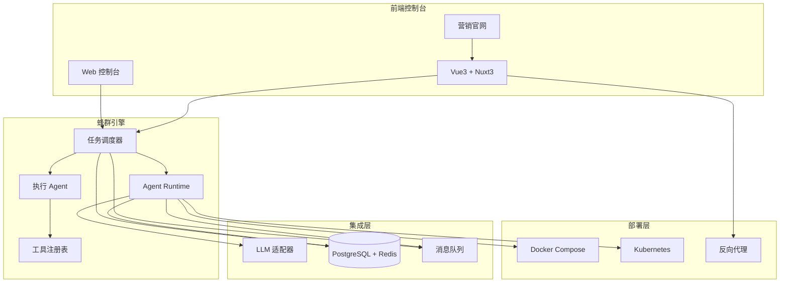
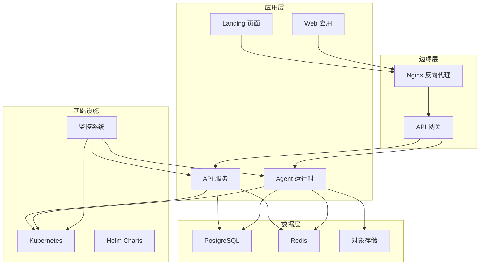
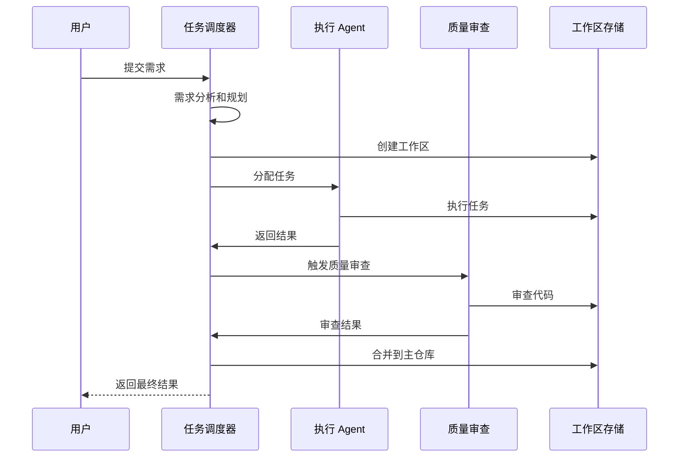
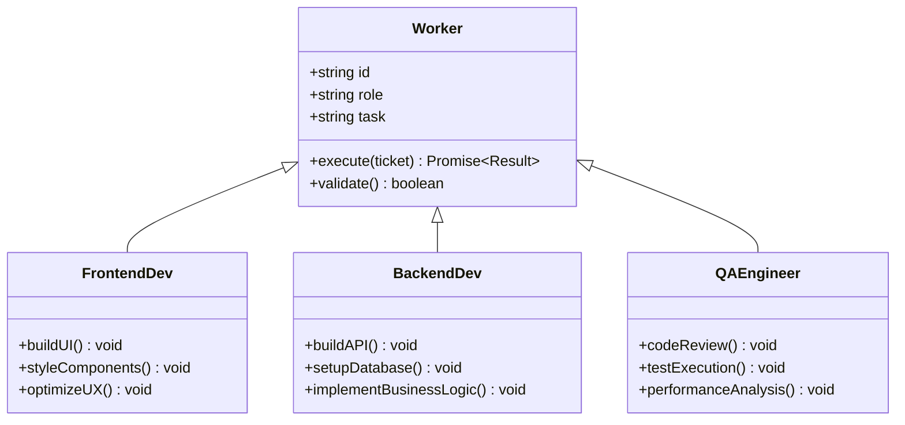
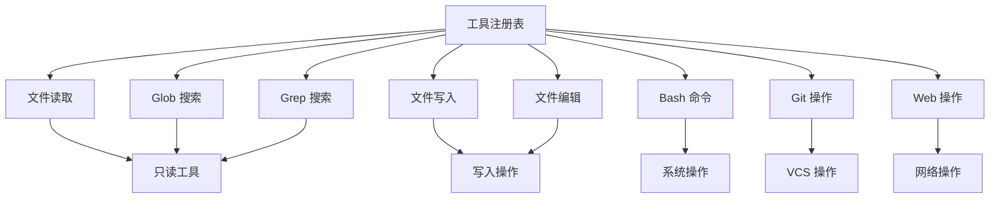
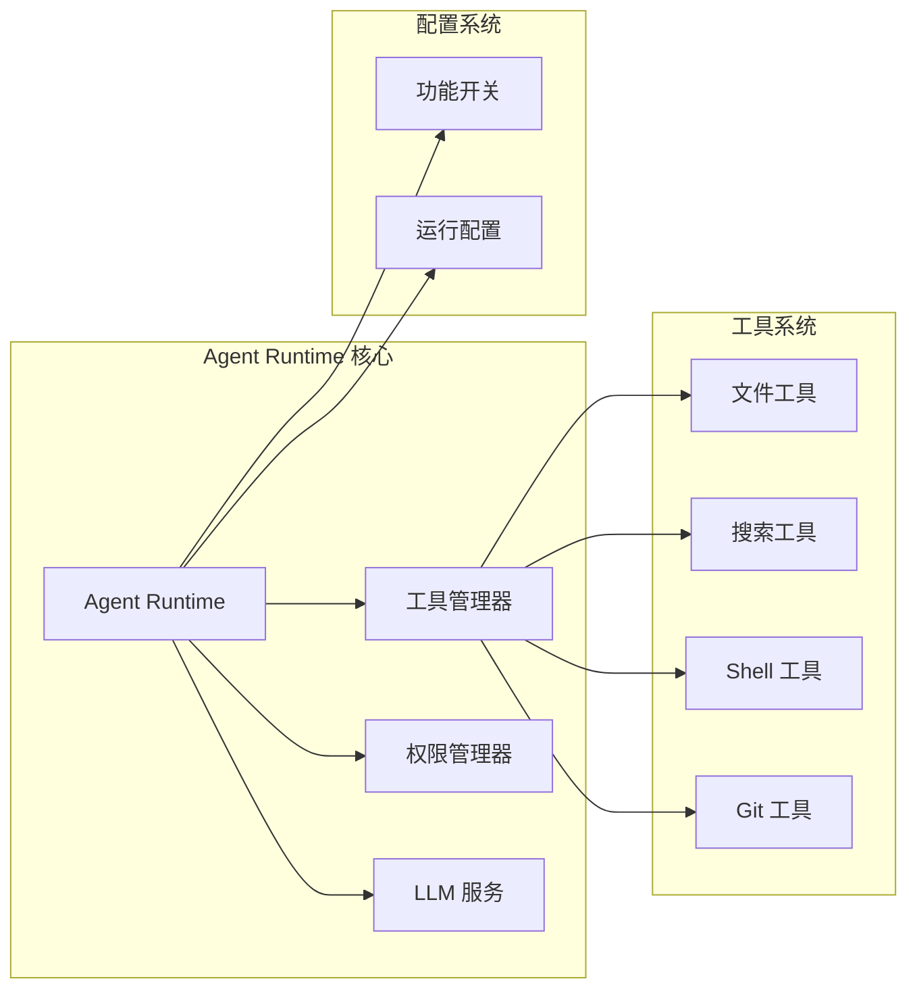
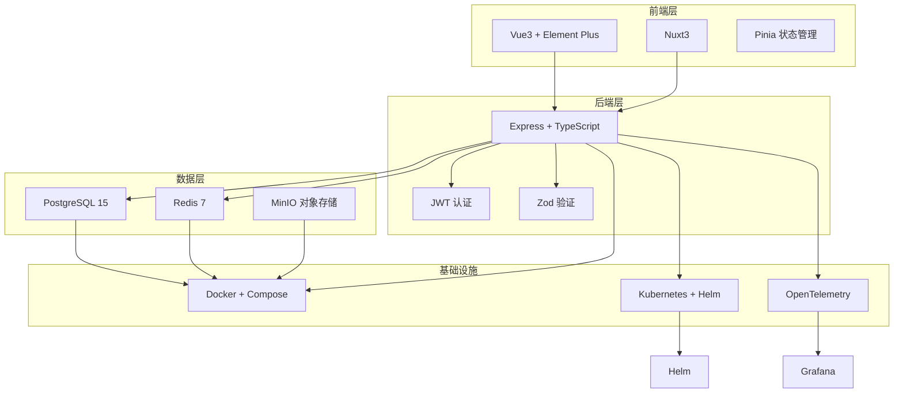
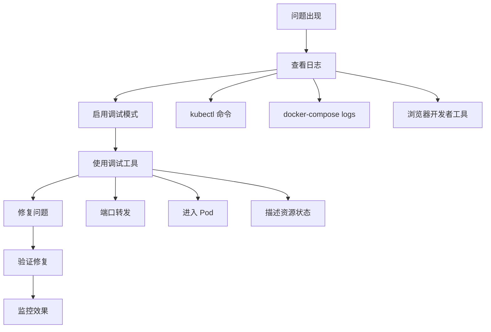
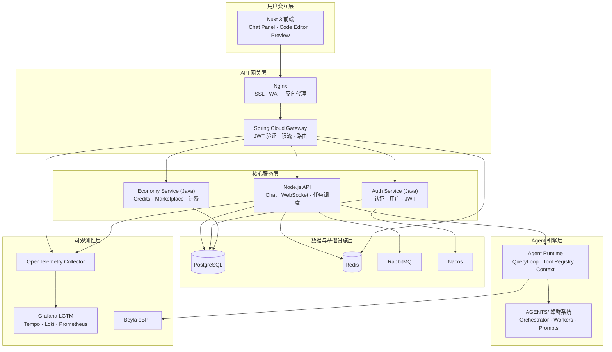

# 项目概述

<cite>
**本文引用的文件**
- [README.md](file://README.md)
- [AGENTS.md](file://AGENTS.md)
- [apps/README.md](file://apps/README.md)
- [docs/architecture/00-architecture-review.md](file://docs/architecture/00-architecture-review.md)
- [docs/architecture/04-development-roadmap.md](file://docs/architecture/04-development-roadmap.md)
- [AGENT_COLLABORATION_SPEC.md](file://AGENT_COLLABORATION_SPEC.md)
- [AGENTS/orchestrator.ts](file://AGENTS/orchestrator.ts)
- [AGENTS/workers/backend-dev.ts](file://AGENTS/workers/backend-dev.ts)
- [AGENTS/workers/frontend-dev.ts](file://AGENTS/workers/frontend-dev.ts)
- [AGENTS/workers/qa-engineer.ts](file://AGENTS/workers/qa-engineer.ts)
- [AGENTS/tools/tool-registry.json](file://AGENTS/tools/tool-registry.json)
- [AGENTS/shared/prompts/system-orchestrator.md](file://AGENTS/shared/prompts/system-orchestrator.md)
- [apps/agent-runtime/src/index.ts](file://apps/agent-runtime/src/index.ts)
- [apps/api/src/app.ts](file://apps/api/src/app.ts)
- [WORKFLOW.md](file://WORKFLOW.md)
</cite>

## 目录
1. [简介](#简介)
2. [项目结构](#项目结构)
3. [核心组件](#核心组件)
4. [架构总览](#架构总览)
5. [详细组件分析](#详细组件分析)
6. [依赖关系分析](#依赖关系分析)
7. [性能考虑](#性能考虑)
8. [故障排除指南](#故障排除指南)
9. [结论](#结论)
10. [附录](#附录)

## 简介

AgentHive Cloud 是一个无代码蜂群 Agent 平台，旨在让用户无需编写复杂代码即可构建、部署和管理多 Agent 协作的 AI 应用。该项目采用"蜂群模式"，模拟软件开发团队的协作方式，通过可视化界面配置 Agent 角色和工作流，实现智能化的自动化开发。

### 核心价值主张

- **无代码构建**：通过可视化界面配置 Agent 角色、工作流和工具，降低技术门槛
- **蜂群协作**：多个 Agent 分工合作，自动完成复杂任务，提升开发效率
- **一键部署**：支持 Docker Compose 和 Kubernetes，本地/云端随意切换
- **开箱即用**：预置常见 Agent 模板（开发、测试、文档、运维）
- **灵活扩展**：轻松接入自定义工具、API 和 LLM 模型

### 适用场景

| 场景 | 说明 |
|------|------|
| **AI 应用开发** | 无需从零编码，配置 Agent 团队即可构建完整应用 |
| **自动化工作流** | 让 Agent 协作处理重复性任务（数据处理、内容生成、代码审查） |
| **快速原型** | 1 小时搭建可演示的 AI 产品原型 |
| **企业知识库** | 部署专属问答 Agent，接入内部文档系统 |
| **DevOps 自动化** | 自动执行 CI/CD、监控告警、故障排查 |

## 项目结构

AgentHive Cloud 采用分层架构设计，主要分为四个层次：

**图表来源**
- [README.md:40-66](file://README.md#L40-L66)
- [AGENTS.md:37-98](file://AGENTS.md#L37-L98)

**章节来源**
- [README.md:70-102](file://README.md#L70-L102)
- [AGENTS.md:37-98](file://AGENTS.md#L37-L98)

## 核心组件

### 蜂群引擎（Agent Runtime）

蜂群引擎是平台的核心执行层，负责任务调度、Agent 协作和资源管理。主要组件包括：

- **任务调度器（Orchestrator）**：负责需求分析、任务拆解和协调
- **执行 Agent（Workers）**：包括前端开发、后端开发、QA 工程师等角色
- **工具注册表（Tool Registry）**：管理各种可用工具和权限控制

### 集成层

集成层提供平台所需的基础服务和基础设施：

- **LLM 适配器**：支持多种大语言模型提供商
- **数据库**：PostgreSQL 15 + Redis 7
- **消息队列**：WebSocket + 内存队列
- **可观测性**：OpenTelemetry + Grafana LGTM

### 部署层

支持多种部署方式，适应不同环境需求：

- **Docker Compose**：本地开发和测试环境
- **Kubernetes**：生产环境部署
- **Nginx**：反向代理和负载均衡

**章节来源**
- [README.md:40-66](file://README.md#L40-L66)
- [AGENTS.md:11-34](file://AGENTS.md#L11-L34)

## 架构总览

AgentHive Cloud 采用现代化的云原生架构，结合微服务和容器化技术：

**图表来源**
- [docs/architecture/00-architecture-review.md:25-59](file://docs/architecture/00-architecture-review.md#L25-L59)
- [docs/architecture/00-architecture-review.md:82-104](file://docs/architecture/00-architecture-review.md#L82-L104)

**章节来源**
- [docs/architecture/00-architecture-review.md:21-104](file://docs/architecture/00-architecture-review.md#L21-L104)

## 详细组件分析

### 任务调度器（Orchestrator）

任务调度器是蜂群模式的核心，负责将用户需求分解为可执行的任务，并协调各个 Agent 完成工作。

**图表来源**
- [AGENTS/orchestrator.ts:246-431](file://AGENTS/orchestrator.ts#L246-L431)
- [WORKFLOW.md:7-18](file://WORKFLOW.md#L7-L18)

任务调度器的关键特性：

- **文件锁机制**：防止多个 Agent 同时修改相同文件
- **并行执行**：无冲突且依赖满足的任务并行执行
- **自动修复循环**：QA 拒绝后自动生成修复任务
- **持久化支持**：支持断点续传和离线恢复

**章节来源**
- [AGENTS/orchestrator.ts:1-650](file://AGENTS/orchestrator.ts#L1-L650)
- [AGENTS/shared/prompts/system-orchestrator.md:1-46](file://AGENTS/shared/prompts/system-orchestrator.md#L1-L46)

### 执行 Agent（Workers）

执行 Agent 是具体的任务执行者，根据角色不同有不同的职责：

**图表来源**
- [AGENTS/workers/frontend-dev.ts:1-46](file://AGENTS/workers/frontend-dev.ts#L1-L46)
- [AGENTS/workers/backend-dev.ts:1-45](file://AGENTS/workers/backend-dev.ts#L1-L45)
- [AGENTS/workers/qa-engineer.ts:1-121](file://AGENTS/workers/qa-engineer.ts#L1-L121)

各角色的具体职责：

- **前端开发（小花）**：Vue 3/Nuxt 3 前端开发，组件和页面实现
- **后端开发（阿铁）**：Node.js/API/数据库开发，业务逻辑实现
- **QA 工程师（阿镜）**：代码审查、质量把控、测试执行

**章节来源**
- [AGENTS/workers/frontend-dev.ts:1-46](file://AGENTS/workers/frontend-dev.ts#L1-L46)
- [AGENTS/workers/backend-dev.ts:1-45](file://AGENTS/workers/backend-dev.ts#L1-L45)
- [AGENTS/workers/qa-engineer.ts:1-121](file://AGENTS/workers/qa-engineer.ts#L1-L121)

### 工具注册表（Tool Registry）

工具注册表提供了丰富的工具集，支持文件操作、搜索、系统命令等各种功能：

**图表来源**
- [AGENTS/tools/tool-registry.json:1-471](file://AGENTS/tools/tool-registry.json#L1-L471)

工具分类和权限控制：

- **只读工具**：文件读取、搜索等不会修改系统的操作
- **写入工具**：文件写入、编辑等会修改系统的操作
- **系统工具**：Bash 命令执行等底层系统操作
- **版本控制工具**：Git 操作等版本管理功能

**章节来源**
- [AGENTS/tools/tool-registry.json:1-471](file://AGENTS/tools/tool-registry.json#L1-L471)

### Agent 运行时（Agent Runtime）

Agent 运行时提供了完整的 Agent 执行环境，支持工具管理和权限控制：

**图表来源**
- [apps/agent-runtime/src/index.ts:1-351](file://apps/agent-runtime/src/index.ts#L1-L351)

**章节来源**
- [apps/agent-runtime/src/index.ts:1-351](file://apps/agent-runtime/src/index.ts#L1-L351)

## 依赖关系分析

AgentHive Cloud 的依赖关系体现了清晰的分层架构：

**图表来源**
- [README.md:218-244](file://README.md#L218-L244)
- [AGENTS.md:11-34](file://AGENTS.md#L11-L34)

**章节来源**
- [README.md:218-244](file://README.md#L218-L244)
- [AGENTS.md:11-34](file://AGENTS.md#L11-L34)

## 性能考虑

AgentHive Cloud 在设计时充分考虑了性能优化：

### 并行执行优化
- **文件锁机制**：防止文件冲突，确保任务正确执行
- **依赖解析**：自动识别任务依赖关系，最大化并行度
- **资源隔离**：每个任务在独立的工作区中执行

### 缓存策略
- **工具结果缓存**：避免重复计算
- **LLM 调用缓存**：减少重复的模型调用
- **文件系统缓存**：加速文件读取操作

### 监控和可观测性
- **OpenTelemetry 集成**：完整的分布式追踪
- **性能指标收集**：CPU、内存、网络等关键指标
- **告警机制**：自动监控系统健康状况

## 故障排除指南

### 常见问题和解决方案

| 问题类型 | 症状 | 解决方案 |
|----------|------|----------|
| **环境配置问题** | 端口被占用、依赖缺失 | 检查环境变量、安装依赖包 |
| **Agent 执行失败** | 任务卡住、文件锁冲突 | 检查文件权限、清理工作区 |
| **数据库连接问题** | 连接超时、认证失败 | 验证数据库配置、网络连通性 |
| **Kubernetes 部署问题** | Pod 重启、资源不足 | 检查资源配置、日志输出 |

### 调试工具和方法

**章节来源**
- [AGENT_COLLABORATION_SPEC.md:611-640](file://AGENT_COLLABORATION_SPEC.md#L611-L640)

## 结论

AgentHive Cloud 代表了 AI Agent 协作开发的新范式，通过蜂群模式实现了智能化的自动化开发。项目具有以下显著特点：

### 技术优势
- **混合架构**：Java（Spring Cloud）负责平台核心业务，Node.js 负责 AI Agent 引擎，双栈互补
- **架构先进**：采用云原生架构，支持容器化和微服务，集成 Kubernetes/Helm/ArgoCD
- **全栈 TypeScript**：前端（Nuxt 3 + Vue 3）、后端（Express）、Agent Runtime 统一 TypeScript
- **协作高效**：多 Agent 协作，模拟真实开发团队的分工模式
- **可观测性企业级**：OpenTelemetry + Beyla eBPF + LGTM 全链路追踪

### 技术栈矩阵

| 层次 | 技术 | 版本 | 用途 |
|------|------|------|------|
| 前端 | Nuxt 3 + Vue 3 | 3.x | SSR 前端控制台 |
| 前端 | Element Plus | 2.9+ | UI 组件库 |
| 前端 | Pinia | 2.1+ | 状态管理 |
| 后端 API | Express + TypeScript | 4.x | REST + WebSocket API |
| Agent 引擎 | Node.js + Zod | 20+ | Agent 运行时 + 验证 |
| Java 微服务 | Spring Boot 3.2 + Spring Cloud | 3.2.12 | 认证/网关/经济系统 |
| 数据库 | PostgreSQL 15 + Redis 7 | - | 持久化 + 缓存 |
| 消息队列 | RabbitMQ | 3.x | Java 服务间事件 |
| 服务发现 | Nacos | 2.x | Java 服务注册/配置 |
| 容器编排 | Kubernetes + Helm + Kustomize | - | 部署管理 |
| GitOps | ArgoCD | - | 持续部署 |
| IaC | Terraform | - | 基础设施即代码 |
| 可观测性 | OTel + Beyla eBPF + LGTM | - | 全链路追踪监控 |

### 子系统概览

### 应用价值
- **降低门槛**：无代码配置，让更多人能够参与 AI 应用开发
- **提升效率**：自动化工作流，减少重复性劳动
- **保证质量**：内置 QA 流程，确保代码质量
- **快速迭代**：支持快速原型开发和敏捷开发
- **企业级可观测**：LLM 调用成本追踪、Agent 任务监控、分布式链路追踪

### 发展前景

项目正在从多 Agent 协作开发平台转型为面向用户的低代码 AI 应用生成平台（对标 atoms.dev），同时作为 Java + 全栈面试作品，展示 Spring Cloud / Spring Security / MyBatis / 分布式锁 / Agent AI 等核心技术。详细规划见 [技术规划文档](file://.qoder/specs/agenthive-cloud-spec.md)。

## 附录

### 快速开始指南

1. **环境准备**：安装 Node.js 20+、Docker、pnpm
2. **项目克隆**：`git clone https://github.com/sdoxiaobaomei/agenthive-cloud.git`
3. **依赖安装**：`cd apps && pnpm install`
4. **环境配置**：复制 `.env.example` 为 `.env` 并配置 LLM 设置
5. **启动服务**：使用 Docker Compose 或本地开发模式启动

### 社区贡献

项目采用开放的社区治理模式，欢迎开发者贡献代码、提出建议和报告问题。通过 GitHub Issues 和 Pull Request 机制，社区成员可以共同推动项目发展。