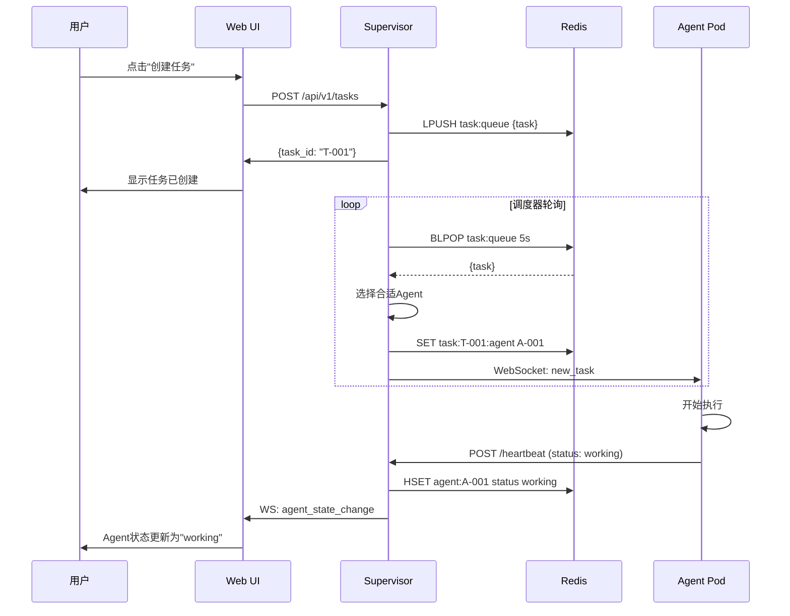
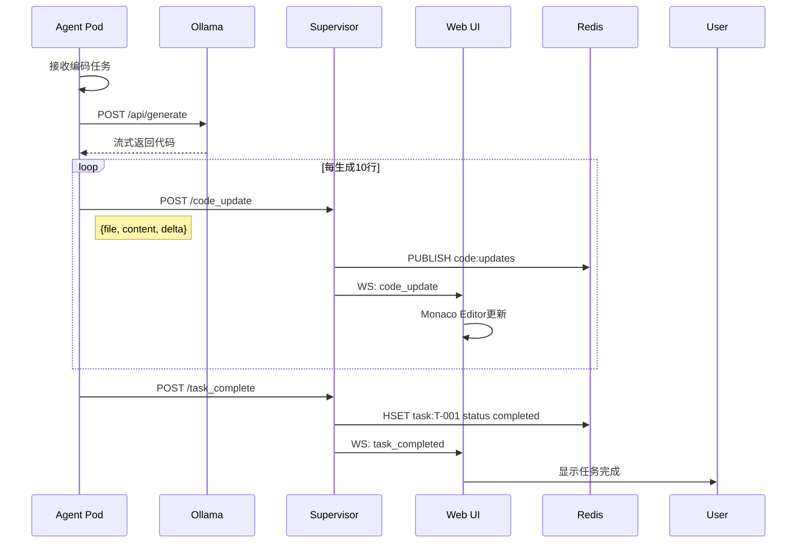
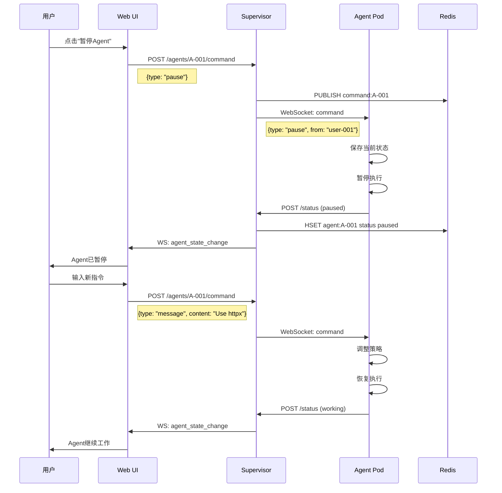

# AgentHive 数据流详解

## 核心数据流

### 1. 用户创建任务



### 2. Agent实时编码



### 3. 用户干预Agent



## 数据存储

### Redis (实时数据)

```
# Agent状态
HSET agent:{id} 
  status "working"
  current_task "T-001"
  progress 75
  last_seen "2026-03-31T10:00:00Z"
  pod_ip "10.0.1.23"

# 任务队列
LPUSH task:queue {task_json}

# WebSocket连接
SET ws:client:{client_id} {agent_id} EX 300

# 代码更新 (Pub/Sub)
PUBLISH code:updates {file, content, agent_id}

# 用户命令
PUBLISH command:{agent_id} {command_json}
```

### PostgreSQL (持久数据)

```sql
-- Agent注册表
CREATE TABLE agents (
    id VARCHAR(32) PRIMARY KEY,
    role VARCHAR(50) NOT NULL,
    name VARCHAR(100),
    status VARCHAR(20) DEFAULT 'idle',
    created_at TIMESTAMP DEFAULT NOW(),
    config JSONB
);

-- 任务历史
CREATE TABLE tasks (
    id VARCHAR(32) PRIMARY KEY,
    type VARCHAR(50),
    description TEXT,
    agent_id VARCHAR(32) REFERENCES agents(id),
    status VARCHAR(20),
    created_at TIMESTAMP,
    completed_at TIMESTAMP,
    result JSONB
);

-- 代码快照
CREATE TABLE code_snapshots (
    id SERIAL PRIMARY KEY,
    task_id VARCHAR(32) REFERENCES tasks(id),
    file_path VARCHAR(500),
    content TEXT,
    agent_id VARCHAR(32),
    created_at TIMESTAMP DEFAULT NOW()
);

-- 操作日志
CREATE TABLE operation_logs (
    id SERIAL PRIMARY KEY,
    agent_id VARCHAR(32),
    type VARCHAR(50),
    details JSONB,
    created_at TIMESTAMP DEFAULT NOW()
);
```

### MinIO (文件存储)

```
bucket: agenthive
├── agents/
│   ├── {agent_id}/
│   │   ├── workspace/        # Agent工作目录备份
│   │   └── logs/             # Agent日志归档
├── tasks/
│   └── {task_id}/
│       ├── artifacts/        # 任务产物
│       └── snapshots/        # 代码快照
└── system/
    └── backups/              # 系统备份
```

## 消息格式

### Agent上报状态

```json
{
  "agent_id": "A-001",
  "type": "status_update",
  "status": "working",
  "current_task": "T-001",
  "progress": 75,
  "current_file": "/app/main.go",
  "live_output": "Compiling...",
  "timestamp": "2026-03-31T10:00:00Z"
}
```

### 代码更新

```json
{
  "agent_id": "A-001",
  "type": "code_update",
  "file": "/app/main.go",
  "content": "package main\n\nimport...",
  "delta": {
    "start_line": 10,
    "added": ["import \"fmt\""],
    "removed": []
  },
  "timestamp": "2026-03-31T10:00:00Z"
}
```

### 终端输出

```json
{
  "agent_id": "A-001",
  "type": "terminal_output",
  "output": "Build successful\n",
  "is_error": false,
  "timestamp": "2026-03-31T10:00:00Z"
}
```

### 用户指令

```json
{
  "from": "user-001",
  "type": "command",
  "command": {
    "type": "message",
    "content": "Use httpx instead of urllib"
  },
  "timestamp": "2026-03-31T10:00:00Z"
}
```

## 性能优化

### 1. 代码增量更新

不传输完整文件，只传输diff：

```javascript
// 前端合并delta
const currentContent = editor.getValue();
const newContent = applyDelta(currentContent, delta);
editor.setValue(newContent);
```

### 2. 批量上报

Agent批量上报，减少网络请求：

```go
// 批量上报
updates := []Update{}
for i := 0; i < 10; i++ {
    updates = append(updates, getUpdate())
}
supervisorClient.BatchReport(updates)
```

### 3. 连接池

Supervisor维护WebSocket连接池：

```go
type WebSocketPool struct {
    clients map[string]*WebSocketConn
    
    // 广播时复用连接
    Broadcast(message []byte) {
        for _, conn := range pool.clients {
            conn.Write(message)
        }
    }
}
```

## 监控指标

| 指标 | 采集方式 | 存储 |
|------|---------|------|
| API请求延迟 | Middleware | Prometheus |
| WebSocket连接数 | Hub统计 | Prometheus |
| 任务执行时间 | Task记录 | PostgreSQL |
| Agent心跳延迟 | Heartbeat | Prometheus |
| 代码更新频率 | Event计数 | Prometheus |
| LLM调用次数 | Middleware | PostgreSQL |
